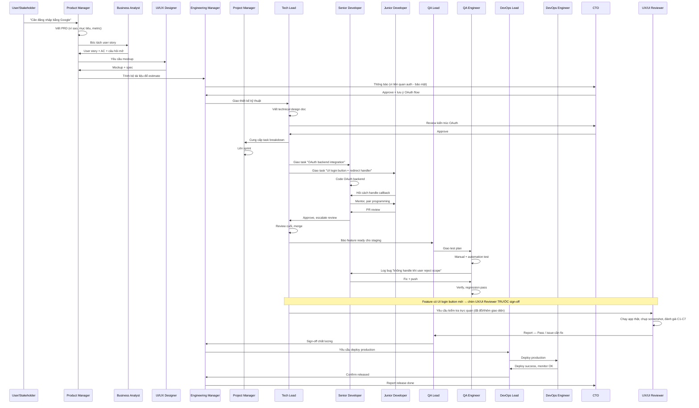
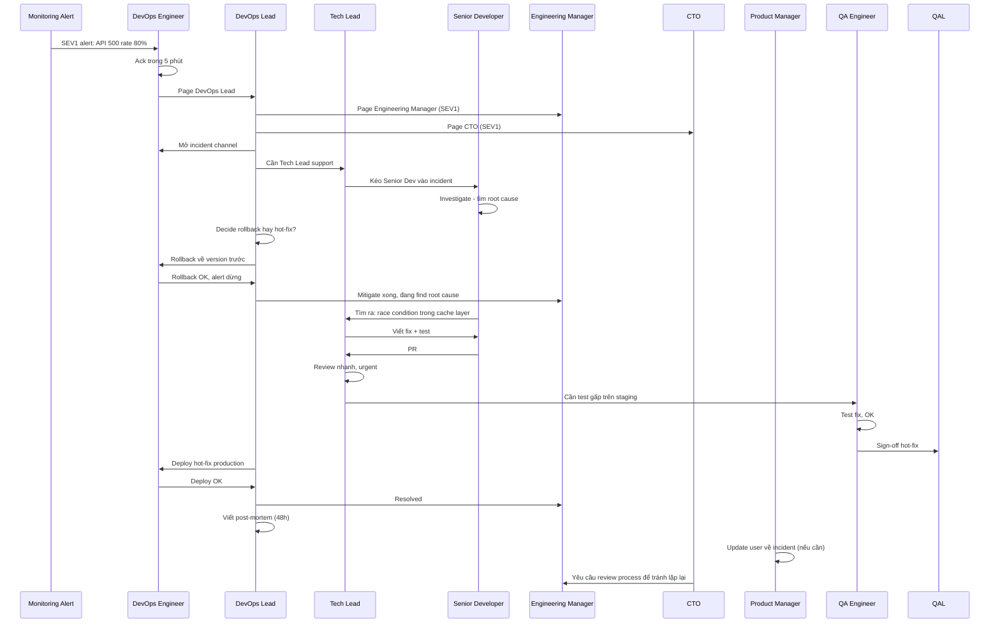
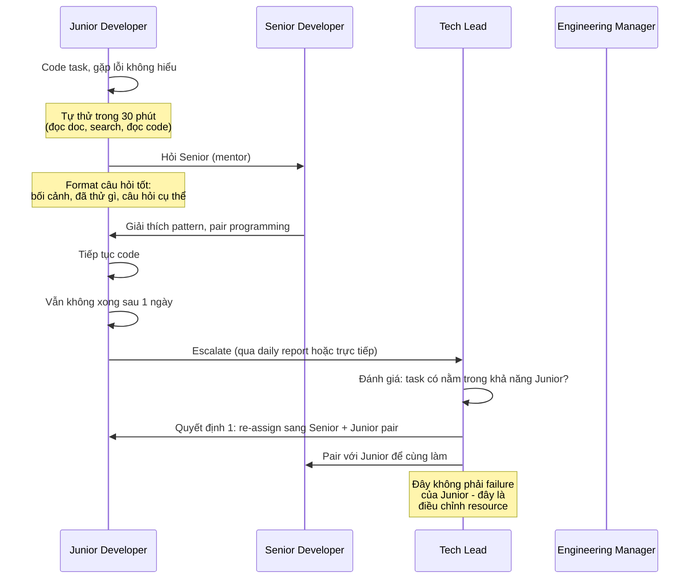
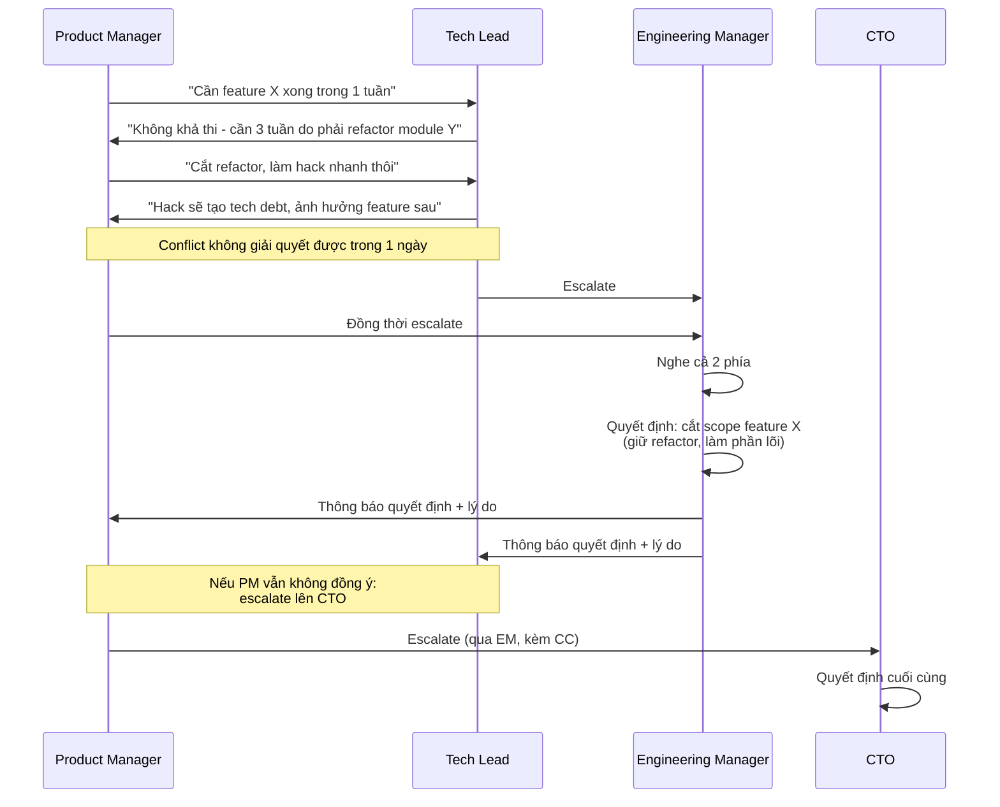
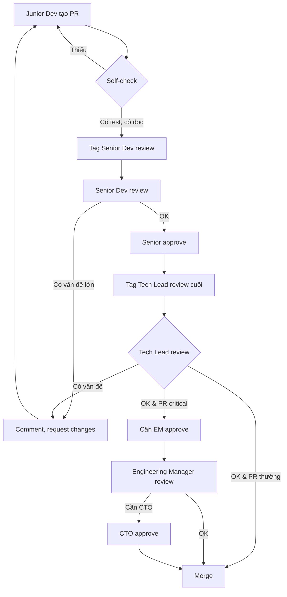
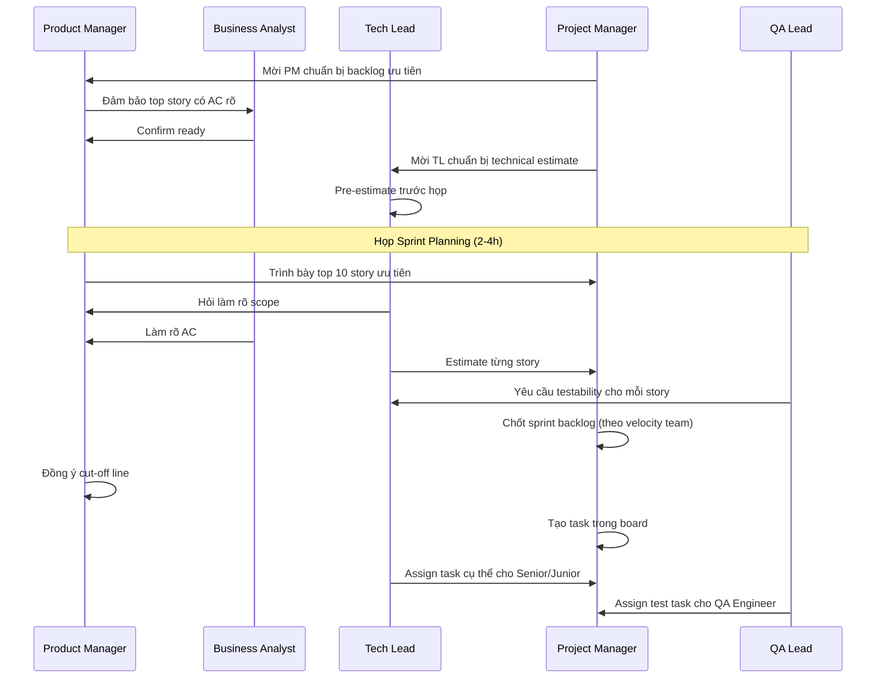
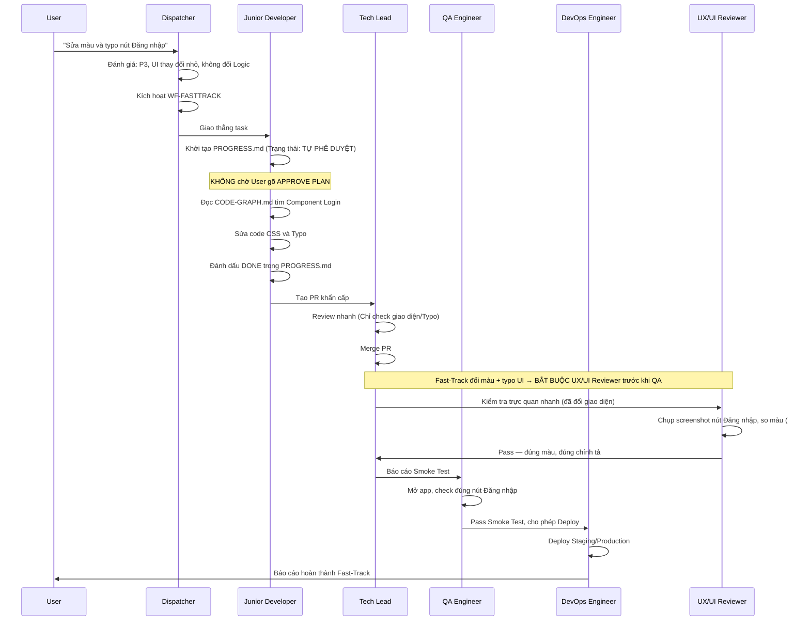
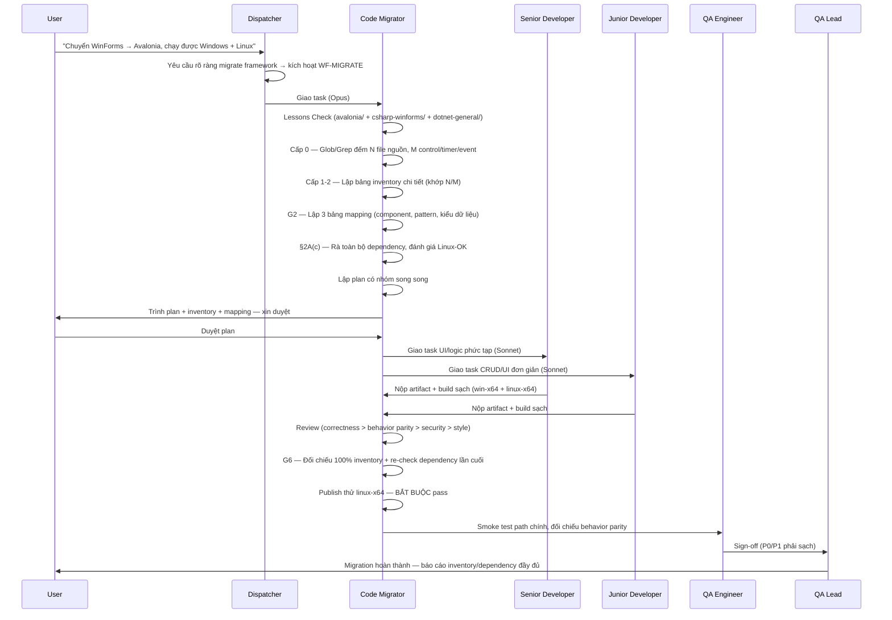
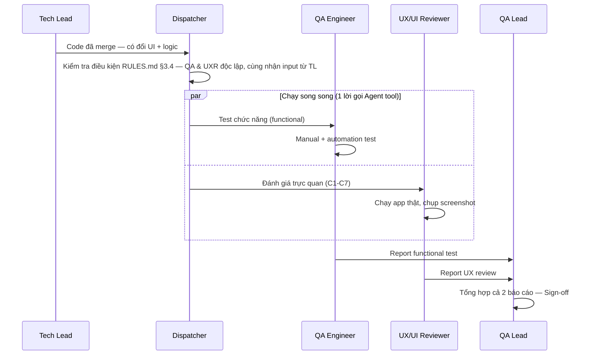

# LUỒNG LÀM VIỆC MẪU (Workflow Examples)

Tài liệu minh họa cách các AGENT phối hợp giải quyết các tình huống thực tế. Đọc cùng `RULES.md` để hiểu đầy đủ.

---

## Ví dụ 1: Yêu cầu tính năng mới "Đăng nhập bằng Google"

**Bài học từ ví dụ này:**
- KHÔNG ai nhảy cấp. PM không nói thẳng với Junior Developer.
- CTO can thiệp vì liên quan đến bảo mật (OAuth), nhưng chỉ approve ở mức kiến trúc.
- Junior hỏi Senior (mentor), Senior báo lên Tech Lead.
- QA có quyền VETO. Không sign-off thì không deploy.
- UX/UI Reviewer chèn vào TRƯỚC QA Lead sign-off vì feature có UI login button mới — bỏ qua bước này nếu feature chỉ đổi backend/logic.

---

## Ví dụ 2: Bug Production khẩn (SEV1)

**Bài học:**
- Trong incident, **bỏ qua chain of command** (escalate thẳng lên CTO theo Quy tắc 6 của `RULES.md`).
- **Mitigate trước, fix root cause sau.** Rollback là an toàn nhất.
- QA vẫn phải test fix dù gấp - không bỏ bước.
- Sau incident, BẮT BUỘC có post-mortem.

---

## Ví dụ 3: Junior Developer bị block

**Bài học:**
- Junior PHẢI tự thử 30 phút trước khi hỏi (không phải lười).
- Hỏi đúng format (bối cảnh + đã thử + câu hỏi cụ thể).
- Tech Lead có thể re-assign mà không phải đổ lỗi Junior.

---

## Ví dụ 4: Conflict giữa PM và Tech Lead

**Bài học:**
- Conflict không giải quyết được trong 1 ngày → escalate (Quy tắc 6).
- Escalate phải đi qua cấp trên trực tiếp, có CC.
- Quyết định cuối thuộc về cấp cao hơn, các bên phải tuân thủ.

---

## Ví dụ 5: Code Review từ Junior → Senior → Tech Lead

**Bài học:**
- 2-eyes principle: KHÔNG ai self-merge.
- PR thường: Senior → Tech Lead là đủ.
- PR critical (auth, payment, DB schema): cần thêm EM, có khi CTO.

---

## Ví dụ 6: Sprint Planning chuẩn

**Bài học:**
- Sprint planning phải có ĐỦ: PM, BA, TL, PJM, QA Lead.
- Story phải READY trước họp (có AC rõ).
- Estimate là việc của Tech Lead, không phải PM.
- Cut-off scope dựa trên velocity, không phải mong muốn.
## Ví dụ 7: Luồng Fast-Track sửa lỗi UI nhỏ (WF-FASTTRACK)

**Tình huống:** Người dùng yêu cầu "Sửa lại màu nút Đăng nhập bị sai mã màu và sai chính tả thành 'Đăng Nhạp'".

---

## Ví dụ 8: WF-MIGRATE — Chuyển đổi Framework (Code Migrator)

**Tình huống:** Người dùng yêu cầu "Chuyển project IPGSUseCam từ WinForms sang Avalonia, chạy được cả Windows và Linux".

**Bài học từ ví dụ này:**
- Code Migrator KHÔNG tự code hàng loạt — chỉ khảo sát/lập plan/review (Opus), giao việc code thực tế cho Senior/Junior Dev (Sonnet).
- Inventory PHẢI khớp số đếm thực tế (Cấp 0) — không liệt kê mẫu, tránh bỏ sót tính năng.
- Dependency PHẢI được rà lại lần cuối ở G6 (không chỉ 1 lần ở đầu) — bắt các package Senior/Junior Dev thêm giữa đường.
- Workflow này KHÔNG tự động kích hoạt — chỉ khi user yêu cầu rõ ràng chuyển đổi framework/ngôn ngữ.

---

## Ví dụ 9: Song song hoá — QA Engineer ∥ UX/UI Reviewer (lấy cảm hứng từ Ruflo/Claude Flow)

**Tình huống:** Feature "Đăng nhập bằng Google" (tiếp theo Ví dụ 1) vừa được Tech Lead merge, có cả logic OAuth và UI login button mới. Thay vì chạy UX/UI Reviewer RỒI MỚI đến QA Engineer (tuần tự), Dispatcher gọi cả hai chạy đồng thời vì cả hai cùng nhận code đã merge và không phụ thuộc lẫn nhau (đủ điều kiện theo `RULES.md` §3.4).

**Bài học từ ví dụ này:**
- Song song hoá CHỈ áp dụng khi 2 bước thật sự độc lập (`RULES.md` §3.4) — QA và UXR cùng nhận 1 input (code merge), không bên nào chờ kết quả bên kia.
- Rút ngắn thời gian workflow đáng kể cho cặp bước này so với chạy tuần tự, mà KHÔNG bỏ bớt bất kỳ bước kiểm tra nào.
- QA Lead vẫn phải nhận ĐỦ cả 2 báo cáo trước khi sign-off — không sign-off khi thiếu 1 trong 2.
- KHÔNG áp dụng song song cho cặp có quan hệ review (VD: Senior Dev code → Tech Lead review vẫn PHẢI tuần tự).

---

## Tóm tắt nguyên tắc xuyên suốt

| # | Nguyên tắc | Áp dụng khi |
|---|------------|-------------|
| 1 | Không nhảy cấp | Mọi lúc, trừ incident SEV1/SEV2 |
| 2 | 2-eyes principle | Mọi review (code, design, deploy) |
| 3 | QA có quyền VETO release | Khi còn P0/P1 bug |
| 4 | Mitigate trước, fix sau | Production incident |
| 5 | Escalate đúng cách | Khi vượt quyền hoặc conflict |
| 6 | Junior được phép sai, không được lặp | Mentoring |
| 7 | Tài liệu hóa quyết định | Mọi quyết định lớn |
| 8 | Khách hàng là trung tâm | Khi có tranh cãi nội bộ |
| 9 | UX/UI Reviewer bắt buộc khi đổi giao diện | Trước QA sign-off, nếu code sửa/thêm UI (feature, bugfix, hotfix, fast-track, refactor) |
| 10 | Code Migrator chỉ dùng khi được yêu cầu | Không tự động chạy trong bất kỳ workflow nào khác; Opus chỉ dùng ở giai đoạn lập plan/review |
| 11 | Song song hoá khi 2 bước độc lập, không quan hệ review | Tăng tốc workflow, không giảm chất lượng kiểm tra (xem `RULES.md` §3.4, ký hiệu `∥` trong `CLAUDE.md` §4) |
