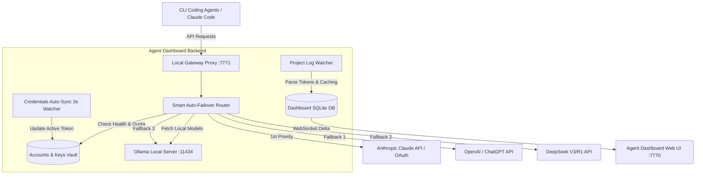

# BÁO CÁO PHÂN TÍCH ĐỐI THỦ & ĐỀ XUẤT CẢI TIẾN HỆ THỐNG AGENT DASHBOARD
**Chủ đề**: Tối ưu hóa Quản trị Đa Tài khoản AI, Tự động Chuyển đổi (Auto-Failover), Tích hợp Local LLM và Quản lý MCP Server

---

## 📑 MỤC LỤC
1. **Bối cảnh & Tổng quan Khảo sát Thị trường**
2. **Phân tích Cơ chế Kỹ thuật Chi tiết của các Công cụ Đối thủ**
3. **Bảng Phân tích & Đề xuất Cải tiến Chi tiết (16 Nhóm Tính năng)**
4. **Kiến trúc Kỹ thuật Đề xuất cho Agent Dashboard**
5. **Lộ trình Triển khai Chi tiết (Roadmap Sprints 7 – 9)**

---

## 1. 🌐 BỐI CẢNH & TỔNG QUAN KHẢO SÁT THỊ TRƯỜNG

Trong sinh thái các công cụ AI Lập trình (AI Coding Agents) và Quản lý LLM hiện nay, việc người dùng phải làm việc với nhiều tài khoản, nhiều nhà cung cấp (Anthropic, OpenAI, Google Gemini, DeepSeek) hoặc các mô hình chạy Local (Ollama) là rất phổ biến. 

Qua khảo sát thực tế các ứng dụng nổi tiếng trên GitHub và thị trường, các công cụ hiện tại được chia thành **4 nhóm chính**:

1. **Nhóm Quản lý Cấu hình & Môi trường (Config & Environment Switchers)**:
   * **Đại diện**: `CC-Switch`, `Claude Switcher`, `cpm` (Claude Profile Manager).
   * **Đặc điểm**: Chuyên giải quyết bài toán chuyển đổi Profile CLI 1-click, quản lý tập tin cấu hình `claude_desktop_config.json` và bật/tắt các MCP Server.
2. **Nhóm Gateway Proxy & Cân bằng tải (Failover & Load Balancing Routers)**:
   * **Đại diện**: `LiteLLM`, `One-API`, `New-API`, `OpenRouter`.
   * **Đặc điểm**: Đóng vai trò làm Proxy trung gian chuẩn hóa OpenAI API format. Có khả năng tự động xoay tài khoản (Rate-limit Auto-rotation) khi bị dính lỗi `429` hoặc hết hạn mức.
3. **Nhóm Đo lường & Phân tích Token Local (Token & Session Analytics)**:
   * **Đại diện**: `Tokscale`, `ccusage`, `AgentOps`, `LangSmith`.
   * **Đặc điểm**: Đọc log trực tiếp từ đĩa địa phương, phân tích chi tiết tỷ lệ **Prompt Caching** (Cache Read vs Cache Write vs Uncached Tokens), tính toán tốc độ tiêu thụ Token/phút (TPM) và phát hiện các Subagent bị kẹt vòng lặp.
4. **Nhóm Giao diện Chat Sandbox & Local LLM (Chat UI & Local Execution)**:
   * **Đại diện**: `Open WebUI`, `LobeChat`, `LibreChat`, `AnythingLLM`.
   * **Đặc điểm**: Tự động phát hiện server Ollama local, hỗ trợ khung chat thử nghiệm prompt trực tiếp và so sánh kết quả trả về từ nhiều mô hình song song (Side-by-Side Comparison).

---

## 2. 🔬 PHÂN TÍCH CƠ CHẾ KỸ THUẬT CHI TIẾT CỦA CÁC ĐỐI THỦ HÀNG ĐẦU

### 2.1. CC-Switch / Claude-Switcher
* **Cơ chế hoạt động**: Sử dụng biến môi trường `CLAUDE_CONFIG_DIR` để tách biệt các thư mục cấu hình isolated `~/.claude-work` và `~/.claude-personal`.
* **Ưu điểm**: Chuyển đổi tài khoản không cần gõ lệnh `login/logout` thủ công, hỗ trợ toggle MCP Server trực quan.
* **Hạn chế**: Không có tính năng tự động phát hiện hết Quota để xoay tài khoản trong thời gian thực.

### 2.2. LiteLLM Proxy / New-API
* **Cơ chế hoạt động**: Xây dựng một bản Local Proxy Gateway chuẩn hóa API. Thiết lập danh sách **Fallback Target Chain**:
  $$\text{Claude 3.5 Sonnet} \longrightarrow \text{GPT-4o} \longrightarrow \text{DeepSeek R1} \longrightarrow \text{Ollama Local}$$
* **Ưu điểm**: Khi tài khoản chính bị trả về lỗi `HTTP 429` hoặc `401`, Gateway tự động đổi credentials và retry request trong `<100ms`, lệnh CLI của người dùng không bao giờ bị dừng.

### 2.3. Tokscale & ccusage
* **Cơ chế hoạt động**: Quét và parse tập tin JSONL thời gian thực từ `~/.claude/projects/`. 
* **Ưu điểm**: Bóc tách chính xác lượng token tiết kiệm nhờ **Prompt Caching** (`cache_read_input_tokens` vs `cache_creation_input_tokens`) và đo độ sâu của cây Subagent.

---

## 3. 📊 BẢNG PHÂN TÍCH & ĐỀ XUẤT CẢI TIẾN CHI TIẾT (16 NHÓM TÍNH NĂNG)

| STT | Tính năng nâng cao | Trạng thái | Tên tính năng đã có | Công cụ so sánh & Cơ chế hoạt động | Chi tiết đề xuất cải tiến toàn diện cho Agent Dashboard |
| :---: | :--- | :---: | :--- | :--- | :--- |
| **1** | **Hệ thống Quản lý Đa Nhà Cung Cấp (Multi-Provider Unified Vault)** | **Chưa có** | *(Chỉ hỗ trợ Anthropic / Claude Code)* | **One-API, New-API, LiteLLM, LobeChat, Poe** *(Cơ chế: Chuyển đổi linh hoạt giữa OAuth Session và API Keys)* | - Quản lý tập trung tài khoản OAuth & API Key cho **OpenAI (ChatGPT / GPT-4o)**, **Google Gemini (1.5 Pro/Flash)**, **DeepSeek (V3/R1)**, **OpenRouter**, **Mistral**, **Groq**. - Cho phép gán vai trò Model mặc định cho từng CLI Agent hoặc từng nhiệm vụ cụ thể. |
| **2** | **Chuỗi Chuyển Đổi Tài Khoản Tự Động (Smart Failover & Auto-Rotation Chain)** | **Chưa có** | *(Chỉ chuyển đổi thủ công qua nút "Kích hoạt")* | **LiteLLM Failover Router, CC-Switch, New-API** *(Cơ chế: Hot-swapping credentials trên đĩa khi dính lỗi 429/100% quota)* | - Tự động thiết lập chuỗi ưu tiên chuyển đổi (Fallback Chain): `Tài khoản Pro 1 → Tài khoản Pro 2 → DeepSeek R1 → Ollama Local`. - Tự động xoay con trỏ Active trong **<100ms** ngay khi phát hiện tài khoản hiện tại chạm `100% Quota (5h/7d)` hoặc trả về HTTP Status `429/401/503`, đảm bảo lệnh CLI không bao giờ bị dừng giữa chừng. |
| **3** | **Đo lường & Phân tích Tỷ lệ Prompt Caching (Token Caching Efficiency Analytics)** | **Chưa có** | *(Chỉ mới đếm tổng Input/Output Tokens)* | **Tokscale, ccusage, Anthropic Console** *(Cơ chế: Parse các trường cache_read_input_tokens và cache_creation_input_tokens)* | - Bóc tách chi tiết lượng Token thành 4 nhóm: `Uncached Input`, `Cache Creation (Write)`, `Cache Read`, và `Output Tokens`. - Hiển thị biểu đồ **Tỷ lệ tiết kiệm nhờ Cache (%)** giúp người dùng đánh giá hiệu quả áp dụng Prompt Caching của Agent. |
| **4** | **Phát hiện & Ngắt Vòng lặp Vô hạn Subagent (Runaway Loop & Recursion Guard)** | **Chưa có** | *-* | **AgentOps, LangSmith, Phoenix Arize** *(Cơ chế: Theo dõi độ sâu cây subagent và tần suất sinh tool call lặp lại)* | - Theo dõi độ sâu của cây Subagent và tần suất gọi cùng 1 Tool (ví dụ: `view_file` lặp lại >10 lần). - Tự động gửi cảnh báo khẩn cấp và cung cấp nút **Kill Subagent** 1-click trên Dashboard để ngăn chặn tình trạng "ngốn sạch" quota do subagent bị kẹt vòng lặp. |
| **5** | **Tự động Phát hiện & Đẩy Tác vụ xuống Model Local (Local LLM Offloading - Ollama)** | **Chưa có** | *-* | **AnythingLLM, Open WebUI, Ollama CLI** *(Cơ chế: Polling localhost:11434/api/tags & theo dõi GPU VRAM)* | - Tự động phát hiện server Ollama local, hiển thị dung lượng VRAM/GPU khả dụng. - Hỗ trợ chế độ **Hybrid Offloading**: Tự động chuyển các Subagent làm nhiệm vụ đơn giản (như đọc file, format markdown, sinh unit test) sang chạy trên Ollama Local miễn phí để tiết kiệm Quota Cloud cho Dispatcher chính. |
| **6** | **Quản lý MCP Server & Cô lập Môi trường (MCP & Environment Switcher)** | **Chưa có** | *-* | **CC-Switch, Roo Code (Cline), Cursor** *(Cơ chế: Đọc/Ghi file config JSON & switch CLAUDE_CONFIG_DIR)* | - Trình quản lý trực quan cho `claude_desktop_config.json` / `mcp.json`. Cho phép bật/tắt nhanh các MCP Servers (GitHub, Postgres, Brave Search, FileSystem) chỉ bằng 1 công tắc toggle. - Hỗ trợ tạo các Profile môi trường riêng biệt (ví dụ: `Profile-Work`, `Profile-Personal`) để chạy lệnh CLI song song mà không xung đột cấu hình. |
| **7** | **Kho Thư viện System Prompts Mẫu (System Prompt & Persona Hub)** | **Chưa có** | *-* | **LobeChat, TypingMind, Open WebUI** *(Cơ chế: Prompt template engine với biến chèn động)* | - Lưu trữ và quản lý kho System Prompts mẫu được tối ưu cho từng vai trò Agent (như: Code Reviewer, Refactoring Specialist, Security Auditor, Test Generator). - Hỗ trợ chèn biến động thời gian thực: `{{project_name}}`, `{{git_branch}}`, `{{working_dir}}`. |
| **8** | **Khung Chat Sandbox & So sánh Mô hình Song song (Multi-Model Chat Playground)** | **Chưa có** | *-* | **OpenAOE, LibreChat, TypingMind** *(Cơ chế: Gửi prompt đồng thời tới nhiều Provider)* | - Tích hợp khung Chat Web tương tác ngay trên Dashboard. - **Tính năng Side-by-Side**: Cho phép gửi cùng 1 prompt đồng thời tới Claude 3.5 Sonnet, GPT-4o và DeepSeek R1 để so sánh kết quả trả về trước khi giao nhiệm vụ chính thức cho CLI Agent. |
| **9** | **Quản lý Hạn mức Token & Tốc độ Dự án (Project Token & Rate Limit Policies)** | **Chưa có** | *(Mới chỉ gom nhóm token theo đường dẫn dự án)* | **LiteLLM (Virtual Keys), One-API, LangSmith** *(Cơ chế: Thiết lập Soft Limit / Hard Limit theo lượng Token)* | - Cho phép cài đặt **Hạn mức Token tối đa (Hard Cap)** theo Ngày/Tuần/Tháng cho từng dự án hoặc từng Agent. - Tự động phát thông báo khi dự án đạt `80% Soft Limit` và tạm dừng cấp phát token khi chạm `100% Hard Limit`. |
| **10** | **Bộ Giám sát Sức khỏe Kênh & Độ trễ API (Channel Health Check & Latency Ping)** | **Chưa có** | *-* | **LiteLLM Router, New-API Channel Monitor** *(Cơ chế: Ping định kỳ và tính toán latency ms, tỷ lệ lỗi HTTP 5xx/429)* | - Đo lường thời gian phản hồi (Latency ms) và tỷ lệ thành công (Success Rate %) của các kênh AI. - Tự động đánh dấu `Unhealthy` và tạm ẩn tài khoản khỏi chuỗi xoay tự động khi phát hiện kênh đó bị chập chờn hoặc Anthropic/OpenAI đang bảo trì server. |
| **11** | **Cảnh báo Webhook Thông minh (Telegram / Discord Webhook Notifications)** | **Chưa có** | *-* | **AgentOps, Helicone, Tokenomy** *(Cơ chế: Event-driven webhook dispatcher)* | - Gửi thông báo tức thời qua **Telegram Bot** hoặc **Discord Webhook** khi:   + Tài khoản Active chạm mốc `90% Quota (5h/7d)`.   + Hệ thống tự động xoay sang tài khoản mới thành công.   + Phát hiện Subagent bị kẹt vòng lặp ngốn token. |
| **12** | **Xuất Báo cáo Tiến trình & Lưu trữ Lịch sử (Session Archiving & Multi-format Export)** | **Chưa có** | *-* | **Tokscale, Braintrust, LangChain Trace** *(Cơ chế: Serialize session logs ra PDF/HTML/Markdown)* | - Hỗ trợ xuất toàn bộ nhật ký phiên làm việc (bao gồm thinking process, tool calls, kết quả trả về) ra các định dạng **PDF, Markdown, HTML, JSON**. - Hỗ trợ lưu trữ (Archive) và tìm kiếm toàn văn (Full-text Search) lịch sử chat trong quá khứ. |
| **13** | **Tự động Đồng bộ Credentials từ CLI (CLI Credentials Auto-Sync)** | **Đã có** | **CLI Credentials Auto-sync (3s watcher)** | **Agent Dashboard (Hệ thống hiện tại - Sprint 6)** | *Đã hoàn thành ở Sprint 6:* Quét file credentials định kỳ 3s/lần, nhận diện đăng nhập/đăng xuất CLI, tự động cập nhật token mới và bảo vệ tài khoản active đang hợp lệ khỏi bị ghi đè. |
| **14** | **Bảng Điều khiển Quota Anthropic Chi tiết (Anthropic Quota Monitor)** | **Đã có** | **OAuth Usage Bar (5h & 7d)** | **Agent Dashboard (Hệ thống hiện tại - Sprint 6)** | *Đã hoàn thành ở Sprint 6:* Trích xuất chính xác phần trăm sử dụng 5h/7d kèm đồng hồ đếm ngược reset thời gian thực từ API Anthropic (xử lý triệt để cấu trúc dictionary lồng nhau). |
| **15** | **Hiển thị Tiến trình Pipeline & Subagent Chi tiết (Aggregate Pipeline View)** | **Đã có** | **Aggregate Pipeline View & Subagent Activity** | **Agent Dashboard (Hệ thống hiện tại - Sprint 6)** | *Đã hoàn thành ở Sprint 6:* Lưới các thẻ pipeline (196x100px), badge đếm phiên chạy song song (`xN`), hiển thị công việc đang làm của subagent và số token đầy đủ với phân cách hàng nghìn. |
| **16** | **Trình Đọc Lịch sử Phiên làm việc & Tool Calls (Session History Inspector)** | **Đã có** | **Session History & Event Log** | **Agent Dashboard (Hệ thống hiện tại)** | *Đã hoàn thành:* Xem lại danh sách các phiên làm việc trong quá khứ, soi chi tiết các bước gọi tool, tham số đầu vào và kết quả trả về của từng Agent. |

---

## 4. 🛠️ KIẾN TRÚC KỸ THUẬT ĐỀ XUẤT CHO AGENT DASHBOARD

---

## 5. 🚀 LỘ TRÌNH TRIỂN KHAI CHI TIẾT (ROADMAP)

* **Sprint 7 (Auto-Failover & Subagent Guard)**:
  * Triển khai Local Failover Engine: Tự động hoán đổi active account trong đĩa khi chạm `100% Quota (5h/7d)` hoặc lỗi `429`.
  * Phân tích Prompt Caching Efficiency & Cảnh báo ngắt vòng lặp Subagent vô hạn.
* **Sprint 8 (Multi-Provider Hub & Ollama Integration)**:
  * Mở rộng Quản lý Tài khoản cho OpenAI, Gemini, DeepSeek và Ollama Local (Hybrid Offloading).
  * Trình quản lý cấu hình MCP Server 1-click tương tự CC-Switch.
* **Sprint 9 (Playground & Webhook Alerts)**:
  * Tích hợp Khung Chat Web Playground (Side-by-Side Model Comparison).
  * Hệ thống thông báo Telegram Bot / Discord Webhook & Xuất báo cáo PDF/CSV.
