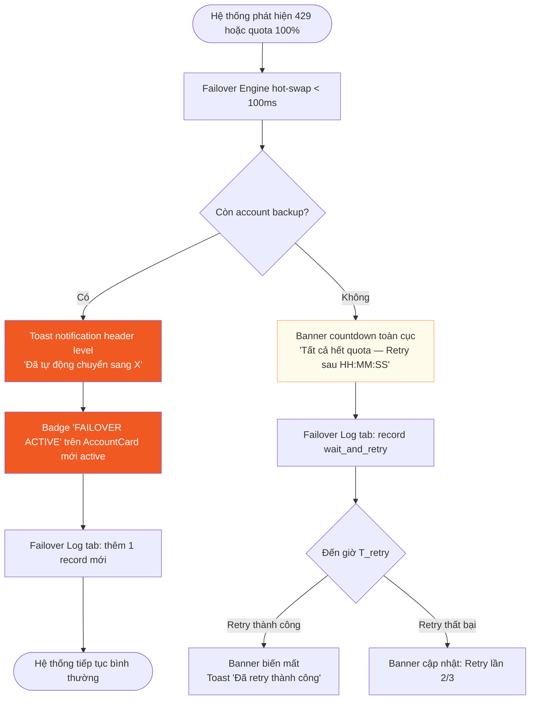
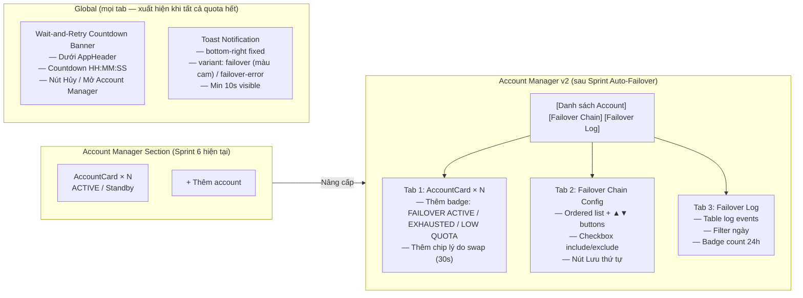

# DESIGN: Agent Dashboard v2 — Auto-Failover Anthropic UI

**Phiên bản:** 1.0
**Ngày:** 2026-08-09
**Designer:** UI/UX Designer (KZTEK)
**US nguồn:** `docs/user-stories/US-agent-dashboard-autofailover.md` (US-001..007)
**PRD nguồn:** `docs/prd/PRD-agent-dashboard-autofailover.md` v2.3
**Plan:** `docs/plans/PLAN-agent-dashboard-autofailover-2026-08-09/PLAN-MASTER.md`

---

## Tổng quan thiết kế

### Nguyên tắc chủ đạo

Auto-Failover là tính năng **chủ yếu backend**. UI chỉ bổ sung 4 component nhỏ vào Account Manager section đã có (Sprint 6) — không thiết kế lại màn hình, không tạo trang mới. Mọi component đều tái dùng token màu và pattern component đã có trong codebase.

**Design token nền tảng (từ tailwind.config.js):**

| Token | Hex | Dùng trong Auto-Failover UI |
|-------|-----|------------------------------|
| `kz-orange` | `#F05922` | Badge FAILOVER ACTIVE, countdown timer, CTA "Lưu thứ tự", banner cảnh báo |
| `kz-navy` | `#251C53` | Heading, priority badge, text chính, nút thứ cấp |
| `kz-navy-mid` | `#4A3F8C` | Sub-label, link trong log table |
| `kz-navy-light` | `#B8B3D6` | Background nhẹ, fill hàng bảng log |
| `kz-gray` | `#CBCBCB` | Border, divider, badge EXHAUSTED |
| `kz-warning-bg` | `#FFFBEB` | Nền banner wait-and-retry |
| `kz-orange-light` | `#FFAA80` | Border trái banner warning |
| `kz-error-bg` | `#FEF2F2` | Nền hàng log thất bại |

### Luồng UI tổng thể



---

## Component 1: Badge "FAILOVER ACTIVE" + Toast Notification

**US:** US-004 Scenario 1, US-007 Scenario 1
**Mục đích:** Thông báo tức thì (< 2 giây) khi hệ thống vừa tự động swap account — đảm bảo KHÔNG có silent failover (FAIL-7).

### 1a. Toast Notification (Header level — global)

Toast tồn tại song song với `ToastNotification.tsx` hiện tại nhưng cần thêm variant `type: 'failover'` để phân biệt với success toast thông thường.

**Vị trí:** `fixed bottom-6 right-6` — tái dùng vị trí toast hiện tại (bên dưới phải màn hình).

**Trạng thái hiển thị:**

| Trạng thái | Nội dung | Thời gian tự đóng |
|------------|----------|-------------------|
| Failover thành công | "↺ Đã tự động chuyển sang [Tên account] — [429 detected / Quota 5h full / Quota 7d full]" | 15 giây (tối thiểu 10s per BR21) |
| Failover thất bại | "! Failover thất bại — Không thể ghi credential file" | Không tự đóng (user phải bấm ✕) |
| All accounts exhausted | "! Tất cả account đã hết quota — Hệ thống đang chờ reset" | Không tự đóng |

**Styling (mở rộng `ToastContext` thêm type `'failover'` và `'failover-error'`):**

```
Failover success toast:
  bg-kz-orange text-white
  Icon: "↺" (màu white)
  font-size: 14px / line-height: 1.5

Failover error toast:
  bg-kz-error-bg border border-kz-red text-kz-red
  Icon: "!" (màu kz-red)
  Không auto-dismiss — user phải bấm ✕
```

**Accessibility:**
- `role="status"` + `aria-live="polite"` cho success toast
- `role="alert"` + `aria-live="assertive"` cho error toast (cần đọc ngay)
- Nút "✕" có `aria-label="Đóng thông báo failover"`

---

### 1b. Badge "FAILOVER ACTIVE" trên AccountCard

Badge nhỏ hiển thị ngay trong header của `AccountCard` — chỉ trên account vừa trở thành active sau khi swap.

**Vị trí trong `AccountCard` header:**
```
[★ ACTIVE]  [↺ FAILOVER ACTIVE]  [OAuth]  tên account
```
Badge "FAILOVER ACTIVE" nằm ngay sau badge "★ ACTIVE", cùng hàng flex.

**Styling:**

```
Badge FAILOVER ACTIVE (account vừa được swap vào):
  bg-kz-orange text-white
  px-2 py-0.5 rounded-badge text-caption font-semibold
  Text: "↺ FAILOVER ACTIVE"
  Xuất hiện: ngay khi swap xong
  Tự ẩn: sau 30 giây (CSS transition: opacity 0→1 trong 0.3s khi xuất hiện,
         opacity 1→0 trong 1s khi biến mất sau 29 giây)

Badge EXHAUSTED (account bị swap ra — không còn active):
  bg-kz-gray/30 text-kz-text (chữ xám nhạt)
  Text: "EXHAUSTED"
  Tồn tại cho đến khi quota reset hoặc user reactivate thủ công

Badge LOW QUOTA (account backup còn < 10% quota):
  bg-kz-orange/15 text-kz-orange
  Text: "Ít quota (X%)"
  Hiển thị thường xuyên khi backup account đang là Standby có quota thấp
```

**Chip lý do swap (ngay dưới các badge):**
Một dòng phụ nhỏ `text-caption text-kz-navy-mid` hiển thị trong vòng 30 giây (cùng lifecycle với badge FAILOVER ACTIVE):
```
"Lý do: 429 detected  |  Độ trễ swap: 45ms"
"Lý do: Quota 5h full  |  Độ trễ swap: 32ms"
```

**States của AccountCard sau failover:**

| Trạng thái account | Badge thêm vào | Thời gian |
|-------------------|----------------|-----------|
| Account mới được swap vào (active) | ★ ACTIVE + ↺ FAILOVER ACTIVE (cam) | 30s rồi badge FAILOVER tự ẩn |
| Account bị swap ra (exhausted) | EXHAUSTED (xám) | Cho đến khi quota reset |
| Account backup còn < 10% quota | LOW QUOTA X% (cam nhạt) | Thường xuyên, không tự ẩn |

---

## Component 2: Failover Chain Config

**US:** US-005 Scenario 1, 2, 3, 4
**Mục đích:** Cho phép user sắp xếp thứ tự ưu tiên account và bao gồm/loại trừ account khỏi failover chain.

### Vị trí trong Account Manager

Thêm tab bar 2 tab vào đầu Account Manager section (hiện không có tab):

```
[Danh sách Account]  [Failover Chain]  [Failover Log]
```

Tab styling:
```
Tab active:
  border-b-2 border-kz-orange text-kz-orange font-semibold text-sm pb-2

Tab inactive:
  text-kz-navy-mid text-sm pb-2 hover:text-kz-navy transition-colors
```

### Layout Failover Chain Tab

```
┌─────────────────────────────────────────────────────────┐
│  Failover Chain                                          │
│  Thứ tự account được kích hoạt khi xảy ra failover.     │
│  Priority 1 = ưu tiên cao nhất.                         │
├─────────────────────────────────────────────────────────┤
│  [✓] #1  ▲ ▼  vietanh          [ACTIVE]   5h:72% 7d:45% │
│  [✓] #2  ▲ ▼  OAuth Imported   [Standby]  5h:30% 7d:12% │
│  [ ] #3  ▲ ▼  Old Key          [Needs Relogin]          │
├─────────────────────────────────────────────────────────┤
│  [Lưu thứ tự]              Lưu lần cuối: 21:30 09/08    │
└─────────────────────────────────────────────────────────┘
```

### Spec từng element trong danh sách

**Mỗi hàng account trong chain** là một `div flex items-center gap-3 py-3 border-b border-kz-gray`:

**Checkbox "Bao gồm trong chain":**
- HTML native `<input type="checkbox">` + `<label>`
- Checked: account bao gồm trong failover chain
- Unchecked: account bị loại trừ — hàng mờ đi (`opacity-50`)
- Validation: không cho uncheck account cuối cùng còn checked
- Khi uncheck account cuối: hiển thị inline error `text-kz-red text-caption`: "Phải giữ ít nhất 1 account trong failover chain"

**Priority number badge:**
```
bg-kz-navy text-white
px-2 py-0.5 rounded-badge text-caption font-semibold
Text: "#1", "#2", "#3"...
```

**Nút lên/xuống (▲/▼):**
```
Nút:
  w-6 h-6 flex items-center justify-center
  border border-kz-gray rounded text-kz-navy text-xs
  hover:bg-kz-navy-light/20 transition-colors
  disabled: opacity-30 cursor-not-allowed (nút ▲ ở hàng đầu, ▼ ở hàng cuối)

Text: "▲" / "▼"
aria-label: "Di chuyển [tên account] lên trên" / "Di chuyển [tên account] xuống dưới"
```

**Tên account:** `text-sm font-semibold text-kz-navy truncate flex-1`

**Status badge của account trong chain:**

| Trạng thái | Styling |
|-----------|---------|
| Active | `bg-kz-orange text-white px-2 py-0.5 rounded-badge text-caption font-semibold` |
| Standby | `bg-kz-navy/10 text-kz-navy px-2 py-0.5 rounded-badge text-caption` |
| Exhausted | `bg-kz-gray/30 text-kz-text px-2 py-0.5 rounded-badge text-caption` |
| Needs Relogin | `bg-red-100 text-red-700 px-2 py-0.5 rounded-badge text-caption` |

**Quota mini display:**
```
text-caption text-kz-navy-mid
"5h: 72% | 7d: 45%"
Ẩn nếu account là API key (không có quota)
Ẩn nếu Needs Relogin (không thể đọc quota)
```

**Nút "Lưu thứ tự" (CTA):**
```
bg-kz-orange hover:bg-kz-orange/90 text-white
px-4 py-2 rounded-btn text-sm font-semibold transition-colors

Loading state: text "Đang lưu..." + disabled
Success: text đổi thành "✓ Đã lưu" trong 2s rồi quay lại "Lưu thứ tự"
Error: BannerAlert type="error" ngay trên nút
```

### States

| State | Mô tả |
|-------|-------|
| Default | Danh sách theo thứ tự priority hiện tại |
| Reordered (chưa lưu) | Hàng vừa di chuyển có highlight `bg-kz-navy-light/10` nhạt |
| Saving | Nút disabled + spinner, danh sách không tương tác được |
| Saved | Toast success "Thứ tự ưu tiên đã cập nhật", timestamp "Lưu lần cuối" cập nhật |
| Error validation | Inline error màu `text-kz-red text-caption` ngay dưới hàng bị lỗi |
| Empty chain (tất cả bỏ tick) | Block save + error: "Phải giữ ít nhất 1 account" |

### Accessibility

- Mỗi hàng `role="listitem"`, danh sách `role="list"` với `aria-label="Failover chain priority list"`
- Nút ▲/▼ có `aria-label` đầy đủ: "Di chuyển [tên] lên trên/xuống dưới trong failover chain"
- Khi reorder: `aria-live="polite"` thông báo vị trí mới: "[Tên account] đã di chuyển lên vị trí 1"
- Checkbox: `aria-checked` + `aria-label="Bao gồm [tên] trong failover chain"`
- Nút Lưu: `aria-busy="true"` khi saving

---

## Component 3: Failover Log View

**US:** US-003 Scenario 4, US-007 Scenario 2
**Mục đích:** Cho phép user xem lịch sử toàn bộ sự kiện failover — audit trail, không có silent failover.

### Vị trí

Tab "Failover Log" trong Account Manager (tab thứ 3 trong tab bar đã thêm ở Component 2).

### Layout Failover Log Tab

```
┌─────────────────────────────────────────────────────────┐
│  Failover Log           [5 lần trong 24h]               │
│  [Từ: ______] [Đến: ______]  [Lọc]  [Xóa filter]       │
├──────────┬─────────────────┬─────────┬──────────┬───────┤
│ Thời gian│ Từ → Đến        │ Lý do   │ Kết quả  │ Trễ  │
├──────────┼─────────────────┼─────────┼──────────┼───────┤
│21:30 9/8 │vietanh → OAuth  │429      │Thành công│ 45ms │
│20:15 9/8 │OAuth (all) → ─  │Quota 7d │Chờ reset │  ─   │
│18:02 9/8 │vietanh → OAuth  │Quota 5h │Thành công│ 67ms │
│...       │...              │...      │...       │...   │
├──────────┴─────────────────┴─────────┴──────────┴───────┤
│  Hiển thị 20 gần nhất    [Xem thêm]                     │
└─────────────────────────────────────────────────────────┘
```

### Spec chi tiết

**Header row:**
```
"Failover Log" — text-h2 text-kz-navy font-semibold
Badge "X lần trong 24h":
  Nếu X > 0: bg-kz-orange/20 text-kz-orange px-2 py-0.5 rounded-badge text-caption font-semibold
  Nếu X = 0: ẩn badge
```

**Filter bar:**
```
2 input date: type="date" styled border border-kz-gray rounded px-2 py-1 text-sm text-kz-text
Nút "Lọc": border border-kz-navy text-kz-navy rounded-btn px-3 py-1 text-caption hover:bg-kz-navy-light/20
Nút "Xóa filter": text-kz-navy-mid text-caption underline (chỉ hiện khi filter đang active)
```

**Table header:**
```
bg-kz-navy text-white text-caption font-semibold
px-3 py-2
```

**Table rows:**

| Loại event | Styling row | Loại kết quả |
|-----------|-------------|--------------|
| Thành công | `bg-white` | Thành công |
| Thất bại (swap fail) | `bg-kz-error-bg/40` | Thất bại |
| Wait-and-retry | `bg-kz-warning-bg/60` | Chờ reset |

**Nội dung các cột:**

- **Thời gian:** `HH:mm DD/MM` — `text-caption text-kz-navy-mid font-mono`
- **Từ → Đến:** `text-sm text-kz-navy` — "vietanh → OAuth Imported" hoặc "vietanh (all exhausted)" khi wait-and-retry
- **Lý do:** `text-caption` — chip nhỏ inline:
  - `429 detected`: `bg-kz-orange/10 text-kz-orange px-1.5 rounded text-[11px]`
  - `Quota 5h full`: `bg-kz-navy/10 text-kz-navy px-1.5 rounded text-[11px]`
  - `Quota 7d full`: `bg-kz-navy/10 text-kz-navy px-1.5 rounded text-[11px]`
  - `Manual activation`: `bg-kz-gray/30 text-kz-text px-1.5 rounded text-[11px]`
- **Kết quả:**
  - Thành công: `text-kz-green text-caption font-semibold` "✓ Thành công"
  - Thất bại: `text-kz-red text-caption font-semibold` "✗ Thất bại"
  - Chờ reset: `text-kz-orange text-caption font-semibold` "⏳ Chờ reset"
- **Trễ (ms):** `font-mono text-caption text-kz-navy-mid` — "45ms" hoặc "─" khi không có

**Empty state:**
```
text-center py-12
Icon (text): "📋"
Text: "Chưa có sự kiện failover nào" — text-sm text-kz-gray
Sub: "Hệ thống sẽ ghi lại tại đây khi xảy ra auto-failover" — text-caption text-kz-gray
```

**Pagination:**
```
Hiển thị 20 record gần nhất mặc định
Nút "Xem thêm": text-kz-navy-mid underline text-caption — load thêm 20 record
```

**Realtime update (WebSocket push):**
Khi có failover event mới → hàng mới trượt vào đầu bảng với animation `animate-fade-in` (class đã có trong codebase) — không cần reload tab.

### States

| State | Mô tả |
|-------|-------|
| Loading | Skeleton 3 hàng — `bg-kz-navy-light/20 animate-pulse h-8 rounded` |
| Empty (chưa có log) | Empty state với text hướng dẫn |
| Filtered (kết quả 0) | "Không có sự kiện trong khoảng thời gian này" + nút "Xóa filter" |
| Error load | `BannerAlert type="error"` "Không thể tải lịch sử failover" |

### Accessibility

- `role="table"` với `aria-label="Lịch sử sự kiện failover"`
- Header: `role="columnheader"` + `scope="col"`
- Mỗi hàng: `role="row"`, mỗi ô: `role="cell"`
- Realtime update: `aria-live="polite"` thông báo "1 sự kiện mới thêm vào đầu bảng"

---

## Component 4: Wait-and-Retry Countdown Banner

**US:** US-006 Scenario 1, 2, US-004 Scenario 3
**Mục đích:** Thông báo global (visible từ mọi tab) khi tất cả account hết quota — user không cần phải mở Account Manager để biết tình trạng.

### Vị trí

Banner dán trực tiếp dưới `AppHeader` (height 56px) — full width, nằm trong layout chính, đẩy nội dung xuống theo (không phải overlay/fixed-position).

Lý do chọn dưới header thay vì toast: BR12 yêu cầu visible từ mọi tab, và trạng thái này kéo dài nhiều giờ — toast tự đóng không phù hợp.

### Layout Banner

```
┌─────────────────────────────────────────────────────────────────────┐
│ [!] Tất cả account Anthropic đã hết quota   Retry sau: 02:14:33     │
│     Sẽ retry với: vietanh  (quota reset dự kiến 23:45)   [Hủy auto] │
└─────────────────────────────────────────────────────────────────────┘
```

**Trường hợp chỉ 1 account:**
```
[!] Account duy nhất (vietanh) đã hết quota   Retry sau: 02:14:33
    Quota reset dự kiến: 23:45 hôm nay                   [Hủy auto]
```

**Trường hợp đang retry (countdown = 0):**
```
[↻] Đang thử lại với vietanh...
```

**Trường hợp retry thất bại lần 1-2:**
```
[!] Retry lần 2/3 — Chờ thêm 5 phút...   Retry tiếp sau: 00:05:00
```

**Trường hợp hết 3 lần retry:**
```
[!] Hết lần retry tự động — Vui lòng kích hoạt thủ công một account  [Mở Account Manager]
```

### Styling

```css
/* Banner container */
bg-kz-warning-bg
border-b-2 border-kz-orange
px-4 py-3
flex items-center gap-3

/* Icon [!] */
w-6 h-6 rounded-full bg-kz-orange text-white
flex items-center justify-center
text-sm font-bold shrink-0
Content: "!"

/* Text chính */
text-sm font-semibold text-kz-navy flex-1

/* Countdown */
font-mono font-bold text-kz-orange text-base
VD: "02:14:33"

/* Subtitle */
text-caption text-kz-navy-mid (dòng 2 nếu cần)

/* Nút "Hủy auto-retry" */
px-3 py-1 text-caption font-semibold
border border-kz-navy text-kz-navy
rounded-btn hover:bg-kz-navy-light/20 transition-colors
shrink-0

/* Nút "Mở Account Manager" (chỉ khi hết retry) */
px-3 py-1 text-caption font-semibold
bg-kz-orange text-white rounded-btn
hover:bg-kz-orange/90 transition-colors
shrink-0
```

### States Banner

| State | Nội dung | Border màu | Nút |
|-------|----------|-----------|-----|
| Chờ retry (countdown active) | Text + countdown timer | `border-kz-orange` | "Hủy auto-retry" |
| Đang retry (countdown = 0) | Spinner + "Đang thử lại..." | `border-kz-orange-light` | Ẩn nút |
| Retry thất bại lần N | "Retry lần N/3 — Chờ thêm 5 phút" | `border-kz-orange` | "Hủy auto-retry" |
| Hết 3 lần retry (cần can thiệp) | Error message | `border-kz-red` + `bg-kz-error-bg` | "Mở Account Manager" |
| User hủy bằng nút "Hủy auto" | Banner biến mất tức thì | — | — |
| Retry thành công | Banner biến mất + toast success "Đã retry thành công với [tên account]" | — | — |
| Manual activation trong lúc đếm ngược | Banner biến mất tức thì (BR16: manual beats auto) | — | — |

### Countdown timer

Countdown (`HH:MM:SS`) được tính từ `next_retry_at` trả về qua WebSocket — không tự tính frontend để tránh drift. Backend gửi `next_retry_at` (ISO 8601), frontend tính delta còn lại mỗi giây bằng `setInterval`.

### Accessibility

- `role="alert"` + `aria-live="assertive"` (trạng thái nghiêm trọng — tất cả account hết quota)
- Countdown timer: `aria-label="Thời gian còn lại đến lần retry tiếp theo: 2 giờ 14 phút 33 giây"` (không đọc từng giây — chỉ đọc khi focus vào element đó)
- Nút "Hủy": `aria-label="Hủy tự động retry và quay lại quản lý thủ công"`

---

## Tích hợp vào Account Manager — sơ đồ thay đổi



---

## Bảng component → US → Tokens

| Component | US | Màu chính | Màu phụ | Pattern tái dùng |
|-----------|-----|-----------|---------|-----------------|
| Badge FAILOVER ACTIVE | US-004, US-007 | `kz-orange` bg | `white` text | Tái dùng badge pattern AccountCard |
| Badge EXHAUSTED | US-002, US-004 | `kz-gray` bg | `kz-text` text | Tái dùng badge pattern AccountCard |
| Toast failover | US-007 | `kz-orange` bg | `white` text | Mở rộng `ToastContext` thêm variant |
| Tab bar (3 tab) | US-003, US-005 | `kz-orange` border-b (active) | `kz-navy-mid` (inactive) | Pattern mới — không có tab hiện tại |
| Failover Chain list | US-005 | `kz-navy` (priority badge) | `kz-orange` (CTA) | Pattern list mới |
| Failover Log table | US-003, US-007 | `kz-navy` (header) | `kz-orange` (24h badge) | Tái dùng table pattern SessionTable |
| Wait-and-Retry Banner | US-006, US-004 | `kz-orange` (border, countdown) | `kz-warning-bg` (nền) | Mở rộng `BannerAlert` |

---

## Hand-off cho Senior Developer (Phase 4.1 — Backend)

```
## [FailoverEngine — Backend]
Mục đích: Giám sát 429/quota, hot-swap credential, ghi log | Flow: US-001 → US-002 → US-003
States: idle / monitoring / swapping / waiting / retrying / error
Components: Không có UI component — backend service thuần
API mới cần thêm:
  GET /api/failover/status       → trạng thái failover hiện tại + countdown next_retry_at
  GET /api/failover/log          → danh sách failover_events (filter: from_date, to_date, limit)
  GET /api/failover/chain        → thứ tự priority hiện tại
  PUT /api/failover/chain        → cập nhật thứ tự + include/exclude
WebSocket events mới:
  failover:started               → payload: { from_account, to_account, trigger_reason }
  failover:completed             → payload: { to_account, swap_latency_ms }
  failover:failed                → payload: { reason }
  failover:all_exhausted         → payload: { next_retry_at, retry_account }
  failover:retry_success         → payload: { account_name }
Tokens: — (backend không dùng token màu)
Accessibility: —
```

---

## Hand-off cho Junior Developer (Phase 4.2 — Frontend)

```
## [FailoverStatusBadge — Component]
Mục đích: Hiển thị badge FAILOVER ACTIVE / EXHAUSTED / LOW QUOTA trên AccountCard | Flow: US-004, US-007
Props:
  failoverState: 'active' | 'exhausted' | 'low_quota' | 'none'
  lowQuotaPct?: number        (chỉ khi failoverState = 'low_quota')
  reason?: string             (chỉ khi failoverState = 'active': "429 detected" | "Quota 5h/7d full")
  swapLatencyMs?: number      (chỉ khi failoverState = 'active')
States: active (30s) → fade-out → none | exhausted (permanent) | low_quota (permanent)
Tokens: kz-orange (active), kz-gray (exhausted), kz-orange/15 (low_quota)
Accessibility: role="status" aria-live="polite"

## [FailoverChainConfig — Component]
Mục đích: Ordered list + ▲▼ + checkbox bao gồm/loại trừ | Flow: US-005
Props:
  chain: FailoverChainItem[]    (id, name, priority, included, status, quota5h, quota7d)
  onSave: (updated: FailoverChainItem[]) => Promise<void>
States: default / reordering (highlight hàng vừa di chuyển) / saving / saved / error
Tokens: kz-navy (priority badge), kz-orange (CTA save), kz-gray (nút ▲▼)
Accessibility: role="list" aria-label="Failover chain priority list", ▲▼ có aria-label đầy đủ

## [FailoverLogTable — Component]
Mục đích: Bảng lịch sử failover events + filter ngày | Flow: US-003, US-007
Props:
  events: FailoverEvent[]
  loading: boolean
  onFilter: (from: string, to: string) => void
  total24h: number
States: loading (skeleton) / empty / filtered-empty / loaded / error
Tokens: kz-navy (table header bg), kz-orange (24h badge), kz-warning-bg (wait_and_retry row)
Accessibility: role="table" aria-label="Lịch sử sự kiện failover"

## [WaitRetryBanner — Component]
Mục đích: Banner global dưới AppHeader khi tất cả account hết quota | Flow: US-006, US-004
Props:
  nextRetryAt: string | null    (ISO 8601 — null khi hết retry)
  retryAccount: string | null
  retryAttempt: number          (1, 2, 3)
  maxRetries: number            (3)
  onCancel: () => void
States: counting (countdown active) / retrying (spinner) / retry_failed_n (lần thứ n) / exhausted_all_retries / hidden
Tokens: kz-warning-bg (nền), kz-orange (border, countdown, icon), kz-error-bg (khi hết retry)
Accessibility: role="alert" aria-live="assertive"
```

---

## Checklist thiết kế

- [x] Dùng đúng brand KZTEK: Navy `#251C53` cho text/heading/priority badges
- [x] Dùng đúng brand KZTEK: Cam `#F05922` cho CTA (Lưu thứ tự), badge FAILOVER ACTIVE, countdown timer, icon cảnh báo
- [x] Không dùng màu đỏ tươi (tránh màu FUTECH) — dùng `kz-red` (`#EF4444`) chỉ cho error state, không dùng làm màu accent chính
- [x] Nền chính trắng `#FFFFFF`
- [x] Tái dùng tối đa pattern đã có: badge pattern từ AccountCard, BannerAlert, ToastNotification, toast positioning
- [x] Không thiết kế lại màn hình — chỉ bổ sung tab bar + 2 tab mới + badges vào component đã có
- [x] Không dùng thư viện drag-and-drop nặng (react-dnd, dnd-kit) — chỉ nút ▲/▼ đơn giản
- [x] Accessibility: role, aria-label, aria-live cho mọi component mới
- [x] Mobile-friendly: flex-wrap, min-w-0, truncate đã có trong AccountCard — kế thừa pattern này

---

*DESIGN v1.0 — UI/UX Designer KZTEK — 2026-08-09*
*Bước tiếp theo: Engineering Manager ước tính effort (Bước 0.4), sau đó Tech Lead viết TDD (Bước 1.2)*
