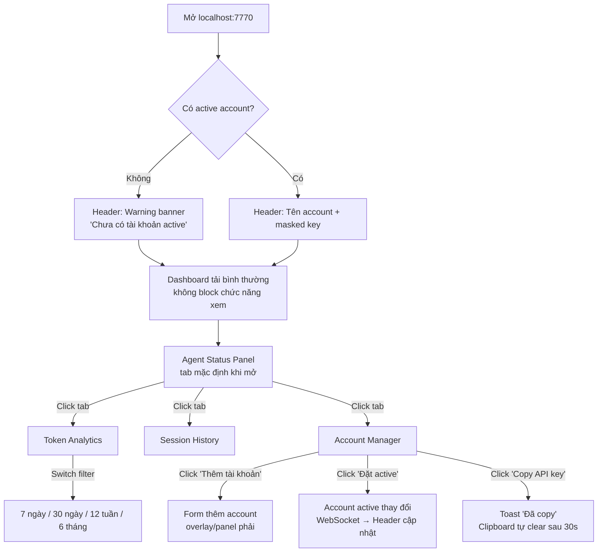
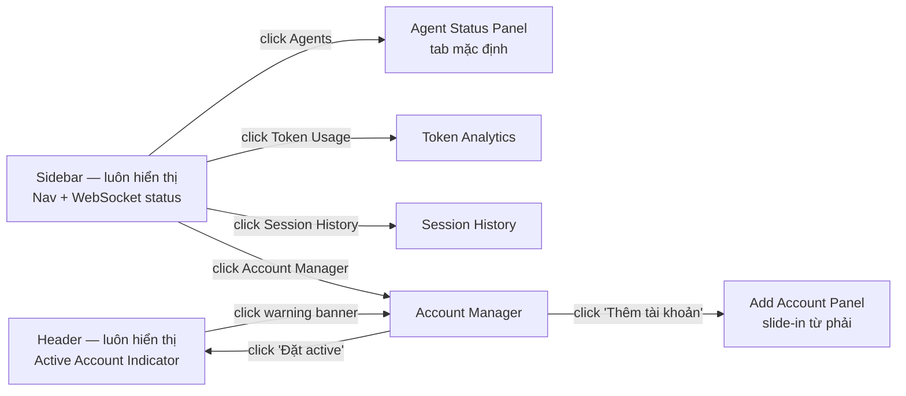

# DESIGN-agent-dashboard: Agent Dashboard — Dashboard Web Local Realtime Quản Lý Claude Code Agents

**Feature:** Agent Dashboard
**UX Designer:** UI/UX Designer (KZTEK)
**Phiên bản:** 1.0
**Ngày:** 2026-08-05
**Tham chiếu PRD:** `docs/prd/PRD-agent-dashboard.md`
**Tham chiếu US:** `docs/user-stories/US-agent-dashboard.md`

---

## Design System (Mini — nội bộ, không persist design-system folder)

Dashboard nội bộ, áp dụng bộ màu KZTEK chuẩn:

| Token | Hex | Ứng dụng |
|-------|-----|----------|
| `color.navy.dark` | `#251C53` | Heading, sidebar bg, nav active, text nhấn |
| `color.orange` | `#F05922` | Accent button, badge Running, CTA, active indicator |
| `color.navy.mid` | `#4A3F8C` | Sub-heading, link, sidebar item hover |
| `color.navy.light` | `#B8B3D6` | Table header fill, sidebar item bg, border nhẹ |
| `color.orange.light` | `#FFAA80` | Warning badge Idle, hover state |
| `color.gray.light` | `#CBCBCB` | Divider, border, row separator |
| `color.white` | `#FFFFFF` | Nền trang chính |
| `color.green` | `#22C55E` | Badge Active/Connected (trạng thái hệ thống) |
| `color.red.soft` | `#EF4444` | Badge Done, text lỗi |
| `color.text.body` | `#1F2937` | Văn bản nội dung thông thường |

**Typography:**
- Heading H1: 20px, semibold, `#251C53`
- Heading H2: 16px, semibold, `#251C53`
- Body: 14px, regular, `#1F2937`
- Label/Caption: 12px, regular, `#4A3F8C`
- Monospace (token count, API key masked): `font-family: monospace`

**Spacing:** 4px base → 8, 12, 16, 24, 32px
**Border radius:** card: 8px | button: 6px | badge: 12px (pill)

---

## User Flow Tổng Thể



---

## Layout Tổng Thể

Dashboard dạng **single-page app**, bố cục: **Header cố định trên cùng** + **Sidebar trái** + **Main content area** bên phải.

```
┌────────────────────────────────────────────────────────────────────────┐
│  HEADER (height: 56px, bg: #251C53, text: white)                       │
│  [KZTEK Logo]  Agent Dashboard           [Account Indicator]           │
│                                          [Tên account | sk-ant-****XXXX]│
└────────────────────────────────────────────────────────────────────────┘
┌──────────────┬─────────────────────────────────────────────────────────┐
│  SIDEBAR     │  MAIN CONTENT AREA                                       │
│  (w: 220px)  │  (fluid width, bg: #FFFFFF, padding: 24px)              │
│  bg: #251C53 │                                                          │
│  text: white │                                                          │
│              │                                                          │
│  [>] Agents  │                                                          │
│              │                                                          │
│  [ ] Token   │                                                          │
│      Usage   │                                                          │
│              │                                                          │
│  [ ] Session │                                                          │
│      History │                                                          │
│              │                                                          │
│  [ ] Account │                                                          │
│      Manager │                                                          │
│              │                                                          │
│  ──────────  │                                                          │
│  WebSocket   │                                                          │
│  [●] Live    │                                                          │
│  (or [!]     │                                                          │
│  Reconnect.) │                                                          │
└──────────────┴─────────────────────────────────────────────────────────┘
```

**Sidebar nav items:**
- Item active: bg `#4A3F8C`, text white, left border 3px `#F05922`
- Item hover: bg `#4A3F8C` 50%, transition 150ms
- Item icon: 16x16 SVG (Agents: monitor, Token: chart-bar, History: clock, Account: user-circle)

**WebSocket status indicator (bottom sidebar):**
- Connected: dot `#22C55E` + text "Live"
- Reconnecting: dot `#FFAA80` + text "Đang kết nối lại..."
- Disconnected: dot `#EF4444` + text "Mất kết nối"

---

## Màn Hình 1: Agent Status Panel (US-001, US-002)

**Route/Tab:** Agents (mặc định khi mở dashboard)

### Layout

```
┌─────────────────────────────────────────────────────────────────────┐
│  Agents đang chạy                          Cập nhật lúc: 14:32:05   │
│  H2: #251C53                               Caption: #4A3F8C          │
├─────────────────────────────────────────────────────────────────────┤
│                                                                       │
│  [RUNNING – 2]  ─────────────────────────────────────────────────   │
│                                                                       │
│  ┌──────────────────────────────────────────────────────────────┐   │
│  │ ● [RUNNING]  senior-developer                    14:28:01    │   │
│  │ badge: Cam #F05922                     bắt đầu: caption      │   │
│  │ Task: "Đang viết unit test cho module auth/login.ts..."       │   │
│  │ (tối đa 100 ký tự, truncate với ...)                         │   │
│  │ Tokens: IN 12,450 | OUT 3,210 | Cache R 8,200 | Cache W 400  │   │
│  │ (label: #4A3F8C, value: monospace #251C53)                   │   │
│  └──────────────────────────────────────────────────────────────┘   │
│                                                                       │
│  ┌──────────────────────────────────────────────────────────────┐   │
│  │ ● [RUNNING]  junior-developer                    14:29:15    │   │
│  │ badge: Cam #F05922                                           │   │
│  │ Task: "Code màn hình Login theo spec TDD-001..."             │   │
│  │ Tokens: IN 5,100 | OUT 1,340 | Cache R 2,100 | Cache W 0    │   │
│  └──────────────────────────────────────────────────────────────┘   │
│                                                                       │
│  [IDLE – 1]  ───────────────────────────────────────────────────    │
│                                                                       │
│  ┌──────────────────────────────────────────────────────────────┐   │
│  │ ○ [IDLE]     tech-lead                           14:15:30    │   │
│  │ badge: Cam nhạt #FFAA80, text #251C53                        │   │
│  │ Task: "Review PR #47 — module authentication..."             │   │
│  │ Tokens: IN 22,100 | OUT 8,450 | Cache R 15,000 | Cache W 900│   │
│  └──────────────────────────────────────────────────────────────┘   │
│                                                                       │
│  [DONE – 3]  ───────────────────────────────────────────────────    │
│                                                                       │
│  ┌──────────────────────────────────────────────────────────────┐   │
│  │ ✕ [DONE]     qa-engineer              Kết thúc: 13:45:20     │   │
│  │ badge: #EF4444 nhạt, text #EF4444                            │   │
│  │ Task: "Thực thi test plan TC-001 đến TC-015..."              │   │
│  │ Tokens: IN 8,230 | OUT 2,100 | Cache R 4,500 | Cache W 200  │   │
│  └──────────────────────────────────────────────────────────────┘   │
│                                                                       │
│  (DONE card thứ 2 và 3 — collapsed theo mặc định nếu >3 DONE items)  │
│  [ Xem thêm 2 phiên đã kết thúc ▼ ]  (link màu #4A3F8C)            │
│                                                                       │
└─────────────────────────────────────────────────────────────────────┘
```

### Agent Card — Component Spec

**Cấu trúc dữ liệu 1 card:**

| Field | Nguồn dữ liệu | Hiển thị |
|-------|---------------|----------|
| Tên agent | Tên file JSONL hoặc trường `agent` | Bold, 14px, `#251C53` |
| Status badge | Logic timeout 60s/300s từ backend | Pill badge (xem bảng trạng thái bên dưới) |
| Thời gian bắt đầu | Timestamp entry đầu tiên | `HH:mm:ss`, caption `#4A3F8C` |
| Thời gian kết thúc | Chỉ với DONE: entry cuối + offset | `Kết thúc: HH:mm:ss`, caption |
| Task description | Message assistant cuối, max 100 ký tự | 14px regular, truncate `...` |
| Tokens IN | `usage.input_tokens` cộng dồn | Monospace, có dấu phân cách nghìn |
| Tokens OUT | `usage.output_tokens` cộng dồn | Monospace |
| Cache Read | `usage.cache_read_input_tokens` | Monospace |
| Cache Write | `usage.cache_creation_input_tokens` | Monospace |

**Bảng trạng thái badge:**

| Trạng thái | Điều kiện | Badge bg | Badge text | Dot |
|------------|-----------|----------|------------|-----|
| RUNNING | Có activity trong 60s qua | `#F05922` | white | `●` filled `#F05922` |
| IDLE | 60s–300s không có activity | `#FFAA80` | `#251C53` | `○` outline `#FFAA80` |
| DONE | >300s không có activity | `#FEE2E2` | `#EF4444` | `✕` `#EF4444` |

**States của Agent Status Panel:**

**Empty State (không có agent nào):**
```
┌──────────────────────────────────────────────────────┐
│                                                      │
│        [Icon: monitor outline, 48px, #B8B3D6]       │
│                                                      │
│     Không có agent nào đang chạy                    │
│     H3: #251C53                                      │
│                                                      │
│   Khởi động Claude Code để bắt đầu theo dõi         │
│   Caption: #4A3F8C                                   │
│                                                      │
└──────────────────────────────────────────────────────┘
```

**Error State (thư mục log không tìm thấy):**
```
┌──────────────────────────────────────────────────────┐
│  [!] Không tìm thấy thư mục log                     │
│  Banner: bg #FEF2F2, border-left 4px #EF4444        │
│  "~/.claude/projects/ chưa tồn tại hoặc không có    │
│  quyền đọc. Kiểm tra lại cấu hình."                │
└──────────────────────────────────────────────────────┘
```

**WebSocket Reconnecting State:**
```
┌──────────────────────────────────────────────────────┐
│  [~] Đang kết nối lại...                            │
│  Banner: bg #FFFBEB, border-left 4px #FFAA80        │
│  "Mất kết nối WebSocket — tự động kết nối lại"      │
└──────────────────────────────────────────────────────┘
(Dữ liệu cũ vẫn hiển thị, chỉ không nhận update mới)
```

---

## Màn Hình 2: Token Analytics (US-003, US-005)

**Route/Tab:** Token Usage

### Layout

```
┌─────────────────────────────────────────────────────────────────────┐
│  Token Usage                                                         │
│  H2: #251C53                                                         │
├───────────────────────────────────┬─────────────────────────────────┤
│  FILTER BAR (full width, dưới heading)                               │
│  Filter: [7 ngày] [30 ngày*] [12 tuần] [6 tháng]                   │
│  Nút active: bg #251C53, text white                                  │
│  Nút inactive: bg #B8B3D6 nhạt, text #251C53                        │
│  Agent filter: [Tất cả agents ▼]  (dropdown)                        │
├─────────────────────────────────────────────────────────────────────┤
│  CHART AREA (height: 280px)                                          │
│                                                                      │
│  50K ┤                                   █                           │
│  40K ┤                         █       █ █                           │
│  30K ┤               █       █ █     █ █ █   █                       │
│  20K ┤     █       █ █     █ █ █   █ █ █ █   █   █                  │
│  10K ┤   █ █   █   █ █   █ █ █ █ █ █ █ █ █ █ █   █                  │
│    0 └──────────────────────────────────────────────────────        │
│      07/07  09/07  11/07  13/07  15/07  17/07  19/07  ...           │
│                                                                      │
│  [■] Input Tokens (#4A3F8C)   [■] Output Tokens (#F05922)           │
│  Legend: 12px, flex row, gap 16px                                    │
│                                                                      │
│  Hover tooltip trên cột:                                             │
│  ┌─────────────────────────┐                                         │
│  │ 13/07/2026              │                                         │
│  │ Input:   38,450         │                                         │
│  │ Output:  12,210         │                                         │
│  │ Sessions: 4             │                                         │
│  └─────────────────────────┘                                         │
├─────────────────────────────────────────────────────────────────────┤
│  SUMMARY CARDS (3 card ngang, spacing 16px)                          │
│  ┌──────────────┐  ┌──────────────┐  ┌──────────────┐               │
│  │ Total Input  │  │ Total Output │  │ Tổng Sessions│               │
│  │ 284,500      │  │  89,430      │  │     23       │               │
│  │ tokens       │  │  tokens      │  │              │               │
│  │ (trong 30 ng)│  │ (trong 30 ng)│  │ (30 ngày)    │               │
│  └──────────────┘  └──────────────┘  └──────────────┘               │
│  Card: border 1px #CBCBCB, radius 8px, heading #251C53, value 24px  │
├─────────────────────────────────────────────────────────────────────┤
│  BẢNG CHI TIẾT THEO SESSION                                          │
│  H3: "Chi tiết theo session"                                         │
│                                                                      │
│  ┌──────────────┬──────────┬───────────┬──────────┬───────────────┐ │
│  │ Agent        │ Bắt đầu  │ Input     │ Output   │ Tổng          │ │
│  │ (header:     │          │ Tokens    │ Tokens   │ (In+Out)      │ │
│  │ bg #251C53,  │          │           │          │               │ │
│  │ text white)  │          │           │          │               │ │
│  ├──────────────┼──────────┼───────────┼──────────┼───────────────┤ │
│  │ senior-dev   │ 14:28:01 │    12,450 │    3,210 │    15,660     │ │
│  │ junior-dev   │ 14:29:15 │     5,100 │    1,340 │     6,440     │ │
│  │ tech-lead    │ 14:15:30 │    22,100 │    8,450 │    30,550     │ │
│  └──────────────┴──────────┴───────────┴──────────┴───────────────┘ │
│  Row hover: bg #B8B3D6 25%                                           │
│  Phân trang: [ < 1 2 3 > ] nếu >50 rows                             │
└─────────────────────────────────────────────────────────────────────┘
```

**States của Token Analytics:**

**Empty State (không có data trong khoảng filter):**
```
┌────────────────────────────────────────────────────────┐
│  [Chart area trống]                                    │
│                                                        │
│      [Icon: chart-bar, 48px, #B8B3D6]                 │
│   Không có dữ liệu trong khoảng thời gian này         │
│   Caption: #4A3F8C                                     │
│                                                        │
│   Thử chọn [ 30 ngày ] hoặc [ Tất cả ]               │
│   (Link buttons, màu #F05922)                         │
└────────────────────────────────────────────────────────┘
```

---

## Màn Hình 3: Session History (US-006)

**Route/Tab:** Session History

### Layout

```
┌─────────────────────────────────────────────────────────────────────┐
│  Lịch sử Session                                                     │
│  H2: #251C53                                                         │
├─────────────────────────────────────────────────────────────────────┤
│  FILTER BAR                                                          │
│  Từ ngày: [__/__/____]  Đến ngày: [__/__/____]  [Lọc]              │
│  Input: border 1px #CBCBCB, focus border #251C53                     │
│  [Lọc] button: bg #251C53, text white, hover bg #4A3F8C              │
│  Hiển thị X session  (caption #4A3F8C, căn phải)                    │
├─────────────────────────────────────────────────────────────────────┤
│  BẢNG SESSION                                                        │
│                                                                      │
│  ┌──────────┬──────────────────────────┬─────────┬─────────┬──────┐ │
│  │ Agent    │ Task Description         │ Bắt đầu │ K. thúc │ Trạng│ │
│  │          │                          │         │         │ thái │ │
│  │(header:  │                          │         │         │      │ │
│  │bg #251C53│                          │         │         │      │ │
│  │text white│                          │         │         │      │ │
│  ├──────────┼──────────────────────────┼─────────┼─────────┼──────┤ │
│  │ senior   │ Review PR #47 — module   │ 14:15   │ 14:45   │ Done │ │
│  │ dev      │ authentication...        │ hôm nay │ hôm nay │ ●    │ │
│  ├──────────┼──────────────────────────┼─────────┼─────────┼──────┤ │
│  │ qa-eng   │ Thực thi test plan       │ 13:30   │ 13:45   │ Time │ │
│  │          │ TC-001 đến TC-015...     │         │ (*)     │ out  │ │
│  │          │                          │         │         │ ○    │ │
│  └──────────┴──────────────────────────┴─────────┴─────────┴──────┘ │
│                                                                      │
│  (*) Tooltip khi hover cột "K. thúc" của Timeout row:               │
│  "Phiên kết thúc do không có activity trong 5 phút"                 │
│                                                                      │
│  Phân trang: [ < Trang 1 / 3 > ]  Hiển thị 50/132 session           │
└─────────────────────────────────────────────────────────────────────┘
```

**Badge trạng thái trong bảng:**
- Done: text `#22C55E`, dot filled
- Timeout: text `#FFAA80`, dot outline

**Empty State:**
```
Chưa có lịch sử session
Caption: "Dữ liệu sẽ xuất hiện khi agent đầu tiên kết thúc"
```

---

## Màn Hình 4: Account Manager (US-007, US-008)

**Route/Tab:** Account Manager

### Layout chính

```
┌─────────────────────────────────────────────────────────────────────┐
│  Quản lý tài khoản API                                               │
│  H2: #251C53                                                         │
│                                       [+ Thêm tài khoản] (button)   │
│                                       bg #F05922, text white         │
├─────────────────────────────────────────────────────────────────────┤
│  DANH SÁCH TÀI KHOẢN                                                 │
│                                                                      │
│  ┌──────────────────────────────────────────────────────────────┐   │
│  │  [★ ACTIVE]  KZTEK Production           ────────────────────  │   │
│  │  Badge "ACTIVE": bg #F05922, text white, pill                │   │
│  │  API key: sk-ant-****...XXXX  (monospace, 13px)              │   │
│  │                                                              │   │
│  │  [Copy API key]  [Xóa]                                       │   │
│  │  Copy: border 1px #251C53, text #251C53, hover bg #B8B3D6   │   │
│  │  Xóa: text #EF4444, hover bg #FEE2E2                         │   │
│  └──────────────────────────────────────────────────────────────┘   │
│                                                                      │
│  ┌──────────────────────────────────────────────────────────────┐   │
│  │  KZTEK Dev                                                   │   │
│  │  API key: sk-ant-****...YYYY  (monospace, 13px)              │   │
│  │                                                              │   │
│  │  [Đặt active]  [Copy API key]  [Xóa]                        │   │
│  │  Đặt active: bg #251C53, text white                          │   │
│  └──────────────────────────────────────────────────────────────┘   │
│                                                                      │
│  ┌──────────────────────────────────────────────────────────────┐   │
│  │  Personal                                                    │   │
│  │  API key: sk-ant-****...ZZZZ                                 │   │
│  │  [Đặt active]  [Copy API key]  [Xóa]                        │   │
│  └──────────────────────────────────────────────────────────────┘   │
└─────────────────────────────────────────────────────────────────────┘
```

### Panel "Thêm tài khoản" — Slide-in từ phải (không phải modal, không block nội dung)

```
                     ┌────────────────────────────────────┐
                     │  Thêm tài khoản mới                │
                     │  H3: #251C53         [✕ Đóng]      │
                     ├────────────────────────────────────┤
                     │                                    │
                     │  Tên hiển thị *                    │
                     │  ┌──────────────────────────────┐  │
                     │  │ VD: KZTEK Production         │  │
                     │  └──────────────────────────────┘  │
                     │  Tối đa 50 ký tự                   │
                     │                                    │
                     │  API Key *                         │
                     │  ┌──────────────────────────────┐  │
                     │  │ sk-ant-...                   │  │
                     │  └──────────────────────────────┘  │
                     │  Phải bắt đầu bằng "sk-ant-"       │
                     │  (Warning nếu khác, không block)   │
                     │                                    │
                     │  [Huỷ]  [Lưu tài khoản]           │
                     │  Huỷ: text #4A3F8C                 │
                     │  Lưu: bg #F05922, text white        │
                     └────────────────────────────────────┘
```

### States của Account Manager:

**Empty State (lần đầu dùng, chưa có account):**
```
┌──────────────────────────────────────────────────────────┐
│                                                          │
│      [Icon: user-plus, 48px, #B8B3D6]                   │
│                                                          │
│   Chưa có tài khoản nào                                 │
│   H3: #251C53                                            │
│                                                          │
│   Nhấn "Thêm tài khoản" để bắt đầu                     │
│   Caption: #4A3F8C                                       │
│                                                          │
│      [+ Thêm tài khoản]                                 │
│      bg #F05922, text white, btn centered               │
│                                                          │
└──────────────────────────────────────────────────────────┘
```

**Validation Errors (inline dưới field):**
```
Tên hiển thị đã tồn tại, vui lòng chọn tên khác
API key không được để trống
(text: #EF4444, 12px, margin-top 4px)
```

**Toast sau Copy API key:**
```
┌──────────────────────────────────────────────┐
│  ✓ Đã copy API key — tự nhập vào Claude Code│
│  bg: #251C53, text: white, border-radius 6px │
│  Tự biến mất sau 3 giây                      │
│  (Vị trí: bottom-right, margin 24px)         │
└──────────────────────────────────────────────┘
```

**Dialog xác nhận Xóa tài khoản:**
```
┌──────────────────────────────────────────────────────┐
│  Xác nhận xóa tài khoản                             │
│  H3: #251C53                                         │
├──────────────────────────────────────────────────────┤
│  Bạn có chắc muốn xóa tài khoản                     │
│  "KZTEK Production"?                                 │
│  Thao tác này không thể hoàn tác.                   │
│                                                      │
│  [Huỷ]          [Xóa tài khoản]                     │
│  text #4A3F8C   bg #EF4444, text white               │
└──────────────────────────────────────────────────────┘
```

**Banner lỗi file accounts.enc corrupt:**
```
┌──────────────────────────────────────────────────────────────────┐
│  [!] File tài khoản bị hỏng và đã được reset.                   │
│  Vui lòng thêm lại tài khoản.                                   │
│  bg: #FEF2F2, border-left 4px #EF4444                           │
└──────────────────────────────────────────────────────────────────┘
```

---

## Màn Hình 5: Header — Active Account Indicator (US-008)

Header cố định, height 56px, nền `#251C53`.

### State 1 — Có active account

```
┌─────────────────────────────────────────────────────────────────────┐
│ [Logo KZTEK]  Agent Dashboard       [●] KZTEK Production            │
│ 20px white                          [●]: #22C55E filled 8px         │
│                                     Tên: 14px white bold            │
│                                     sk-ant-****XXXX (monospace 12px)│
│                                     text: #B8B3D6                   │
└─────────────────────────────────────────────────────────────────────┘
```

- Tên account truncate ở 30 ký tự với "...", có tooltip tên đầy đủ
- Không cho hover để xem API key — chỉ vào Account Manager mới copy được

### State 2 — Không có active account

```
┌─────────────────────────────────────────────────────────────────────┐
│ [Logo KZTEK]  Agent Dashboard       [!] Chưa có tài khoản active   │
│                                         Vào Accounts để đặt         │
│                                     Banner: inline, bg #F05922,     │
│                                     text white, pill shape          │
│                                     Click → navigate to Accounts tab│
└─────────────────────────────────────────────────────────────────────┘
```

**Quyết định UX (câu hỏi mở Q7):** Không block chức năng khi chưa có active account — dashboard vẫn hiển thị Agent Status, Token Analytics, Session History bình thường. Chỉ warning inline trên header và banner trên trang Account Manager. Lý do: admin cần theo dõi agent đang chạy ngay cả khi chưa setup account.

---

## Navigation Flow



---

## Design Spec Hand-off

### Component List (cần build)

| Component | Màn hình | Props chính | State |
|-----------|----------|-------------|-------|
| `AppHeader` | Global | `activeAccount` | with-account / no-account |
| `SidebarNav` | Global | `activeTab`, `wsStatus` | connected / reconnecting / disconnected |
| `AgentCard` | Agent Status | `name`, `status`, `task`, `tokens`, `startTime`, `endTime?` | running / idle / done |
| `AgentStatusPanel` | Agent Status | `agents[]` | loading / empty / error / has-data |
| `TokenBarChart` | Token Analytics | `data[]`, `filter`, `agentFilter` | loading / empty / has-data |
| `SummaryCard` | Token Analytics | `label`, `value`, `unit` | — |
| `SessionTable` | Session History | `sessions[]`, `pagination` | loading / empty / has-data |
| `AccountCard` | Account Manager | `account`, `isActive` | active / inactive |
| `AddAccountPanel` | Account Manager | `onSave`, `onClose` | default / validating / error |
| `ConfirmDialog` | Account Manager | `message`, `onConfirm`, `onCancel` | — |
| `ToastNotification` | Global | `message`, `duration` | — |
| `BannerAlert` | Global | `type`, `message`, `action?` | info / warning / error |
| `WebSocketStatus` | Sidebar | `status` | connected / reconnecting / disconnected |

### Design Tokens Summary

```css
/* Colors */
--color-navy-dark: #251C53;
--color-orange: #F05922;
--color-navy-mid: #4A3F8C;
--color-navy-light: #B8B3D6;
--color-orange-light: #FFAA80;
--color-gray-light: #CBCBCB;
--color-white: #FFFFFF;
--color-green: #22C55E;
--color-red: #EF4444;
--color-red-bg: #FEE2E2;
--color-warning-bg: #FFFBEB;
--color-error-bg: #FEF2F2;
--color-text-body: #1F2937;

/* Spacing */
--spacing-xs: 4px;
--spacing-sm: 8px;
--spacing-md: 16px;
--spacing-lg: 24px;
--spacing-xl: 32px;

/* Typography */
--font-size-h1: 20px;
--font-size-h2: 16px;
--font-size-body: 14px;
--font-size-caption: 12px;
--font-weight-semibold: 600;
--font-weight-regular: 400;
--font-family-mono: monospace;

/* Layout */
--sidebar-width: 220px;
--header-height: 56px;
--card-radius: 8px;
--button-radius: 6px;
--badge-radius: 12px;
```

### Accessibility

- Tất cả button có `aria-label` rõ ràng (VD: "Copy API key cho tài khoản KZTEK Production")
- Status badge dùng cả màu VÀ text (không chỉ dựa vào màu)
- Sidebar navigation dùng `<nav>` semantic, mỗi item là `<button>` hoặc `<a>`
- Toast notification có `role="status"` (polite) để screen reader đọc
- Confirm dialog có `role="dialog"`, focus trap khi mở
- Token values có `aria-label` mô tả đơn vị: `aria-label="12,450 input tokens"`
- Tab order logic: Header → Sidebar → Main content

### Responsive

Dashboard này là **local-only tool** chạy trên máy dev — thiết kế cho màn hình 1280px+ (desktop). Không cần responsive mobile.

---

## Quyết định UX (Giả định cho các câu hỏi mở từ BA)

| Câu hỏi mở | Quyết định UX | Lý do |
|------------|---------------|-------|
| Q1: Ngưỡng 60s/300s | Giữ nguyên 60s/300s | Phù hợp cho tool theo dõi realtime; nếu cần thay đổi → config trong P2 (F-12) |
| Q2: DONE hiển thị bao lâu trên Status Panel | Giữ trong panel cùng ngày (<24h từ khi kết thúc) | Admin vẫn muốn thấy session DONE gần đây trong cùng work session |
| Q3: Backend restart | Chỉ reconnect WebSocket, KHÔNG reload page | Giữ dữ liệu đang hiển thị, tránh mất context |
| Q7: Không có active account | Warning only, KHÔNG block chức năng | Xem agent/token không cần account; chỉ "Copy API key" cần account active |

---

## Link Figma / Prototype

Không có — dashboard nội bộ, thiết kế text-based đủ để implement trực tiếp.

---

## Sprint 3 — Pipeline View, Tên Session & %Context (FR-001, FR-002, FR-003)

> Phiên bản: 2.0 | Ngày: 2026-08-06 | Designer: UI/UX Designer (KZTEK)
> Tham chiếu TDD: `docs/tech-design/TDD-agent-dashboard.md` §24–26

### Tổng quan thay đổi Sprint 3

| FR | Thay đổi | Vị trí áp dụng |
|----|----------|----------------|
| FR-003 | Tên session thân thiện thay session_id thô | Tiêu đề SessionCard |
| FR-002 | Badge %context window (progress bar + %) | Hàng token trong SessionCard |
| FR-001 | PipelineCard — hàng ngang stations trong SessionCard | Bên trong SessionCard (chỉ khi có chain) |

---

### Cập nhật SessionCard — Layout v2.0

SessionCard hiện tại (Sprint 1-2) đổi tên thành **SessionCard v2** — giữ nguyên cấu trúc header nhưng bổ sung:

1. **Dòng tiêu đề session** (FR-003) — thay thế session_id thô
2. **Badge %context** (FR-002) — nhét vào hàng token
3. **PipelineCard** (FR-001) — block mới bên dưới token row, chỉ render khi `steps.length > 0`

```
┌─────────────────────────────────────────────────────────────────────┐
│  ● [RUNNING]  WF-FEATURE: Dashboard Planning       bắt đầu 10:05   │  ← header row (giữ nguyên v1)
│              [Tên session từ ai-title hoặc user text]               │  ← THÊM MỚI FR-003
│  Đang gọi: "Senior Developer thực hiện backend..."                 │  ← task description (giữ nguyên)
│  IN 8,200 | OUT 1,450 | Cache R 3,100 | [▓▓░░░░░░░░] 4.5%         │  ← THÊM badge FR-002 ở cuối
├─────────────────────────────────────────────────────────────────────┤  ← divider mỏng #CBCBCB
│  🔗 Pipeline [5 bước]                     [← cuộn →]               │  ← THÊM MỚI header pipeline FR-001
│                                                                     │
│  ┌────────┐   ┌────────┐   ┌────────┐   ┌────────┐   ┌──────────┐  │
│  │ ✓ PM   │──▶│ ✓ BA   │──▶│ ✓ UX   │──▶│ ✓ TL   │──▶│ ● SD     │  │  ← pipeline stations
│  │Product │   │Business│   │UI/UX   │   │Tech    │   │Senior    │  │
│  │Manager │   │Analyst │   │Designer│   │Lead    │   │Developer │  │
│  │"Viết   │   │"Viết   │   │"Wire   │   │"TDD    │   │"Code     │  │
│  │PRD..." │   │US..."  │   │frame.."│   │v1.0.." │   │backend.."│  │
│  │ (mờ)   │   │ (mờ)   │   │ (mờ)   │   │ (mờ)   │   │▌ACTIVE   │  │  ← border trái cam #F05922
│  └────────┘   └────────┘   └────────┘   └────────┘   └──────────┘  │
│                                                ← overflow-x: auto → │
└─────────────────────────────────────────────────────────────────────┘
```

---

### FR-003 — Tên Session Thân Thiện

#### Vị trí và hiển thị

```
┌─────────────────────────────────────────────────────────────────────┐
│  ● [RUNNING]  senior-developer                      bắt đầu 10:05  │
│  WF-FEATURE: Dashboard Planning Sprint 3                            │  ← dòng tiêu đề mới
│  Task: "Đang viết unit test cho parser.py..."                       │
│  ...                                                                │
└─────────────────────────────────────────────────────────────────────┘
```

#### Spec

| Field | Giá trị | Style |
|-------|---------|-------|
| Nguồn 1 (ưu tiên) | `ai_title` từ JSONL (dòng cuối) | 13px, `#4A3F8C`, truncate 80 ký tự |
| Nguồn 2 (fallback) | Tin nhắn user đầu tiên (text block) | 13px, `#4A3F8C`, truncate 60 ký tự |
| Nguồn 3 (fallback) | `session_id.slice(0, 8)` như v1 | 13px monospace, `#9CA3AF` |
| Khi title = null | Không hiển thị dòng tiêu đề | (giữ layout cũ) |

**Typography:** 13px, regular, `#4A3F8C` — phân biệt với task description bên dưới (14px, `#1F2937`)

**Truncation:** max 1 dòng, ellipsis `...`, tooltip trên hover hiển thị đầy đủ

---

### FR-002 — Badge %Context Window

#### Vị trí trong hàng token

```
Tokens: IN 12,450 | OUT 3,210 | Cache R 8,200 | Cache W 400    [▓▓░░░░░░░░] 4.5%
                                                                 ↑ badge %context ↑
```

Badge nằm cuối dòng token, căn phải, không xuống dòng (hàng token flex row, badge `margin-left: auto`).

#### Component spec — ContextBadge

```
┌─────────────────────────────┐
│ [▓▓░░░░░░░░]  4.5%          │
│  progress    percentage     │
└─────────────────────────────┘

Progress bar: 48px × 8px, border-radius 4px (pill)
Percentage text: 12px monospace, margin-left 6px
Tooltip on hover: "32,000 / 1,000,000 tokens (lượt gần nhất)"
```

#### Màu sắc theo ngưỡng

| Ngưỡng | Màu progress bar | Màu text | Ý nghĩa |
|--------|-----------------|----------|---------|
| 0–70% | `#4A3F8C` (navy mid) | `#4A3F8C` | Bình thường |
| 70–90% | `#FFAA80` (cam nhạt) | `#251C53` | Cảnh báo |
| 90–100% | `#EF4444` (đỏ) | `#EF4444` | Nguy hiểm — sắp hết context |

**Accessibility:** `aria-label="4.5% context window đã dùng (32,000 / 1,000,000 tokens)"`

**States đặc biệt:**
- `context_pct = 0` (session chưa có assistant message) → ẩn badge (không hiển thị `0%`)
- `context_pct = null` / backend chưa có data → ẩn badge
- Session DONE → vẫn hiển thị badge (chụp lại trạng thái lúc kết thúc), màu nhạt hơn 50% opacity

---

### FR-001 — PipelineCard Component

#### Khi nào render

| Điều kiện | Hành động |
|-----------|-----------|
| `steps.length > 0` | Render PipelineCard bên dưới token row |
| `steps.length = 0` hoặc API trả empty | Không render — SessionCard hiển thị bình thường như v1 |
| API đang loading (`/api/sessions/{id}/chain`) | Hiện skeleton mờ (1 hàng 3 station placeholder, pulse animation) |
| API lỗi | Không hiển thị PipelineCard (fail silently — không làm vỡ SessionCard) |

#### Layout PipelineCard

```
┌─────────────────────────────────────────────────────────────────────┐
│ border-top: 1px #CBCBCB                                             │
│ background: #FAFAFA (phân biệt nhẹ với SessionCard header trắng)   │
│ padding: 10px 16px 12px                                             │
│                                                                     │
│  🔗 Pipeline  [3 bước]                        (caption #4A3F8C)    │
│                                                                     │
│  [overflow-x: auto container]                                       │
│  ┌─────────────────────────────────────────────────────────────┐    │
│  │  [Station Done]  ──▶  [Station Done]  ──▶  [Station Active] │    │
│  └─────────────────────────────────────────────────────────────┘    │
│                                                 (fade gradient phải)│
└─────────────────────────────────────────────────────────────────────┘
```

**Overflow behavior:**
- Container: `overflow-x: auto`, `white-space: nowrap`, `padding-bottom: 6px` (khoảng cho scrollbar)
- Scrollbar: `height: 4px`, `background: #E5E7EB`, thumb `#B8B3D6` — mỏng, không chiếm nhiều không gian
- Fade gradient phải: pseudo-element `::after` với `background: linear-gradient(to right, transparent, #FAFAFA)`, chỉ hiện khi content tràn

---

#### Step Station — 2 trạng thái

##### Trạm DONE (đã qua)

```
┌──────────────┐
│ ✓            │  ← icon checkmark, màu #22C55E, 12px
│ Product      │  ← subagent_display, 11px bold, #4A3F8C, truncate 1 dòng
│ Manager      │
│ "Viết PRD    │  ← description, 10px, #9CA3AF, max 2 dòng, ellipsis
│  cho dash..."│
└──────────────┘
Kích thước: width 96px, height 80px
Style: bg #F5F5F5, border 1px #CBCBCB, border-radius 6px
Opacity: 0.65
Hover: opacity 1.0, box-shadow 0 1px 4px rgba(0,0,0,0.1), z-index: 1
       → tooltip hiển thị description đầy đủ
```

##### Trạm ACTIVE (đang chạy — chỉ có 1 trong chain, luôn là bước cuối)

```
┌──────────────────┐
│ ●  (pulse dot)   │  ← animated dot #F05922, 8px
│ Senior           │  ← subagent_display, 13px semibold, #251C53
│ Developer        │
│                  │
│ "Code backend    │  ← description, 12px, #1F2937, max 3 dòng, no truncate
│  ingest loop..." │
│                  │
└──────────────────┘
Kích thước: width 164px, height 80px (wider để đọc được description)
Style:
  bg: rgba(255, 170, 128, 0.12)  (FFAA80 ở 12% opacity — cam nhạt nhẹ)
  border: 1px rgba(240, 89, 34, 0.3)
  border-left: 4px solid #F05922  ← accent chính
  border-radius: 6px
Opacity: 1.0 (không mờ)
Animation: dot pulse keyframe (scale 1→1.3→1, 1.5s infinite)
```

##### Connector giữa các trạm

```
  [Station]  ──▶  [Station]
             ↑
             Connector: 20px wide
             SVG hoặc CSS: line 1px #CBCBCB + arrowhead #CBCBCB
             display: inline-flex, align-items: center
             flex-shrink: 0  (không bị co khi overflow)
```

---

#### Pipeline header row

```
  🔗 Pipeline  [5 bước]

  Style:
  - Icon 🔗: thay bằng SVG chain-link 14px, màu #4A3F8C
  - Text "Pipeline": 12px semibold, #251C53
  - Badge "[5 bước]": 11px, bg #B8B3D6, text #251C53, border-radius 10px, padding 1px 6px
  - Khoảng cách trên pipeline header: margin-bottom 8px
```

---

#### SessionCard DONE — PipelineCard collapsed

Khi session DONE, PipelineCard vẫn hiển thị nhưng:
- Toàn bộ container opacity 0.6
- Tất cả stations ở trạng thái DONE (không có ACTIVE station)
- Pipeline header: "🔗 Pipeline  [5 bước — kết thúc]"

```
┌─────────────────────────────────────────────────────────────────────┐ ← opacity 0.6
│ 🔗 Pipeline  [5 bước — kết thúc]                                   │
│ [✓ PM]──▶[✓ BA]──▶[✓ UX]──▶[✓ TL]──▶[✓ SD]                        │ ← tất cả done
└─────────────────────────────────────────────────────────────────────┘
```

---

### Xử lý chain dài (10–20+ bước)

Đây là trường hợp thực tế quan trọng nhất (WF-FEATURE full chain có thể đến 15 bước).

**Chiến lược:**

1. **Scroll ngang** — toàn bộ stations trong `overflow-x: auto`. Không wrap 2 dòng, không ẩn bước.
2. **Auto-scroll to active** — khi `active` station nằm ngoài viewport của scroll container → `scrollIntoView({ behavior: 'smooth', block: 'nearest', inline: 'end' })` khi component mount hoặc khi `steps` cập nhật.
3. **Fade gradient** — overlay mờ phía phải (`::after` pseudo-element, width 32px, gradient `transparent → #FAFAFA`) khi nội dung tràn → gợi ý có thể scroll.
4. **Step counter label** — "🔗 Pipeline [12 bước]" trong header luôn hiển thị tổng số bước để user biết chain dài bao nhiêu mà không cần scroll hết.
5. **Hover expand** — done station width 96px (compact); khi hover: expand inline (transition 150ms) thêm 16px để đọc description dễ hơn — KHÔNG làm layout shift đột ngột.

**Benchmark test cases (JD cần test tay):**

| Số bước | Mô tả | Kỳ vọng |
|---------|-------|---------|
| 1 | Chỉ gọi 1 agent | 1 station ACTIVE (nếu Running), không scroll |
| 5 | WF-BUGFIX | Tất cả visible không cần scroll |
| 10 | WF-FEATURE (từ PM đến QA) | Scroll, auto-scroll to active |
| 20+ | WF-FEATURE full + re-call | Scroll, active ở cuối tự hiện ra |

---

### Wireframe tổng thể — Agent Status Panel (Sprint 3)

#### Session CÓ chain (Dispatcher session gọi nhiều agent)

```
┌─────────────────────────────────────────────────────────────────────┐
│  RUNNING [1]  ─────────────────────────────────────────────────     │
│                                                                     │
│  ┌──────────────────────────────────────────────────────────────┐  │
│  │ ● [RUNNING]  (phiên Dispatcher)           bắt đầu: 10:05     │  │  ← row 1: status + time
│  │ WF-FEATURE: Dashboard Planning Sprint 3                      │  │  ← row 2: FR-003 session title
│  │ "Đang gọi Senior Developer thực hiện backend..."             │  │  ← row 3: description
│  │ IN 8,200 | OUT 1,450 | Cache R 3,100 | [▓▓░░] 4.5%          │  │  ← row 4: tokens + FR-002 badge
│  ├──────────────────────────────────────────────────────────────┤  │  ← divider
│  │ 🔗 Pipeline  [5 bước]                      [← cuộn →]       │  │  ← pipeline header
│  │                                                              │  │
│  │  ┌──────┐   ┌──────┐   ┌──────┐   ┌──────┐   ┌──────────┐  │  │
│  │  │ ✓ PM │──▶│ ✓ BA │──▶│ ✓ UX │──▶│ ✓ TL │──▶│ ● SD     │  │  │  ← stations
│  │  │(mờ)  │   │(mờ)  │   │(mờ)  │   │(mờ)  │   │ACTIVE    │  │  │
│  │  └──────┘   └──────┘   └──────┘   └──────┘   └──────────┘  │  │
│  └──────────────────────────────────────────────────────────────┘  │
│                                                                     │
│  DONE [2]  ─────────────────────────────────────────────────────   │
│                                                                     │
│  ┌──────────────────────────────────────────────────────────────┐  │  ← session đơn (không có chain)
│  │ ✕ [DONE]   senior-developer                  kết thúc 09:45  │  │
│  │ Viết unit test cho module auth                               │  │  ← FR-003: title (nếu có)
│  │ Task: "Review PR #47 — module authentication..."             │  │
│  │ IN 22,100 | OUT 8,450 | Cache R 15,000 | [▓▓▓▓▓░░░░░] 22.8% │  │
│  └──────────────────────────────────────────────────────────────┘  │
│                                                                     │
│  ┌──────────────────────────────────────────────────────────────┐  │  ← session đơn có pipeline (DONE)
│  │ ✕ [DONE]   (phiên QA)                        kết thúc 09:30  │  │
│  │ WF-BUGFIX: Fix BUG-001 DELETE 500                            │  │
│  │ "Verify fix trên staging, regression test..."                │  │
│  │ IN 5,100 | OUT 1,200 | [░░░░░░░░░░] 2.1%                    │  │
│  ├──────────────────────────────────────────────────────────────┤  │
│  │ 🔗 Pipeline [3 bước — kết thúc]                              │  │  ← pipeline DONE (opacity 0.6)
│  │  ┌──────┐   ┌──────┐   ┌──────┐                              │  │
│  │  │ ✓ SD │──▶│ ✓ TL │──▶│ ✓ QA │                              │  │
│  │  │(mờ)  │   │(mờ)  │   │(mờ)  │                              │  │
│  │  └──────┘   └──────┘   └──────┘                              │  │
│  └──────────────────────────────────────────────────────────────┘  │
└─────────────────────────────────────────────────────────────────────┘
```

---

### States tổng hợp của PipelineCard

| State | Trigger | Hiển thị |
|-------|---------|---------|
| Loading | Component mount, đang gọi `/chain` endpoint | Skeleton row: 3 pill mờ, pulse animation |
| Active chain (Running) | Steps > 0, session Running | Pipeline đầy đủ, active station highlight Cam |
| Ended chain | Steps > 0, session Idle/Ended | Pipeline hiển thị opacity 0.6, tất cả done |
| Empty (no chain) | Steps = 0 hoặc API empty | Không render — SessionCard v1 bình thường |
| API error | Network/backend lỗi | Fail silently — ẩn PipelineCard, không lỗi toàn bộ card |

---

### Component List (bổ sung Sprint 3)

| Component | Loại | Props | State |
|-----------|------|-------|-------|
| `PipelineCard` | New | `sessionId`, `steps[]`, `sessionState` | loading / active / ended / empty / error |
| `StepStation` | New (child of PipelineCard) | `step`, `isActive`, `isDone` | active / done |
| `StepConnector` | New (utility) | — | — |
| `ContextBadge` | New | `contextPct`, `lastInputTotal`, `maxContext` | normal / warning / danger / hidden |
| `SessionCard` | Updated (v2) | + `title?`, `contextPct?`, `steps[]?` | (các state cũ + pipeline) |

---

### Design Tokens bổ sung Sprint 3

```css
/* Pipeline */
--pipeline-bg: #FAFAFA;
--pipeline-border: var(--color-gray-light);          /* #CBCBCB */
--station-done-bg: #F5F5F5;
--station-done-opacity: 0.65;
--station-active-bg: rgba(255, 170, 128, 0.12);      /* #FFAA80 12% */
--station-active-border: rgba(240, 89, 34, 0.3);
--station-active-accent: var(--color-orange);        /* #F05922 */
--station-width-done: 96px;
--station-width-active: 164px;
--station-height: 80px;
--connector-color: var(--color-gray-light);          /* #CBCBCB */
--connector-width: 20px;

/* Context Badge */
--context-bar-width: 48px;
--context-bar-height: 8px;
--context-normal: var(--color-navy-mid);             /* #4A3F8C */
--context-warning: var(--color-orange-light);        /* #FFAA80 */
--context-danger: var(--color-red);                  /* #EF4444 */
--context-threshold-warning: 70;
--context-threshold-danger: 90;

/* Session title */
--session-title-color: var(--color-navy-mid);        /* #4A3F8C */
--session-title-size: 13px;
```

---

### Accessibility (Sprint 3)

- `PipelineCard`: `role="list"`, mỗi StepStation là `role="listitem"`
- StepStation done: `aria-label="Bước [N]: [subagent_display] — [description] — đã hoàn thành"`
- StepStation active: `aria-label="Bước [N]: [subagent_display] — [description] — đang chạy"`
- ContextBadge: `role="progressbar"`, `aria-valuenow={contextPct}`, `aria-valuemin="0"`, `aria-valuemax="100"`, `aria-label="[pct]% context window"`
- Session title: không thêm heading mới — dùng `<p>` với class `.session-title` (semantic đủ trong card context)
- Pipeline scroll container: `tabindex="0"`, keyboard Left/Right arrow để scroll ngang

---

### Quyết định UX Sprint 3

| Câu hỏi | Quyết định | Lý do |
|---------|-----------|-------|
| Pipeline nằm ở đâu trong SessionCard? | Bên dưới token row, phân cách bằng divider mỏng | Không làm vỡ layout header; pipeline là thông tin phụ trợ, không phải chính |
| Session không có chain? | Hiển thị SessionCard v1 thuần (không có pipeline block) | Không làm nhiễu những session simple/single-agent |
| Chain dài (10-20+ bước) scroll hay ẩn bớt? | Scroll ngang, KHÔNG ẩn bước nào | Transparency — user cần thấy đầy đủ WF đã đi qua; auto-scroll đến active |
| Done station collapsed hay expanded mặc định? | Compact mặc định (96px), expand on hover | Tiết kiệm không gian; hover cho chi tiết khi cần |
| Khi session IDLE (không có active step)? | Tất cả stations = done (không có active highlight) | Phản ánh đúng TDD §26.4: active chỉ có khi session Running |
| %Context khi = 0? | Ẩn badge | Không có data hữu ích để hiển thị; tránh "0%" gây nhầm lẫn |
| Title null fallback? | session_id.slice(0,8) theo v1 | Backward compatible; không hiển thị chữ "null" hay dòng trống |

---

## Sprint 5 — Usage Display + Dispatcher Node + Toggle Pipeline Mode (BUG-004, BUG-005, FR-004, FR-005)

> Phiên bản: 2.1 | Ngày: 2026-08-07 | Designer: UI/UX Designer (KZTEK)
> Tham chiếu TDD: `docs/tech-design/TDD-agent-dashboard.md` §29–35

---

### Tổng quan thay đổi Sprint 5

| Hạng mục | Thay đổi | Vị trí áp dụng |
|----------|----------|----------------|
| Phần A — Usage Bars | 2 progress bar nhỏ: Session 5hr + Weekly 7day | `AppHeader`, `AccountCard` |
| Phần B — BUG-004 (UX fallback) | Placeholder "đang khởi tạo…" + "— tokens" khi active card chưa có data | `AgentRosterItem` |
| Phần C — FR-004 Dispatcher Node | Node "Claude (Dispatcher)" luôn đứng đầu roster, style Navy riêng | `AgentRosterItem` (is_dispatcher flag) |
| Phần D — FR-005 Toggle Pipeline | Segment control "Theo Session" / "Tổng hợp" + `AggregatePipelineView` | `AgentStatusPage`, component mới |
| BUG-005 | Rule nút "Xem lịch sử": hiện khi `call_count >= 1` (không phải `> 1`) | `AgentRosterItem` |

---

### Phần A — Usage Bars (Session 5hr + Weekly 7day)

#### A1. Màu sắc theo ngưỡng %

| Ngưỡng | Màu fill bar | Màu text % | Ý nghĩa |
|--------|-------------|-----------|---------|
| < 80% | `#22C55E` (xanh lá) | `#22C55E` | Bình thường |
| 80–94% | `#F05922` (Cam) | `#F05922` | Cảnh báo — sắp đạt giới hạn |
| ≥ 95% | `#F05922` (Cam đậm) | `#F05922` | Nguy hiểm — gần đạt giới hạn |
| null / error | ẩn bar | `#CBCBCB` | Không có data |

> **Lưu ý brand:** TUYỆT ĐỐI không dùng đỏ tươi cho cảnh báo — đỏ là màu của FUTECH, không phải KZTEK. Cam #F05922 là màu cảnh báo cao nhất trong hệ brand KZTEK.

#### A2. Wireframe AppHeader (sau thêm UsageBar)

Header height tăng từ 56px lên **80px** để chứa 2 dòng usage bars.

```
┌─────────────────────────────────────────────────────────────────────────────┐  80px
│  [KZ]  Agent Dashboard                        ●  Tên Account               │
│  bg: #251C53, text: white                        sk-ant-****XXXX            │
│                                                  5h [████████░░] 78%  Reset 1h 20m │
│                                                  7d [████░░░░░░] 42%  Reset 4d 3h  │
└─────────────────────────────────────────────────────────────────────────────┘
                                                     ^bar fill: Cam (78% ≥80%)
                                                                  ^bar fill: Xanh (<80%)

UsageBar spec (trên header navy):
  Track bg  : rgba(255,255,255,0.2)          — nền bar
  Track h   : 4px, width: 120px, border-radius: 2px
  Fill color: theo ngưỡng A1
  Label trái: "5h" / "7d" — font 10px monospace, color: white
  % phải    : "78%" — font 10px, color theo ngưỡng
  Reset text: "Reset Xh Ym" / "Reset Xd Yh" — font 9px, opacity 0.6, white
  Gap 2 bars: 3px
  Chỉ hiện  : khi active account là OAuth (API key account → ẩn, không hiện gì)
```

**States của UsageBar trong AppHeader:**

```
Bình thường (OAuth, có data):
  ● Tên Account
  sk-ant-****XXXX
  5h [████████░░] 78%  Reset 1h 20m    ← cam vì ≥80%
  7d [████░░░░░░] 42%  Reset 4d 3h     ← xanh vì <80%

Loading (vừa switch account / fetch đầu tiên):
  ● Tên Account
  sk-ant-****XXXX
  5h [░░░░░░░░░░] …
  7d [░░░░░░░░░░] …   ← skeleton pulse animation, opacity 0.4

Error (timeout/unauthorized):
  ● Tên Account
  sk-ant-****XXXX
  (không hiển thị usage bars — ẩn lặng lẽ, header về 56px)

API Key account:
  ● Tên Account
  sk-ant-****XXXX
  (không có usage bars — API key không có quota 5hr/7day)
```

#### A3. Wireframe AccountCard (sau thêm UsageBar)

Usage bars chèn vào thân card, ngay sau OAuth badges, trước nút actions.

```
┌────────────────────────────────────────────────────────────┐
│  [★ ACTIVE] [OAuth] Tên Account                            │
│  session-id-masked                                          │
│  [Còn 12 ngày]                                             │
│  ────────── Quota Claude Pro ─────────────────────────────  │  ← divider + label
│  5h [████████░░] 78%  ·  Resets in 1h 20m    (fill: Cam)  │
│  7d [████░░░░░░] 42%  ·  Resets in 4d 3h     (fill: Xanh) │
│                                                             │
│  [Đặt active]  [Copy API key]  [Xóa]                       │
└────────────────────────────────────────────────────────────┘

UsageBar spec (trong card — nền trắng):
  Track bg  : rgba(203,203,203,0.4)   — nền bar trong card
  Fill color: theo ngưỡng A1 (giống AppHeader)
  Label     : "5h" / "7d" — font 10px, color #4A3F8C
  % value   : font 10px, color theo ngưỡng
  Reset text: "Resets in ..." — font 9px, color #6B7280
  Width bar : 100px (card hẹp hơn header)

Fetch strategy cho AccountCard:
  - Lazy: dùng IntersectionObserver — chỉ fetch khi card scroll vào viewport
  - Active account: poll mỗi 60s (đồng bộ AppHeader)
  - Inactive account: fetch 1 lần khi vào viewport, KHÔNG poll tự động
  - Kết quả cache 60s tại backend (§30.2 TDD) — gọi nhiều lần trong 60s = cache hit

API Key account → toàn bộ section Quota ẨN (không render).

States đặc biệt:
  OAuth, đang load → skeleton bar (pulse, màu xám nhạt)
  OAuth, error     → "Không lấy được quota" (font 10px, #CBCBCB)
  OAuth, null pct  → ẩn từng bar bị null (hiện bar còn lại nếu có)
```

#### A4. Component UsageBar — Props

```tsx
interface UsageBarProps {
  label: string            // "5h" | "7d"
  pct: number | null       // 0..100 hoặc null (ẩn bar)
  resetsAt?: number        // unix seconds — hiện countdown "Resets in Xh Ym"
  onHeader?: boolean       // true → track bg sáng trên nền navy, text white
  loading?: boolean        // true → skeleton state
}
```

---

### Phần B — BUG-004 UX Fallback (AgentRosterItem)

> Backend fix (WS `chain_updated`) do SD xử lý. Phần này chỉ thiết kế UX fallback phía frontend.

Khi card đang ACTIVE nhưng data chưa về (race window 1–5s):

```
ACTIVE — thiếu model (đang khởi tạo):
┌── 4px border cam ──────────────────────────┐
│  ● Senior Developer              (196×100)  │
│  đang khởi tạo…       ← italic, cam #F05922│
│                                             │
│                                             │
└────────────────────────────────────────────┘

ACTIVE — có description nhưng chưa có tokens:
┌── 4px border cam ──────────────────────────┐
│  ● Senior Developer                         │
│  Viết unit test cho parser.py               │
│  — tokens         ← placeholder, không ẩn  │
└────────────────────────────────────────────┘
```

Rule:
- Nếu ACTIVE và `!model` → hiện "đang khởi tạo…" (10px, italic, cam)
- Nếu ACTIVE và `totalTokens === 0` → hiện "— tokens" thay vì ẩn

---

### Phần C — Dispatcher Node (FR-004)

#### C1. Visual Style so sánh

| Property | Subagent ACTIVE | Subagent DONE | Dispatcher ACTIVE | Dispatcher DONE |
|----------|----------------|--------------|-------------------|----------------|
| Border trái | 4px #F05922 | 1px #CBCBCB | 4px #251C53 | 4px #251C53 |
| Background | rgba(255,170,128,0.12) | #F5F5F5 | **#251C53** | rgba(37,28,83,0.08) |
| Text màu | #251C53 | #4A3F8C | **white** | #251C53 |
| Indicator dòng 1 | ● pulse cam | ✓ xanh | **🧠** (tĩnh) | **🧠** (tĩnh) |
| Label | display_name | display_name | **"Claude (Dispatcher)"** | **"Claude (Dispatcher)"** |
| "Xem lịch sử" | Có (xem C2) | Có (xem C2) | **KHÔNG** | **KHÔNG** |
| Kích thước | 196 × 100px | 196 × 100px | 196 × 100px | 196 × 100px |

#### C2. Wireframe Dispatcher Node

```
ACTIVE (session đang Running):
┌── 4px border #251C53 ────────────────────────┐
│  bg: #251C53                                  │
│  🧠  Claude (Dispatcher)      (text: white)   │
│  sonnet-4-6 : WF-FEATURE Sprint 5...          │
│  (model: white bold, desc: rgba(255,255,255,0.8)) │
│  3.1M tokens                                  │
│  (text: rgba(255,255,255,0.6))                │
└───────────────────────────────────────────────┘

DONE (session đã Ended):
┌── 4px border #251C53 ────────────────────────┐
│  bg: rgba(37,28,83,0.08), opacity 0.65        │
│  🧠  Claude (Dispatcher)      (text: #251C53) │
│  sonnet-4-6 : WF-FEATURE Sprint 5...          │
│  (hover: opacity 1.0, boxShadow nhẹ)          │
│  3.1M tokens                                  │
└───────────────────────────────────────────────┘

Vị trí trong chain (luôn đầu tiên):
[🧠 Dispatcher] → [● Tech Lead ACTIVE] → [✓ Senior Dev] → ...
       ^
       index 0 trong roster[], không thể dịch chuyển

Edge cases:
  Session chỉ có Dispatcher  → card đơn độc, không có arrow connector
  Dispatcher tokens = 0       → ẩn dòng tokens (không hiện "— tokens", khác BUG-004)
  model = null                → ẩn dòng model+description
```

#### C3. Render condition cho "Xem lịch sử" (gộp luôn BUG-005)

```tsx
// AgentRosterItem.tsx — điều kiện mới (thay thế `entry.call_count > 1`):
const hasHistory = !entry.is_dispatcher && entry.call_count >= 1

// Giải thích:
//   !entry.is_dispatcher  → Dispatcher không có history[], ẩn nút
//   entry.call_count >= 1 → BUG-005 fix: hiện ngay từ lần gọi đầu tiên
//   (trước: call_count > 1 → agent chỉ gọi 1 lần không xem được chi tiết)
```

---

### Phần D — Toggle 2 Chế Độ Pipeline (FR-005)

#### D1. Vị trí Toggle

Toggle đặt ở phần đầu `AgentStatusPage`, bên phải inline với page title.

```
┌──────────────────────────────────────────────────────────────────────────┐
│  Agent Status                       [Theo Session │ Tổng hợp]           │
│  ──────────────────────────────────────────────────────────────────────  │
│  (nội dung thay đổi theo mode, instant, không animation)                 │
└──────────────────────────────────────────────────────────────────────────┘

Toggle — Segmented Control style:
  Container: border 1px solid #CBCBCB, border-radius 6px, display: inline-flex
  Button active  : bg #251C53, text white, font-medium 13px
  Button inactive: bg transparent, text #4A3F8C, hover bg #F5F5F5
  Height: 32px, padding: 0 12px
  Persistent: localStorage key "pipelineMode", default "session"
```

#### D2. Mode "Theo Session" (hiện tại)

Không thay đổi — giữ nguyên `AgentStatusPanel` + `SessionCard`/`PipelineCard` hiện tại.

#### D3. Wireframe Mode "Tổng hợp" (AggregatePipelineView)

```
┌────────────────────────────────────────────────────────────────────────┐
│  Tổng hợp — 127 sessions · 847 lượt gọi                                │
│  [ 🔍 Tìm vai trò...                   ]   [Tất cả thời gian ▾]        │
├───────────────────────────────────────────────────────────────────────-┤
│  Vai trò              Lần gọi   Sessions   Token IN   Token OUT  Active │
│  (bg header: #251C53, text: white, font: 12px semibold)                │
├──────────────────────────────────────────────────────────────────────-─┤
│  Tech Lead              247        45       31.2M      4.8M            │  row trắng
│  Senior Developer       189        38       22.4M      3.1M        2   │  ← active_now=2, cam
│  ← viền trái 3px #F05922 nếu active_now > 0                           │
│  Junior Developer       134        29       14.7M      2.1M            │  row #F9FAFB
│  Business Analyst        87        22        9.3M      1.4M            │  row trắng
│  QA Engineer             67        18        7.1M      1.0M            │  row #F9FAFB
│  ...                                                                   │
│  (scroll tự nhiên, không phân trang — estimate ≤ 30 role unique)       │
└────────────────────────────────────────────────────────────────────────┘

Chi tiết table:
  Row height   : 44px
  Data row     : trắng / #F9FAFB xen kẽ
  Active row   : viền trái 3px #F05922 + text "N đang chạy" màu #F05922 ở cột Active
  Token format : compact — 1200 → "1.2k", 1_000_000 → "1.0M" (fmtTokensCompact có sẵn)
  Sort mặc định: call_count DESC (nhiều gọi nhất lên đầu)
  Filter search: real-time theo display_name, không phân biệt hoa/thường

Dropdown thời gian (query param `window`):
  "Tất cả thời gian" (default, window=0)
  "7 ngày"           (window=7)
  "30 ngày"          (window=30)
  "90 ngày"          (window=90)

Polling: gọi lại /api/pipeline/aggregate mỗi 30s khi ở aggregate mode
  (không dùng WS — endpoint polling là đủ cho view tổng hợp)
```

#### D4. States đặc biệt AggregatePipelineView

```
Loading state (fetch đầu tiên):
  ┌──────────────────────────────────────────────────────┐
  │  Tổng hợp — đang tải...                              │
  │  ░░░░░░░░░░░  ░░░░  ░░░░  ░░░░░░   ← skeleton rows  │
  │  ░░░░░░░░░░░  ░░░░  ░░░░  ░░░░░░   (5 rows, pulse)  │
  └──────────────────────────────────────────────────────┘

Error state:
  ⚠ Không lấy được dữ liệu · [Thử lại]
  (text #F05922, 13px, căn giữa)

Empty state (project mới, chưa có subagent):
  🤖
  Chưa có dữ liệu subagent
  Dữ liệu xuất hiện khi có agent được gọi trong session
  (căn giữa, text #CBCBCB)
```

#### D5. Quyết định Layout Aggregate View

| Câu hỏi | Quyết định | Lý do |
|---------|-----------|-------|
| Table hay Card grid? | Table (tabular) | Aggregate là data comparison — table dễ so sánh số liệu |
| Phân trang? | Không — scroll tự nhiên | ≤ 30 role unique trong thực tế; phân trang phức tạp UX không cần thiết |
| Sort mặc định? | call_count DESC | Vai trò được dùng nhiều nhất thường là quan trọng nhất |
| Group theo project? | Không mặc định — dropdown filter | Giữ đơn giản; filter project khi cần |
| Animation transition? | Instant (không fade) | Backend fetch mới → có loading state; animation + loading state = double delay |
| active_now: pulse hay viền? | Viền trái 3px cam + text "N đang chạy" | Pulse chỉ dành cho ACTIVE agent được gọi realtime (thống nhất toàn app) |

---

### BUG-005 — Rule nút "Xem lịch sử"

**Rule đúng:** Nút "Xem lịch sử" PHẢI hiện khi `call_count >= 1` (không phải `> 1`).

**Root cause:** `AgentRosterItem.tsx` dòng 29 — điều kiện sai:
```tsx
// TRƯỚC (sai — agent gọi 1 lần không xem được):
const hasHistory = entry.call_count > 1

// SAU (đúng — kết hợp cả BUG-005 fix + Dispatcher exclusion):
const hasHistory = !entry.is_dispatcher && entry.call_count >= 1
```

Điều kiện kép `!entry.is_dispatcher && call_count >= 1`:
- Fix BUG-005: agent gọi đúng 1 lần vẫn thấy nút, xem được chi tiết lượt đó
- Loại Dispatcher: `is_dispatcher=true` → ẩn nút (backend trả `history=[]`)

Label nút "Xem lịch sử" giữ nguyên — phù hợp dù chỉ có 1 entry.

---

### Component List (bổ sung Sprint 5)

| Component | Loại | File | Mô tả |
|-----------|------|------|-------|
| `UsageBar` | new | `components/UsageBar.tsx` | Progress bar quota, 2 states (header/card), polling |
| `AggregatePipelineView` | new | `components/AggregatePipelineView.tsx` | Table aggregate role, search, dropdown thời gian |
| `usePipelineMode` | hook (new) | `hooks/usePipelineMode.ts` | Toggle "session"/"aggregate", persist localStorage |
| `AppHeader` | edit | `components/layout/AppHeader.tsx` | Thêm 2 UsageBar dưới account name; height 56→80px |
| `AccountCard` | edit | `components/accounts/AccountCard.tsx` | Thêm section Quota sau OAuth badges (ẩn khi api_key) |
| `AgentRosterItem` | edit | `components/sessions/AgentRosterItem.tsx` | Dispatcher style (Navy) + BUG-004 fallback + BUG-005 fix |

---

### Design Tokens bổ sung Sprint 5

```css
/* Header height */
--header-height: 80px;           /* tăng từ 56px để chứa usage bars */

/* Usage bars */
--usage-bar-h: 4px;
--usage-bar-w-header: 120px;     /* trên AppHeader */
--usage-bar-w-card: 100px;       /* trong AccountCard */
--usage-bar-track-header: rgba(255,255,255,0.2);
--usage-bar-track-card:   rgba(203,203,203,0.4);
--usage-color-ok:    #22C55E;    /* < 80% */
--usage-color-warn:  #F05922;    /* ≥ 80% (cam, không dùng đỏ) */

/* Dispatcher node */
--dispatcher-bg-active: #251C53;
--dispatcher-text-active: #FFFFFF;
--dispatcher-border: 4px solid #251C53;
--dispatcher-bg-done: rgba(37,28,83,0.08);

/* Toggle segment control */
--toggle-active-bg: #251C53;
--toggle-inactive-text: #4A3F8C;
--toggle-height: 32px;
--toggle-border: 1px solid #CBCBCB;
```

---

### Accessibility (Sprint 5)

- `UsageBar`: `role="progressbar"`, `aria-valuenow={pct}`, `aria-valuemin={0}`, `aria-valuemax={100}`, `aria-label="Session 5 giờ: 78% — Resets in 1h 20m"`
- Dispatcher node: `aria-label="Claude Dispatcher — phiên chính — [đang chạy / đã hoàn thành]"`
- Toggle segment: `role="group"`, `aria-label="Chế độ hiển thị pipeline"`, mỗi button `aria-pressed={true/false}`
- Aggregate table: `role="table"`, `<thead>`/`<tbody>` rõ ràng, `<th scope="col">` cho mỗi cột header

---

### Quyết định UX Sprint 5

| Câu hỏi | Quyết định | Lý do |
|---------|-----------|-------|
| Header height 56→80px có phá layout? | Chấp nhận — cần thiết | Usage bar phải luôn visible với active account; tooltip/hover-only làm khó phát hiện |
| Dispatcher ACTIVE có pulse dot cam? | KHÔNG — dùng 🧠 icon tĩnh | Dispatcher là phiên gốc, không phải agent đang "được gọi"; cam pulse sẽ gây nhầm với subagent active |
| Dispatcher DONE: ẩn button "Xem lịch sử"? | Ẩn (`is_dispatcher` check) | Backend trả `history=[]` — không có gì để xem |
| API key account hiển thị usage? | Ẩn toàn bộ section Quota | API key không có quota 5hr/7day theo Anthropic; hiện section trống gây nhầm |
| Aggregate polling interval? | 30s | Pipeline view không cần realtime hard như session view; 30s là cân bằng UX/network |
| Dispatcher tokens=0 → hiện "— tokens"? | Ẩn — không hiện | Khác BUG-004 (subagent đang khởi tạo): Dispatcher lúc đầu chưa có turn nào là hợp lý, không cần báo |
