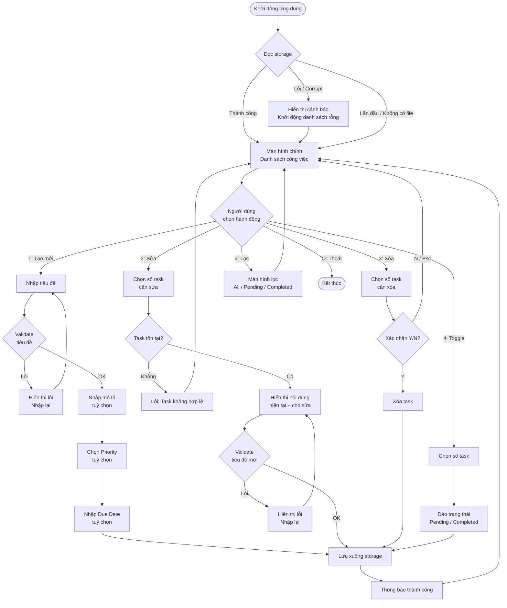

# DESIGN-todo-app-csharp: Thiết kế UX/UI — To-Do App C# Console

> Tài liệu này là đầu vào chính thức cho Frontend Dev (Senior/Junior Developer) để implement giao diện Console.
> Mọi thay đổi UI/UX phải cập nhật đồng bộ file này và thông báo cho Tech Lead.

---

## 1. Tham chiếu

| Tài liệu | Đường dẫn |
|---|---|
| PRD | `docs/prd/PRD-todo-app-csharp.md` |
| User Stories | `docs/user-stories/US-todo-app-csharp.md` |
| Template Design | `.claude/templates/DESIGN-template.md` |

---

## 2. Nguyên tắc thiết kế Console UX

Ứng dụng Console không có GUI truyền thống. Các nguyên tắc sau bắt buộc áp dụng:

| Nguyên tắc | Mô tả |
|---|---|
| **Clarity** | Mỗi màn hình chỉ hiển thị thông tin cần thiết, không rối |
| **Immediate Feedback** | Mỗi thao tác phải có phản hồi ngay (thành công, lỗi, xác nhận) |
| **Discoverability** | Menu phím tắt luôn hiển thị ở footer — user không cần nhớ |
| **Error Recovery** | Khi lỗi validation, giữ nguyên input cũ và chỉ báo lỗi |
| **Minimal Steps** | Mọi thao tác CRUD hoàn thành trong tối đa 3 bước từ màn hình chính |
| **Visual Hierarchy** | Dùng ký tự ASCII và màu ANSI để phân cấp thông tin rõ ràng |

---

## 3. Color Scheme — ANSI Console Colors

> Console Windows hỗ trợ ANSI escape codes từ Windows 10 build 1511 trở lên.
> Developer PHẢI enable ANSI mode khi khởi động: `Console.OutputEncoding = Encoding.UTF8`
> và gọi `EnableAnsiConsole()` utility method.

### 3.1 Bảng màu sử dụng

| Token | ANSI Code | Màu hiển thị | Sử dụng cho |
|---|---|---|---|
| `color.header` | `\e[97m` (Bright White) | Trắng sáng | Tiêu đề app, header màn hình |
| `color.primary` | `\e[96m` (Bright Cyan) | Xanh lam sáng | Số menu, prompt nhập liệu, highlight |
| `color.success` | `\e[92m` (Bright Green) | Xanh lá sáng | Task Completed, thông báo thành công |
| `color.warning` | `\e[93m` (Bright Yellow) | Vàng sáng | Due date hôm nay, cảnh báo |
| `color.danger` | `\e[91m` (Bright Red) | Đỏ sáng | Task quá hạn, lỗi, xác nhận xóa |
| `color.muted` | `\e[90m` (Dark Gray) | Xám tối | Task Completed (mờ đi), metadata |
| `color.priority.high` | `\e[91m` (Bright Red) | Đỏ | Priority High |
| `color.priority.medium` | `\e[93m` (Bright Yellow) | Vàng | Priority Medium |
| `color.priority.low` | `\e[92m` (Bright Green) | Xanh lá | Priority Low |
| `color.reset` | `\e[0m` | Reset | Kết thúc màu |

### 3.2 Priority Symbols

| Priority | Symbol | Màu |
|---|---|---|
| High | `[!!!]` | Đỏ sáng |
| Medium | `[!]` | Vàng |
| Low | `[·]` | Xanh lá |
| None | ` ` | Không màu |

### 3.3 Status Symbols

| Trạng thái | Symbol | Hiển thị |
|---|---|---|
| Pending | `[ ]` | Trắng bình thường |
| Completed | `[✓]` | Xanh lá, tiêu đề bị strikethrough bằng dấu `~~` trong comment code, hiển thị màu xám |
| Quá hạn (Overdue) | `[!]` | Đỏ sáng |
| Đến hạn hôm nay (Due Today) | `[~]` | Vàng |

---

## 4. User Flow Tổng Quan

```
KHỞI ĐỘNG
    │
    ▼
[Đọc file storage] ──── Lỗi / corrupt ──► [Cảnh báo + khởi động danh sách rỗng]
    │
    ▼
[MÀN HÌNH CHÍNH — Danh sách công việc]
    │
    ├──► [1] Tạo task mới ──► [Nhập tiêu đề] ──► [Nhập mô tả (tuỳ chọn)]
    │         ──► [Chọn Priority (tuỳ chọn)] ──► [Chọn Due Date (tuỳ chọn)]
    │         ──► [Xác nhận] ──► [Lưu] ──► [Quay về màn hình chính]
    │
    ├──► [2] Sửa task ──► [Chọn số task] ──► [Sửa từng trường]
    │         ──► [Xác nhận] ──► [Lưu] ──► [Quay về màn hình chính]
    │
    ├──► [3] Xóa task ──► [Chọn số task] ──► [Xác nhận Y/N]
    │         ──► [Lưu] ──► [Quay về màn hình chính]
    │
    ├──► [4] Toggle Hoàn thành ──► [Chọn số task] ──► [Đảo trạng thái]
    │         ──► [Lưu] ──► [Quay về màn hình chính]
    │
    ├──► [5] Lọc / Filter ──► [Menu lọc] ──► [Chọn chế độ]
    │         ──► [Quay về màn hình chính với bộ lọc mới]
    │
    └──► [Q] Thoát ──► [Kết thúc ứng dụng]
```

### 4.1 User Flow chi tiết (Mermaid)



---

## 5. Thiết kế Wireframe ASCII — Từng màn hình

### Screen 1: Màn hình chính — Danh sách công việc

**Mục đích:** Hiển thị toàn bộ danh sách task, cung cấp menu điều hướng chính.
**User Story:** US-002 (Xem danh sách), US-005 (Toggle), US-008 (Filter)

```
╔════════════════════════════════════════════════════════════════════════╗
║              TO-DO APP — Quản lý Công Việc  v1.0                      ║
╠════════════════════════════════════════════════════════════════════════╣
║  Bộ lọc: [TẤT CẢ]    Tổng: 5 task  |  Pending: 3  |  Hoàn thành: 2  ║
╠════════════════════════════════════════════════════════════════════════╣
║  #   Trạng  Ưu tiên  Tiêu đề                  Due Date     Ngày tạo  ║
║ ─────────────────────────────────────────────────────────────────── ║
║  1   [ ]    [!!!]    Hoàn thành báo cáo Q2    ⚠ 01/06/26  31/05/26  ║
║  2   [ ]    [!]      Họp team sáng thứ 2      ~ Hôm nay   01/06/26  ║
║  3   [ ]    [·]      Mua đồ ăn trưa            05/06/26   01/06/26  ║
║  4   [✓]    [·]      Gửi email cho khách hàng  ─────────  30/05/26  ║
║  5   [✓]             Review code PR #42        ─────────  29/05/26  ║
║                                                                       ║
║  [Chưa có thêm task nào]                                             ║
╠════════════════════════════════════════════════════════════════════════╣
║  MENU:  [1] Tạo mới  [2] Sửa  [3] Xóa  [4] Toggle  [5] Lọc  [Q] Thoát ║
╚════════════════════════════════════════════════════════════════════════╝
Nhập lựa chọn: _
```

**Chú thích màu:**
- Header `TO-DO APP`: Bright White
- `⚠ 01/06/26`: Bright Red (quá hạn)
- `~ Hôm nay`: Bright Yellow (đến hạn hôm nay)
- `[!!!]`: Bright Red
- `[!]`: Bright Yellow
- `[·]`: Bright Green
- Task `[✓]` (dòng 4, 5): toàn bộ dòng màu Dark Gray
- Số menu `[1] [2]...`: Bright Cyan
- `Nhập lựa chọn:`: Bright Cyan

**States cần handle:**

| State | Hiển thị |
|---|---|
| Default (có data) | Hiển thị danh sách như wireframe trên |
| Empty (không có task) | Xem Screen 1b bên dưới |
| Filter: Pending | Tiêu đề "Bộ lọc: [PENDING]", chỉ hiện task Pending |
| Filter: Completed | Tiêu đề "Bộ lọc: [HOÀN THÀNH]", chỉ hiện task Completed |
| Filter result empty | Xem Screen 1c bên dưới |

**Screen 1b — Empty State (chưa có task nào):**

```
╔════════════════════════════════════════════════════════════════════════╗
║              TO-DO APP — Quản lý Công Việc  v1.0                      ║
╠════════════════════════════════════════════════════════════════════════╣
║  Bộ lọc: [TẤT CẢ]    Tổng: 0 task                                   ║
╠════════════════════════════════════════════════════════════════════════╣
║                                                                       ║
║                                                                       ║
║            Chưa có công việc nào.                                    ║
║            Nhấn [1] để tạo task đầu tiên!                            ║
║                                                                       ║
║                                                                       ║
╠════════════════════════════════════════════════════════════════════════╣
║  MENU:  [1] Tạo mới  [2] Sửa  [3] Xóa  [4] Toggle  [5] Lọc  [Q] Thoát ║
╚════════════════════════════════════════════════════════════════════════╝
Nhập lựa chọn: _
```

**Screen 1c — Filter Empty State:**

```
╔════════════════════════════════════════════════════════════════════════╗
║              TO-DO APP — Quản lý Công Việc  v1.0                      ║
╠════════════════════════════════════════════════════════════════════════╣
║  Bộ lọc: [HOÀN THÀNH]    Tổng: 0 task khớp bộ lọc                   ║
╠════════════════════════════════════════════════════════════════════════╣
║                                                                       ║
║            Chưa có công việc nào hoàn thành.                         ║
║            Nhấn [5] để thay đổi bộ lọc.                             ║
║                                                                       ║
╠════════════════════════════════════════════════════════════════════════╣
║  MENU:  [1] Tạo mới  [2] Sửa  [3] Xóa  [4] Toggle  [5] Lọc  [Q] Thoát ║
╚════════════════════════════════════════════════════════════════════════╝
Nhập lựa chọn: _
```

---

### Screen 2: Tạo task mới

**Mục đích:** Thu thập thông tin task mới từ người dùng qua từng bước tuần tự.
**User Story:** US-001, US-009, US-010

```
╔════════════════════════════════════════════════════════════════════════╗
║              TẠO CÔNG VIỆC MỚI                                       ║
╠════════════════════════════════════════════════════════════════════════╣
║  Bước 1/4 — Tiêu đề                                                  ║
║                                                                       ║
║  Nhập tiêu đề công việc (bắt buộc, tối đa 200 ký tự):               ║
║  > _                                                                  ║
║                                                                       ║
║  [Esc] Huỷ và quay lại                                               ║
╚════════════════════════════════════════════════════════════════════════╝
```

**Screen 2 — Bước 2: Mô tả (sau khi nhập tiêu đề hợp lệ):**

```
╔════════════════════════════════════════════════════════════════════════╗
║              TẠO CÔNG VIỆC MỚI                                       ║
╠════════════════════════════════════════════════════════════════════════╣
║  Bước 2/4 — Mô tả                                                    ║
║                                                                       ║
║  Tiêu đề: Hoàn thành báo cáo Q2                                      ║
║                                                                       ║
║  Nhập mô tả chi tiết (tuỳ chọn, Enter để bỏ qua):                   ║
║  > _                                                                  ║
║                                                                       ║
║  [Esc] Huỷ và quay lại                                               ║
╚════════════════════════════════════════════════════════════════════════╝
```

**Screen 2 — Bước 3: Priority:**

```
╔════════════════════════════════════════════════════════════════════════╗
║              TẠO CÔNG VIỆC MỚI                                       ║
╠════════════════════════════════════════════════════════════════════════╣
║  Bước 3/4 — Mức độ ưu tiên                                           ║
║                                                                       ║
║  Tiêu đề: Hoàn thành báo cáo Q2                                      ║
║                                                                       ║
║  Chọn mức độ ưu tiên (Enter để bỏ qua = Không có):                  ║
║    [1] Không có ưu tiên                                              ║
║    [2] [·] Thấp   (Low)                                              ║
║    [3] [!] Trung bình (Medium)                                       ║
║    [4] [!!!] Cao  (High)                                             ║
║                                                                       ║
║  [Esc] Huỷ và quay lại                                               ║
╚════════════════════════════════════════════════════════════════════════╝
Chọn [1-4]: _
```

**Screen 2 — Bước 4: Due Date:**

```
╔════════════════════════════════════════════════════════════════════════╗
║              TẠO CÔNG VIỆC MỚI                                       ║
╠════════════════════════════════════════════════════════════════════════╣
║  Bước 4/4 — Ngày hạn hoàn thành                                      ║
║                                                                       ║
║  Tiêu đề: Hoàn thành báo cáo Q2                                      ║
║  Ưu tiên:  [!!!] Cao                                                 ║
║                                                                       ║
║  Nhập ngày hạn (định dạng DD/MM/YYYY, Enter để bỏ qua):             ║
║  > _                                                                  ║
║                                                                       ║
║  Ví dụ: 15/06/2026                                                   ║
║  [Esc] Huỷ và quay lại                                               ║
╚════════════════════════════════════════════════════════════════════════╝
```

**Screen 2 — Xác nhận (Tóm tắt trước khi lưu):**

```
╔════════════════════════════════════════════════════════════════════════╗
║              TẠO CÔNG VIỆC MỚI — XÁC NHẬN                           ║
╠════════════════════════════════════════════════════════════════════════╣
║                                                                       ║
║  Tiêu đề  : Hoàn thành báo cáo Q2                                   ║
║  Mô tả    : Gửi cho anh Ngạn trước 17h                               ║
║  Ưu tiên  : [!!!] Cao                                                ║
║  Ngày hạn : 05/06/2026                                               ║
║  Trạng thái: Pending                                                  ║
║                                                                       ║
╠════════════════════════════════════════════════════════════════════════╣
║  [Enter/Y] Lưu task      [N/Esc] Huỷ bỏ                             ║
╚════════════════════════════════════════════════════════════════════════╝
```

**Screen 2 — Validation Error State:**

```
╔════════════════════════════════════════════════════════════════════════╗
║              TẠO CÔNG VIỆC MỚI                                       ║
╠════════════════════════════════════════════════════════════════════════╣
║  Bước 1/4 — Tiêu đề                                                  ║
║                                                                       ║
║  Nhập tiêu đề công việc (bắt buộc, tối đa 200 ký tự):               ║
║  > _                                                                  ║
║                                                                       ║
║  ✗ Lỗi: Tiêu đề không được để trống.                                 ║
║                                                                       ║
║  [Esc] Huỷ và quay lại                                               ║
╚════════════════════════════════════════════════════════════════════════╝
```

**Chú thích màu Screen 2:**
- Header "TẠO CÔNG VIỆC MỚI": Bright White
- "Bước N/4 —": Bright Cyan
- Dấu `>` prompt: Bright Cyan
- `[!!!] Cao`: Bright Red; `[!] Trung bình`: Bright Yellow; `[·] Thấp`: Bright Green
- `✗ Lỗi:`: Bright Red, toàn bộ dòng lỗi màu đỏ
- `[Enter/Y] Lưu task`: Bright Green
- `[N/Esc] Huỷ bỏ`: Dark Gray

**States:**

| State | Mô tả |
|---|---|
| Default | Ô nhập trống, chờ user gõ |
| Error | Hiển thị dòng đỏ bên dưới ô nhập, giữ nguyên nội dung cũ |
| Due Date in past | Cảnh báo vàng: "Ngày hạn đã qua. Nhấn Y để tiếp tục, N để nhập lại:" |
| Saving | Dòng "Đang lưu..." trong 200ms |
| Success | Clear màn hình, quay về Screen 1, hiển thị toast 1 giây |

---

### Screen 3: Sửa task

**Mục đích:** Cho phép chỉnh sửa tiêu đề, mô tả, priority, due date của task đã có.
**User Story:** US-003, US-009, US-010

**Bước đầu — Chọn task cần sửa:**

```
╔════════════════════════════════════════════════════════════════════════╗
║              SỬA CÔNG VIỆC                                           ║
╠════════════════════════════════════════════════════════════════════════╣
║  Nhập số thứ tự task cần sửa (1-5):                                  ║
║  > _                                                                  ║
║                                                                       ║
║  [Esc] Huỷ và quay lại                                               ║
╚════════════════════════════════════════════════════════════════════════╝
```

**Màn hình sửa — Hiển thị giá trị hiện tại:**

```
╔════════════════════════════════════════════════════════════════════════╗
║              SỬA CÔNG VIỆC — #1                                      ║
╠════════════════════════════════════════════════════════════════════════╣
║  Điền thông tin mới (Enter để giữ nguyên giá trị hiện tại):         ║
║                                                                       ║
║  [1] Tiêu đề    : Hoàn thành báo cáo Q2                             ║
║      Mới        > _                                                   ║
║                                                                       ║
║  [2] Mô tả      : Gửi cho anh Ngạn trước 17h                        ║
║      Mới        > (Enter để giữ nguyên)                              ║
║                                                                       ║
║  [3] Ưu tiên    : [!!!] Cao                                          ║
║      Mới [1-4]  > (Enter để giữ nguyên)                             ║
║                                                                       ║
║  [4] Ngày hạn   : 05/06/2026                                         ║
║      Mới DD/MM  > (Enter để giữ nguyên, "0" để xoá ngày hạn)       ║
║                                                                       ║
╠════════════════════════════════════════════════════════════════════════╣
║  [S] Lưu thay đổi    [Esc] Huỷ bỏ (không lưu)                       ║
╚════════════════════════════════════════════════════════════════════════╝
```

**Chú thích màu Screen 3:**
- Giá trị hiện tại (sau dấu `:`): Dark Gray (chỉ để tham khảo)
- Dấu `>` prompt: Bright Cyan
- `[S] Lưu thay đổi`: Bright Green
- `[Esc] Huỷ bỏ`: Dark Gray
- Dòng validation error: Bright Red

**States:**

| State | Mô tả |
|---|---|
| Default | Hiển thị giá trị cũ màu xám, con trỏ tại ô đầu tiên |
| Validation Error | Dòng đỏ bên dưới trường lỗi, focus giữ tại trường đó |
| No Change | User nhấn Enter tất cả → lưu với dữ liệu cũ (không có gì thay đổi) |
| Success | Quay về Screen 1, toast "Đã cập nhật task #N" |

---

### Screen 4: Xác nhận xóa

**Mục đích:** Yêu cầu xác nhận trước khi xóa vĩnh viễn task (BR-GLOBAL-07).
**User Story:** US-004

**Bước đầu — Chọn task cần xóa:**

```
╔════════════════════════════════════════════════════════════════════════╗
║              XÓA CÔNG VIỆC                                           ║
╠════════════════════════════════════════════════════════════════════════╣
║  Nhập số thứ tự task cần xóa (1-5):                                  ║
║  > _                                                                  ║
║                                                                       ║
║  [Esc] Huỷ và quay lại                                               ║
╚════════════════════════════════════════════════════════════════════════╝
```

**Màn hình xác nhận xóa:**

```
╔════════════════════════════════════════════════════════════════════════╗
║              XÓA CÔNG VIỆC — XÁC NHẬN                               ║
╠════════════════════════════════════════════════════════════════════════╣
║                                                                       ║
║  Bạn có chắc chắn muốn XÓA VĨNH VIỄN công việc sau không?           ║
║                                                                       ║
║  ┌────────────────────────────────────────────────────────────────┐   ║
║  │ #1  [!!!]  Hoàn thành báo cáo Q2                              │   ║
║  │     Ngày tạo: 31/05/2026  |  Trạng thái: Pending             │   ║
║  └────────────────────────────────────────────────────────────────┘   ║
║                                                                       ║
║  ⚠ CẢNH BÁO: Hành động này KHÔNG THỂ hoàn tác!                      ║
║                                                                       ║
╠════════════════════════════════════════════════════════════════════════╣
║  [Y] Xóa vĩnh viễn    [N / Esc] Huỷ bỏ, giữ lại task              ║
╚════════════════════════════════════════════════════════════════════════╝
```

**Chú thích màu Screen 4:**
- Toàn bộ box task trong khung `┌─┐`: Bright White (nổi bật task sắp bị xóa)
- `⚠ CẢNH BÁO:`: Bright Red, in đậm
- `[Y] Xóa vĩnh viễn`: Bright Red (nguy hiểm)
- `[N / Esc] Huỷ bỏ`: Bright Green (an toàn)

**States:**

| State | Mô tả |
|---|---|
| Default | Hiển thị thông tin task, chờ Y/N |
| User chọn N / Esc | Quay về Screen 1, không thay đổi gì |
| User chọn Y | "Đang xóa...", quay về Screen 1, toast "Đã xóa task #N" |
| Task không tồn tại | Thông báo lỗi "Số task không hợp lệ", quay về Screen 1 |

---

### Screen 5: Menu lọc / Filter

**Mục đích:** Cho phép chọn bộ lọc hiển thị danh sách.
**User Story:** US-008

```
╔════════════════════════════════════════════════════════════════════════╗
║              LỌC CÔNG VIỆC                                           ║
╠════════════════════════════════════════════════════════════════════════╣
║                                                                       ║
║  Bộ lọc hiện tại: [TẤT CẢ]                                          ║
║                                                                       ║
║  Chọn bộ lọc:                                                        ║
║                                                                       ║
║    [1] Tất cả          — Hiển thị tất cả công việc (5 task)          ║
║    [2] Đang chờ        — Chỉ hiển thị chưa hoàn thành (3 task)      ║
║    [3] Đã hoàn thành   — Chỉ hiển thị đã hoàn thành (2 task)        ║
║                                                                       ║
╠════════════════════════════════════════════════════════════════════════╣
║  [Esc] Huỷ, giữ nguyên bộ lọc hiện tại                              ║
╚════════════════════════════════════════════════════════════════════════╝
Chọn [1-3]: _
```

**Chú thích màu Screen 5:**
- Bộ lọc đang chọn hiện tại: in trong dấu ngoặc vuông, Bright Cyan
- Số lượng task trong mỗi nhóm: Dark Gray (thống kê nhanh)
- Option đang active: đánh dấu `*` hoặc `►` trước

**States:**

| State | Mô tả |
|---|---|
| Default | Hiển thị 3 tùy chọn với số lượng task thực tế |
| Chọn option | Cập nhật bộ lọc, quay về Screen 1 ngay lập tức |
| Esc | Giữ nguyên bộ lọc cũ, quay về Screen 1 |

---

### Screen 6: Toggle hoàn thành (Inline — không có màn hình riêng)

**Mục đích:** Toggle trạng thái task Pending ↔ Completed trực tiếp từ màn hình chính.
**User Story:** US-005

```
╔════════════════════════════════════════════════════════════════════════╗
║              TOGGLE TRẠNG THÁI                                       ║
╠════════════════════════════════════════════════════════════════════════╣
║  Nhập số thứ tự task cần đánh dấu (1-5):                             ║
║  > _                                                                  ║
║                                                                       ║
║  [Esc] Huỷ và quay lại                                               ║
╚════════════════════════════════════════════════════════════════════════╝
```

> Sau khi user nhập số hợp lệ: toggle ngay, không có màn hình trung gian, quay về Screen 1 với toast xác nhận.

---

### Screen 7: Toast Notification (Overlay — hiển thị tạm thời 1.5 giây)

**Mục đích:** Phản hồi nhanh sau mỗi thao tác thành công hoặc lỗi hệ thống.

**Toast Success:**
```
 ─────────────────────────────────────── 
  ✓  Task đã được tạo thành công!
 ─────────────────────────────────────── 
```
Màu: Bright Green, xuất hiện dưới footer, tự động mất sau 1.5 giây.

**Toast Error (Storage):**
```
 ─────────────────────────────────────── 
  ✗  Không thể lưu dữ liệu. Kiểm tra dung lượng đĩa.
 ─────────────────────────────────────── 
```
Màu: Bright Red, giữ trên màn hình cho đến khi user nhấn phím bất kỳ.

**Toast Warning:**
```
 ─────────────────────────────────────── 
  ⚠  Dữ liệu bị lỗi. Ứng dụng khởi động với danh sách mới.
     File cũ đã được backup: todos.bak.json
 ─────────────────────────────────────── 
```
Màu: Bright Yellow, giữ cho đến khi user nhấn Enter để xác nhận.

---

## 6. Hệ thống phím tắt (Keyboard Navigation)

### 6.1 Phím tắt toàn cục (hoạt động ở mọi màn hình)

| Phím | Hành động |
|---|---|
| `Esc` | Hủy thao tác hiện tại, quay về màn hình trước |
| `Q` / `q` | Thoát ứng dụng (chỉ từ màn hình chính) |

### 6.2 Phím tắt tại Màn hình chính (Screen 1)

| Phím | Hành động |
|---|---|
| `1` | Mở màn hình Tạo task mới |
| `2` | Mở màn hình Sửa task |
| `3` | Mở màn hình Xóa task |
| `4` | Mở màn hình Toggle hoàn thành |
| `5` | Mở màn hình Lọc |
| `Q` / `q` | Thoát ứng dụng |

### 6.3 Phím tắt tại màn hình Nhập liệu (Create / Edit)

| Phím | Hành động |
|---|---|
| `Enter` | Xác nhận trường hiện tại, chuyển sang trường tiếp theo |
| `Esc` | Hủy toàn bộ, quay về màn hình chính (không lưu) |
| `S` | Lưu (chỉ tại màn hình Sửa) |

### 6.4 Phím tắt tại màn hình Xác nhận (Confirm Delete)

| Phím | Hành động |
|---|---|
| `Y` / `y` | Xác nhận xóa |
| `N` / `n` | Hủy xóa |
| `Esc` | Hủy xóa |
| `Enter` | Mặc định = Hủy (N) — để tránh xóa nhầm |

### 6.5 Phím tắt tại màn hình Lọc (Screen 5)

| Phím | Hành động |
|---|---|
| `1` | Lọc: Tất cả |
| `2` | Lọc: Đang chờ (Pending) |
| `3` | Lọc: Đã hoàn thành (Completed) |
| `Esc` | Giữ nguyên bộ lọc, quay về màn hình chính |

---

## 7. Cách hiển thị thông tin trong danh sách

### 7.1 Định dạng dòng task

```
[N]   [STATUS]  [PRIORITY]   [TITLE (max 35 chars)]     [DUE_DATE]   [CREATED]
```

| Cột | Độ rộng | Nội dung |
|---|---|---|
| `#` (số thứ tự) | 4 ký tự | Số từ 1 đến N, căn phải |
| `Status` | 5 ký tự | `[ ]` hoặc `[✓]` |
| `Priority` | 6 ký tự | `[!!!]`, `[!]`, `[·]`, hoặc khoảng trắng |
| `Title` | 35 ký tự | Truncate với `...` nếu dài hơn |
| `Due Date` | 13 ký tự | Ngày hoặc nhãn trạng thái |
| `Created` | 10 ký tự | DD/MM/YY |

### 7.2 Truncation rule

- Tiêu đề > 35 ký tự → cắt còn 32 ký tự + `...`
- Ví dụ: `"Hoàn thành báo cáo quý 2 năm 2026"` → `"Hoàn thành báo cáo quý 2 nă..."`

### 7.3 Hiển thị Due Date trong danh sách

| Điều kiện | Hiển thị | Màu |
|---|---|---|
| Không có due date | ` ` (trống) | N/A |
| Due date > hôm nay, Pending | `DD/MM/YY` | Trắng bình thường |
| Due date = hôm nay, Pending | `~ Hôm nay` | Bright Yellow |
| Due date < hôm nay, Pending | `⚠ DD/MM/YY` | Bright Red |
| Due date bất kỳ, Completed | `─────────` | Dark Gray |

### 7.4 Hiển thị task Completed

- Toàn bộ dòng task: Dark Gray
- Symbol: `[✓]` thay cho `[ ]`
- Tiêu đề không có strikethrough (console không hỗ trợ) — màu xám đủ phân biệt

---

## 8. Thông báo lỗi / Success Messages

### 8.1 Danh sách thông báo chuẩn

| Code | Loại | Nội dung | Hiển thị |
|---|---|---|---|
| `MSG-001` | Error | "Tiêu đề không được để trống." | Inline dưới ô nhập |
| `MSG-002` | Error | "Tiêu đề tối đa 200 ký tự (hiện tại: N ký tự)." | Inline dưới ô nhập |
| `MSG-003` | Error | "Mô tả tối đa 1000 ký tự." | Inline dưới ô nhập |
| `MSG-004` | Error | "Định dạng ngày không hợp lệ. Vui lòng nhập DD/MM/YYYY." | Inline dưới ô nhập |
| `MSG-005` | Warning | "Ngày hạn đã qua. Nhấn Y để tiếp tục, N để nhập lại:" | Inline, chờ Y/N |
| `MSG-006` | Error | "Số task không hợp lệ. Vui lòng nhập từ 1 đến N." | Inline |
| `MSG-007` | Success | "Task đã được tạo thành công!" | Toast 1.5 giây |
| `MSG-008` | Success | "Task #N đã được cập nhật!" | Toast 1.5 giây |
| `MSG-009` | Success | "Task #N đã được xóa." | Toast 1.5 giây |
| `MSG-010` | Success | "Task #N đã được đánh dấu hoàn thành." | Toast 1.5 giây |
| `MSG-011` | Success | "Task #N đã được đặt lại thành Đang chờ." | Toast 1.5 giây |
| `MSG-012` | Error | "Không thể lưu dữ liệu. Kiểm tra dung lượng đĩa hoặc quyền truy cập." | Toast, giữ đến khi nhấn phím |
| `MSG-013` | Warning | "Dữ liệu bị lỗi. Ứng dụng khởi động với danh sách mới. File cũ: todos.bak.json" | Toast, giữ đến khi nhấn Enter |
| `MSG-014` | Error | "Không thể đọc file dữ liệu. Kiểm tra quyền truy cập." | Toast, giữ đến khi nhấn phím |

### 8.2 Quy tắc hiển thị thông báo

- **Inline error:** Hiển thị ngay dưới trường nhập lỗi, màu Bright Red, prefix `✗`
- **Toast success:** Dưới footer màn hình, màu Bright Green, tự mất sau 1.5 giây
- **Toast warning:** Màu Bright Yellow, giữ cho đến khi user xác nhận
- **Toast critical error:** Màu Bright Red, giữ cho đến khi user nhấn phím bất kỳ

---

## 9. Component List — Các phần tử UI tái sử dụng

### 9.1 AppHeader

**Mô tả:** Dòng tiêu đề cố định ở đầu mọi màn hình.

```
╔════════════════════════════════════════════════════════════════════════╗
║              TO-DO APP — [TÊN MÀN HÌNH]                              ║
╠════════════════════════════════════════════════════════════════════════╣
```

| Thuộc tính | Giá trị |
|---|---|
| Chiều rộng | 72 ký tự (cố định) |
| Màu viền | Dark Gray hoặc White |
| Màu text tiêu đề | Bright White |
| Tái sử dụng | Tất cả màn hình |

### 9.2 StatusBar

**Mô tả:** Dòng thống kê trạng thái bộ lọc và số lượng task, hiển thị dưới header.

```
║  Bộ lọc: [TẤT CẢ]    Tổng: 5 task  |  Pending: 3  |  Hoàn thành: 2  ║
```

| Thuộc tính | Giá trị |
|---|---|
| Tái sử dụng | Screen 1 (màn hình chính) |
| Màu bộ lọc | Bright Cyan |
| Màu số liệu | White |

### 9.3 TaskRow

**Mô tả:** Dòng hiển thị thông tin tóm tắt của một task trong danh sách.

```
║  N   [STATUS]  [PRIORITY]   [TITLE]                   [DUE]   [DATE]  ║
```

| Thuộc tính | Giá trị |
|---|---|
| Pending task | Màu White |
| Completed task | Màu Dark Gray |
| Overdue task | Due date màu Bright Red |
| Due today task | Due date màu Bright Yellow |

### 9.4 MenuBar

**Mô tả:** Footer menu phím tắt, hiển thị ở cuối mọi màn hình có thao tác.

```
╠════════════════════════════════════════════════════════════════════════╣
║  MENU:  [1] Tạo mới  [2] Sửa  [3] Xóa  [4] Toggle  [5] Lọc  [Q] Thoát ║
╚════════════════════════════════════════════════════════════════════════╝
```

| Thuộc tính | Giá trị |
|---|---|
| Màu số phím `[1]` | Bright Cyan |
| Màu text mô tả | White |
| Tái sử dụng | Screen 1 |

### 9.5 ConfirmBox

**Mô tả:** Vùng xác nhận Y/N, tái sử dụng ở Delete và các cảnh báo.

```
╠════════════════════════════════════════════════════════════════════════╣
║  [Y] Xác nhận    [N / Esc] Huỷ bỏ                                   ║
╚════════════════════════════════════════════════════════════════════════╝
```

| Thuộc tính | Giá trị |
|---|---|
| `[Y]` xác nhận nguy hiểm | Bright Red |
| `[Y]` xác nhận an toàn | Bright Green |
| `[N/Esc]` | Dark Gray hoặc Bright Green |

### 9.6 InputPrompt

**Mô tả:** Dấu nhắc nhập liệu chuẩn.

```
  Nhập [mô tả trường]:
  > _
```

| Thuộc tính | Giá trị |
|---|---|
| Label | White |
| Dấu `>` | Bright Cyan |
| Cursor `_` | Nhấp nháy tự nhiên của console |

### 9.7 ToastNotification

**Mô tả:** Thông báo ngắn xuất hiện tạm thời sau thao tác.

```
 ─────────────────────────────────────── 
  [ICON]  [NỘI DUNG THÔNG BÁO]
 ─────────────────────────────────────── 
```

| Loại | Icon | Màu |
|---|---|---|
| Success | `✓` | Bright Green |
| Error | `✗` | Bright Red |
| Warning | `⚠` | Bright Yellow |

### 9.8 EmptyState

**Mô tả:** Hiển thị khi danh sách không có dữ liệu.

```
║            [Nội dung thông báo trống]                                ║
║            [Gợi ý hành động tiếp theo]                               ║
```

| Thuộc tính | Giá trị |
|---|---|
| Màu text | Dark Gray |
| Căn giữa | Có |
| Tái sử dụng | Screen 1b, 1c |

### 9.9 StepIndicator

**Mô tả:** Hiển thị tiến trình bước trong màn hình nhiều bước (Create / Edit).

```
║  Bước N/4 — [Tên bước]                                              ║
```

| Thuộc tính | Giá trị |
|---|---|
| Màu "Bước N/4" | Bright Cyan |
| Tái sử dụng | Screen 2 (Create), Screen 3 (Edit) |

---

## 10. Design Spec Hand-off

### Screen 1 — Màn hình chính

```
## Màn hình chính / Danh sách công việc
Mục đích  : Hiển thị danh sách task | Flow: US-002, US-005, US-008
States    : Default (có data) / Empty / Filter-Pending / Filter-Completed / Filter-Empty
Components: AppHeader | StatusBar | TaskRow (list) | MenuBar | ToastNotification | EmptyState
Tokens    : color.header (Bright White) | color.primary (Bright Cyan)
            color.success (Bright Green) | color.danger (Bright Red)
            color.warning (Bright Yellow) | color.muted (Dark Gray)
Spacing   : Chiều rộng console cố định 72 ký tự | Padding 2 ký tự hai bên
Keyboard  : 1/2/3/4/5/Q (xem mục 6.2)
Accessibility: Tất cả thao tác qua keyboard, không cần mouse
               Screen reader: text-only, không dùng ký tự đặc biệt quan trọng mà không có text label
Link Figma: N/A (Console App — ASCII wireframe là thiết kế chính thức)
```

### Screen 2 — Tạo task mới

```
## Màn hình Tạo task mới (Multi-step)
Mục đích  : Thu thập thông tin task mới | Flow: US-001, US-009, US-010
States    : Step1 (Title) / Step2 (Desc) / Step3 (Priority) / Step4 (DueDate)
            / Confirm / ValidationError / DueDateWarning / Saving / Success
Components: AppHeader | StepIndicator | InputPrompt | ConfirmBox | ToastNotification
Tokens    : color.primary (prompt) | color.danger (error text)
            color.priority.high/medium/low (priority labels)
Keyboard  : Enter (next step) | Esc (cancel all) | Y/N (confirm)
Validation: Title: không rỗng + max 200 ký tự | Desc: max 1000 | DueDate: DD/MM/YYYY format
Accessibility: Mọi lỗi có text rõ ràng, không chỉ dựa vào màu sắc
Link Figma: N/A
```

### Screen 3 — Sửa task

```
## Màn hình Sửa task
Mục đích  : Chỉnh sửa tiêu đề, mô tả, priority, due date | Flow: US-003, US-009, US-010
States    : Default (show current values) / ValidationError / NoChange / Success
Components: AppHeader | InputPrompt | ConfirmBox | ToastNotification
Tokens    : color.muted (current values) | color.primary (prompt) | color.danger (error)
Keyboard  : Enter (skip field = keep) | S (save) | Esc (cancel)
Rule      : Enter tại trường = giữ giá trị cũ, không phải xóa trắng
Link Figma: N/A
```

### Screen 4 — Xác nhận xóa

```
## Màn hình Xác nhận xóa
Mục đích  : Phòng ngừa xóa nhầm, yêu cầu xác nhận rõ ràng | Flow: US-004
States    : ShowConfirm / Deleting / Success / TaskNotFound
Components: AppHeader | TaskRow (preview) | ConfirmBox (destructive) | ToastNotification
Tokens    : color.danger (warning text + [Y] button) | color.success ([N] button)
Keyboard  : Y (xóa) | N / Esc (hủy) | Enter = N (mặc định an toàn)
Rule      : Enter mặc định = N (an toàn) — tránh xóa nhầm khi spam Enter
Link Figma: N/A
```

### Screen 5 — Menu lọc

```
## Màn hình Lọc / Filter
Mục đích  : Thay đổi bộ lọc hiển thị danh sách | Flow: US-008
States    : Default / Selected
Components: AppHeader | MenuBar (filter options)
Tokens    : color.primary (số phím + bộ lọc đang active)
Keyboard  : 1/2/3 (chọn filter) | Esc (giữ nguyên)
Rule      : Số lượng task trong mỗi nhóm phải tính real-time từ in-memory list
Link Figma: N/A
```

---

## 11. Accessibility

| Yêu cầu | Chi tiết |
|---|---|
| **Keyboard-only navigation** | Toàn bộ thao tác thực hiện qua keyboard, không cần mouse |
| **Clear text labels** | Mọi thao tác nguy hiểm (xóa) đều có text rõ, không chỉ dùng màu đỏ |
| **Error messages** | Thông báo lỗi bằng ngôn ngữ tự nhiên, không chỉ code lỗi |
| **Color not sole indicator** | Priority dùng symbol `[!!!]` `[!]` `[·]` kết hợp màu — không chỉ màu |
| **Consistent shortcuts** | Esc = hủy, Enter = xác nhận/next — nhất quán ở mọi màn hình |
| **Visible focus** | Dấu `>` cursor luôn hiển thị rõ vị trí nhập liệu hiện tại |
| **Timeout warning** | Toast quan trọng (lỗi storage) không tự biến mất — đợi user acknowledge |

---

## 12. UX Notes — Lưu ý trải nghiệm người dùng

### 12.1 Nguyên tắc thiết kế tổng quát

1. **Không dùng "Press any key to continue"** — đây là UX anti-pattern cổ. Thay bằng context rõ ràng: `"Nhấn Enter để tiếp tục"` hoặc `"[Q] Thoát"`.

2. **Luôn hiển thị menu ở footer** — người dùng không phải nhớ phím tắt. Mọi màn hình đều có hướng dẫn thoát (Esc hoặc Q).

3. **Clear màn hình giữa các màn hình** — gọi `Console.Clear()` khi chuyển màn hình để tránh rối. Tuy nhiên không clear khi hiển thị toast (overlay).

4. **Feedback ngay lập tức** — sau mỗi thao tác hợp lệ, phản hồi trong vòng 200ms (trước khi ghi storage nếu cần). Không để user chờ im lặng.

5. **Destructive action mặc định = Cancel** — tại màn hình xóa, Enter mặc định = N (hủy), không phải Y. Ngăn xóa nhầm khi user spam Enter.

6. **Giữ nguyên input khi lỗi** — khi validation fail, không xóa trắng trường, giữ lại nội dung user đã nhập để sửa.

### 12.2 Console size assumption

- Thiết kế tối ưu cho console width: **80 ký tự**, height: **25 dòng trở lên**
- Wireframe sử dụng 72 ký tự content + 2 viền mỗi bên = 74 ký tự
- Developer PHẢI kiểm tra `Console.WindowWidth` khi khởi động; nếu < 80 → hiển thị cảnh báo nhưng không block ứng dụng

### 12.3 Đặc thù Console App cần chú ý

| Vấn đề | Giải pháp |
|---|---|
| Không hỗ trợ strikethrough | Dùng màu xám (Dark Gray) cho Completed task thay strikethrough |
| Đặc biệt Unicode có thể không hiển thị đúng | Dùng `Console.OutputEncoding = Encoding.UTF8` khi khởi động; fallback `[x]` nếu `✓` không hiển thị |
| ANSI không hoạt động trên Windows cũ | Check OS version; nếu không hỗ trợ ANSI → disable màu, dùng plaintext thuần |
| Scrolling danh sách dài | Nếu task > 20 dòng màn hình: dùng phân trang (`Trang 1/3 — [N] Trang sau, [P] Trang trước`) |
| Nhập ngày | Validate format DD/MM/YYYY bằng `DateTime.TryParseExact`, không dùng regex thuần |

### 12.4 Loading state

- Khi đọc file storage lúc khởi động: hiển thị `"Đang tải dữ liệu..."` nếu thời gian > 500ms
- Khi ghi storage: ghi background, không chặn UI (với JSON nhỏ thường < 50ms, không cần spinner)

### 12.5 Multi-instance warning

MVP là single-instance. Nếu phát hiện file lock (khi dùng SQLite), hiển thị cảnh báo:
```
⚠ Ứng dụng đang chạy ở cửa sổ khác. Chỉ dùng một cửa sổ để tránh mất dữ liệu.
```

---

## 13. Link Figma / Prototype

- **Link Figma:** N/A — Console Application không dùng Figma. Tài liệu này (ASCII wireframe + spec) là thiết kế chính thức.
- **Prototype:** Developer có thể dùng file này để implement trực tiếp.
- **Review:** PM review màn hình này bằng cách chạy ứng dụng thực tế sau khi Developer implement prototype đầu tiên.

---

*Tài liệu này là đầu vào chính thức cho Senior Developer và Junior Developer.*
*Mọi thay đổi UX trong quá trình implement phải được UI/UX Designer review trước khi merge.*
*Câu hỏi mở từ US (OQ-BA-*) có ảnh hưởng đến thiết kế: OQ-BA-01 (toast sau tạo task), OQ-BA-03 (thứ tự sắp xếp), OQ-BA-09 (priority mặc định) — PM phải trả lời trước Phase 1.*
