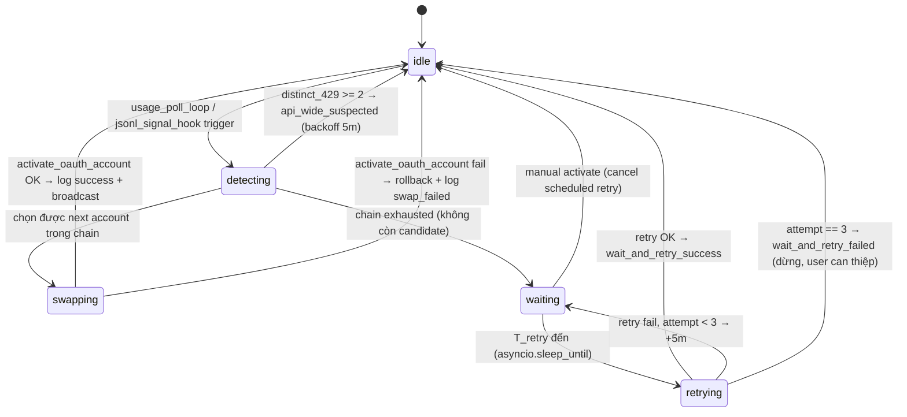
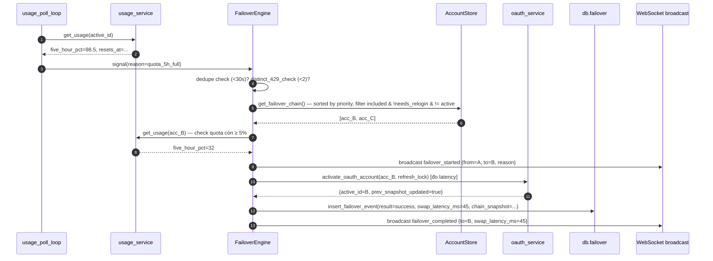

# TDD: Agent Dashboard v2 — Auto-Failover Anthropic

## 0. ASSUMPTIONS đang đặt ra (xác nhận lại nếu sai)

1. **Dashboard KHÔNG đứng giữa Claude Code CLI ↔ Anthropic API.** CLI gọi thẳng Anthropic; dashboard chỉ quan sát qua (a) `usage_service.get_usage()` — REST poll `/api/oauth/usage` với OAuth Bearer, và (b) JSONL watcher đọc file transcript CLI ghi vào `.claude/projects/...`. → Không tồn tại con đường "bắt 429 real-time <100ms" như PRD FAIL-2 đã nêu; con số 100ms mô tả **latency của thao tác ghi `.credentials.json`** (đã có `refresh_lock`), KHÔNG phải latency từ lúc CLI gặp 429 đến lúc swap. Điều chỉnh SLA thực tế ở §4 và §11.
2. **Anthropic usage endpoint đã trả về `resets_at` (5h) và `seven_day_resets_at` (7d)** — xác nhận qua đọc `usage_service.py:90-91`. → Không cần gọi endpoint mới cho Q-TL-4.
3. **AccountStore là JSON có XOR obfuscation (không phải SQLite).** Failover chain config (`priority`, `include_in_chain`) sẽ thêm field vào từng account trong AccountStore, KHÔNG tạo bảng SQLite riêng.
4. **`failover_events` là bảng SQLite mới** trong cùng file DB với `sessions`/`events` hiện có — theo pattern migration idempotent `_migrate_*` trong `db/schema.py`.
5. **1 event loop asyncio duy nhất** cho backend (Uvicorn). Failover engine chạy như background task cùng loop — KHÔNG thread riêng.

Nếu ASSUMPTION 1 sai (VD: SD chấp nhận thêm proxy `httpx` trung gian đứng giữa CLI ↔ Anthropic) → phải làm lại phần detection §3; không khuyến nghị vì đây là scope creep lớn ngoài US-001.

---

## 1. Bối cảnh

Agent Dashboard v1 (Sprint 1–6) đã có: JSONL watcher realtime, session view, token analytics, pipeline view, session history, và Account Manager Anthropic (thủ công). Sprint 2 đã xây `activate_oauth_account()` + `refresh_lock` + XOR obfuscation cho `.credentials.json`, và Sprint 5 đã có `usage_service` REST poll với cache 60s trả `resets_at`/`seven_day_resets_at`.

TDD này mở rộng bằng một **Failover Engine** chạy trong process backend Uvicorn: quan sát usage + JSONL events → khi phát hiện account active kiệt quota → hot-swap sang account kế trong chain → log event → broadcast WebSocket. Khi cả chain kiệt → schedule wait-and-retry với countdown push cho FE.

---

## 2. Goals / Non-goals

### Goals

- G1: Automate hot-swap Anthropic account khi account active bị 429 hoặc quota 100% (5h hoặc 7d).
- G2: Failover chain có thứ tự user cấu hình được (priority + include/exclude) và persist qua restart.
- G3: Wait-and-retry tự động khi cả chain hết quota, dùng `resets_at`/`seven_day_resets_at` có sẵn, buffer 30s, tối đa 3 retry cách 5 phút.
- G4: Mọi swap có audit trail đầy đủ (`failover_events` table) — no silent failover (FAIL-3, FAIL-7).
- G5: Backward compat 100% với Sprint 1–6 (không đụng schema `sessions`/`events`, không phá `activate_oauth_account()` API cũ).

### Non-goals

- Không proxy Anthropic API (không đứng giữa CLI ↔ Anthropic).
- Không failover cross-provider.
- Không thay đổi cách CLI phát hiện lỗi hay retry — CLI vẫn hành xử như hiện tại.
- Không nâng cấp XOR → AES.

---

## 3. Trả lời 4 câu Q-TL

### Q-TL-1 — Cơ chế phát hiện 429

**Trả lời dứt khoát:** KHÔNG bắt request 429 real-time. Dashboard dùng **2 kênh phát hiện song song, đều có độ trễ có thể chấp nhận được**:

**Kênh A — Proactive qua `usage_service` (chính, khuyến nghị):**

- Failover engine mở một background task `usage_poll_loop()` chạy mỗi **15s** (`FAILOVER_USAGE_POLL_SEC`, override được), cho **tất cả account OAuth `include_in_chain=True`** — kể cả không phải active. Poll dùng chính `get_usage(force=False)` — cache 60s có sẵn của Sprint 5 sẽ tự dedupe (thực tế 1 phút mới có call thật/1 account).
- Trigger swap khi: `active_account.five_hour_pct >= FAILOVER_THRESHOLD_PCT` (mặc định **98.0** — không lấy 100 chằn để né race giữa lúc quota reset ↔ CLI vẫn gửi được request; user có thể chỉnh 95–99) **hoặc** `active_account.seven_day_pct >= FAILOVER_THRESHOLD_PCT`.
- Trigger swap khi HTTP call `get_usage` trả `error="http_429"` cho `active_account` (Anthropic usage endpoint chính nó bị rate-limit → account bị throttle).
- Latency thực tế: 15s poll interval + tối đa 60s cache freshness ⇒ **worst case ~75s từ khi quota chạm ngưỡng đến khi Engine biết**. Với burst API traffic thực tế của power-user, mức này chấp nhận được — CLI sẽ retry vài lần trong thời gian đó nếu gặp 429.
- Điều chỉnh SLA vs US-001 Scenario 1 ("trong vòng 5 giây"): **không đạt được**. Đề xuất BA/PM chỉnh AC thành "trong vòng 90 giây từ lúc quota chạm ngưỡng" — đưa vào TDD làm số thực tế; hoặc chấp nhận latency ẩn nếu giữ 5s (điều này sẽ fail QA verify).

**Kênh B — Reactive qua JSONL parser (bổ sung):**

- Watcher hiện có đã đọc JSONL events realtime (Sprint 1). Bổ sung parser check: nếu block `type=="user"` content chứa `is_error: true` + message chứa chuỗi `"rate_limit"` / `"quota"` / `"429"` (Claude Code CLI đưa tool_result lỗi vào transcript) → phát sinh tín hiệu trigger sớm hơn, thậm chí có thể tới 1–3s.
- Kênh B là "opportunistic" — không đảm bảo mọi lỗi 429 đều xuất hiện trong JSONL (phụ thuộc format CLI hiện hành), nên KHÔNG dựa duy nhất vào kênh B. Nếu kênh B trigger → skip kênh A cho lần đó (dedupe theo `active_account_id + trigger_reason` trong 30s).

**Kết luận:** Failover engine dùng kênh A làm nền, kênh B tăng tốc khi may mắn parser bắt được. Cả hai đều đổ vào cùng function `_maybe_trigger_failover(reason)` để không có 2 luồng logic swap song song.

### Q-TL-2 — Threshold "1 account hết quota" vs "Anthropic API down toàn cầu"

**Trả lời dứt khoát:** Áp dụng chính đề xuất BA (EC3), tinh chỉnh cụ thể:

- Duy trì trong Engine 1 counter global `recent_429_events: deque[(account_id, timestamp)]` giữ 60 giây gần nhất.
- Trước khi swap: đếm `distinct_account_ids` trong 60s vừa qua.
  - `distinct >= 2` → **giả định API-wide issue**: KHÔNG swap, ghi `failover_events` với `result="api_wide_suspected"`, broadcast WS `failover_paused`, và **backoff 5 phút** trước khi thử phát hiện tiếp (skip kênh A/B trigger trong 5p).
  - `distinct == 1` (bình thường) → tiến hành swap.
- Confirm điều kiện lại sau 5 phút backoff: nếu `get_usage()` cho ít nhất 1 account trả 200 OK và `five_hour_pct < 100` → API sống lại → mở lại failover; nếu vẫn error → tiếp tục backoff 5p nữa (unlimited backoff cho tới khi API sống).
- **Cấu hình:** `FAILOVER_API_WIDE_DISTINCT_THRESHOLD = 2`, `FAILOVER_API_WIDE_WINDOW_SEC = 60`, `FAILOVER_API_WIDE_BACKOFF_SEC = 300`.

### Q-TL-3 — Schema `failover_events`

**Trả lời dứt khoát:** Chấp nhận 9 field BA đề xuất, bổ sung 3 field kỹ thuật cần thiết, đưa vào SQLite migration mới `_migrate_failover_events_table` (idempotent, gọi cùng chuỗi `initialize()` trong `db/schema.py`):

```sql
CREATE TABLE IF NOT EXISTS failover_events (
  failover_id         TEXT PRIMARY KEY,          -- UUID4 hex, do FE có thể ref
  occurred_at         TEXT NOT NULL,             -- ISO 8601 UTC (with ms + offset)
  from_account_id     TEXT,                      -- null khi trigger từ system-level không có active
  from_account_name   TEXT,
  to_account_id       TEXT,                      -- null nếu result != success
  to_account_name     TEXT,
  trigger_reason      TEXT NOT NULL,             -- 'http_429' | 'quota_5h_full' | 'quota_7d_full' | 'jsonl_rate_limit' | 'api_wide_suspected' | 'manual_override'
  result              TEXT NOT NULL,             -- 'success' | 'swap_failed' | 'wait_and_retry_scheduled' | 'wait_and_retry_success' | 'wait_and_retry_failed' | 'api_wide_suspected' | 'retry_cancelled_by_manual'
  swap_latency_ms     INTEGER,                   -- null cho non-swap events
  next_retry_at       TEXT,                      -- ISO 8601 UTC — null nếu không phải wait-and-retry
  retry_attempt       INTEGER,                   -- 1..3 khi trong chuỗi retry; null nếu không retry
  error_message       TEXT,                      -- null nếu success; ngắn gọn ≤500 char cho swap_failed/api_wide
  chain_snapshot_json TEXT                       -- JSON: [{acc_id, name, priority, included, five_hour_pct, seven_day_pct}] tại thời điểm event → cho phép reconstruct chain sau này
);
CREATE INDEX IF NOT EXISTS idx_failover_events_occurred_at ON failover_events(occurred_at DESC);
CREATE INDEX IF NOT EXISTS idx_failover_events_result      ON failover_events(result);
```

**Auto-purge 30 ngày (BR trong US-003):** thêm 1 query DELETE tại lúc `initialize()`:
```sql
DELETE FROM failover_events WHERE occurred_at < datetime('now', '-30 days');
```

**Lý do 3 field bổ sung:** (1) `retry_attempt` cần để UI biểu thị "Retry lần 2/3" (US-006 Scenario từ FE spec); (2) `error_message` cho debug swap_failed thay vì chỉ enum result; (3) `chain_snapshot_json` cho phép tái hiện trạng thái chain lúc failover (audit sâu — nếu user đổi priority sau đó, event cũ vẫn hiểu được).

**BR9 (không credential plaintext):** `chain_snapshot_json` chỉ chứa `acc_id`/`name`/`priority`/`included`/`pct` — KHÔNG có `accessToken`/`refreshToken`. Test unit sẽ verify điều này (grep serialize output không có key `accessToken`).

### Q-TL-4 — Tính `T_reset`

**Trả lời dứt khoát:** KHÔNG cần endpoint mới. `usage_service.py:29-32,90-91` đã lộ:

- `UsageInfo["resets_at"]` — unix seconds, reset 5h window
- `UsageInfo["seven_day_resets_at"]` — unix seconds, reset 7d window

Công thức trong Failover Engine:

```python
def compute_next_reset(accounts_in_chain: list[UsageInfo]) -> int | None:
    """
    T_reset = min reset time trong tất cả (account, window) có pct >= threshold.
    Chỉ xét account included và không needs_relogin.
    Trả về unix seconds, hoặc None nếu không xác định được.
    """
    candidates: list[int] = []
    for info in accounts_in_chain:
        if info.get("error"):
            continue
        for pct_key, reset_key in (
            ("five_hour_pct", "resets_at"),
            ("seven_day_pct", "seven_day_resets_at"),
        ):
            pct = info.get(pct_key)
            reset = info.get(reset_key)
            if pct is not None and pct >= FAILOVER_THRESHOLD_PCT and reset:
                candidates.append(int(reset))
    return min(candidates) if candidates else None

T_retry = compute_next_reset(...) + FAILOVER_RETRY_BUFFER_SEC   # 30
```

**Fallback nếu Anthropic không trả reset_at (edge case):** dùng `time.time() + 3600` cho 5h window (1h an toàn) và log warning. Retry vẫn diễn ra, chỉ mất chính xác — vẫn tự động, không cần user can thiệp.

---

## 4. Kiến trúc

### 4.1 Module mới trong backend

```
tools/agent-dashboard/backend/agent_dashboard/
  ├── failover/                       # ← NEW package
  │   ├── __init__.py
  │   ├── engine.py                   # FailoverEngine class + state machine
  │   ├── detector.py                 # usage_poll_loop + jsonl_signal_hook
  │   ├── scheduler.py                # wait-and-retry background task
  │   └── models.py                   # dataclasses: FailoverEvent, ChainSnapshot
  ├── db/
  │   ├── schema.py                   # + _migrate_failover_events_table
  │   └── failover.py                 # ← NEW: insert_failover_event, list_failover_events, count_24h, purge_old
  ├── accounts.py                     # + fields priority, include_in_chain per account; + set_priority, set_include_in_chain, get_failover_chain
  ├── oauth_service.py                # (không đổi API cũ; failover engine gọi activate_oauth_account như hiện tại)
  ├── usage_service.py                # (không đổi — chỉ reuse)
  └── api/                            # 5 endpoint mới + 5 WS event
```

### 4.2 State machine Failover Engine



### 4.3 Sequence: một chu kỳ failover thành công



### 4.4 Concurrency & re-entrancy

- Toàn bộ Engine gộp qua **1 `asyncio.Lock` — `failover_action_lock`** — mọi transition detecting→swapping / waiting→retrying phải acquire trước. Khác với `refresh_lock` (chỉ bảo vệ ghi credential file). Trong `activate_oauth_account`, `refresh_lock` được acquire ở tầng dưới — Engine giữ `failover_action_lock` bao ngoài.
- **Không** giữ `failover_action_lock` trong `usage_poll_loop` — chỉ acquire khi thực sự trigger (tránh block loop).
- Manual activation từ UI phải cancel `scheduler_task` (nếu đang wait) và ghi event `retry_cancelled_by_manual`. Cơ chế: khi FE gọi `POST /api/accounts/{id}/activate` (endpoint đã có Sprint 2) — thêm hook cuối `activate_oauth_account` gọi `engine.on_manual_activation()` → engine cancel `scheduler_task` nếu có.

---

## 5. DB migration

Thêm vào `db/schema.py` sau `_migrate_result_columns`:

```python
async def _migrate_failover_events_table(conn: aiosqlite.Connection) -> None:
    """Idempotent: create failover_events table + indexes (Sprint 7).

    Uses CREATE TABLE IF NOT EXISTS + CREATE INDEX IF NOT EXISTS — safe on
    repeated startups. Also purges records older than 30 days (BR from US-003).
    """
    await conn.executescript("""
      CREATE TABLE IF NOT EXISTS failover_events (
        failover_id         TEXT PRIMARY KEY,
        occurred_at         TEXT NOT NULL,
        from_account_id     TEXT,
        from_account_name   TEXT,
        to_account_id       TEXT,
        to_account_name     TEXT,
        trigger_reason      TEXT NOT NULL,
        result              TEXT NOT NULL,
        swap_latency_ms     INTEGER,
        next_retry_at       TEXT,
        retry_attempt       INTEGER,
        error_message       TEXT,
        chain_snapshot_json TEXT
      );
      CREATE INDEX IF NOT EXISTS idx_failover_events_occurred_at ON failover_events(occurred_at DESC);
      CREATE INDEX IF NOT EXISTS idx_failover_events_result      ON failover_events(result);
    """)
    await conn.execute(
        "DELETE FROM failover_events WHERE occurred_at < datetime('now', '-30 days')"
    )
    await conn.commit()
    logger.info("DB migration Sprint 7: failover_events ready (+ 30-day purge)")
```

Và gọi trong `initialize()` sau `_migrate_result_columns`.

**AccountStore JSON schema mở rộng** (không phải SQL migration — do JSON): mỗi account thêm 2 field:

```json
{
  "id": "acc_xyz",
  "kind": "oauth_session",
  "priority": 1,             // NEW — int, 1 = ưu tiên cao nhất, mặc định = len(accounts) khi add mới
  "include_in_chain": true,  // NEW — mặc định true
  "needs_relogin": false,
  ...
}
```

Migration function `_migrate_v2_to_v3` trong `AccountStore._load()`: khi đọc file thấy account thiếu 2 field này → set mặc định. Idempotent, tự-fix qua lần load kế.

---

## 6. API contract

### 6.1 REST endpoints (thêm vào FastAPI router hiện có)

| Method | Path | Request | Response 200 | Error |
|---|---|---|---|---|
| `GET` | `/api/failover/status` | — | `FailoverStatus` (§6.3) | 500 |
| `GET` | `/api/failover/log?from=&to=&limit=&offset=` | query params ISO date | `{ "items": FailoverEvent[], "total": int, "count_24h": int }` | 400 (date parse), 500 |
| `GET` | `/api/failover/chain` | — | `FailoverChainItem[]` | 500 |
| `PUT` | `/api/failover/chain` | `{ "items": [{ "acc_id": str, "priority": int, "include_in_chain": bool }] }` | `{ "ok": true }` | 400 (empty included set, dup priority, unknown acc_id), 409 (concurrent edit) |
| `POST` | `/api/failover/cancel-retry` | — | `{ "ok": true, "cancelled": bool }` | 500 |

### 6.2 WebSocket events (broadcast qua channel `dashboard` hiện có)

```json
// failover_started
{"type": "failover_started", "from": {"id":"...","name":"vietanh"}, "to": {"id":"...","name":"OAuth Imported"}, "reason": "quota_5h_full", "at": "2026-08-09T21:30:45.123+07:00"}

// failover_completed
{"type": "failover_completed", "failover_id": "abc...", "to": {"id":"...","name":"..."}, "swap_latency_ms": 45}

// failover_failed
{"type": "failover_failed", "failover_id": "abc...", "reason": "CREDENTIALS_WRITE_FAILED: ..."}

// all_accounts_exhausted
{"type": "all_accounts_exhausted", "next_retry_at": "2026-08-09T22:00:30+07:00", "retry_account": {"id":"...","name":"vietanh"}, "retry_attempt": 1, "max_retries": 3}

// wait_retry_tick   (mỗi 1s trong khi countdown active — tùy chọn: FE tự tick từ next_retry_at nếu cần tiết kiệm bandwidth)
{"type": "wait_retry_tick", "seconds_left": 8073}

// retry_success
{"type": "retry_success", "account": {"id":"...","name":"..."}}

// retry_cancelled_by_manual
{"type": "retry_cancelled_by_manual", "activated": {"id":"...","name":"..."}}

// failover_paused   (api_wide_suspected)
{"type": "failover_paused", "reason": "api_wide_suspected", "backoff_until": "2026-08-09T22:05:00+07:00"}
```

**Ghi chú `wait_retry_tick`:** DESIGN §Component 4 nói FE tự tính countdown từ `next_retry_at`. Đủ. Server KHÔNG bắt buộc push tick — tiết kiệm băng thông. Vẫn giữ event type để dùng sau nếu FE cần (VD: multi-tab sync). SD ưu tiên không implement server tick trong sprint này.

### 6.3 Type schemas

```typescript
// FailoverStatus
{
  state: 'idle' | 'monitoring' | 'swapping' | 'waiting' | 'retrying' | 'paused',
  active_account: { id: string, name: string } | null,
  next_retry_at: string | null,           // ISO 8601 UTC
  retry_account: { id: string, name: string } | null,
  retry_attempt: number,                  // 0 khi không trong retry cycle
  max_retries: number,                    // 3
  count_24h: number,
  api_wide_backoff_until: string | null
}

// FailoverChainItem
{
  acc_id: string,
  name: string,
  priority: number,
  include_in_chain: boolean,
  status: 'active' | 'standby' | 'exhausted' | 'needs_relogin',
  five_hour_pct: number | null,
  seven_day_pct: number | null,
  resets_at: number | null
}
```

---

## 7. Rủi ro kỹ thuật & giảm thiểu

| ID | Rủi ro | Mức | Giảm thiểu |
|---|---|---|---|
| RT-1 | Detection latency thực tế 15–90s, không đạt "5s" trong US-001 Scenario 1 | Trung | Đàm phán chỉnh AC xuống 90s; ghi rõ trong TDD; QA verify ở mức 90s |
| RT-2 | Infinite loop khi TẤT CẢ account 429 nhưng threshold API-wide chưa đủ (distinct=1) | Cao | Đếm `swap_failed_or_still_429_in_a_row` — nếu ≥ 3 lần trong 2 phút → force wait-and-retry, không tiếp tục swap; kèm max 3 retry (BR18) là cap cứng cuối |
| RT-3 | Race giữa `activate_oauth_account` (đang gọi bởi manual UI) và Failover engine swap | Trung | Cả 2 dùng chung `refresh_lock` — sequential; thêm `failover_action_lock` bọc ngoài Engine để 2 tín hiệu trigger không tạo 2 swap song song |
| RT-4 | Engine block main event loop khi thao tác dài (subprocess, sleep countdown) | Cao | Wait-and-retry dùng `asyncio.sleep()` (không block loop); subprocess `_run_claude_subprocess()` chạy trong `run_in_executor` (đã có); không dùng `time.sleep()` ở bất cứ đâu trong Engine |
| RT-5 | `usage_service` cache 60s làm miss trigger sớm | Thấp | Poll dùng `force=False` là chủ ý (dedupe) — 15s poll + 60s cache = worst 75s; nếu nghi ngờ, dùng `force=True` một lần khi đã có tín hiệu JSONL kênh B |
| RT-6 | `chain_snapshot_json` chứa nhầm token plaintext | Cao (security) | Serializer chỉ đọc field whitelist `{id, name, priority, include_in_chain, five_hour_pct, seven_day_pct}` — unit test grep output "accessToken\|refreshToken" phải 0 match |
| RT-7 | Backward compat với Sprint 1–6: JSONL watcher/session view đọc DB dùng bảng cũ | Thấp | Chỉ thêm 1 bảng + migration idempotent; không alter bảng cũ; không đổi schema `sessions/events` |
| RT-8 | FE tính countdown drift so với backend | Thấp | Backend luôn trả `next_retry_at` (absolute time). FE tính delta = server_time - local_time offset (lưu tại mỗi WS message có `at`) — DESIGN đã ghi |
| RT-9 | `refresh_lock` giữ quá lâu (subprocess 30s trong `_do_swap_and_invoke`) block failover swap | Trung | `activate_oauth_account` KHÔNG có subprocess — chỉ ghi file. Failover engine gọi thẳng `activate_oauth_account`, KHÔNG gọi `_do_swap_and_invoke` (refresh scheduler khác nhiệm vụ). |

---

## 8. Backward compat

- Không đụng bảng `sessions`/`events`/`token_usage`/`file_cursors`.
- Không đổi chữ ký `activate_oauth_account()`, `refresh_inactive_accounts()`.
- Endpoint mới đều dưới `/api/failover/*` — không xung đột tên với Sprint 2 (`/api/accounts/*`).
- AccountStore migration `v2→v3`: chỉ thêm field mặc định, không xóa/đổi.
- WebSocket: thêm event types mới — client cũ nhận unknown type sẽ bỏ qua (FE code hiện tại đã dùng switch/case; SD verify FE Sprint 6 không crash trên unknown type — nếu có, fix trong task JD).

---

## 9. Task breakdown

**Convention:** Sprint 7, mã `S7-T##`. SD tổng ~7.5nd; JD tổng ~7.5nd. Cả 2 song song sau khi TDD merged.

### Senior Developer — Backend (7.5 nd)

| ID | Task | Estimate | Phụ thuộc | DoD tóm tắt |
|---|---|---|---|---|
| S7-T01 | Migration `_migrate_failover_events_table` + `_migrate_v2_to_v3 AccountStore` + module `db/failover.py` (insert/list/count/purge) | 0.5 nd | — | Bảng tạo idempotent; unit test purge 30d; migration test double-run OK |
| S7-T02 | AccountStore: thêm field `priority`/`include_in_chain`, method `set_priority`, `set_include_in_chain`, `get_failover_chain()` (sorted, filtered) | 0.5 nd | S7-T01 | Test add account mới → priority = len; test constraint "phải giữ ≥1 included"; XOR persist qua restart |
| S7-T03 | `failover/models.py` + `failover/detector.py`: `usage_poll_loop` (15s), `jsonl_signal_hook`, dedup, distinct_429 check | 1.5 nd | S7-T02 | Poll không block loop; unit test mock 3 case: quota_5h_full, http_429, jsonl trigger; dedupe 30s; distinct≥2→pause |
| S7-T04 | `failover/engine.py`: state machine, `_maybe_trigger_failover`, chọn next in chain, gọi `activate_oauth_account`, đo `swap_latency_ms`, ghi `failover_events` | 1.5 nd | S7-T02, S7-T03 | Test happy path swap; test swap_failed (mock write raise) → rollback + log; test chain exhausted → chuyển state waiting |
| S7-T05 | `failover/scheduler.py`: wait-and-retry, compute `T_reset`, `asyncio.sleep_until`, retry loop max 3 × 5m, cancel-on-manual | 1.0 nd | S7-T04 | Test T_reset chọn min; test cancel khi manual activate; test retry 1→2→3 fail flow; test buffer 30s |
| S7-T06 | REST endpoints (5 endpoint §6.1) + validation (empty included set, dup priority, unknown acc_id) | 1.0 nd | S7-T05 | OpenAPI schema đúng type; test 400 các case; test 200 happy; PUT chain persist file JSON |
| S7-T07 | WebSocket broadcast (§6.2) — hook vào Engine transition, thêm channel `dashboard` message types | 0.5 nd | S7-T04, S7-T05 | Test tất cả 8 event type broadcast đúng payload; test client nhận qua WS mock |
| S7-T08 | Wire Engine vào app lifespan (startup: start engine tasks; shutdown: cancel gracefully) + hook `on_manual_activation` vào `activate_oauth_account` (Sprint 2 endpoint) | 0.5 nd | S7-T07 | App start không leak task khi shutdown; manual activate cancel scheduler task; regression test Sprint 6 endpoints còn OK |
| S7-T09 | Unit + integration test tổng hợp; security test: verify `chain_snapshot_json` không có accessToken/refreshToken (RT-6) | 0.5 nd | S7-T01..T08 | Coverage ≥ 80% các module mới; grep security test pass |

### Junior Developer — Frontend (7.5 nd)

| ID | Task | Estimate | Phụ thuộc | DoD tóm tắt |
|---|---|---|---|---|
| S7-T21 | Tab bar 3 tab cho Account Manager (Danh sách / Failover Chain / Failover Log); giữ nguyên "Danh sách" là component Sprint 6 hiện có (wrap) | 1.0 nd | — | Không phá layout Sprint 6; keyboard nav (arrow keys) chuyển tab; a11y `role="tablist"` |
| S7-T22 | `FailoverStatusBadge` component + `ToastContext` variant `failover` / `failover-error` + hook vào WS events | 0.5 nd | S7-T21 | Badge auto ẩn 30s; toast auto-dismiss 15s success, không auto-dismiss error; test hover |
| S7-T23 | `FailoverChainConfig` tab (ordered list, ▲▼, checkbox include, nút Lưu) — GET/PUT `/api/failover/chain`, mock server đầu | 1.5 nd | S7-T21 | Reorder → priority tính lại (1..N); validate không cho uncheck last; loading/saving/saved state; a11y aria-label ▲▼ |
| S7-T24 | `FailoverLogTable` tab (table 6 cột, filter ngày, pagination "Xem thêm", badge 24h count) — GET `/api/failover/log` | 2.0 nd | S7-T21 | Empty state; filter empty state; realtime append hàng mới qua WS `failover_completed`/`failover_failed`; skeleton loading; a11y `role="table"` |
| S7-T25 | `WaitRetryBanner` global (dưới AppHeader) — state machine counting → retrying → retry_failed_n → exhausted_all_retries → hidden; countdown tính từ `next_retry_at` local | 1.5 nd | S7-T22 | Countdown không drift ≥ 1s trong 5 phút; nút Hủy call `POST /api/failover/cancel-retry`; nút "Mở Account Manager" navigate đúng; manual activate → banner biến mất |
| S7-T26 | WS client: subscribe/parse 8 event type mới; dedupe; ignore unknown type an toàn (backward compat) | 0.5 nd | S7-T22..T25 | Test parser với payload mẫu (fixtures từ TDD §6.2); unknown type không throw |
| S7-T27 | E2E manual test theo AC US-001..US-007 với mock backend; sửa bugs phát sinh; screenshot 4 component cho UX Reviewer | 0.5 nd | S7-T21..T26 | 7 US pass manual test; screenshot đủ 4 component × 3 state chính |

**Ghi chú song song:** JD dùng MSW / json-server mock 5 endpoint từ ngày 1 (contract cố định từ TDD §6). Khi SD deliver S7-T06 → JD switch qua real backend cuối sprint.

---

## 10. Câu hỏi/quyết định chờ user

- **Điều chỉnh AC US-001 Scenario 1 từ "5s" → "90s"?** Đề nghị BA/PM confirm để QA plan viết đúng. Nếu giữ 5s → không đạt được với kiến trúc này (cần proxy — scope creep).
- **`FAILOVER_THRESHOLD_PCT` mặc định 98.0** — user muốn đổi (95? 100)? Có thể expose thành config env `FAILOVER_TRIGGER_PCT` để user chỉnh runtime.

---

## 11. Metric sau go-live

Bổ sung 1 metric vào PRD §6:

| Metric | Target |
|---|---|
| **Detection→swap latency P95** | ≤ 90s (không phải 100ms — 100ms chỉ là swap file write; xem §3 Q-TL-1) |

Metric 100ms của PRD giữ nguyên nhưng gán rõ scope: latency từ khi Engine gọi `activate_oauth_account` đến khi file được ghi. Đo qua `swap_latency_ms` trong `failover_events`.

---

*TDD v1.0 — Tech Lead KZTEK — 2026-08-09*
*Bước tiếp theo: SD (S7-T01..T09) + JD (S7-T21..T27) chạy song song sau khi user confirm 2 câu §10.*
