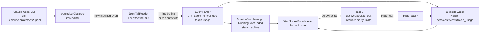

# TDD — Agent Dashboard

## 1. Bối cảnh

Dashboard web chạy local (`http://localhost:7770`) theo dõi realtime hoạt động của Claude Code agents đang chạy trên máy user (KZTEK). Nguồn dữ liệu **DUY NHẤT**: các file JSONL do Claude Code CLI ghi ra trong `~/.claude/projects/<project-slug>/<session-uuid>.jsonl`. Dashboard KHÔNG can thiệp vào runtime của Claude Code — chỉ đọc log + hiển thị.

- Link PRD: `docs/prd/PRD-agent-dashboard.md`
- Link US: `docs/user-stories/US-agent-dashboard.md`
- Link DESIGN: `docs/design/DESIGN-agent-dashboard.md`
- Link SPRINT: `docs/planning/SPRINT-agent-dashboard.md`

---

## 2. Assumptions (giả định thiết kế — user/PM xác nhận nếu sai)

1. Máy chạy Windows 11 + Python 3.10+ đã cài (KZTEK dev environment). Node 20+ có sẵn cho build frontend.
2. Đường dẫn log Claude Code: Windows `%USERPROFILE%\.claude\projects\<slug>\*.jsonl` (POSIX equivalent trên WSL/macOS).
3. Format JSONL của Claude Code: mỗi dòng là 1 JSON message hợp lệ với các field như `type` (user/assistant/tool_use/tool_result), `timestamp`, `message.usage` (input_tokens/output_tokens/cache_creation_input_tokens/cache_read_input_tokens). Dòng chưa kết thúc bằng `\n` = ghi dở → bỏ qua chờ tick sau.
4. 1 file JSONL = 1 session của 1 agent (session_id = tên file không đuôi).
5. Tool cá nhân, 1 user 1 máy, không cần auth. Cổng 7770 backend, frontend build tĩnh do backend serve luôn (không dev server separate ở production local).
6. Mã hóa API key: XOR + base64 với salt local (theo BA/UX chốt) — không phải secure crypto, chỉ chống nhìn trực tiếp file.

→ Nếu sai bất kỳ điểm nào, phản hồi ngay; nếu không, tiến hành theo các giả định này.

---

## 3. Goals / Non-goals

### Goals
- Realtime cập nhật ≤ 2s khi file JSONL có dòng mới (WebSocket delta push).
- 4 màn hình: Agent Status, Token Analytics, Session History, Account Manager.
- 1 lệnh khởi động duy nhất (`python -m agent_dashboard`), không cần Docker.
- Không mất dữ liệu khi restart: SQLite persist toàn bộ session/token history.

### Non-goals
- Không multi-user, không auth, không remote access.
- Không inject account key vào runtime Claude Code (chỉ lưu + hiển thị).
- Không dark mode, không export CSV (out of scope MVP, xem SPRINT §Scope bị đẩy ra ngoài).
- Không secure crypto cho API key (chấp nhận mã hoá nhẹ).

---

## 4. Quyết định Tech Stack

### 4.1 Backend: **Python 3.10+ / FastAPI / watchdog / SQLite (better via `aiosqlite`)**

**Lý do chọn Python thay vì Node.js/TypeScript:**
| Tiêu chí | Python/FastAPI | Node.js/TypeScript |
|---|---|---|
| Sprint plan đã chốt | ✅ S1-T003 ghi rõ `watchdog`, S1-T020 `uvicorn` | ❌ Phải đổi lại sprint |
| Môi trường KZTEK dev | ✅ Đã có Python 3.10+ + venv (dùng cho script `md_to_docx_kztek.py`, lessons converter…) | ⚠️ Cần cài Node runtime riêng |
| File-watcher lib | `watchdog` (chín, ổn định Windows/macOS/Linux) | `chokidar` cũng ổn |
| WebSocket | FastAPI built-in `WebSocket` + `uvicorn` | Cần thêm `ws` |
| SQLite async | `aiosqlite` | `better-sqlite3` (sync, đơn giản hơn) |
| Team fluency | Python là stack chính KZTEK cho tool nội bộ | TS cần setup thêm |

→ **CHỐT: Python/FastAPI.** Sprint đã chốt, giữ nguyên. Node.js không mang lại giá trị đủ để đảo sprint plan.

### 4.2 Frontend: **Vite + React 18 + TypeScript + Tailwind CSS + Recharts**

- Vite + React + TS: build nhanh, HMR dev, output tĩnh cho backend serve. Dùng skill `vite-react-setup` để scaffold nhanh.
- Tailwind: khớp design token KZTEK (Navy/Cam) qua `tailwind.config.js` custom theme.
- Recharts: bar chart cho Token Analytics (nhẹ hơn Chart.js, tích hợp React tốt).
- State: React `useState` + `useReducer` cho local, context cho WebSocket connection. **Không dùng Redux** — scope nhỏ, thừa.
- WebSocket client: `native WebSocket` + custom hook `useWebSocket()` — không cần lib ngoài.

### 4.3 Storage
- **SQLite** (single file `data/dashboard.db`) qua `aiosqlite` — zero-setup, đủ cho vài chục nghìn events.
- **accounts.enc** (file JSON XOR+base64, cùng thư mục `data/`) — 1 flag `active: true` duy nhất.

### 4.4 Tổng hợp version bắt buộc
- Python: 3.10+
- FastAPI: 0.110+
- uvicorn[standard]: 0.27+
- watchdog: 4.0+
- aiosqlite: 0.20+
- Node: 20+
- React: 18.3+
- Vite: 5+
- Tailwind: 3.4+
- Recharts: 2.12+

---

## 5. Kiến trúc pipeline



### 5.1 Thành phần chính (backend package `agent_dashboard/`)

| Module | Trách nhiệm |
|---|---|
| `watcher.py` | `watchdog.Observer` theo dõi glob `~/.claude/projects/*/*.jsonl`. Emit event `(file_path, event_type)` vào asyncio queue. |
| `tail_reader.py` | Per-file cursor (offset byte). Đọc từ offset cũ đến EOF. **Chỉ yield dòng kết thúc bằng `\n`** — dòng dở giữ lại buffer cho tick sau. Xử lý file rotate/truncate (offset > filesize → reset). |
| `parser.py` | Nhận string JSONL 1 dòng → parse JSON. Trích: `session_id` (từ tên file), `timestamp`, `type`, `tool_name` (nếu tool_use), `usage.input_tokens/output_tokens/cache_creation_input_tokens/cache_read_input_tokens` từ `message.usage`. Try/except IndividualLine — 1 dòng lỗi KHÔNG dừng session. |
| `state_manager.py` | Map `session_id -> SessionState`. Rule: last_event_at + 5 phút chưa có event → `Idle`; + 30 phút → `Ended`. Ticker asyncio 30s để evaluate. |
| `db.py` | `aiosqlite` connection. Migrations at boot (CREATE IF NOT EXISTS). Bulk insert theo batch 50 events. |
| `ws.py` | FastAPI WebSocket endpoint `/ws`. Subscribe manager fan-out delta cho mọi client. |
| `accounts.py` | CRUD `data/accounts.enc`. XOR key = SHA256(hostname + username)[:16]. Base64 wrapper. |
| `main.py` | FastAPI app: mount REST routes + `/ws` + static files (frontend build). Start watcher + state ticker. |

### 5.2 Giải quyết watch_out (BA) — "log không có event kết thúc rõ ràng"

**Định nghĩa state machine session (chốt):**

| State | Điều kiện chuyển |
|---|---|
| `Running` | Có event mới trong ≤ 5 phút gần nhất |
| `Idle` | Không có event mới > 5 phút, ≤ 30 phút |
| `Ended` | Không có event mới > 30 phút |

Ngưỡng cấu hình được qua `config.py` (`IDLE_THRESHOLD_SEC=300`, `ENDED_THRESHOLD_SEC=1800`). Ticker asyncio 30s re-evaluate toàn bộ sessions và broadcast delta khi có thay đổi.

### 5.3 Xử lý dòng ghi dở (partial write)

`tail_reader.py`:
1. Lưu `last_offset` per file trong RAM (dict) + persist ra SQLite table `file_cursors` để survive restart.
2. Mở file mode `rb`, `seek(last_offset)`, `read()` → decode UTF-8 ignore errors.
3. Split bằng `\n`. Nếu string cuối KHÔNG rỗng (tức không end bằng `\n`) → **KHÔNG** parse, giữ lại buffer trong RAM. Chỉ commit `last_offset` = offset cuối dòng đã hoàn chỉnh.
4. Tick tiếp theo (do watchdog trigger hoặc timer 500ms fallback poll), đọc tiếp từ offset đã commit — dòng dở sẽ đầy đủ hơn.
5. Nếu file size < last_offset → file bị truncate/rotate → reset offset = 0.

---

## 6. API Contract

### 6.1 REST endpoints

Base: `http://localhost:7770/api`

| Method | Path | Mô tả | Response |
|---|---|---|---|
| GET | `/api/sessions` | Danh sách session hiện tại (state != Ended) | `[{session_id, project, agent_type, state, started_at, last_event_at, token_total}]` |
| GET | `/api/sessions/history?from=&to=&limit=100&offset=0` | Session đã Ended, có phân trang | `{items: [...], total: N}` |
| GET | `/api/sessions/{id}` | Chi tiết 1 session, kèm timeline events | `{session, events: [...]}` |
| GET | `/api/tokens/summary?range=7d\|30d\|12w\|6m` | Tổng hợp token cho chart | `{buckets: [{label, input, output, cache_creation, cache_read}], totals: {...}}` |
| GET | `/api/accounts` | Danh sách account | `[{id, name, key_masked, is_active, created_at}]` |
| POST | `/api/accounts` | Thêm account mới. Body: `{name, api_key}` | `{id, name, key_masked, is_active: false}` |
| PATCH | `/api/accounts/{id}` | Update name | `{...}` |
| DELETE | `/api/accounts/{id}` | Xóa (không xóa nếu là active — return 409) | `204` |
| POST | `/api/accounts/{id}/activate` | Set active (unset others) | `{active_id}` |
| GET | `/api/accounts/{id}/reveal` | Trả plaintext key để copy clipboard (1 lần) | `{api_key}` |
| GET | `/api/health` | Health check | `{status: "ok", uptime_sec, watcher_alive: true}` |

**Error format** (RFC7807-lite):
```json
{ "error": { "code": "ACCOUNT_ACTIVE_CANNOT_DELETE", "message": "..." } }
```

**Error codes:**
- `SESSION_NOT_FOUND` (404)
- `ACCOUNT_NOT_FOUND` (404)
- `ACCOUNT_ACTIVE_CANNOT_DELETE` (409)
- `ACCOUNT_KEY_INVALID` (400) — key không có prefix `sk-`
- `INTERNAL_ERROR` (500)

### 6.2 WebSocket `/ws`

Client mở kết nối → server gửi `snapshot` đầy đủ, sau đó chỉ push `delta`.

**Message envelope (server → client):**
```json
{ "type": "snapshot|delta", "ts": "2026-08-05T23:00:00Z", "payload": { ... } }
```

**Event types (trong payload.event khi type=delta):**

| event | payload | Trigger |
|---|---|---|
| `agent_started` | `{session_id, project, agent_type, started_at}` | File JSONL mới xuất hiện + có dòng đầu |
| `agent_update` | `{session_id, last_event_at, tool_use?: string, tokens_added?: {...}}` | Có dòng mới trong file đang chạy |
| `agent_state_changed` | `{session_id, state: "Running\|Idle\|Ended"}` | State machine chuyển |
| `token_update` | `{session_id, delta: {input, output, cache_creation, cache_read}, cumulative: {...}}` | Có usage trong dòng mới |
| `account_changed` | `{active_id, name}` | POST activate |
| `watcher_status` | `{alive: bool, error?: string}` | Watcher crash/restart |

**Snapshot payload** (khi client kết nối lần đầu):
```json
{
  "sessions": [ /* GET /api/sessions */ ],
  "active_account": { "id": "...", "name": "...", "key_masked": "..." },
  "watcher_alive": true
}
```

**Client → server:** ping mỗi 30s (`{"type":"ping"}`) — server reply `{"type":"pong"}`. Không gửi command nào khác qua WS.

---

## 7. DB Schema (SQLite)

```sql
CREATE TABLE IF NOT EXISTS sessions (
  session_id       TEXT PRIMARY KEY,          -- UUID = tên file
  project          TEXT NOT NULL,             -- tên project-slug (parent folder)
  file_path        TEXT NOT NULL,
  agent_type       TEXT,                      -- suy ra từ dòng đầu nếu có
  started_at       TEXT NOT NULL,             -- ISO8601
  last_event_at    TEXT NOT NULL,
  ended_at         TEXT,
  state            TEXT NOT NULL,             -- Running|Idle|Ended
  token_input      INTEGER DEFAULT 0,
  token_output     INTEGER DEFAULT 0,
  token_cache_creation INTEGER DEFAULT 0,
  token_cache_read INTEGER DEFAULT 0
);
CREATE INDEX IF NOT EXISTS idx_sessions_state ON sessions(state);
CREATE INDEX IF NOT EXISTS idx_sessions_last_event_at ON sessions(last_event_at);

CREATE TABLE IF NOT EXISTS events (
  id           INTEGER PRIMARY KEY AUTOINCREMENT,
  session_id   TEXT NOT NULL,
  ts           TEXT NOT NULL,
  type         TEXT NOT NULL,                  -- user|assistant|tool_use|tool_result|system
  tool_name    TEXT,
  payload_json TEXT,                            -- raw line (compact) để debug/audit
  FOREIGN KEY (session_id) REFERENCES sessions(session_id)
);
CREATE INDEX IF NOT EXISTS idx_events_session_ts ON events(session_id, ts);

CREATE TABLE IF NOT EXISTS token_usage (
  id           INTEGER PRIMARY KEY AUTOINCREMENT,
  session_id   TEXT NOT NULL,
  ts           TEXT NOT NULL,
  input        INTEGER DEFAULT 0,
  output       INTEGER DEFAULT 0,
  cache_creation INTEGER DEFAULT 0,
  cache_read   INTEGER DEFAULT 0,
  FOREIGN KEY (session_id) REFERENCES sessions(session_id)
);
CREATE INDEX IF NOT EXISTS idx_token_ts ON token_usage(ts);

CREATE TABLE IF NOT EXISTS file_cursors (
  file_path    TEXT PRIMARY KEY,
  last_offset  INTEGER NOT NULL,
  updated_at   TEXT NOT NULL
);
```

**Migration plan:** Chưa có version cũ → bootstrap CREATE IF NOT EXISTS ngay lúc `main.py` startup. Version 2+ (tương lai) dùng `PRAGMA user_version` để track.

---

## 8. Account Store Design

- File: `data/accounts.enc` (JSON encoded).
- Encryption: XOR key = `SHA256(getpass.getuser() + platform.node()).digest()[:16]`. Base64 wrap.
- Structure (sau khi decrypt):
```json
{
  "version": 1,
  "active_id": "acc-xxx",
  "accounts": [
    { "id": "acc-xxx", "name": "Personal", "api_key": "sk-ant-...", "created_at": "..." }
  ]
}
```
- API `GET /api/accounts` → luôn trả `key_masked` (`sk-ant-****XXXX` — 4 ký tự cuối).
- `GET /api/accounts/{id}/reveal` → plaintext key, dùng cho copy clipboard, rate-limit 5 lần/phút.
- Dashboard **KHÔNG** inject key vào runtime Claude Code — user tự copy set env var (khớp scope PRD).

---

## 9. Cấu trúc thư mục project mới

Tạo tại `tools/agent-dashboard/` trong repo hiện tại (không đụng code hệ thống agent ở `.claude/`).

```
tools/agent-dashboard/
├── backend/
│   ├── agent_dashboard/
│   │   ├── __init__.py
│   │   ├── __main__.py            # python -m agent_dashboard
│   │   ├── main.py                # FastAPI app factory
│   │   ├── config.py              # env, paths, thresholds
│   │   ├── watcher.py
│   │   ├── tail_reader.py
│   │   ├── parser.py
│   │   ├── state_manager.py
│   │   ├── db.py                  # schema + aiosqlite
│   │   ├── ws.py                  # WebSocket manager
│   │   ├── accounts.py
│   │   ├── models.py              # pydantic schemas
│   │   └── routes/
│   │       ├── sessions.py
│   │       ├── tokens.py
│   │       └── accounts.py
│   ├── tests/
│   │   ├── test_parser.py
│   │   ├── test_tail_reader.py
│   │   ├── test_state_manager.py
│   │   ├── test_accounts.py
│   │   └── fixtures/
│   │       └── sample.jsonl
│   ├── data/                      # .gitignore — SQLite + accounts.enc
│   ├── pyproject.toml
│   ├── requirements.txt
│   └── README.md
├── frontend/
│   ├── src/
│   │   ├── main.tsx
│   │   ├── App.tsx
│   │   ├── router.tsx
│   │   ├── styles/
│   │   │   └── tokens.css         # CSS vars từ DESIGN
│   │   ├── hooks/
│   │   │   ├── useWebSocket.ts
│   │   │   └── useApi.ts
│   │   ├── components/
│   │   │   ├── layout/
│   │   │   │   ├── AppHeader.tsx
│   │   │   │   ├── SidebarNav.tsx
│   │   │   │   └── WebSocketStatus.tsx
│   │   │   ├── agents/
│   │   │   │   ├── AgentCard.tsx
│   │   │   │   └── AgentStatusPanel.tsx
│   │   │   ├── tokens/
│   │   │   │   ├── TokenBarChart.tsx
│   │   │   │   ├── SummaryCard.tsx
│   │   │   │   └── FilterBar.tsx
│   │   │   ├── sessions/
│   │   │   │   └── SessionTable.tsx
│   │   │   ├── accounts/
│   │   │   │   ├── AccountCard.tsx
│   │   │   │   ├── AddAccountPanel.tsx
│   │   │   │   └── ConfirmDialog.tsx
│   │   │   └── common/
│   │   │       ├── ToastNotification.tsx
│   │   │       └── BannerAlert.tsx
│   │   ├── pages/
│   │   │   ├── AgentStatusPage.tsx
│   │   │   ├── TokenAnalyticsPage.tsx
│   │   │   ├── SessionHistoryPage.tsx
│   │   │   └── AccountManagerPage.tsx
│   │   └── state/
│   │       └── wsReducer.ts
│   ├── public/
│   │   └── kztek-logo.png
│   ├── mocks/                     # MSW mock cho JD giai đoạn parallel
│   │   └── handlers.ts
│   ├── index.html
│   ├── package.json
│   ├── vite.config.ts
│   ├── tailwind.config.js
│   ├── tsconfig.json
│   └── README.md
└── README.md                      # cách chạy 1 lệnh
```

**Build production:** `cd frontend && npm run build` → `dist/` → backend `main.py` mount `StaticFiles(directory="../frontend/dist", html=True)` phục vụ luôn.

**Dev:** backend chạy `uvicorn agent_dashboard.main:app --port 7770 --reload` + frontend chạy `vite --port 5173 --proxy 7770`. Production local: chỉ chạy backend, đã bundle frontend.

---

## 10. Rủi ro & giảm thiểu

| Rủi ro | Mức | Giảm thiểu |
|---|---|---|
| watchdog trên Windows đôi khi miss event khi file tăng rất nhanh | Trung | Fallback: `PollingObserver` interval 500ms cho môi trường Windows nếu native fail |
| JSONL format Claude Code thay đổi (Anthropic update) | Trung | Parser `try/except` per-line, log warning + tiếp tục; smoke test khi CLI upgrade |
| SQLite lock khi ghi đồng thời | Thấp | 1 writer duy nhất (asyncio queue serialize INSERT), WAL mode |
| Frontend WS reconnect storm | Thấp | Exponential backoff 1s/2s/5s/10s, max 10s |
| Account key leak qua log | Trung | Không log plaintext key — mask ngay tại boundary (`GET /api/accounts` trả key_masked) |
| Port 7770 bận | Thấp | Config env `DASHBOARD_PORT` override, error message rõ khi bind fail |

---

## 11. Task Breakdown (khớp SPRINT §Backlog — 21 task)

### Backend (Senior Developer — S1-T002 ~ S1-T007)

| Task ID | Nội dung TDD-level | Input | Output | Estimate |
|---|---|---|---|---|
| S1-T002 | Setup `tools/agent-dashboard/backend/`: pyproject.toml, requirements.txt (FastAPI, uvicorn, watchdog, aiosqlite, pydantic), venv, folder structure §9, `__main__.py` boilerplate | TDD §9 | Chạy được `python -m agent_dashboard` → FastAPI empty app on :7770 | 0.5nd |
| S1-T003 | `watcher.py` + `tail_reader.py` + `parser.py`: watchdog Observer, offset per-file (persist qua `file_cursors`), defensive parse dòng dở (§5.3), asyncio queue | TDD §5.1, §5.3 | Log event stream ra stdout khi có JSONL mới; unit test dùng fixture `sample.jsonl` (test_parser, test_tail_reader) | 2nd |
| S1-T004 | `db.py` + models: bootstrap schema §7 (WAL mode), aiosqlite writer batch 50 events, index đúng như §7 | TDD §7 | DB tự tạo khi boot; insert được sessions/events/token_usage; test roundtrip | 1.5nd |
| S1-T005 | `ws.py`: FastAPI `/ws` endpoint, ConnectionManager fan-out, `snapshot` khi client mở, delta message envelope §6.2, ping/pong 30s | TDD §6.2 | `wscat ws://localhost:7770/ws` nhận snapshot + delta khi có event mới; test 2 client cùng nhận delta | 1nd |
| S1-T006 | `accounts.py` + `routes/accounts.py`: XOR+base64 store, CRUD, activate rule (unset others), reveal endpoint rate-limit 5/phút, error codes §6.1 | TDD §6.1, §8 | 6 endpoints hoạt động, `accounts.enc` tự tạo lần đầu; test CRUD + activate | 1.5nd |
| S1-T007 | Unit + integration tests đủ coverage 70%+ cho: parser, tail_reader, state_manager, accounts, WS message format, sessions REST | TDD toàn bộ | `pytest -q` xanh, coverage report ≥ 70% | 0.5nd |

**Handoff Payload cho Senior Developer (Bước 3.1):** xem cuối file.

### Frontend (Junior Developer — S1-T008 ~ S1-T015)

| Task ID | Nội dung TDD-level | Input | Output | Estimate |
|---|---|---|---|---|
| S1-T008 | Scaffold `tools/agent-dashboard/frontend/` bằng skill `vite-react-setup` (Vite + React 18 + TS + Tailwind). Cấu hình `tailwind.config.js` inject 10 design tokens KZTEK (Navy/Cam/Green/Red) làm theme colors. MSW mock handlers cho toàn bộ REST endpoints §6.1 để JD chạy độc lập. React Router với 4 route: `/agents`, `/tokens`, `/sessions`, `/accounts` | DESIGN §Design System, TDD §6.1 | `npm run dev` mở localhost:5173, 4 route render placeholder OK, tokens.css áp dụng đúng | 0.5nd |
| S1-T009 | Layout: `AppHeader` (logo, tên account + key_masked), `SidebarNav` (4 mục), `WebSocketStatus` (badge Connected/Disconnected góc dưới sidebar). Layout responsive theo DESIGN §Layout | DESIGN §Layout | Layout render đúng screenshot design, đủ 4 mục nav clickable | 1.5nd |
| S1-T010 | Page `AgentStatusPage` + component `AgentCard` (state Running/Idle/Ended badge màu, session_id truncate, project, tokens total, last_event_at "5s ago") + `AgentStatusPanel` grid | DESIGN §Agent Status, TDD §6.1 GET /api/sessions | Render list agent từ mock, badge màu đúng token, auto-refresh khi WS delta | 1.5nd |
| S1-T011 | Page `TokenAnalyticsPage` + `TokenBarChart` (Recharts stacked bar: input/output/cache_creation/cache_read) + 3 `SummaryCard` (Today, Week, Month) + `FilterBar` (7d/30d/12w/6m) | DESIGN §Token Analytics, TDD §6.1 GET /api/tokens/summary | Chart render 4 series đúng color token, filter switch reload data | 2nd |
| S1-T012 | Page `SessionHistoryPage` + `SessionTable` (sort by started_at/tokens desc, pagination 20/page, date range picker) | DESIGN §Session History, TDD §6.1 GET /api/sessions/history | Bảng render 20 rows, sort/paginate OK từ mock 100 rows | 1nd |
| S1-T013 | Page `AccountManagerPage` + `AccountCard` (masked key, badge Active/Inactive, actions: Copy/Set Active/Edit/Delete) + `AddAccountPanel` (overlay phải) + `ConfirmDialog` cho delete | DESIGN §Account Manager, TDD §6.1 accounts endpoints, §8 | Add/Delete/Set Active hoạt động qua mock; Copy hiển thị Toast "Đã copy" | 2nd |
| S1-T014 | `ToastNotification` (top-right, auto-dismiss 3s) + `BannerAlert` (top-page cho warning "Chưa có account active") — reusable | DESIGN §Utility | Dùng được ở 4 page, animation fade-in/out mượt | 0.5nd |
| S1-T015 | `useWebSocket` hook (native WebSocket + reconnect backoff §10) + `wsReducer` (merge snapshot + delta vào state). Tích hợp thay thế mock ở AgentStatusPage + AccountManagerPage | TDD §6.2 | Kết nối `ws://localhost:7770/ws` (khi backend ready), snapshot render đúng, delta cập nhật realtime | 0.5nd |

**Handoff Payload cho Junior Developer (Bước 3.2):** xem cuối file.

### Các task còn lại (khớp Sprint)
- S1-T016 (TL Code Review): dùng `verify-pr` checklist + TDD §11 làm chuẩn AC.
- S1-T017 (UXR): chạy `python -m agent_dashboard` + frontend build, đánh giá C1-C7.
- S1-T018-T019 (QA/QAL): dựa Test Plan sẽ viết sau (out of scope TDD này).
- S1-T020-T021 (DevOps): script `run.sh`/`run.ps1` + smoke test 4 màn hình.

---

## 12. Definition of Done (TDD level)

- [x] Tech stack chốt + lý do rõ ràng
- [x] Kiến trúc pipeline (mermaid) + trách nhiệm từng module
- [x] Định nghĩa state machine session (Running/Idle/Ended) + ngưỡng cụ thể
- [x] API contract đầy đủ (REST + WebSocket)
- [x] DB schema SQLite + migration plan
- [x] Account store design (XOR+base64) + rule không inject runtime
- [x] Cấu trúc thư mục project mới (`tools/agent-dashboard/`)
- [x] Task breakdown khớp 21 task Sprint
- [x] Rủi ro + giảm thiểu

---

## 13. Handoff Payload cho các bước sau

### 13.1 → Senior Developer (Bước 3.1 / S1-T002..T007 — Backend)
- **do_not_redo:** Đã chốt Python/FastAPI + watchdog + aiosqlite + SQLite; đã thiết kế xong module layout §5.1, schema §7, API contract §6, state machine §5.2, xử lý partial write §5.3. Không cần thiết kế lại; bắt đầu implement theo §11 (S1-T002 → T007 tuần tự trong 1 owner).
- **watch_out:**
  1. Dòng JSONL cuối file có thể chưa `\n` (ghi dở) — PHẢI check `line.endswith("\n")` trước khi parse, không commit offset qua dòng dở.
  2. `watchdog` trên Windows đôi khi miss event khi file tăng nhanh — chuẩn bị fallback `PollingObserver` 500ms.
  3. SQLite: bật WAL (`PRAGMA journal_mode=WAL`) + 1 writer duy nhất qua asyncio queue — tránh lock.
  4. Ngưỡng state machine: `IDLE_THRESHOLD_SEC=300`, `ENDED_THRESHOLD_SEC=1800` — đặt vào `config.py`, không hardcode.
  5. Account key: KHÔNG log plaintext ở bất kỳ đâu. `GET /api/accounts` LUÔN mask.
  6. Path Windows: dùng `pathlib.Path.home() / ".claude" / "projects"` — không hardcode `~`.
- **next_inputs:** `docs/tech-design/TDD-agent-dashboard.md` (nhất là §5, §6, §7, §8, §9 backend, §11 backend), `docs/design/DESIGN-agent-dashboard.md` §Design System (chỉ để biết token names dùng khi log/error). Base path implement: `tools/agent-dashboard/backend/`.

### 13.2 → Junior Developer (Bước 3.2 / S1-T008..T015 — Frontend)
- **do_not_redo:** Đã chốt Vite + React 18 + TS + Tailwind + Recharts + native WebSocket (không Redux). Đã thiết kế API contract §6 để JD viết MSW mock chính xác từ đầu. Không cần thảo luận lại stack; scaffold bằng skill `vite-react-setup`.
- **watch_out:**
  1. JD chạy **song song** với SD → PHẢI dùng MSW mock cho toàn bộ REST + WS ngay từ S1-T008. KHÔNG chờ backend.
  2. Design token bắt buộc dùng qua Tailwind config (đọc DESIGN §Design System) — KHÔNG hardcode màu hex trong JSX.
  3. WebSocket message envelope §6.2: `{type: "snapshot|delta", ts, payload}` — reducer phải phân biệt snapshot (replace state) vs delta (merge).
  4. Recharts bar chart 4 series stacked: đúng thứ tự color: input=Navy dark, output=Cam, cache_creation=Navy mid, cache_read=Navy light.
  5. Account "Copy API key" → gọi `GET /api/accounts/{id}/reveal`, hiển thị Toast "Đã copy", clipboard tự clear sau 30s (dùng `setTimeout` clear `navigator.clipboard.writeText("")`).
  6. Tất cả 4 page phải chịu được state `Chưa có active account` (BannerAlert warning nhưng vẫn render bình thường).
- **next_inputs:** `docs/tech-design/TDD-agent-dashboard.md` (nhất là §6 API contract, §11 frontend), `docs/design/DESIGN-agent-dashboard.md` (toàn bộ — wireframe từng page). Base path implement: `tools/agent-dashboard/frontend/`. Skill scaffold: `.claude/skills/vite-react-setup` (nếu có) hoặc `npm create vite@latest frontend -- --template react-ts`.

---

## 14. Lịch sử cập nhật

| Ngày | Phiên bản | Thay đổi | Agent |
|---|---|---|---|
| 2026-08-05 | v1.0 | TDD khởi tạo — chốt Python/FastAPI backend + Vite/React/TS frontend, API contract, schema, task breakdown 21 task | Tech Lead |
| 2026-08-06 | v1.1 | Addendum Sprint 2 — Track A (OAuth Account Support), Track B (Agent Name/Activity + 2 View Modes). Xem §15. | Tech Lead |

---

# ADDENDUM v1.1 — Sprint 2 (2026-08-06)

> **Bối cảnh:** Sprint 1 (WF-FEATURE) đã hoàn thành và ship. Sprint 2 mở 2 track độc lập, code song song bởi Senior Developer (Track A) và Junior Developer (Track B). Addendum này KHÔNG viết đè phần v1.0 phía trên — chỉ bổ sung.

## 15. ASSUMPTIONS I'M MAKING (Sprint 2)

1. Credential OAuth thực tế nằm ở `%USERPROFILE%\.claude\.credentials.json` với block `claudeAiOauth` + field `organizationUuid` ngang hàng, block `mcpOAuth` KHÔNG liên quan (đã Dispatcher verify).
2. Endpoint OAuth refresh nội bộ của Anthropic KHÔNG public → dashboard KHÔNG gọi trực tiếp; chỉ dựa vào Claude Code CLI để tự refresh (chiến lược "swap-and-invoke", xem §17.3).
3. `refresh_token` cũng có hạn (~29 ngày theo `refreshTokenExpiresAt` quan sát được) — khi hết hạn, user PHẢI `claude login` lại; dashboard chỉ đánh dấu badge, KHÔNG tự đăng nhập.
4. Log JSONL của Claude Code có `tool_use` với `name:"Agent"` chứa `input.subagent_type` + `input.description` — verified. Token usage riêng của subagent con KHÔNG lưu ở nơi rõ ràng (file `tasks/<agentId>.output` = 0 byte) → giữ token ở CẤP SESSION như v1.0.
5. Project-slug trong `~/.claude/projects/<slug>/` là đường dẫn tuyệt đối đã encode bằng cách thay `\`, `:`, `/` bằng `-` (ambiguous với `-` sẵn có trong tên thư mục — chấp nhận best-effort decode).

→ Nếu sai bất kỳ điểm nào, phản hồi ngay; nếu không, tiếp tục theo giả định.

---

## 16. Goals / Non-goals (Sprint 2)

### Goals
- **Track A:** Dashboard quản lý được cả 2 loại account (`api_key` legacy + `oauth_session` mới), auto-refresh OAuth nền cho account KHÔNG active (theo hướng safe: swap file + invoke CLI).
- **Track B:** Agent Status Panel hiển thị rõ vai trò subagent (tên tiếng Việt/vai trò) + hoạt động hiện tại (description), + 2 view mode "Theo Agent"/"Theo Dự án".

### Non-goals (Sprint 2)
- KHÔNG gọi thẳng OAuth endpoint của Anthropic (chưa verify được API contract).
- KHÔNG tách token theo từng subagent con (giới hạn dữ liệu nguồn — ghi rõ gap ở §19.5).
- KHÔNG dùng OS keychain (giữ nguyên XOR+base64 v1.0 — rủi ro đã accepted trong PRD Q4b).

---

## 17. TRACK A — OAuth Account Support (Senior Developer)

### 17.1 Data model mở rộng

Bảng `accounts` (v1.0) hiện chỉ có API key trong `data/accounts.enc`. Sprint 2 mở rộng schema JSON (bên trong file `.enc` đã mã hoá) để có discriminator `kind`:

```jsonc
{
  "version": 2,                       // bump từ 1 → 2
  "active_id": "acc-xxx",
  "accounts": [
    {
      "id": "acc-xxx",
      "kind": "api_key",              // NEW: "api_key" | "oauth_session"
      "name": "Personal",
      "api_key": "sk-ant-...",        // chỉ có khi kind == "api_key"
      "created_at": "..."
    },
    {
      "id": "acc-yyy",
      "kind": "oauth_session",        // NEW
      "name": "Team KZTEK",
      "oauth": {                       // NEW: snapshot nguyên trạng từ .credentials.json
        "accessToken": "sk-ant-...",
        "refreshToken": "sk-ant-...",
        "expiresAt": 1735000000000,
        "refreshTokenExpiresAt": 1737500000000,
        "scopes": ["user:inference", "user:profile"],
        "subscriptionType": "team",
        "rateLimitTier": "standard"
      },
      "organizationUuid": "uuid-...",  // NEW: ngang hàng claudeAiOauth trong file gốc
      "needs_relogin": false,          // NEW: true khi refreshTokenExpiresAt < now hoặc refresh CLI fail
      "last_refreshed_at": "...",       // NEW: ISO8601, dùng để scheduler xếp thứ tự
      "created_at": "..."
    }
  ]
}
```

**Migration v1 → v2:** Ở boot, `accounts.py` decrypt file → nếu `version == 1` → gán `kind: "api_key"` cho mọi record + `version: 2` → re-encrypt lưu lại. Idempotent.

### 17.2 API contract bổ sung

Base `http://localhost:7770/api`:

| Method | Path | Mô tả | Response |
|---|---|---|---|
| POST | `/api/accounts` | Body mở rộng: `{name, kind: "api_key"\|"oauth_session", api_key?}`. Với `oauth_session` KHÔNG cần key ở body — server sẽ **đọc snapshot hiện tại của `.credentials.json`** và import. | `{id, kind, name, key_masked?, oauth_masked?, is_active}` |
| POST | `/api/accounts/{id}/import-current-oauth` | Nút "Import từ Claude Code hiện tại" — force snapshot lại từ file credential vào account này. | `{ok: true, imported_at}` |
| POST | `/api/accounts/{id}/activate` | v1.0 giữ nguyên hành vi cho `api_key`. Với `oauth_session`: (1) backup `.credentials.json` → `.credentials.backup.<ts>.json`, (2) đọc snapshot của account đang active TRƯỚC đó để cập nhật lại storage (Claude Code CLI có thể đã tự refresh trong lúc active), (3) ghi đè `claudeAiOauth` + `organizationUuid` bằng snapshot của account mới. | `{active_id, prev_snapshot_updated}` |
| GET | `/api/accounts/{id}/oauth-status` | Trạng thái token của 1 OAuth account: `{expires_in_sec, refresh_expires_in_sec, needs_relogin, last_refreshed_at}` | 200 |

**Error codes bổ sung:**
- `CREDENTIALS_FILE_NOT_FOUND` (404) — user chưa từng `claude login`.
- `OAUTH_SNAPSHOT_INVALID` (400) — block `claudeAiOauth` thiếu field bắt buộc.
- `OAUTH_NEEDS_RELOGIN` (409) — refresh token đã hết hạn, không thể tự refresh.
- `CREDENTIALS_WRITE_FAILED` (500) — không ghi đè được `.credentials.json` (permission).

**Field mask cho response:** `oauth_masked = "sk-ant-****" + accessToken[-4:]`.

### 17.3 Auto-refresh background job (bản đầy đủ — safe strategy)

**Không tự gọi OAuth endpoint Anthropic.** Thay vào đó dùng "swap-and-invoke":

```
Scheduler asyncio, chạy mỗi 30 phút (config OAUTH_REFRESH_INTERVAL_SEC=1800):
  1. Load tất cả account kind=oauth_session, needs_relogin=false.
  2. Sắp xếp theo (expires_in_sec ASC) — refresh sớm nhất trước.
  3. Với MỖI account thoả `expires_in_sec < 20% * (expiresAt-issued_at)` HOẶC < 30 phút:
     Nếu account đó ĐANG là active → SKIP (Claude Code CLI đang tự refresh cho nó khi chạy).
     Nếu KHÔNG active:
       a. Acquire refresh_lock (asyncio.Lock() global — tránh 2 job đồng thời swap file).
       b. Backup current `.credentials.json` → in-memory (KHÔNG ghi file backup thứ 2 để tránh nhân bản token).
       c. Ghi đè `.credentials.json` bằng snapshot của account cần refresh.
       d. Spawn subprocess: `claude -p "ok" --model claude-haiku-4-5 --max-turns 1`
          - timeout 30s. Lệnh vô hại nhất tìm được — 1 turn, model rẻ nhất, prompt tối thiểu.
          - GHI CHÚ (giả định — nếu cú pháp sai, adjust khi implement): nếu `--max-turns` chưa hỗ trợ,
            dùng flag tương đương ngắn nhất hoặc `claude --version` (không tốn token nhưng có thể
            không trigger refresh). SD verify bằng cách so `expiresAt` trước/sau — nếu KHÔNG đổi
            với `--version` thì phải dùng lệnh có gọi API thật.
       e. Đọc lại `.credentials.json` → so `claudeAiOauth.expiresAt` với snapshot cũ:
          - Nếu `expiresAt` MỚI > cũ → refresh thành công → cập nhật snapshot + last_refreshed_at
            vào storage account (encrypt lại `.enc`).
          - Nếu `expiresAt` KHÔNG đổi → CLI không refresh (có thể chưa cần) → skip, không lỗi.
          - Nếu file bị lỗi/không parse được → khôi phục backup in-memory ngay → mark warning log.
       f. Ghi đè `.credentials.json` bằng backup in-memory (khôi phục account đang active).
       g. Release refresh_lock.
  4. Nếu subprocess (d) exit code != 0 HOẶC `refreshTokenExpiresAt < now`:
     - Set `needs_relogin = true` cho account đó, KHÔNG retry.
     - Broadcast WS event `oauth_account_needs_relogin`.
```

**Rủi ro & giảm thiểu:**
| Rủi ro | Giảm thiểu |
|---|---|
| Crash giữa bước (c) và (f) → mất credential active | Backup in-memory + finally block khôi phục. Ngoài ra, ở startup dashboard: nếu tồn tại `.credentials.backup.emergency.json` newer than `.credentials.json` → prompt user restore. |
| 2 job refresh chạy song song → race condition | `refresh_lock` global asyncio.Lock — tuần tự hoá. |
| Rotate refresh_token: Anthropic có thể invalidate token cũ ngay khi issue token mới | Sau bước (e) LƯU snapshot mới NGAY (write-through) trước khi swap file lại. Không giữ token cũ trong storage. |
| User đang chạy Claude Code trong terminal khác tại thời điểm swap | Chấp nhận rủi ro — user KHÔNG nên chạy `claude` trong lúc dashboard đang swap. Ghi rõ trong UI tooltip: "Auto-refresh: nếu đang mở terminal `claude`, tạm dừng khi swap." Có thể mở rộng sau: check active claude process trước khi swap. |
| Lệnh `claude -p "ok"` vẫn tốn 1-2 token/tài khoản/30 phút | Chấp nhận — chi phí vài chục token/ngày/account. |

### 17.4 UI (Account Manager mở rộng)

- Nút **"+ Thêm account"** → mở dialog với **toggle 2 tab**: `API Key` | `OAuth Session`.
- Tab `OAuth Session`: hiển thị hướng dẫn nguyên văn:
  > "1. Mở terminal, chạy `claude login` với tài khoản này. 2. Sau khi đăng nhập xong, quay lại đây và bấm **Import từ Claude Code hiện tại**."
  + input `Tên gợi nhớ` + nút `Import từ Claude Code hiện tại` (POST `/api/accounts` với `kind: "oauth_session"`).
- Danh sách account thêm cột `Loại` (badge: `API Key` cam / `OAuth` navy).
- Với OAuth: badge phụ `Còn X ngày` (từ `refreshTokenExpiresAt`), badge `Cần đăng nhập lại` (đỏ) khi `needs_relogin=true`.
- **Security note (banner cuối trang, luôn hiển thị):** "⚠️ Dashboard lưu nhiều refresh-token OAuth cùng lúc trên máy này bằng mã hoá đơn giản (XOR+base64). Đủ chống người ngó qua vai, KHÔNG phải OS keychain. Không dùng nếu máy chia sẻ."

---

## 18. TRACK B — Agent Name/Activity Display + 2 View Modes (Junior Developer)

### 18.1 Parser mở rộng

Trong `parser.py`, khi gặp `tool_use` với `name == "Agent"`:

```python
if block.get("name") == "Agent":
    tool_input = block.get("input", {}) or {}
    subagent_type = tool_input.get("subagent_type")     # e.g. "senior-developer"
    subagent_activity = tool_input.get("description")   # e.g. "SD fix UI-002 backend"
```

Bổ sung 2 field vào `ParsedLine`:
- `subagent_type: Optional[str]`
- `subagent_activity: Optional[str]`

### 18.2 DB schema mở rộng

`ALTER TABLE sessions` (migrate ở boot nếu column chưa có):
```sql
ALTER TABLE sessions ADD COLUMN current_subagent_type TEXT;
ALTER TABLE sessions ADD COLUMN current_subagent_activity TEXT;
ALTER TABLE sessions ADD COLUMN current_subagent_at TEXT;   -- timestamp lần gọi Agent gần nhất
```

Cập nhật rule: mỗi khi parser thấy `tool_use Agent` → UPDATE 3 field trên cho session tương ứng, KHÔNG ghi đè khi tool_use khác (Read/Bash/…).

### 18.3 Mapping subagent_type → display name

Đặt trong `agent_dashboard/models.py` (constant, share giữa backend serialize + frontend nếu cần):

```python
SUBAGENT_DISPLAY = {
    "cto":                    "CTO",
    "product-manager":        "Product Manager",
    "business-analyst":       "Business Analyst",
    "engineering-manager":    "Engineering Manager",
    "tech-lead":              "Tech Lead",
    "senior-developer":       "Senior Developer",
    "junior-developer":       "Junior Developer",
    "qa-lead":                "QA Lead",
    "qa-engineer":            "QA Engineer",
    "devops-lead":            "DevOps Lead",
    "devops-engineer":        "DevOps Engineer",
    "project-manager":        "Project Manager",
    "ui-ux-designer":         "UI/UX Designer",
    "ux-ui-reviewer":         "UX/UI Reviewer",
    "documentation-writer":   "Documentation Writer",
    "code-migrator":          "Code Migrator",
    "github-repo-researcher": "GitHub Repo Researcher",
    "task-planner":           "Task Planner",
    "md-optimizer":           "MD Optimizer",
}
# fallback: title-case + replace('-', ' ')
```

### 18.4 API + WS delta bổ sung

- `GET /api/sessions` + `/api/sessions/{id}` + snapshot WS: thêm `current_subagent`: `{type, display_name, activity, at}` hoặc `null`.
- WS event mới: `subagent_changed` — payload `{session_id, subagent: {type, display_name, activity, at}}`.
- `GET /api/sessions/by-project?range=...` (MỚI) — group sessions theo project-slug cho view mode "Theo Dự án":
  ```json
  [
    {
      "project_slug": "c--Users-nguye-Desktop-Claude-Git-claude",
      "project_display": "C:\\Users\\nguye\\Desktop\\Claude-Git\\claude",
      "session_count": 12,
      "token_total": 45230,
      "sessions": [ /* array items same as /api/sessions */ ]
    }
  ]
  ```

### 18.5 Decode project-slug → tên dễ đọc

Convention Claude Code (verified thực tế trên repo hiện tại: slug `c--Users-nguye-Desktop-Claude-Git-claude` ↔ path `C:\Users\nguye\Desktop\Claude-Git\claude`):
- Ký tự đầu là drive letter thường (`c`) → uppercase + `:\`.
- `--` → `\` (khi liền nhau).
- Các `-` còn lại: ambiguous (có thể là `\` hoặc `-` nguyên gốc trong tên thư mục).

**Best-effort decode algorithm (`decode_project_slug` trong `models.py`):**
```
1. Nếu slug match ^[a-z]-- → drive = slug[0].upper() + ":\\", phần còn lại từ slug[3:].
2. Split phần còn lại theo "--" trước → mỗi mảnh là 1 thành phần path chắc chắn.
3. Trong mỗi mảnh, giữ nguyên "-" (không đoán) — vì ambiguous.
4. Join lại bằng "\\".
```
Kết quả: `c--Users-nguye-Desktop-Claude-Git-claude` → `C:\Users-nguye-Desktop-Claude-Git-claude` (không hoàn hảo). **Chấp nhận limitation này** — kèm tooltip "Slug gốc: `<slug>`" khi hover, user tự nhận ra. Nếu tương lai cần decode chính xác 100% → cần đối chiếu với danh sách project thực tế trên disk (Glob `~\.claude\projects\*`), out of scope Sprint 2.

### 18.6 UI mở rộng (Agent Status Panel)

- **Toggle view mode** ở đầu panel: 2 pill buttons `[Theo Agent] [Theo Dự án]` (mặc định "Theo Agent", state lưu trong `localStorage`).
- **View "Theo Agent"** (giữ layout v1.0 nhưng đổi cell "Hoạt động cuối"):
  - Nếu `current_subagent != null`: hiển thị `<Badge color=navy>{display_name}</Badge> <span>{activity}</span> <time>{relative_time(at)}</time>`.
  - Nếu `null`: giữ hiển thị cũ "Xs trước".
- **View "Theo Dự án"** (mới):
  - Danh sách accordion theo `project_display` (tooltip slug), mỗi group hiển thị: tên dự án, tổng session, tổng token.
  - Expand → hiển thị list session giống view "Theo Agent" nhưng nested indent.
  - Dùng `<details>` HTML native để tránh thêm lib animation.

---

## 19. Rủi ro & Gap đã biết (Sprint 2)

| # | Rủi ro / Gap | Mức độ | Xử lý |
|---|---|---|---|
| S2-R1 | Lệnh `claude -p ...` để force refresh có thể tốn nhiều token hơn dự kiến trên account subscription | Medium | Verify thực tế trong bước code (SD): log token trước/sau, nếu > 100 token/lần → đổi sang lệnh nhẹ hơn (VD: `claude --version` nếu đủ trigger refresh, hoặc chỉ đơn giản check `expiresAt` mà không force refresh — passive mode). |
| S2-R2 | Ghi đè `.credentials.json` có thể conflict với `claude login` đang chạy song song | Low | Đọc modtime file trước khi ghi; nếu file đổi trong lúc job chạy → abort iteration, retry ở tick sau. |
| S2-R3 | Slug decode ambiguous → user thấy path sai | Low | Tooltip slug gốc + doc nội bộ giải thích. |
| S2-R4 | subagent token usage không tách được | Accepted | Ghi vào Non-goals §16. Tương lai có thể parse `parent_uuid`/`agentId` để suy ra, out-of-scope Sprint 2. |
| S2-R5 | Migration v1→v2 file account fail → user mất account | Low | Backup `data/accounts.enc` → `accounts.v1.bak` trước khi migrate; nếu decrypt v2 fail → auto-restore. |

---

## 20. Task breakdown Sprint 2

| ID | Tên | Owner | Estimate | Phụ thuộc |
|---|---|---|---|---|
| S2-T01 | Migration v1→v2 accounts + backup | SD | 0.5 ngày | — |
| S2-T02 | API POST/PATCH accounts (kind discriminator) + import-current-oauth | SD | 1 ngày | S2-T01 |
| S2-T03 | Activate flow OAuth (backup + swap + re-snapshot prev) | SD | 1 ngày | S2-T02 |
| S2-T04 | Auto-refresh scheduler (swap-and-invoke + lock + relogin flag) | SD | 1.5 ngày | S2-T03 |
| S2-T05 | UI Account Manager: 2-tab dialog + badge Loại + needs_relogin + security banner | SD | 1 ngày | S2-T02 |
| S2-T06 | Unit tests Track A (mock file IO + subprocess) | SD | 0.5 ngày | S2-T04 |
| S2-T07 | Parser: trích subagent_type + subagent_activity từ tool_use Agent | JD | 0.5 ngày | — |
| S2-T08 | DB migrate: 3 column mới + UPDATE rule | JD | 0.5 ngày | S2-T07 |
| S2-T09 | API + WS: current_subagent trong sessions, event subagent_changed, endpoint by-project | JD | 1 ngày | S2-T08 |
| S2-T10 | UI: badge tên agent + activity trong Agent Status Panel | JD | 0.5 ngày | S2-T09 |
| S2-T11 | UI: toggle 2 view mode + view "Theo Dự án" (accordion, tooltip slug) | JD | 1 ngày | S2-T10 |
| S2-T12 | Unit tests Track B (parser + slug decode + mapping) | JD | 0.5 ngày | S2-T11 |

**Tổng:** SD 5.5 ngày (Track A), JD 4 ngày (Track B). Chạy song song ∥.

---

## 21. Handoff Payload — Sprint 2

### 21.1 → Senior Developer (Track A)

- **do_not_redo:** Đã chốt data model v2 (§17.1), API bổ sung (§17.2), auto-refresh "swap-and-invoke" (§17.3), UI Account Manager (§17.4). KHÔNG cần thảo luận lại chiến lược refresh; KHÔNG tự gọi OAuth endpoint Anthropic.
- **watch_out:**
  1. Backup `.credentials.json` PHẢI in-memory + finally block khôi phục — crash giữa swap = mất credential user.
  2. `refresh_lock` global asyncio.Lock — tránh 2 iteration đồng thời swap file.
  3. Verify thực tế lệnh `claude -p "ok" --model claude-haiku-4-5 --max-turns 1` có trigger refresh không (so `expiresAt` trước/sau). Nếu không → thử lệnh khác, ghi log để TL review.
  4. Migration v1→v2 PHẢI backup `accounts.v1.bak` trước khi ghi đè.
  5. Security banner UI BẮT BUỘC hiển thị (chấp nhận rủi ro đã document).
  6. Encryption XOR+base64 giữ nguyên v1.0 — không đổi cơ chế.
  7. `oauth_masked` KHÔNG log full accessToken/refreshToken ở BẤT KỲ đâu (console, DB payload_json, WS delta).
- **next_inputs:** `docs/tech-design/TDD-agent-dashboard.md` §15–17, §19–20. File credential mẫu tại `%USERPROFILE%\.claude\.credentials.json`. Module hiện có: `tools/agent-dashboard/backend/agent_dashboard/accounts.py`, `routes/`, `main.py`. Sau khi code xong PHẢI: `graphify update --diff` (nếu có) → `/verify-pr` → gắn VERIFICATION REPORT vào PR.

### 21.2 → Junior Developer (Track B)

- **do_not_redo:** Đã chốt parser field mới (§18.1), DB column mới (§18.2), mapping đầy đủ (§18.3), API/WS mở rộng (§18.4), decode algorithm best-effort (§18.5), UI 2 view mode (§18.6). KHÔNG cần đọc lại toàn bộ TDD v1.0 — chỉ §5.1 parser + §6 API + §7 schema để hiểu module hiện có.
- **watch_out:**
  1. `tool_use Agent` khác các `tool_use` khác (Read/Bash) — CHỈ update `current_subagent_*` khi `block.name == "Agent"`, KHÔNG update khi tool khác.
  2. Migrate ALTER TABLE PHẢI idempotent — check column tồn tại trước khi ADD (SQLite `PRAGMA table_info`).
  3. Decode project-slug ambiguous — LUÔN kèm tooltip slug gốc, không tự đoán.
  4. View mode state lưu `localStorage` key `agent-dashboard.view-mode` — không dùng URL query để tránh vỡ bookmark.
  5. Accordion "Theo Dự án" dùng `<details>` native — KHÔNG thêm framer-motion/animation lib.
  6. Fallback mapping (`title-case + replace('-', ' ')`) BẮT BUỘC — subagent_type mới trong tương lai không được để hiển thị raw kebab-case.
  7. Endpoint `/api/sessions/by-project` reuse query base của `/api/sessions` — KHÔNG duplicate logic filter/pagination.
- **next_inputs:** `docs/tech-design/TDD-agent-dashboard.md` §18, §20. Module: `tools/agent-dashboard/backend/agent_dashboard/parser.py` (line 66-84 hiện đã handle tool_use), `db.py`, `routes/sessions.py`, `frontend/src/pages/AgentStatus.tsx` (v1.0). Sau khi code xong: `graphify update --diff` → `/verify-pr` → PR.


---

# ADDENDUM v1.2 — Sprint 3 (2026-08-06)

> **Bối cảnh:** Sprint 2 đã merge. Sprint 3 xử lý 1 bug (BUG-003 Invalid Date) + 3 feature request (FR-001 Pipeline view, FR-002 % context, FR-003 tên session thân thiện). Addendum này KHÔNG đè các §1–21 — chỉ bổ sung.

## 22. ASSUMPTIONS I'M MAKING (Sprint 3) — đã verify

1. **Field `ai-title` là native Claude Code** — grep type-value uniq trên `.jsonl` thật: `{"type":"ai-title","aiTitle":"<vietnamese-friendly-name>","sessionId":"..."}` — xuất hiện nhiều lần trong 1 file (Claude cập nhật tên dần), lấy **dòng cuối cùng**.
2. **Chỉ 2 loại dòng thiếu `timestamp`:** `ai-title` và `last-prompt` — verified via `grep -v '"timestamp"'`. Các dòng này là metadata, KHÔNG phải content event, KHÔNG được tạo session record.
3. **Max context window (giá trị tĩnh, verified qua skill `claude-api` Sprint 2):** Sonnet 5 / Opus 5 / Fable 5 = **1_000_000**; Haiku 4.5 = **200_000**. Fallback model lạ = 200_000. KHÔNG gọi `GET /v1/models/{id}` runtime (tool local, tránh network dep + rate-limit).
4. **`tool_use` với `name="Agent"`** trong session cha là dấu hiệu duy nhất khả dụng để nhận diện chain — subagent con ghi log ở nơi khác (đã ghi nhận Sprint 2 §19.5). Chain = 1 session cha.
5. `usage.input_tokens` chỉ xuất hiện ở `type="assistant"` — snapshot lượt cuối chỉ update khi gặp assistant message có `usage`.

→ Sai bất kỳ điểm nào, phản hồi ngay; nếu không, tiếp tục.

---

## 23. BUG-003 — Fix "Invalid Date" started_at

### 23.1 Root cause (verified)
- `parser.py:55`: `timestamp = data.get("timestamp") or data.get("ts") or ""` — dòng `ai-title`/`last-prompt` không có `timestamp` → trả `""`.
- `db.py:140`: `INSERT OR IGNORE ... (session_id, project, file_path, agent_type, started_at, last_event_at, state) VALUES (..., timestamp, timestamp, 'Running')` — INSERT với `started_at=""` khi 1 trong 2 dòng meta đó là dòng đầu tiên ingest cho session mới.

### 23.2 Fix (backend, tận gốc)

1. **Parser:** thêm early-return sau khi extract xong `ai_title` (§24):
   ```python
   # Sau khi xử lý ai-title (nếu có), meta lines không có timestamp không được tạo session
   if not timestamp:
       return None  # hoặc trả ParsedLine chỉ có ai_title=... nếu type=="ai-title" — xem §24
   ```
2. **DB defensive:** `upsert_session()` — thêm assert/skip khi `timestamp == ""` (double-guard, phòng regression).
3. **Migration cleanup 1 lần khi startup** (`db.init`):
   ```sql
   UPDATE sessions
     SET started_at = last_event_at
     WHERE started_at = '' OR started_at IS NULL;
   ```
   Idempotent — sau lần chạy đầu, `count(*) WHERE started_at=''` = 0 nên không tác dụng phụ.
4. **Frontend giữ nguyên `fmtDateTime`/`normalizeIso`** đã có từ UI-001 fix — không revert (phòng thủ lớp 2).

### 23.3 Test
- Unit test parser: dòng ai-title → return None (hoặc ParsedLine với is_meta=True); dòng user/assistant thiếu timestamp → return None.
- Migration test: seed 3 sessions started_at='', chạy `init()`, verify UPDATE đúng.
- Integration: restart uvicorn, `curl /api/sessions | jq '[.[] | select(.started_at=="")] | length'` → 0.

---

## 24. FR-003 — Tên session thân thiện

### 24.1 Nguồn dữ liệu (verified)
- **Ưu tiên 1:** `aiTitle` từ dòng `{"type":"ai-title","aiTitle":"..."}` — lấy dòng CUỐI CÙNG trong file (Claude cập nhật).
- **Fallback 2:** `message.content[0].text` của dòng đầu tiên `type="user"` — verified structure. Nếu block `[0]` không phải `type="text"` (là `image`/`tool_result`/...) → duyệt tiếp tìm text block đầu tiên. Nếu không có → null.
- **Fallback 3:** null → UI hiển thị `session_id` thô như hiện tại.

### 24.2 Schema
```sql
ALTER TABLE sessions ADD COLUMN title TEXT;  -- idempotent migration (PRAGMA table_info check)
```
Migration function tương tự `_migrate_subagent_columns` Sprint 2.

### 24.3 Parser mở rộng

`ParsedLine` thêm 2 field optional:
```python
ai_title: Optional[str] = None           # từ type="ai-title"
first_user_text: Optional[str] = None    # từ type="user", block text đầu tiên
```

Rule:
- Dòng `type="ai-title"`: trả ParsedLine với chỉ `session_id`, `ai_title`, `is_meta=True` (không tạo session, chỉ update title nếu session đã tồn tại).
- Dòng `type="user"` có text block: trả `first_user_text = truncate(text, 60)`.

### 24.4 Ingest logic (`main.py` ingest loop)

```python
if parsed.ai_title:
    await db.update_title(conn, parsed.session_id, parsed.ai_title, source="ai_title")
    await ws.broadcast(SessionTitleChanged(...))
    continue  # không tạo session từ dòng meta

# ... upsert_session bình thường ...

if parsed.first_user_text:
    # Chỉ set nếu session chưa có title (tránh đè ai-title đã có)
    await db.update_title_if_null(conn, session_id, truncate(text, 60), source="user_text")
```

`db.update_title`:
- ai_title → luôn UPDATE (ghi đè fallback).
- user_text → chỉ UPDATE khi `title IS NULL`.

### 24.5 WS delta mới
```json
{ "type": "session_title_changed",
  "session_id": "...", "title": "...", "source": "ai_title" | "user_text" }
```

### 24.6 API mở rộng
`/api/sessions` + `/api/sessions/by-project` — SELECT thêm cột `title`. Response schema thêm `title: string | null`.

---

## 25. FR-002 — % Context window

### 25.1 Schema (idempotent migration)
```sql
ALTER TABLE sessions ADD COLUMN last_input_tokens INTEGER DEFAULT 0;
ALTER TABLE sessions ADD COLUMN last_cache_creation INTEGER DEFAULT 0;
ALTER TABLE sessions ADD COLUMN last_cache_read INTEGER DEFAULT 0;
ALTER TABLE sessions ADD COLUMN last_usage_at TEXT;
```
Migration function chung với §24.2 (1 helper `_migrate_sprint3_columns`).

### 25.2 Update rule (GHI ĐÈ, KHÔNG cộng dồn)

Trong `upsert_session()` — nhánh assistant message có `usage.input_tokens > 0`:
```sql
UPDATE sessions SET
  last_input_tokens   = ?,   -- KHÔNG cộng dồn
  last_cache_creation = ?,
  last_cache_read     = ?,
  last_usage_at       = ?,
  -- token_* cũ vẫn cộng dồn như v1.0
  token_input           = token_input + ?,
  ...
```
Ghi đè bằng giá trị của LƯỢT hiện tại.

### 25.3 Config `MODEL_CONTEXT_WINDOW` (giá trị tĩnh)

`config.py`:
```python
MODEL_CONTEXT_WINDOW: dict[str, int] = {
    # 1M context
    "claude-sonnet-5":  1_000_000,
    "claude-opus-5":    1_000_000,
    "claude-fable-5":   1_000_000,  # nếu có
    # 200K context
    "claude-haiku-4-5": 200_000,
    "claude-sonnet-4-6": 200_000,   # legacy Sprint 2
    "claude-opus-4-7":   200_000,   # legacy
}
DEFAULT_CONTEXT_WINDOW = 200_000  # fallback model lạ
```
Helper: `resolve_max_context(model: str) -> int` — dùng key exact match, không match prefix (tránh nhầm Sonnet 5 vs Sonnet 4).

### 25.4 API mở rộng
`/api/sessions` + `/api/sessions/by-project` response thêm:
```json
{
  "last_input_total": 45000,   // = last_input_tokens + last_cache_creation + last_cache_read
  "max_context": 1000000,
  "context_pct": 4.5           // = last_input_total / max_context * 100
}
```
Backend tính `context_pct` bằng `round(x, 1)` — frontend chỉ format string `"4.5%"`.

### 25.5 WS delta mở rộng
Delta `session_updated` (đã có) thêm 3 field `last_input_total`, `max_context`, `context_pct`.

---

## 26. FR-001 — Pipeline view (chain identification)

### 26.1 Chain definition (đã chốt sau khi verify Sprint 2 gap)

**Chain = 1 session cha (1 file `.jsonl` chính).** Pipeline = danh sách các `tool_use` Agent trong session đó, theo thứ tự thời gian.

Lý do: subagent con ghi log ở nơi khác — Sprint 2 đã ghi nhận không truy được đầy đủ. Sprint 3 KHÔNG R&D thêm; đủ giá trị dashboard cho MVP.

### 26.2 Data source (không thêm bảng mới)

`events` table (đã có từ v1.0) chứa mọi tool_use event với `payload_json` (Sprint 2 mở rộng có `subagent_type`+`description`). Query:

```sql
SELECT id, ts, payload_json
FROM events
WHERE session_id = ? AND tool_name = 'Agent'
ORDER BY ts ASC;
```

### 26.3 Endpoint mới

`GET /api/sessions/{session_id}/chain` → response:

```json
{
  "session_id": "...",
  "session_state": "Running" | "Idle" | "Ended",
  "steps": [
    {
      "step_index": 0,
      "subagent_type": "product-manager",
      "subagent_display": "Product Manager",   // decode từ SUBAGENT_DISPLAY Sprint 2
      "description": "Viết PRD",
      "started_at": "2026-08-06T10:00:00Z",
      "status": "done"
    },
    {
      "step_index": 1,
      "subagent_type": "business-analyst",
      "subagent_display": "Business Analyst",
      "description": "Viết user stories",
      "started_at": "2026-08-06T10:30:00Z",
      "status": "active"
    }
  ]
}
```

### 26.4 Status logic

```python
def compute_status(step_index: int, total_steps: int, session_state: str) -> str:
    is_last = step_index == total_steps - 1
    if is_last and session_state == "Running":
        return "active"
    return "done"
```

Session Idle/Ended → tất cả step = `done` (không có active).
`pending` KHÔNG áp dụng (chỉ hiển thị step ĐÃ gọi, không đoán trước bước kế tiếp).

### 26.5 WS delta

Không thêm event type mới. WS existing `agent_started` (Sprint 2, khi có Agent tool_use) đủ để frontend biết cần re-fetch chain endpoint. Frontend cache chain, invalidate khi nhận `agent_started` cho session tương ứng.

### 26.6 Non-goals Sprint 3
- KHÔNG lần theo transcript agent con → không hiển thị token/thời gian riêng của từng bước.
- KHÔNG dự đoán các bước "chưa tới" trong chain WF-FEATURE.
- KHÔNG merge nhiều session con thành 1 chain view (mỗi session cha là 1 card riêng).

---

## 27. Task breakdown Sprint 3

### Track C — Backend (Senior Developer, Bước 6.3)

| Task | Mô tả | Estimate |
|---|---|---|
| S3-T01 | Parser mở rộng: extract `ai_title`, `first_user_text`; early-return khi `timestamp=""` (fix BUG-003 root); handle dòng `ai-title` trả ParsedLine với `is_meta=True` | 0.5 nd |
| S3-T02 | DB migration idempotent: cột `title`, `last_input_tokens`, `last_cache_creation`, `last_cache_read`, `last_usage_at`; cleanup migration `UPDATE started_at=''`; `update_title` + `update_title_if_null` helpers | 0.5 nd |
| S3-T03 | Config `MODEL_CONTEXT_WINDOW` + `resolve_max_context()`; ingest loop update snapshot last_* khi assistant message có usage | 0.5 nd |
| S3-T04 | Route `GET /api/sessions/{id}/chain`: query events tool_name=Agent, decode payload_json, compute status, return schema §26.3 | 0.75 nd |
| S3-T05 | Mở rộng `/api/sessions` + `/api/sessions/by-project` trả thêm `title`, `last_input_total`, `max_context`, `context_pct`; WS delta `session_title_changed`; tests đầy đủ | 0.75 nd |

**Tổng SD: 3 nd.** Verify: `pytest` all green, `curl` 4 endpoints manual, Running=0 sau restart migration.

### Track D — Frontend (Junior Developer, Bước 6.4)

| Task | Mô tả | Estimate |
|---|---|---|
| S3-T06 | Hiển thị `title` thay `session_id` thô trong SessionCard/AgentCard — fallback session_id nếu title null (FR-003) | 0.5 nd |
| S3-T07 | Badge % context window trong SessionCard: format `{context_pct}% ({last_input_total}/{max_context})`; tooltip chi tiết; màu warning >70%, error >90% (FR-002) | 0.75 nd |
| S3-T08 | Component MỚI `PipelineCard`: hàng ngang các "trạm" theo `steps` từ endpoint `/api/sessions/{id}/chain`; trạm `active` highlight (Navy #251C53 + Cam #F05922 border), `done` mờ; hiển thị `subagent_display` + `description` mỗi trạm; card 1 dòng scroll ngang nếu tràn. Fetch on-mount + refresh khi WS `agent_started` cho session này (FR-001) — **CHỜ Bước 6.2 UX xong mới bắt đầu implement UI, có thể prep data fetching trước** | 1.5 nd |

**Tổng JD: 2.75 nd.** Verify: `tsc` 0 errors, `vite build` OK, test tay 4 case (session có title/không, %context bình thường/cao, chain 1 bước/nhiều bước, session Ended).

---

## 28. Handoff Payload — Sprint 3

### 28.1 → UI/UX Designer (Bước 6.2, thiết kế wireframe PipelineCard)

- **do_not_redo:** Chain identification đã chốt = 1 session cha. Không cần khảo sát lại cấu trúc log.
- **watch_out:**
  1. Số step có thể từ 1 → 15 (WF-FEATURE full chain) — thiết kế PHẢI scroll ngang khi tràn, KHÔNG wrap 2 dòng.
  2. Chỉ tối đa 1 step `active` mỗi chain, và luôn là step cuối cùng.
  3. Trạm hiển thị `subagent_display` (tiếng Việt Sprint 2) + `description` (câu ngắn, có thể 1-2 dòng, ellipsis).
  4. Brand màu bắt buộc: Navy #251C53 heading, Cam #F05922 accent step active, Xám #CBCBCB divider.
  5. Card pipeline là card RIÊNG bên trong SessionCard, KHÔNG thay thế toàn bộ SessionCard hiện có (SessionCard vẫn giữ token/state header — pipeline nằm dưới).
- **next_inputs:** TDD §26 (endpoint schema), design spec Sprint 1 `docs/design/DESIGN-agent-dashboard.md` (giữ nhất quán component library hiện có). Xuất `docs/design/DESIGN-agent-dashboard-sprint3.md` với section MỚI cho PipelineCard.

### 28.2 → Senior Developer (Track C, Bước 6.3)

- **do_not_redo:** Đã chốt schema DB (4 cột mới + `title`), giá trị tĩnh `MODEL_CONTEXT_WINDOW`, chain query `WHERE tool_name='Agent'`. KHÔNG khảo sát lại `.jsonl` — TDD §22 đã verify.
- **watch_out:**
  1. `ai-title` xuất hiện nhiều lần trong file — parser trả cho MỖI dòng ai-title một ParsedLine riêng; DB `update_title` cho ai_title LUÔN ghi đè (dòng sau ghi đè dòng trước).
  2. `last_*` cột GHI ĐÈ, `token_*` cột cũ CỘNG DỒN — 2 nhóm riêng biệt, đừng gộp UPDATE query.
  3. Migration cleanup `UPDATE started_at=''` — chạy trong `init()` sau khi tất cả ALTER TABLE xong.
  4. `resolve_max_context` exact match string, KHÔNG prefix match (`claude-sonnet-5` ≠ `claude-sonnet-4-6`).
  5. Chain endpoint chỉ trả tool_use Agent — filter tool_name='Agent' bắt buộc, KHÔNG dùng subagent_type IS NOT NULL (sai vì có Agent call không có subagent_type trong edge case).
  6. `context_pct = round(x, 1)` ở backend — frontend không tính lại.
  7. Test edge case: session chưa có assistant message nào → `context_pct = 0.0`, không null.
- **next_inputs:** TDD §23–26. Modules: `parser.py`, `models.py` (ParsedLine), `db.py`, `config.py`, `routes/sessions.py`, `main.py` (ingest). Sau code: `graphify update --diff` (nếu có) → `/verify-pr` → PR có VERIFICATION REPORT.

### 28.3 → Junior Developer (Track D, Bước 6.4)

- **do_not_redo:** Đã có endpoint contract §26.3, response fields §25.4, WS event tận dụng `agent_started` (Sprint 2). Không tự thiết kế lại API.
- **watch_out:**
  1. `title` có thể null → fallback session_id.slice(0, 8) như hiện tại. KHÔNG hiển thị chữ "null".
  2. `context_pct` là số (không phải string) — format `` `${pct}%` `` ở component.
  3. PipelineCard CHỜ Bước 6.2 (UX) xong mới implement UI — có thể prep data fetching hook (`useChain(sessionId)`) trước.
  4. WS `agent_started` cho session X → invalidate chain query cho session X (React Query `invalidateQueries(['chain', sessionId])`), KHÔNG re-fetch mọi session.
  5. Brand màu step active: border-l-4 Cam #F05922, bg subtle Cam nhạt #FFAA80/20 opacity.
  6. Chain endpoint có thể trả empty steps array → PipelineCard KHÔNG render (không hiển thị card trống).
- **next_inputs:** TDD §25.4 + §26.3 endpoint schema, design spec từ Bước 6.2. Modules: `frontend/src/pages/AgentStatus.tsx`, `frontend/src/components/SessionCard.tsx` (thêm title + %context badge), `frontend/src/components/PipelineCard.tsx` (mới). Sau code: `tsc`+`vite build` → `/verify-pr` → PR.


---

# ADDENDUM v1.3 — Sprint 5 (2026-08-06)

> Sprint 5 gộp 4 hạng mục: (A) Usage display Session 5hr% + Weekly 7day%, (B) BUG-004 (RUNNING card mất model/token), (C) FR-004 (node "Claude Dispatcher" trong Pipeline view), (D) FR-005 (toggle 2 chế độ Pipeline: session / aggregate).

## 29. ASSUMPTIONS I'M MAKING (Sprint 5)

1. Toàn bộ tài khoản active dashboard chạy trên **cùng máy local** — `.credentials.json` luôn accessible tại `~/.claude/.credentials.json` (Windows: `C:\Users\<user>\.claude\.credentials.json`), có `claudeAiOauth.accessToken` cho OAuth accounts. API-key accounts KHÔNG có quota Anthropic 5hr/7day → phần A trả `null`.
2. Endpoint `GET https://api.anthropic.com/api/oauth/usage` (verified qua grep binary `claude.exe` — chuỗi `fetchUtilization: GET /api/oauth/usage` + `Mi.get("/api/oauth/usage", {timeout:5000, headers:{"Content-Type":"application/json"}, refreshOAuth:!0})`) trả JSON có các field: `five_hour`, `seven_day`, `seven_day_opus`, `seven_day_sonnet`, `seven_day_overage_included`, `resets_at`, `overageResetsAt`, `overageStatus`, `rateLimitType`. Timeout 5s ở SDK gốc → dùng 5s ở service.
3. Chỉ cần `Authorization: Bearer <accessToken>` (OAuth) → **KHÔNG cần swap `.credentials.json`** cho account inactive (khác với refresh flow ở §17.3). Chỉ cần swap khi accessToken hết hạn — chuỗi refresh dùng lại `_do_swap_and_invoke` đã có.
4. Session gốc (Dispatcher) = file transcript ở `~/.claude/projects/<project>/<uuid>.jsonl` (`is_subagent=False`). Session con (subagent) = file trong `subagents/<parent-uuid>/agent-*.jsonl` (`is_subagent=True`). Đã verify parser.py:61,65.
5. FR-005 aggregate là **tool cá nhân local**, không multi-user → localStorage `pipelineMode` là đủ, không cần persist server-side.
6. BUG-004 root cause = child transcript vừa tạo, `agent_type=NULL` + `token_*=0` cho đến khi assistant message đầu tiên được ingest (thường vài giây). Race window ngắn nhưng luôn thấy khi user mở dashboard đúng lúc agent mới spawn.

→ Xác nhận lại ngay hoặc tôi sẽ tiếp tục thiết kế theo các giả định này.

## 30. Phần A — Usage Display (Session 5hr% + Weekly 7day%)

### 30.1 Khảo sát CLI — kết luận

- **KHÔNG có CLI subcommand** dạng `claude status` / `claude usage` trả text/JSON usage. Slash `/status` và `/usage` chỉ tồn tại BÊN TRONG interactive session (verified: `claude -p "/status"` bị LLM diễn giải như prompt thường, không phải command).
- **Nguồn dữ liệu duy nhất khả dụng non-interactive:** REST endpoint `GET https://api.anthropic.com/api/oauth/usage`. Trước đây được gọi bởi bundled CLI với OAuth bearer token → có thể gọi trực tiếp từ Python `httpx`/`requests` mà không cần subprocess `claude`.
- **Vì vậy KHÔNG dùng subprocess** (khác pattern `oauth_service.py` §17.3 vốn dùng subprocess để refresh). Gọi HTTP trực tiếp: đơn giản, nhanh (<200ms), không tốn model call, không ảnh hưởng active account.

### 30.2 `usage_service.py` design

```python
# backend/agent_dashboard/usage_service.py
import time, httpx
from typing import Optional, TypedDict

USAGE_URL = "https://api.anthropic.com/api/oauth/usage"
CACHE_TTL = 60.0        # seconds — trùng khoảng ticker UI
HTTP_TIMEOUT = 5.0      # bằng SDK gốc

class UsageInfo(TypedDict, total=False):
    account_id: str
    five_hour_pct: Optional[float]        # 0..100 hoặc None
    seven_day_pct: Optional[float]
    seven_day_opus_pct: Optional[float]
    seven_day_sonnet_pct: Optional[float]
    resets_at: Optional[int]              # unix seconds (session window)
    seven_day_resets_at: Optional[int]
    rate_limit_type: Optional[str]        # "five_hour" | "seven_day" | ...
    overage_status: Optional[str]
    fetched_at: int                       # unix seconds cache
    error: Optional[str]                  # "api_key" | "unauthorized" | "timeout" | "http_5xx" | "network"

_cache: dict[str, tuple[float, UsageInfo]] = {}  # {account_id: (expires_at, info)}

async def get_usage(account_id: str, access_token: str, *, force: bool = False) -> UsageInfo:
    """Trả UsageInfo — dùng cache 60s trừ khi force=True."""
    now = time.time()
    if not force:
        cached = _cache.get(account_id)
        if cached and cached[0] > now:
            return cached[1]
    info: UsageInfo = {"account_id": account_id, "fetched_at": int(now)}
    try:
        async with httpx.AsyncClient(timeout=HTTP_TIMEOUT) as client:
            r = await client.get(
                USAGE_URL,
                headers={
                    "Authorization": f"Bearer {access_token}",
                    "Content-Type": "application/json",
                },
            )
        if r.status_code == 401:
            info["error"] = "unauthorized"          # token expired / not OAuth
        elif r.status_code >= 500:
            info["error"] = f"http_{r.status_code}"
        elif r.status_code != 200:
            info["error"] = f"http_{r.status_code}"
        else:
            data = r.json()
            info["five_hour_pct"] = _pct(data.get("five_hour"))
            info["seven_day_pct"] = _pct(data.get("seven_day"))
            info["seven_day_opus_pct"]   = _pct(data.get("seven_day_opus"))
            info["seven_day_sonnet_pct"] = _pct(data.get("seven_day_sonnet"))
            info["resets_at"]            = data.get("resets_at")
            info["seven_day_resets_at"]  = data.get("seven_day_resets_at")
            info["rate_limit_type"]      = data.get("rate_limit_type")
            info["overage_status"]       = data.get("overage_status")
    except httpx.TimeoutException:
        info["error"] = "timeout"
    except httpx.HTTPError:
        info["error"] = "network"

    _cache[account_id] = (now + CACHE_TTL, info)
    return info

def invalidate(account_id: Optional[str] = None) -> None:
    if account_id is None:
        _cache.clear()
    else:
        _cache.pop(account_id, None)

def _pct(v):
    if v is None: return None
    try:
        f = float(v)
        return round(f * 100, 1) if f <= 1.0 else round(f, 1)   # SDK có thể trả 0..1 hoặc 0..100
    except (TypeError, ValueError):
        return None
```

> **Note về scale:** binary claude.exe cho thấy code hiển thị `${r}%` where `r = Math.round(utilization * ...)` — cần xác minh runtime lần đầu response về 0..1 hay 0..100. `_pct` xử lý cả 2 trường hợp: nếu ≤ 1.0 coi là ratio → x100, ngược lại giữ nguyên.

### 30.3 API contract

```
GET /api/accounts/{acc_id}/usage?force=false
  → 200 UsageInfo (schema §30.2)
  → 404 nếu account không tồn tại
  → 200 {"error": "api_key", ...} nếu account là api_key kind (không có OAuth quota)
  → 200 {"error": "no_oauth", ...} nếu account OAuth nhưng chưa có accessToken

GET /api/accounts/usage/active
  → 200 UsageInfo cho active account (shortcut, dùng ở AppHeader)
```

### 30.4 Lấy usage cho account KHÔNG active

- **KHÔNG swap `.credentials.json`** (khác với refresh flow §17.3) — chỉ cần bearer token snapshot đã lưu trong `AccountStore` (`account["oauth"]["accessToken"]`).
- Nếu `expiresAt < now + 60s` → token sắp/đã hết hạn → gọi `_do_swap_and_invoke(acc_id)` (có sẵn) để refresh trước → lấy accessToken mới từ AccountStore snapshot → gọi `/api/oauth/usage`.
- Nếu response 401 sau khi refresh → `set_needs_relogin(acc_id)`, trả `error="unauthorized"`.

### 30.5 WS delta

- KHÔNG broadcast `usage_updated` realtime — cache 60s + polling từ frontend là đủ (không phải hot path).
- Frontend polling: `setInterval` 60s hoặc React Query `refetchInterval: 60_000`.

## 31. Phần B — BUG-004 Root Cause + Fix

### 31.1 Root cause (verified)

- Roster (`get_session_chain` — db.py:1058) lấy `model` và `tokens_step` từ **child session** (bảng `sessions` WHERE `parent_session_id = <parent>`).
- Child transcript file `subagents/<parent>/agent-<uuid>.jsonl` được ingest theo thứ tự dòng. Dòng đầu thường là `user` hoặc meta (`ai-title`, `last-prompt`, ...) — không có `message.model` — parser trả `agent_type=None`.
- `upsert_session` (db.py:452) dùng `agent_type = COALESCE(agent_type, ?)` — giữ NULL cho đến assistant line đầu tiên đến; `token_input=0, token_output=0` khi chưa có usage.
- **Race window:** từ khi child transcript được tạo (tool_use Agent chạy) đến khi assistant line đầu tiên được flush + parse + upsert. Thường 1–5 giây. Trong khoảng này, `/chain` cho parent trả:
  - `matched_calls[N].model = None`
  - `matched_calls[N].tokens = {input:0, output:0, ...}`
- Frontend `AgentRosterItem`:
  - `modelShort = null` — nhánh model+description ẩn nếu cũng không có description (nhưng description LUÔN có vì lấy từ Agent tool_use `input.description`).
  - `fmtTokensCompact(0) === null` — dòng tokens ẩn hoàn toàn.
- Kết quả người dùng thấy: card ACTIVE có tên vai trò + description, nhưng KHÔNG có "model" và KHÔNG có "N tokens". Sau khi child assistant line đầu về — card active cập nhật — hiển thị. Sau khi role done — thường đã có nhiều turn — tokens hiển thị đầy đủ.

### 31.2 Fix (2 lớp)

**Fix 1 (backend — quan trọng nhất):** Broadcast WS `chain_updated` khi CHILD session có event mới, target parent_session_id — frontend re-fetch `/chain` cho parent kịp thời.

`main.py` ingest loop, sau khi upsert child event:

```python
# Sprint 5 — BUG-004: notify parent chain when child updates
if parsed.is_subagent and parsed.parent_session_id:
    await _ws_manager.broadcast(make_delta("chain_updated", {
        "session_id": parsed.parent_session_id,     # trigger parent re-fetch
        "child_session_id": parsed.session_id,
        "reason": "child_event",
    }))
```

Frontend: `PipelineCard` lắng `chain_updated` — nếu `session_id === props.sessionId` — refetch `/chain`.

**Fix 2 (frontend — UX fallback):** Nếu isActive && `!model` — hiển thị placeholder "đang khởi tạo…" thay vì để trống. Nếu isActive && tokens=0 — hiện "— tokens" thay vì ẩn dòng.

```tsx
// AgentRosterItem.tsx (isActive branch)
{isActive && !modelShort && (
  <p style={{fontSize:10, color:'#F05922', fontStyle:'italic'}}>
    đang khởi tạo…
  </p>
)}
// tokens line: khi active + 0 tokens, show "— tokens" thay vì null
const tokensLabel = isActive && totalTokens === 0
  ? '— tokens'
  : (fmtTokensCompact(totalTokens) ?? null)
```

### 31.3 Test

- Unit backend: `test_bug004_child_event_broadcasts_chain_updated` — mock ws_manager, insert child event — assert `chain_updated` delta gửi với parent_session_id.
- Integration: spawn 1 subagent thật, ngay khi Agent tool_use xuất hiện ở parent, quan sát trong DevTools — `chain_updated` phải về trong ≤ 2 giây.

## 32. Phần C — FR-004 Dispatcher Node

### 32.1 Nhận diện session gốc (verified từ code)

- Parent session = file `~/.claude/projects/<project>/<uuid>.jsonl` (parent dir NOT `subagents`) — `is_subagent = False` (parser.py:61).
- Child session = file `<...>/<parent-uuid>/subagents/agent-<uuid>.jsonl` — `is_subagent = True`, `parent_session_id` = folder trên "subagents/" (parser.py:65).
- Trong DB `sessions` table: parent có `is_subagent=0`, `parent_session_id=NULL`; child có `is_subagent=1`, `parent_session_id=<parent-uuid>`.
- Parent's own model + tokens LƯU TRÊN CHÍNH ROW parent trong `sessions` (`agent_type`, `token_input`, `token_output`, `token_cache_creation`, `token_cache_read` cộng dồn qua ingest loop main.py:194).

### 32.2 Inject Dispatcher node vào `/chain`

Trong `get_session_chain` (db.py:1177) — sau khi build `roster`, prepend 1 entry đại diện Dispatcher (session gốc):

```python
# Sprint 5 — FR-004: Dispatcher node đầu roster
async with conn.execute(
    """SELECT agent_type, state, started_at, last_event_at, title,
              token_input, token_output, token_cache_creation, token_cache_read
         FROM sessions WHERE session_id = ?""",
    (session_id,),
) as cur:
    parent_row = await cur.fetchone()

dispatcher_entry = {
    "role":               "__dispatcher__",
    "display_name":       "Claude (Dispatcher)",
    "is_dispatcher":      True,               # frontend dùng để render khác biệt
    "status":             "active" if session_state == "Running" else "done",
    "call_count":         1,
    "latest_description": parent_row["title"] or "Phiên chính",
    "latest_model":       parent_row["agent_type"],
    "first_called_at":    parent_row["started_at"],
    "last_called_at":     parent_row["last_event_at"],
    "total_tokens": {
        "input":          parent_row["token_input"] or 0,
        "output":         parent_row["token_output"] or 0,
        "cache_creation": parent_row["token_cache_creation"] or 0,
        "cache_read":     parent_row["token_cache_read"] or 0,
    },
    "history":            [],       # Dispatcher không cần per-call history
}

return {
    "session_id":    session_id,
    "session_state": session_state,
    "roster":        [dispatcher_entry] + roster,
}
```

**Ghi chú token accounting:**
- Token của Dispatcher = token của session gốc (parent). Parent's tokens KHÔNG bao gồm children's tokens (mỗi session có DB row riêng). Tổng token session tree = parent_tokens + Σ children_tokens.
- KHÔNG cần trừ children's tokens khỏi parent — hai bên đo phần thực thi khác nhau (Dispatcher's own LLM turns vs subagent's own LLM turns).

### 32.3 Frontend hiển thị Dispatcher node

- `AgentRosterItem.tsx`: nếu `entry.is_dispatcher === true` — dùng style khác biệt (VD: icon 🧠 hoặc chip "Chính", border Navy #251C53 đậm hơn thay vì Cam) để phân biệt với subagent card.
- Vị trí: LUÔN là card đầu tiên trong roster (đã được backend đặt thứ tự).
- Không cần nút "Xem lịch sử" (Dispatcher không có history[] — call_count = 1).

### 32.4 Test

- Unit: `test_chain_prepends_dispatcher_node` — session có 3 subagent call — response roster có 4 entry, entry[0].is_dispatcher=True, entry[0].role="__dispatcher__".
- Session state = Running — dispatcher.status = "active"; state = Ended — dispatcher.status = "done".
- Frontend snapshot test: render với `is_dispatcher: true` — snapshot khác với subagent bình thường.

## 33. Phần D — FR-005 Toggle Session/Aggregate

### 33.1 API contract mới

```
GET /api/pipeline/aggregate?project=<optional>&window=<optional-days>
  Query params:
    project  (str, optional) — decoded project slug; nếu bỏ qua — tất cả project
    window   (int, optional, default=0=all-time) — chỉ tính session có last_event_at trong N ngày gần
  Response 200:
  {
    "mode": "aggregate",
    "total_sessions": N,                   // số parent session được tính
    "total_calls": N,                       // Σ Agent tool_use across parents
    "roster": [
      {
        "role": "senior-developer",
        "display_name": "Senior Developer",
        "call_count": 47,                   // tổng số lần role được gọi
        "session_count": 12,                // số parent session unique có role này
        "latest_model": "claude-sonnet-4-6",
        "first_called_at": "2026-08-05T...",
        "last_called_at": "2026-08-06T...",
        "total_tokens": {input, output, cache_creation, cache_read},
        "status": "done",                   // aggregate không track active per role
        "active_now": 2                     // OPTIONAL: số session đang chạy role này
      }
    ]
  }
```

Không cần WS delta riêng — frontend gọi lại endpoint mỗi 30s khi ở mode aggregate.

### 33.2 Implement backend (`db.py` — mới)

```python
async def get_pipeline_aggregate(
    conn, project: Optional[str] = None, window_days: int = 0,
) -> dict:
    # 1. Lấy tất cả parent session (is_subagent=0) trong scope
    filters = ["is_subagent = 0"]
    params: list = []
    if project:
        filters.append("project = ?"); params.append(project)
    if window_days > 0:
        filters.append("last_event_at >= datetime('now', ?)")
        params.append(f"-{window_days} days")
    parents_sql = f"SELECT session_id FROM sessions WHERE {' AND '.join(filters)}"
    async with conn.execute(parents_sql, params) as cur:
        parent_ids = [r["session_id"] for r in await cur.fetchall()]

    if not parent_ids:
        return {"mode": "aggregate", "total_sessions": 0, "total_calls": 0, "roster": []}
    placeholders = ",".join("?" * len(parent_ids))
    # 2. Aggregate: group child sessions by attribution_agent
    async with conn.execute(
        f"""SELECT attribution_agent AS role,
                   COUNT(*)                   AS call_count,
                   COUNT(DISTINCT parent_session_id) AS session_count,
                   SUM(token_input)           AS ti,
                   SUM(token_output)          AS to_,
                   SUM(token_cache_creation)  AS tcc,
                   SUM(token_cache_read)      AS tcr,
                   MIN(started_at)            AS first_at,
                   MAX(last_event_at)         AS last_at,
                   SUM(CASE state WHEN 'Running' THEN 1 ELSE 0 END) AS active_now,
                   (SELECT agent_type FROM sessions s2
                      WHERE s2.attribution_agent = sessions.attribution_agent
                        AND s2.parent_session_id IN ({placeholders})
                      ORDER BY last_event_at DESC LIMIT 1) AS latest_model
             FROM sessions
            WHERE parent_session_id IN ({placeholders})
              AND attribution_agent IS NOT NULL
            GROUP BY attribution_agent
            ORDER BY last_at DESC""",
        parent_ids + parent_ids,      # 2 lần cho placeholders
    ) as cur:
        rows = await cur.fetchall()

    roster = [{
        "role":             r["role"],
        "display_name":     get_subagent_display_name(r["role"]),
        "call_count":       r["call_count"],
        "session_count":    r["session_count"],
        "latest_model":     r["latest_model"],
        "first_called_at":  r["first_at"],
        "last_called_at":   r["last_at"],
        "total_tokens": {
            "input":          r["ti"] or 0,
            "output":         r["to_"] or 0,
            "cache_creation": r["tcc"] or 0,
            "cache_read":     r["tcr"] or 0,
        },
        "status":     "done",
        "active_now": r["active_now"] or 0,
    } for r in rows]

    return {
        "mode":           "aggregate",
        "total_sessions": len(parent_ids),
        "total_calls":    sum(e["call_count"] for e in roster),
        "roster":         roster,
    }
```

### 33.3 Frontend toggle

- **Vị trí toggle:** đầu `AgentStatusPage`, ngay dưới header, 2 nút segment "Theo session" | "Tổng hợp" (cùng style với toggle "Theo Agent"/"Theo Dự án" đã có Sprint 2).
- **State:** `usePipelineMode()` hook đọc/ghi `localStorage['pipelineMode']` — default `'session'`.
- **Aggregate mode:** thay `AgentStatusPanel` bằng `AggregatePipelineView` (component mới) — render 1 `PipelineCard`-style grid với roster từ `/api/pipeline/aggregate`.
- **Không lưu** trên server (§29 assumption 5 — tool cá nhân).

```tsx
// hooks/usePipelineMode.ts
export function usePipelineMode() {
  const [mode, setMode] = useState<'session'|'aggregate'>(
    () => (localStorage.getItem('pipelineMode') as any) || 'session'
  )
  useEffect(() => { localStorage.setItem('pipelineMode', mode) }, [mode])
  return [mode, setMode] as const
}
```

### 33.4 Aggregate view — active_now indicator

Nếu `active_now > 0` cho entry — dùng style ACTIVE (viền cam pulse), nhưng ghi phụ "N đang chạy" thay cho description. Nếu `active_now === 0` — style DONE thường.

### 33.5 Test

- Backend: `test_pipeline_aggregate_empty` (no parents — total=0), `test_pipeline_aggregate_groups_by_role` (2 parent, 3 role, verify counts + tokens sum), `test_pipeline_aggregate_project_filter`.
- Frontend: unit `usePipelineMode` persist localStorage; snapshot `AggregatePipelineView`.

## 34. Task breakdown Sprint 5

### Bước 8.3 — Senior Developer (Backend)

| ID | Task | Estimate |
|---|---|---|
| S5-T01 | `usage_service.py` mới (§30.2) + tests | 0.75d |
| S5-T02 | Route `/api/accounts/{id}/usage` + `/api/accounts/usage/active` + wire refresh nếu token gần hết hạn | 0.5d |
| S5-T03 | BUG-004 fix backend — thêm `chain_updated` WS delta khi child event xuất hiện (§31.2 Fix 1) + test | 0.25d |
| S5-T04 | FR-004 — prepend Dispatcher entry trong `get_session_chain` (§32.2) + test | 0.5d |
| S5-T05 | FR-005 — `get_pipeline_aggregate` + route `/api/pipeline/aggregate` + test | 0.75d |
| S5-T06 | CODE-GRAPH cập nhật (usage_service module + `/chain` shape mới) | 0.25d |

**Tổng SD:** ~3.0nd

### Bước 8.4 — Junior Developer (Frontend)

| ID | Task | Estimate |
|---|---|---|
| S5-T07 | Component `UsageBar` (Session 5hr + Weekly 7day, có tooltip "resets in ...") | 0.5d |
| S5-T08 | Gắn `UsageBar` vào `AppHeader` (active account) và `AccountCard` (mọi account) — polling 60s | 0.5d |
| S5-T09 | BUG-004 frontend — subscribe `chain_updated` — refetch chain; placeholder "đang khởi tạo…" + "— tokens" cho active card (§31.2 Fix 2) | 0.5d |
| S5-T10 | FR-004 — style riêng cho `AgentRosterItem` khi `is_dispatcher=true` (icon, border Navy #251C53) | 0.25d |
| S5-T11 | FR-005 — hook `usePipelineMode`, toggle segment ở đầu `AgentStatusPage`, component `AggregatePipelineView` fetch `/api/pipeline/aggregate` | 1.0d |
| S5-T12 | Types + mock data cho tất cả endpoint mới; regression tsc/vite build 0 errors | 0.25d |

**Tổng JD:** ~3.0nd

## 35. Handoff Payload — Sprint 5

### 35.1 → UI/UX Designer (Bước 8.2 wireframe)

- **do_not_redo:** Đã chốt schema `is_dispatcher` (§32.2), toggle 2 chế độ nằm đầu `AgentStatusPage` (§33.3), UsageBar ở AppHeader + AccountCard (§34 T08). Không cần thiết kế lại chain identification.
- **watch_out:**
  1. Dispatcher node LUÔN là card đầu roster, phải phân biệt visually với subagent (nhưng cùng grid, cùng size 196x100).
  2. UsageBar 2 dòng: "5h: 42%" + "7d: 68%" — nếu ≥ 80% — cam #F05922; ≥ 95% — đỏ; < 80% — xanh lá nhẹ. Tooltip: "Resets in 2h 14m" (session) / "Resets in 4d 3h" (weekly).
  3. Aggregate view có thể có > 50 role entry — cần scroll hoặc pagination; đề xuất filter search.
  4. Brand: Navy #251C53 heading, Cam #F05922 accent active, không dùng đỏ tươi.
- **next_inputs:** TDD §30–33 endpoint schema + component style guidelines.

### 35.2 → Senior Developer (Bước 8.3 backend)

- **do_not_redo:** Endpoint `/api/oauth/usage` đã verify từ binary claude.exe, không cần khảo sát lại; parser đã có `is_subagent`+`parent_session_id`+`attribution_agent` từ Sprint 4, KHÔNG động vào parser.
- **watch_out:**
  1. Bearer token dùng trực tiếp — KHÔNG swap `.credentials.json` (khác `_do_swap_and_invoke`). Chỉ swap khi expired < 60s — gọi lại `_do_swap_and_invoke` có sẵn.
  2. `_pct` handle cả scale 0..1 và 0..100 (chưa verify được scale runtime).
  3. `chain_updated` broadcast cho parent_session_id (KHÔNG child's session_id) — frontend subscribe theo parent.
  4. `get_pipeline_aggregate`: bind `parent_ids` 2 lần (subquery + main WHERE); cẩn thận với danh sách rỗng — early return.
  5. Dispatcher entry: `history=[]` — frontend không expect key thiếu, phải là empty list.
  6. Aggregate query: `attribution_agent IS NOT NULL` — bỏ những child không attribute được (rare, nhưng có).
- **next_inputs:** TDD §30.2 (usage_service code), §32.2 (Dispatcher prepend), §33.2 (aggregate SQL). Modules: `backend/agent_dashboard/usage_service.py` (mới), `routes/accounts.py`, `routes/sessions.py` (thêm aggregate), `db.py`, `main.py` (thêm chain_updated broadcast).

### 35.3 → Junior Developer (Bước 8.4 frontend)

- **do_not_redo:** Backend schema đã chốt (§30.3, §32.2, §33.1). KHÔNG tự thiết kế lại route hoặc field.
- **watch_out:**
  1. `chain_updated` delta có `session_id` = **parent** — subscribe theo parent, refetch `/chain` khi trùng.
  2. `is_dispatcher: true` — render style Navy #251C53 (đậm hơn), KHÔNG dùng Cam của active state.
  3. `usePipelineMode` default `'session'` — không tự đổi mà không có user click.
  4. UsageBar polling 60s — không hơn (backend cache 60s, gọi thêm vô ích).
  5. `AggregatePipelineView` roster có thể rỗng (project mới, chưa có subagent call) — hiển thị empty state, không crash.
  6. `active_now > 0` trong aggregate — viền cam nhẹ, KHÔNG pulse (aggregate view không real-time hard).
- **next_inputs:** TDD §30–33, wireframe từ Bước 8.2. Modules: `components/UsageBar.tsx` (mới), `components/AggregatePipelineView.tsx` (mới), `hooks/usePipelineMode.ts` (mới), `components/sessions/AgentRosterItem.tsx` (edit), `components/layout/AppHeader.tsx` (edit), `components/accounts/AccountCard.tsx` (edit), `contexts/WsContext.tsx` (edit — thêm `chain_updated`), `api/mockData.ts` (edit).

## 36. Lịch sử cập nhật TDD

| Ngày | Version | Nội dung |
|---|---|---|
| 2026-08-05 | 1.0 | TDD ban đầu (Sprint 1) |
| 2026-08-06 | 1.1 | Addendum Sprint 2 (OAuth + agent name + 2 view mode) |
| 2026-08-06 | 1.2 | Addendum Sprint 3 (BUG-003 + FR-001/002/003) |
| 2026-08-06 | 1.3 | Addendum Sprint 5 (Usage display A + BUG-004 B + FR-004 Dispatcher C + FR-005 toggle D) |
