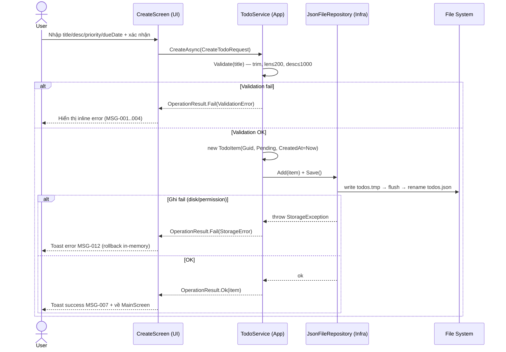

# TDD-todo-app-csharp: Technical Design Document — To-Do App C# (.NET 8)

> Tài liệu này là đầu vào kỹ thuật chính thức cho Senior Developer và Junior Developer.
> SD/JD PHẢI đọc hết tài liệu này trước khi bắt đầu S1-T001.
> Mọi thay đổi API contract / data model / schema trong quá trình code phải cập nhật lại file này (theo §15 CLAUDE.md).

---

## 0. Tham chiếu

| Tài liệu | Đường dẫn |
|---|---|
| PRD | `docs/prd/PRD-todo-app-csharp.md` |
| User Stories | `docs/user-stories/US-todo-app-csharp.md` |
| Design (UX) | `docs/design/DESIGN-todo-app-csharp.md` |
| Sprint Plan | `docs/planning/SPRINT-todo-app-csharp-PLAN.md` |
| Resource Plan | `docs/planning/RESOURCE-todo-app-csharp.md` |

---

## 1. Quyết định kỹ thuật — Trả lời Open Questions (BẮT BUỘC log)

> Theo R7 (mọi quyết định phải có log: ai quyết, vì sao, khi nào).
> Người quyết: **Tech Lead** | Ngày: **2026-06-02**

### OQ1 — Console App hay WinForms/WPF? → **QUYẾT ĐỊNH: Console App (.NET 8)**

| Tiêu chí | Console App | WinForms/WPF |
|---|---|---|
| Thời gian dev MVP | Thấp (không thiết kế GUI) | Cao (designer, layout, binding) |
| Khởi động nhanh (G4 ≤ 2s) | Rất nhanh | Chậm hơn (load XAML/WinForms runtime) |
| Cross-version Windows | Tốt | Phụ thuộc runtime GUI |
| Khớp với DESIGN doc | DESIGN đã thiết kế cho Console | Phải redesign |
| Rủi ro R1 trong PRD | Loại bỏ | Hiện hữu |

**Lý do:** PRD §10.2 R1 + DESIGN doc đã chốt hướng Console. Console App giảm thời gian dev, đảm bảo khởi động ≤ 2s (G4), khớp 100% với 7 wireframe đã thiết kế. GUI để dành cho v2 nếu có nhu cầu.

### OQ2 — Storage: JSON file hay SQLite? → **QUYẾT ĐỊNH: JSON file**

| Tiêu chí | JSON file | SQLite |
|---|---|---|
| Số task dự kiến MVP | ≤ vài trăm — JSON dư sức | Quá mức cần thiết |
| Dependency | `System.Text.Json` (built-in .NET 8) | Cần `Microsoft.Data.Sqlite` + native lib |
| Atomicity | write-then-rename (đơn giản, đủ an toàn) | transaction (mạnh hơn nhưng nặng) |
| Debug / human-readable | Có (mở file đọc tay được) | Không |
| Đóng gói self-contained exe | Nhẹ, không native lib | Nặng hơn, cần bản native theo RID |
| Khớp BR (US-006/007) | write-then-rename, backup .bak | transaction |

**Lý do:** Với quy mô MVP single-user (PRD NG1–NG8 loại bỏ multi-device/collaboration), JSON là đủ và đơn giản nhất. Dùng `System.Text.Json` built-in → không thêm dependency runtime, exe nhẹ, dễ debug. Atomicity đảm bảo bằng pattern **write-temp → flush → rename** (US-006 BR2). Backup `.bak` khi corrupt (US-007 BR3).

> **Lưu ý kiến trúc:** Storage được trừu tượng hóa qua `ITodoRepository`. Nếu v2 cần SQLite chỉ cần thêm `SqliteTodoRepository : ITodoRepository`, không sửa Service/UI. Đây là biện pháp giảm thiểu rủi ro khóa công nghệ.

### OQ4 — Vị trí file lưu trữ? → **QUYẾT ĐỊNH: `%LOCALAPPDATA%\KZTEK\TodoApp\todos.json`**

| Phương án | Ưu | Nhược |
|---|---|---|
| **AppData (LocalApplicationData)** ✅ | Luôn có quyền ghi; không mất khi update/move exe; chuẩn Windows | User khó tìm file thủ công |
| Cùng thư mục exe | Dễ tìm file | Có thể không có quyền ghi (Program Files); mất khi thay exe |

**Lý do:** Tránh lỗi permission denied (US-006 EC4) khi exe đặt ở `Program Files`. Dùng `Environment.GetFolderPath(Environment.SpecialFolder.LocalApplicationData)`. Đường dẫn đầy đủ:

```
%LOCALAPPDATA%\KZTEK\TodoApp\
├── todos.json        ← dữ liệu chính
├── todos.tmp         ← file tạm khi ghi (write-then-rename)
└── todos.bak.json    ← backup tự động khi file chính corrupt
```

> **Override cho dev/test:** Cho phép biến môi trường `TODOAPP_DATA_DIR` ghi đè thư mục lưu (phục vụ integration test ghi vào thư mục tạm, tránh đụng dữ liệu thật).

### Các OQ còn lại (ngoài thẩm quyền TL — ghi nhận giả định để không block dev)

| OQ | Thuộc | Giả định kỹ thuật áp dụng trong code (chờ xác nhận) |
|---|---|---|
| OQ3 (hỗ trợ Win ≤ 10?) | EM | Target Windows 10 build 1511+ (đủ ANSI). Có fallback no-color nếu ANSI fail. |
| OQ-BA-01 (toast sau tạo) | PM | Code sẵn ToastNotification component (DESIGN §9.7) — bật mặc định. |
| OQ-BA-03 (thứ tự sort) | PM | Mặc định CreatedAt DESC (US-002 BR1). |
| OQ-BA-09 (priority mặc định) | PM | Mặc định `Priority.None`. |
| OQ-BA-10 (DueDate là Date hay DateTime) | PM | Lưu `DateOnly` (date-only, US-010 BR5). |

> Nếu PM/EM chốt khác, chỉ cần sửa giá trị cấu hình/enum mặc định — không ảnh hưởng kiến trúc.

---

## 2. Goals / Non-goals (kỹ thuật)

### Goals
- Triển khai F01–F07 (Must) ở Sprint 1, F08–F10 (Should) ở Sprint 2.
- Tách lớp rõ ràng (Layered/Clean-lite) để business logic test được ≥ 80% (PRD metric).
- Persistence atomic, không corrupt, không crash với mọi trạng thái storage (BR-GLOBAL-04).
- Khởi động ≤ 2s; mọi thao tác CRUD ≤ 3 bước (G1, G4).
- Build ra `.exe` self-contained chạy trên máy sạch (PRD DoD).

### Non-goals (kỹ thuật)
- Không dùng async/await phức tạp cho I/O (file JSON nhỏ, sync I/O đủ; tránh over-engineering).
- Không multi-instance / concurrency control (US-006 EC, US-007 EC2 — single-instance).
- Không ORM, không DI container nặng (chỉ `Microsoft.Extensions.DependencyInjection` mức tối thiểu).
- Không cloud, notification, sub-task, recurring (PRD NG1–NG8).

---

## 3. Kiến trúc tổng thể

### 3.1 Lựa chọn kiến trúc: **Layered Architecture (Clean-lite)**

Chọn **Layered Architecture 4 tầng** (biến thể nhẹ của Clean Architecture) thay vì Clean Architecture đầy đủ.

**Lý do:**
- Clean Architecture đầy đủ (UseCase interactor, DTO mapping, boundary ports) là over-engineering cho 1 entity (`TodoItem`) và 1 nguồn dữ liệu.
- Layered vẫn giữ nguyên tắc cốt lõi quan trọng nhất: **Dependency Inversion** — Domain không phụ thuộc Infrastructure; UI phụ thuộc abstraction (`ITodoService`), không phụ thuộc implementation.
- Đủ để đạt 80% test coverage business logic mà không phình code.

### 3.2 Layer diagram (text)

```
┌──────────────────────────────────────────────────────────────┐
│  PRESENTATION (UI)            TodoApp.ConsoleUI                │
│  - Program.cs (composition root + DI)                         │
│  - Screens: MainScreen, CreateScreen, EditScreen,             │
│             DeleteScreen, FilterScreen, ToggleScreen          │
│  - Components: AppHeader, StatusBar, TaskRow, MenuBar,        │
│               ToastNotification, EmptyState ... (DESIGN §9)   │
│  - ConsoleRenderer / AnsiConsole helper                       │
│         │ depends on (interface)                              │
│         ▼                                                      │
├──────────────────────────────────────────────────────────────┤
│  APPLICATION (Business Logic)  TodoApp.Application            │
│  - ITodoService  ◄── interface                               │
│  - TodoService   ── implementation (validation + orchestrate)│
│  - DTO/Result types: OperationResult, ValidationError        │
│  - TaskFilter enum, sort logic                               │
│         │ depends on (interface)                              │
│         ▼                                                      │
├──────────────────────────────────────────────────────────────┤
│  DOMAIN (Core)                 TodoApp.Domain                 │
│  - TodoItem (entity)                                          │
│  - Priority (enum), TaskStatus (enum)                        │
│  - Business constants (MaxTitle=200, MaxDesc=1000)           │
│  - ITodoRepository  ◄── interface (port — định nghĩa ở đây)  │
│  ★ KHÔNG phụ thuộc bất kỳ layer nào khác                     │
└──────────────────────────────────────────────────────────────┘
        ▲ implements
        │
┌──────────────────────────────────────────────────────────────┐
│  INFRASTRUCTURE                TodoApp.Infrastructure         │
│  - JsonFileRepository : ITodoRepository                       │
│  - JsonStorageOptions (đường dẫn file, AppData)              │
│  - Atomic write (write-then-rename), backup khi corrupt      │
└──────────────────────────────────────────────────────────────┘
```

### 3.3 Dependency flow (chiều phụ thuộc)

```
ConsoleUI ──► Application ──► Domain ◄── Infrastructure
   (UI)         (Service)     (Core)     (Repository impl)
```

- Chiều phụ thuộc luôn hướng **vào trong** (về Domain).
- `ITodoRepository` được **định nghĩa ở Domain** (port), **implement ở Infrastructure** (adapter) → Dependency Inversion.
- `Program.cs` (composition root ở UI) là nơi DUY NHẤT biết về implementation cụ thể, wiring qua DI.

### 3.4 Sequence — thao tác tạo task (đại diện luồng)



---

## 4. Tech Stack quyết định

| Thành phần | Lựa chọn | Ghi chú |
|---|---|---|
| Runtime | **.NET 8** (LTS) | `<TargetFramework>net8.0</TargetFramework>` |
| Ngôn ngữ | C# 12, `Nullable` enabled, `ImplicitUsings` enabled | Bắt buộc `<Nullable>enable</Nullable>` |
| Loại app | Console Application (OQ1) | |
| Storage | JSON file qua `System.Text.Json` (OQ2) | KHÔNG dùng Newtonsoft (giảm dependency) |
| DI | `Microsoft.Extensions.DependencyInjection` 8.x | S1-T016 |
| Test framework | **xUnit** | + `Microsoft.NET.Test.Sdk` |
| Mocking | **Moq** 4.x | Mock `ITodoRepository` trong test TodoService |
| Assertion | **FluentAssertions** | Đọc test rõ ràng (khuyến nghị, không bắt buộc) |
| Coverage | `coverlet.collector` | `dotnet test --collect:"XPlat Code Coverage"` |
| Console/ANSI | **Tự viết** `AnsiConsole` helper (không thêm thư viện) | Đủ cho nhu cầu DESIGN; tránh kéo Spectre.Console nặng cho MVP |

> **Quyết định về Spectre.Console:** KHÔNG dùng cho MVP. DESIGN doc dùng ANSI escape code đơn giản; tự viết helper `AnsiColors` + `EnableVirtualTerminal()` (P/Invoke `SetConsoleMode`) là đủ và giữ exe nhẹ. Có thể xem xét Spectre cho v2 nếu UI phức tạp hơn.

### Bảng NuGet packages

| Package | Project | Mục đích |
|---|---|---|
| `Microsoft.Extensions.DependencyInjection` | ConsoleUI | DI container |
| `Microsoft.NET.Test.Sdk` | Tests | Test host |
| `xunit`, `xunit.runner.visualstudio` | Tests | Test framework |
| `Moq` | Tests | Mock repository |
| `FluentAssertions` | Tests | Assertions |
| `coverlet.collector` | Tests | Coverage |

`System.Text.Json` là built-in .NET 8 — không cần NuGet.

---

## 5. Data Model

### 5.1 Enum `Priority` (Domain)

```csharp
namespace TodoApp.Domain;

public enum Priority
{
    None = 0,   // mặc định (OQ-BA-09 giả định)
    Low = 1,
    Medium = 2,
    High = 3
}
```

### 5.2 Enum `TaskStatus` (Domain)

```csharp
namespace TodoApp.Domain;

// Tên TaskStatus trùng System.Threading.Tasks.TaskStatus → dùng tên TodoStatus để tránh xung đột.
public enum TodoStatus
{
    Pending = 0,    // mặc định khi tạo (BR-GLOBAL-05)
    Completed = 1
}
```

### 5.3 Entity `TodoItem` (Domain)

```csharp
namespace TodoApp.Domain;

public sealed class TodoItem
{
    public Guid Id { get; init; }                 // BR-GLOBAL-06: GUID hệ thống sinh
    public string Title { get; set; } = string.Empty;   // BR-GLOBAL-01: ≤200, không rỗng
    public string? Description { get; set; }      // BR-GLOBAL-02: tùy chọn, ≤1000
    public TodoStatus Status { get; set; } = TodoStatus.Pending;
    public Priority Priority { get; set; } = Priority.None;  // F09, tùy chọn
    public DateOnly? DueDate { get; set; }        // F10, tùy chọn, date-only (US-010 BR5)
    public DateTime CreatedAt { get; init; }      // BR-US001-6: không đổi sau tạo
    public DateTime? UpdatedAt { get; set; }      // cập nhật mỗi lần sửa (US-003 BR3)
    public DateTime? CompletedAt { get; set; }    // set khi Completed, null khi Pending (US-005 BR2/BR3)

    // Tính toán trạng thái quá hạn (US-010 BR3/BR4) — không persist
    public bool IsOverdue =>
        DueDate.HasValue
        && Status == TodoStatus.Pending
        && DueDate.Value < DateOnly.FromDateTime(DateTime.Now);

    public bool IsDueToday =>
        DueDate.HasValue
        && Status == TodoStatus.Pending
        && DueDate.Value == DateOnly.FromDateTime(DateTime.Now);
}
```

### 5.4 Hằng số nghiệp vụ (Domain)

```csharp
namespace TodoApp.Domain;

public static class TodoConstants
{
    public const int MaxTitleLength = 200;       // BR-GLOBAL-01
    public const int MaxDescriptionLength = 1000; // BR-GLOBAL-02
}
```

### 5.5 JSON schema (file `todos.json`)

File là một mảng các task. `DateOnly` serialize ra `"yyyy-MM-dd"`; `DateTime` ra ISO-8601.

```json
{
  "schemaVersion": 1,
  "items": [
    {
      "id": "3f2504e0-4f89-41d3-9a0c-0305e82c3301",
      "title": "Hoàn thành báo cáo Q2",
      "description": "Gửi cho anh Ngạn trước 17h",
      "status": 0,
      "priority": 3,
      "dueDate": "2026-06-05",
      "createdAt": "2026-05-31T09:12:00",
      "updatedAt": null,
      "completedAt": null
    }
  ]
}
```

| Field | Kiểu JSON | Bắt buộc | Ghi chú |
|---|---|---|---|
| `schemaVersion` | number | có | Hiện =1; cho phép migrate format sau (EC dữ liệu cũ US-009/010) |
| `items[].id` | string (GUID) | có | |
| `items[].title` | string | có | |
| `items[].description` | string \| null | không | |
| `items[].status` | number (enum) | có | 0=Pending,1=Completed |
| `items[].priority` | number (enum) | không | mặc định 0=None khi đọc dữ liệu cũ thiếu field (US-009 EC1) |
| `items[].dueDate` | string `yyyy-MM-dd` \| null | không | đọc thiếu → null (US-010 EC2) |
| `items[].createdAt` | string ISO | có | |
| `items[].updatedAt` | string ISO \| null | không | |
| `items[].completedAt` | string ISO \| null | không | |

> **Backward-compat:** `JsonSerializerOptions { ... PropertyNameCaseInsensitive = true }`; field thiếu nhận default value của type → không crash với dữ liệu cũ (US-009 EC1, US-010 EC2).

### 5.6 Vị trí file lưu (OQ4 — đã quyết định ở §1)

```
%LOCALAPPDATA%\KZTEK\TodoApp\todos.json   (mặc định)
override bằng env: TODOAPP_DATA_DIR
```

---

## 6. API / Interface contracts (Internal)

> Đây là Console App nên không có HTTP API. "API contract" ở đây là **internal interface contract** giữa các layer. SD/JD phải tuân thủ chính xác signature.

### 6.1 `OperationResult<T>` (Application) — kiểu trả về chuẩn

```csharp
namespace TodoApp.Application;

public sealed class OperationResult<T>
{
    public bool Success { get; private init; }
    public T? Value { get; private init; }
    public string? ErrorMessage { get; private init; }   // mã MSG-xxx hoặc text
    public OperationErrorKind ErrorKind { get; private init; }

    public static OperationResult<T> Ok(T value) =>
        new() { Success = true, Value = value };

    public static OperationResult<T> Fail(OperationErrorKind kind, string message) =>
        new() { Success = false, ErrorKind = kind, ErrorMessage = message };
}

public enum OperationErrorKind
{
    None = 0,
    Validation = 1,   // tiêu đề rỗng/quá dài, ngày sai format
    NotFound = 2,     // task không tồn tại
    Storage = 3       // lỗi đọc/ghi file
}
```

### 6.2 `ITodoRepository` (Domain — port)

```csharp
namespace TodoApp.Domain;

/// <summary>Lưu trữ TodoItem. In-memory list được nạp 1 lần lúc khởi động, ghi xuống đĩa sau mỗi thay đổi.</summary>
public interface ITodoRepository
{
    /// <summary>Nạp toàn bộ task từ storage. Gọi 1 lần lúc khởi động (US-007).
    /// Tự xử lý: file không tồn tại → list rỗng; corrupt → backup .bak + list rỗng.</summary>
    IReadOnlyList<TodoItem> Load();

    /// <summary>Lấy snapshot in-memory hiện tại (không đọc lại đĩa).</summary>
    IReadOnlyList<TodoItem> GetAll();

    TodoItem? GetById(Guid id);

    /// <summary>Thêm task vào in-memory + persist ngay (US-006 BR1).</summary>
    void Add(TodoItem item);

    /// <summary>Cập nhật task theo Id + persist ngay. Trả false nếu không tìm thấy.</summary>
    bool Update(TodoItem item);

    /// <summary>Xóa task theo Id + persist ngay. Trả false nếu không tìm thấy.</summary>
    bool Delete(Guid id);
}
```

> **Hợp đồng lỗi:** Khi ghi đĩa thất bại, implementation NÉM `StorageException` (custom, kế thừa `Exception`). `TodoService` bắt và đổi thành `OperationResult.Fail(Storage, MSG-012)`. In-memory phải được **rollback** về trạng thái trước thao tác (US-001 EC1, US-005 EC1).

### 6.3 `ITodoService` (Application — UI gọi cái này)

```csharp
namespace TodoApp.Application;

public interface ITodoService
{
    /// <summary>Nạp dữ liệu lúc khởi động (US-007). UI gọi 1 lần trong Program.cs.</summary>
    OperationResult<int> Initialize();   // Value = số task đã nạp

    /// <summary>F01 — Tạo task. Validate title trước. (US-001)</summary>
    OperationResult<TodoItem> Create(CreateTodoRequest request);

    /// <summary>F02/F08 — Lấy danh sách theo filter, đã sort (US-002 BR1, US-008).</summary>
    IReadOnlyList<TodoItem> GetTasks(TaskFilter filter = TaskFilter.All);

    /// <summary>Lấy 1 task theo số thứ tự hiển thị (1-based) trong filter hiện tại.</summary>
    TodoItem? GetByDisplayIndex(int index, TaskFilter filter);

    /// <summary>F03 — Sửa title/desc/priority/dueDate (US-003, US-009, US-010).</summary>
    OperationResult<TodoItem> Update(Guid id, UpdateTodoRequest request);

    /// <summary>F04 — Xóa vĩnh viễn (US-004).</summary>
    OperationResult<bool> Delete(Guid id);

    /// <summary>F05 — Toggle Pending ↔ Completed, set/clear CompletedAt (US-005).</summary>
    OperationResult<TodoItem> ToggleComplete(Guid id);

    /// <summary>Số lượng theo nhóm cho StatusBar/FilterScreen (DESIGN §9.2, §5 Screen5).</summary>
    TaskCounts GetCounts();
}

public enum TaskFilter { All = 0, Pending = 1, Completed = 2 }   // US-008 BR2

public sealed record CreateTodoRequest(
    string Title,
    string? Description = null,
    Priority Priority = Priority.None,
    DateOnly? DueDate = null);

public sealed record UpdateTodoRequest(
    string Title,
    string? Description,
    Priority Priority,
    DateOnly? DueDate);

public sealed record TaskCounts(int Total, int Pending, int Completed);
```

### 6.4 Bảng ánh xạ method → User Story → AC

| Method | Feature | US | AC chính |
|---|---|---|---|
| `Initialize` | F07 | US-007 | Scenario 1–4 (load, first-run, corrupt, permission) |
| `Create` | F01 | US-001 | Sc.1–5; validation BR1/BR2/BR3 |
| `GetTasks` | F02, F08 | US-002, US-008 | sort CreatedAt DESC; filter |
| `Update` | F03, F09, F10 | US-003, US-009, US-010 | validation, UpdatedAt, không đổi CreatedAt |
| `Delete` | F04 | US-004 | xóa vĩnh viễn |
| `ToggleComplete` | F05 | US-005 | set/clear CompletedAt |
| `GetCounts` | F08 | US-008 | đếm real-time |

---

## 7. Project structure

```
TodoApp/                                    ← solution root (src/)
├── TodoApp.sln
│
├── src/
│   ├── TodoApp.Domain/                      ← Core (không phụ thuộc gì)
│   │   ├── TodoApp.Domain.csproj
│   │   ├── TodoItem.cs
│   │   ├── Priority.cs
│   │   ├── TodoStatus.cs
│   │   ├── TodoConstants.cs
│   │   ├── ITodoRepository.cs
│   │   └── StorageException.cs
│   │
│   ├── TodoApp.Application/                  ← Business logic
│   │   ├── TodoApp.Application.csproj        (ref: Domain)
│   │   ├── ITodoService.cs
│   │   ├── TodoService.cs
│   │   ├── OperationResult.cs
│   │   ├── TaskFilter.cs
│   │   ├── Requests.cs                       (CreateTodoRequest, UpdateTodoRequest, TaskCounts)
│   │   └── Validation/
│   │       └── TitleValidator.cs
│   │
│   ├── TodoApp.Infrastructure/              ← JSON storage
│   │   ├── TodoApp.Infrastructure.csproj     (ref: Domain)
│   │   ├── JsonFileRepository.cs
│   │   ├── JsonStorageOptions.cs
│   │   └── StorageFileDto.cs                 (schemaVersion + items wrapper)
│   │
│   └── TodoApp.ConsoleUI/                    ← Presentation (entry point)
│       ├── TodoApp.ConsoleUI.csproj          (ref: Application, Infrastructure, Domain)
│       ├── Program.cs                        (composition root + DI + main loop)
│       ├── AppRunner.cs                      (vòng lặp menu chính)
│       ├── Screens/
│       │   ├── MainScreen.cs
│       │   ├── CreateScreen.cs
│       │   ├── EditScreen.cs
│       │   ├── DeleteScreen.cs
│       │   ├── ToggleScreen.cs
│       │   └── FilterScreen.cs
│       ├── Components/
│       │   ├── AppHeader.cs
│       │   ├── StatusBar.cs
│       │   ├── TaskRow.cs
│       │   ├── MenuBar.cs
│       │   ├── ToastNotification.cs
│       │   ├── EmptyState.cs
│       │   ├── ConfirmBox.cs
│       │   └── StepIndicator.cs
│       ├── Rendering/
│       │   ├── AnsiColors.cs                 (bảng màu DESIGN §3.1)
│       │   ├── AnsiConsole.cs                (EnableVirtualTerminal, fallback no-color)
│       │   └── ConsoleInput.cs               (đọc phím, validate số task)
│       └── Messages.cs                       (MSG-001..014 — DESIGN §8.1)
│
└── tests/
    ├── TodoApp.Application.Tests/            ← unit test business logic (TARGET ≥80%)
    │   ├── TodoApp.Application.Tests.csproj
    │   ├── TodoServiceCreateTests.cs
    │   ├── TodoServiceUpdateTests.cs
    │   ├── TodoServiceDeleteTests.cs
    │   ├── TodoServiceToggleTests.cs
    │   ├── TodoServiceFilterTests.cs
    │   └── TitleValidatorTests.cs
    │
    ├── TodoApp.Infrastructure.Tests/        ← unit test repository
    │   ├── TodoApp.Infrastructure.Tests.csproj
    │   └── JsonFileRepositoryTests.cs        (temp dir, corrupt, atomic, backup)
    │
    └── TodoApp.Integration.Tests/           ← end-to-end CRUD + persistence
        ├── TodoApp.Integration.Tests.csproj
        └── CrudPersistenceTests.cs
```

> **Lưu ý project ref:** Domain KHÔNG ref project nào. Application ref Domain. Infrastructure ref Domain. ConsoleUI ref cả 3. Test projects ref project chúng test + Domain.

---

## 8. Pseudocode các flow chính

### 8.1 F01 — Tạo task (`TodoService.Create`)

```
Create(request):
    # 1. Validate (US-001 BR1/BR2/BR3)
    title = request.Title.Trim()                       # EC2: trim trước
    if title.Length == 0:
        return Fail(Validation, MSG-001)               # "Tiêu đề không được để trống"
    if title.Length > MaxTitleLength:                   # 200
        return Fail(Validation, MSG-002)
    if request.Description != null and
       request.Description.Length > MaxDescriptionLength:  # 1000
        return Fail(Validation, MSG-003)

    # 2. Tạo entity (BR4/BR5/BR6)
    item = new TodoItem {
        Id = Guid.NewGuid(),
        Title = title,
        Description = request.Description,
        Status = Pending,
        Priority = request.Priority,
        DueDate = request.DueDate,
        CreatedAt = DateTime.Now,
        UpdatedAt = null,
        CompletedAt = null
    }

    # 3. Persist ngay (BR7) — rollback nếu lỗi (EC1)
    try:
        repository.Add(item)        # Add đã gọi Save() bên trong
    catch StorageException:
        return Fail(Storage, MSG-012)

    return Ok(item)
```

### 8.2 F05 — Toggle complete (`TodoService.ToggleComplete`)

```
ToggleComplete(id):
    item = repository.GetById(id)
    if item == null:
        return Fail(NotFound, MSG-006)

    # Lưu trạng thái cũ để rollback (US-005 EC1)
    oldStatus      = item.Status
    oldCompletedAt = item.CompletedAt

    if item.Status == Pending:
        item.Status = Completed
        item.CompletedAt = DateTime.Now      # BR2
    else:
        item.Status = Pending
        item.CompletedAt = null              # BR3

    try:
        repository.Update(item)              # persist ngay
    catch StorageException:
        item.Status = oldStatus              # rollback in-memory
        item.CompletedAt = oldCompletedAt
        return Fail(Storage, MSG-012)

    return Ok(item)
```

### 8.3 F06/F07 — Persistence atomic + Load (`JsonFileRepository`)

```
# ---- LOAD (US-007, gọi 1 lần lúc khởi động) ----
Load():
    EnsureDataDirectoryExists()              # tạo %LOCALAPPDATA%\KZTEK\TodoApp nếu chưa có
    if not File.Exists(todos.json):
        _items = []                          # first-run (Sc.2)
        return _items

    try:
        json = File.ReadAllText(todos.json)
        dto  = JsonSerializer.Deserialize<StorageFileDto>(json, options)
        _items = dto.Items ?? []
    catch (JsonException or FormatException):    # corrupt (Sc.3)
        BackupCorruptFile()                  # rename todos.json -> todos.bak.json (BR3)
        _items = []
        # UI sẽ hiển thị MSG-013 dựa trên flag CorruptionDetected
    catch (UnauthorizedAccessException):     # permission (Sc.4)
        _items = []
        # UI hiển thị MSG-014; app vẫn chạy với list rỗng
    return _items

# ---- SAVE (atomic, gọi sau mỗi Add/Update/Delete) ----
Save():
    dto  = new StorageFileDto { SchemaVersion = 1, Items = _items }
    json = JsonSerializer.Serialize(dto, options)   # options: WriteIndented = true

    # write-then-rename (US-006 BR2) — đảm bảo atomicity
    File.WriteAllText(todos.tmp, json)              # ghi file tạm
    # flush mặc định khi WriteAllText đóng stream
    if File.Exists(todos.json):
        File.Replace(todos.tmp, todos.json, null)   # atomic replace
    else:
        File.Move(todos.tmp, todos.json)
    # Nếu bất kỳ bước nào ném IOException/UnauthorizedAccess
    #   -> bọc thành StorageException ném lên Service (EC1, EC4 disk full/permission)

# ---- ADD/UPDATE/DELETE: cập nhật _items rồi gọi Save() ----
Add(item):    _items.Add(item);            Save()
Update(item): replace in _items by Id;     Save()   # false nếu không tìm thấy
Delete(id):   remove from _items by Id;    Save()   # false nếu không tìm thấy
```

> **Note atomicity:** `File.Replace` trên NTFS là thao tác gần như atomic — nếu crash giữa chừng (US-006 Sc.3), file `todos.json` cũ vẫn nguyên vẹn (worst case mất thao tác cuối). `todos.tmp` rác sẽ bị ghi đè lần ghi sau.

---

## 9. Error handling strategy

| Tầng | Chiến lược |
|---|---|
| **Domain** | Không throw cho business rule. Hằng số validation đặt ở đây nhưng việc check nằm ở Application. |
| **Infrastructure** | Bắt mọi `IOException`/`UnauthorizedAccessException`/`JsonException` → ném `StorageException` (ghi/đọc) HOẶC xử lý nội bộ (corrupt → backup + list rỗng). KHÔNG để exception thô lọt lên UI. |
| **Application** | Không throw cho lỗi nghiệp vụ — trả `OperationResult.Fail(kind, MSG-code)`. Bắt `StorageException` → `Fail(Storage, MSG-012)` + rollback in-memory. |
| **Presentation** | Đọc `OperationResult`. Validation → inline error (MSG-001..006). Storage → Toast error (MSG-012/013/014). KHÔNG bao giờ crash (BR-GLOBAL-04). |

### Quy tắc cứng (BR-GLOBAL-04)
- **Không có code path nào được phép làm crash ứng dụng vì trạng thái storage.** `Program.cs` bọc top-level `try/catch` cuối cùng để log + thoát gracefully thay vì stack trace.
- **Rollback in-memory** bắt buộc khi persist fail trong Create/Update/Delete/Toggle (EC1 các US).
- **Backup trước reset** khi corrupt (US-007 BR3) — không xóa dữ liệu người dùng không thông báo.

### Mapping exception → message (DESIGN §8.1)

| Tình huống | Exception nguồn | Kết quả | MSG |
|---|---|---|---|
| Tiêu đề rỗng | — | Validation | MSG-001 |
| Tiêu đề > 200 | — | Validation | MSG-002 |
| Mô tả > 1000 | — | Validation | MSG-003 |
| Ngày sai format | `FormatException` (parse ở UI) | Validation | MSG-004 |
| Số task không hợp lệ | — | NotFound | MSG-006 |
| Disk full / permission ghi | `IOException`/`UnauthorizedAccess` → StorageException | Storage | MSG-012 |
| File corrupt lúc load | `JsonException` | xử lý nội bộ + backup | MSG-013 |
| Permission đọc lúc load | `UnauthorizedAccess` | list rỗng | MSG-014 |

---

## 10. Test strategy

### 10.1 Mục tiêu
- **Unit test business logic (`TodoApp.Application`) ≥ 80% coverage** (PRD metric, DoD Sprint 1).
- Unit test repository edge cases (corrupt, atomic, backup).
- Integration test 1 luồng end-to-end CRUD + persistence qua file thật (temp dir).

### 10.2 Unit test — `TodoService` (mock `ITodoRepository` bằng Moq)

| Test class | Case bắt buộc (map AC) |
|---|---|
| `TodoServiceCreateTests` | title hợp lệ → Ok; title rỗng/whitespace → Fail Validation (Sc.3, EC2); title 201 ký tự → Fail (Sc.4); desc 1001 → Fail; repo throw → Fail Storage + rollback (EC1); CreatedAt được set, Status=Pending (BR5) |
| `TodoServiceUpdateTests` | sửa title OK + UpdatedAt set + CreatedAt không đổi (BR2/BR3); title rỗng → Fail giữ nguyên (Sc.3); id không tồn tại → NotFound (EC1) |
| `TodoServiceDeleteTests` | xóa OK; id không tồn tại → NotFound |
| `TodoServiceToggleTests` | Pending→Completed set CompletedAt (BR2); Completed→Pending clear CompletedAt (BR3); toggle 3 lần → Completed (Sc.3); repo throw → rollback (EC1) |
| `TodoServiceFilterTests` | All/Pending/Completed trả đúng tập (US-008); sort CreatedAt DESC (US-002 BR1); GetCounts đúng số |
| `TitleValidatorTests` | boundary 0/1/200/201 ký tự; chuỗi toàn space → invalid |

### 10.3 Unit test — `JsonFileRepository`

| Case | Map |
|---|---|
| File không tồn tại → Load trả rỗng, không throw | US-007 Sc.2 |
| Load file hợp lệ → đúng số task, đúng field | US-007 Sc.1 |
| File corrupt (JSON rác) → backup .bak tạo ra + list rỗng + không throw | US-007 Sc.3 |
| Dữ liệu cũ thiếu `priority`/`dueDate` → đọc default None/null | US-009 EC1, US-010 EC2 |
| Add → file tồn tại + đọc lại đúng | US-006 |
| Save tạo `todos.tmp` rồi rename, không để lại tmp khi thành công | US-006 BR2 |
| Ghi vào thư mục read-only → StorageException | US-006 EC4 |

> Test dùng `TODOAPP_DATA_DIR` trỏ vào `Path.GetTempPath()/guid` mỗi test; cleanup trong `Dispose` (xUnit `IDisposable`).

### 10.4 Integration test (`CrudPersistenceTests`)

```
1. Set TODOAPP_DATA_DIR = temp dir mới
2. Wire DI thật (repo JSON thật, service thật)
3. Create 3 task → Toggle 1 → Update 1 → Delete 1
4. Dispose toàn bộ (giả lập tắt app)
5. Tạo instance mới, Initialize() → assert còn 2 task, trạng thái đúng (US-006 Sc.2, US-007 Sc.1)
6. Cleanup temp dir
```

### 10.5 Lệnh coverage

```bash
dotnet test --collect:"XPlat Code Coverage"
# Gate: TodoApp.Application line coverage >= 80% (kiểm tra trong S1-T018 code review)
```

> UI layer (ConsoleUI) KHÔNG yêu cầu 80% coverage (khó test console rendering). Logic phải tách xuống Service để test được — đây là lý do tách layer.

---

## 11. Build & run instructions

### 11.1 Yêu cầu
- .NET 8 SDK (`dotnet --version` ≥ 8.0.x)
- Windows 10 build 1511+ (ANSI)

### 11.2 Khởi tạo solution (S1-T001 — SD chạy)

```bash
# Tạo solution + projects
dotnet new sln -n TodoApp

dotnet new classlib -n TodoApp.Domain         -o src/TodoApp.Domain         -f net8.0
dotnet new classlib -n TodoApp.Application     -o src/TodoApp.Application     -f net8.0
dotnet new classlib -n TodoApp.Infrastructure  -o src/TodoApp.Infrastructure  -f net8.0
dotnet new console  -n TodoApp.ConsoleUI       -o src/TodoApp.ConsoleUI       -f net8.0

dotnet new xunit    -n TodoApp.Application.Tests     -o tests/TodoApp.Application.Tests
dotnet new xunit    -n TodoApp.Infrastructure.Tests  -o tests/TodoApp.Infrastructure.Tests
dotnet new xunit    -n TodoApp.Integration.Tests     -o tests/TodoApp.Integration.Tests

# Project references
dotnet add src/TodoApp.Application    reference src/TodoApp.Domain
dotnet add src/TodoApp.Infrastructure reference src/TodoApp.Domain
dotnet add src/TodoApp.ConsoleUI      reference src/TodoApp.Application src/TodoApp.Infrastructure src/TodoApp.Domain
dotnet add tests/TodoApp.Application.Tests    reference src/TodoApp.Application src/TodoApp.Domain
dotnet add tests/TodoApp.Infrastructure.Tests reference src/TodoApp.Infrastructure src/TodoApp.Domain
dotnet add tests/TodoApp.Integration.Tests    reference src/TodoApp.ConsoleUI src/TodoApp.Application src/TodoApp.Infrastructure src/TodoApp.Domain

# NuGet
dotnet add src/TodoApp.ConsoleUI package Microsoft.Extensions.DependencyInjection
dotnet add tests/TodoApp.Application.Tests package Moq
dotnet add tests/TodoApp.Application.Tests package FluentAssertions
dotnet add tests/TodoApp.Application.Tests package coverlet.collector

# Thêm vào solution
dotnet sln add (Get-ChildItem -r *.csproj)   # PowerShell; bash: dotnet sln add **/*.csproj

# .csproj của mọi src project: <Nullable>enable</Nullable> + <ImplicitUsings>enable</ImplicitUsings>
```

### 11.3 Build / Test / Run

```bash
dotnet build                                  # build toàn solution
dotnet test                                   # chạy tất cả test
dotnet test --collect:"XPlat Code Coverage"   # test + coverage
dotnet run --project src/TodoApp.ConsoleUI    # chạy app
```

### 11.4 Publish bản Release (S3-T008 — DOE)

```bash
# Self-contained single-file exe cho Windows x64 (chạy máy sạch không cần cài .NET)
dotnet publish src/TodoApp.ConsoleUI -c Release -r win-x64 --self-contained true ^
  -p:PublishSingleFile=true -p:IncludeNativeLibrariesForSelfExtract=true ^
  -o publish/win-x64
```

---

## 12. Rủi ro & cách giảm thiểu (kỹ thuật)

| # | Rủi ro | Ảnh hưởng | Cách giảm |
|---|---|---|---|
| TR1 | File JSON corrupt khi crash giữa ghi | Cao | write-then-rename + `File.Replace` (§8.3); backup .bak khi load corrupt |
| TR2 | Permission denied khi ghi (exe ở Program Files) | Cao | Lưu ở `%LOCALAPPDATA%` (OQ4) — luôn có quyền ghi |
| TR3 | ANSI không hoạt động trên console cũ | Trung bình | `EnableVirtualTerminal()` P/Invoke; fallback no-color nếu fail (DESIGN §12.3) |
| TR4 | Coverage không đạt 80% vì logic kẹt trong UI | Cao | Tách toàn bộ logic xuống `TodoService`; UI chỉ render + đọc phím |
| TR5 | Trùng tên `TaskStatus` với BCL | Thấp | Đặt tên `TodoStatus` (§5.2) |
| TR6 | `DateOnly` serialize sai format JSON | Thấp | `System.Text.Json` .NET 8 hỗ trợ `DateOnly` native ("yyyy-MM-dd"); có test (10.3) |
| TR7 | JD chưa quen pattern Console multi-screen | Trung bình | SD viết sẵn `MainScreen` + `AnsiConsole`/`ConsoleInput` làm mẫu (S1-T008 pair); JD copy pattern cho Create/Edit/Delete/Toggle |

---

## 13. Task breakdown chi tiết — Sprint 1 (F01–F07)

> Đồng bộ với `SPRINT-todo-app-csharp-PLAN.md §4`. Bổ sung chi tiết kỹ thuật + DoD từng task để SD/JD code ngay không cần hỏi. Phân công: **SD = lõi (Domain/App/Infra/test/DI/integration)**, **JD = UI Console (CRUD/màn hình)**.

### 13.1 Senior Developer (lõi) — tổng ~28h

| Task ID | Tên | File chính | Estimate | Phụ thuộc | Definition of Done |
|---|---|---|---|---|---|
| S1-T001 | Setup solution + 4 projects + 3 test projects + refs + NuGet | `TodoApp.sln`, các `.csproj` | 2h | — | `dotnet build` + `dotnet test` pass (test rỗng); Nullable enabled |
| S1-T002 | Data model: `TodoItem`, `Priority`, `TodoStatus`, `TodoConstants` | `src/TodoApp.Domain/*` | 2h | T001 | Compile; `IsOverdue`/`IsDueToday` đúng theo §5.3 |
| S1-T003 | Interfaces: `ITodoRepository`, `ITodoService`, `OperationResult`, requests, `TaskFilter`, `StorageException` | Domain + Application | 2h | T002 | Signature khớp §6; compile |
| S1-T004 | `JsonFileRepository` + `JsonStorageOptions` + `StorageFileDto` (Load/Save/Add/Update/Delete, atomic, backup, AppData path) | `src/TodoApp.Infrastructure/*` | 4h | T003 | §8.3 pseudocode; `TODOAPP_DATA_DIR` override; không throw lúc Load corrupt |
| S1-T005 | `TodoService` + `TitleValidator` (Create/Update/Delete/Toggle/GetTasks/GetCounts/Initialize) | `src/TodoApp.Application/*` | 4h | T003 | §8.1/§8.2 pseudocode; validation BR-GLOBAL-01/02; rollback khi Storage fail |
| S1-T006 | Unit test `TodoService` ≥ 80% (Moq) | `tests/TodoApp.Application.Tests/*` | 4h | T005 | Tất cả case §10.2; coverage ≥ 80% |
| S1-T007 | Unit test `JsonFileRepository` (temp dir, corrupt, atomic, backup) | `tests/TodoApp.Infrastructure.Tests/*` | 2h | T004 | Tất cả case §10.3; cleanup temp |
| S1-T013 | Auto-save tích hợp (đảm bảo mọi mutate gọi Save) — verify qua service | (trong T004/T005) | 2h | T004, T005 | Persist ngay sau Create/Update/Delete/Toggle (BR-GLOBAL-03) |
| S1-T014 | Load lúc khởi động: file không tồn tại / corrupt / permission | (trong T004 + Program.cs) | 2h | T004 | US-007 Sc.1–4; cờ corruption để UI hiện MSG-013 |
| S1-T016 | DI setup (`Program.cs` composition root) | `src/TodoApp.ConsoleUI/Program.cs` | 1h | T001 | Wire `ITodoRepository`→Json, `ITodoService`→TodoService; resolve chạy được |
| S1-T017 | Integration test end-to-end CRUD + persistence | `tests/TodoApp.Integration.Tests/*` | 3h | T006, T007 | §10.4 flow; restart giữ đúng dữ liệu |

### 13.2 Junior Developer (UI Console) — tổng ~19h

> JD đọc DESIGN doc §5 (wireframe), §6 (keyboard), §7 (định dạng dòng), §8 (messages). **SD pair với JD ngày đầu** (R-02 trong Sprint Plan, TR7) — SD viết mẫu `MainScreen` + `AnsiConsole`/`ConsoleInput`, JD nhân bản cho các màn còn lại.

| Task ID | Tên | File chính | Estimate | Phụ thuộc | Definition of Done |
|---|---|---|---|---|---|
| S1-T008 | `MainScreen` + components (AppHeader/StatusBar/TaskRow/MenuBar) + `AnsiColors`/`AnsiConsole`/`ConsoleInput` + `AppRunner` (vòng lặp menu) | `Screens/MainScreen.cs`, `Components/*`, `Rendering/*` | 4h | T005 | Render danh sách đúng DESIGN Screen 1/1b/1c; menu 1-5/Q hoạt động; ANSI + fallback |
| S1-T009 | `CreateScreen` multi-step (title→desc→priority→dueDate→confirm) + validation inline | `Screens/CreateScreen.cs`, `Messages.cs` | 4h | T008 | DESIGN Screen 2; gọi `ITodoService.Create`; hiện MSG-001..004; Esc hủy |
| S1-T010 | `EditScreen` (chọn task, Enter=giữ nguyên, sửa 4 trường) | `Screens/EditScreen.cs` | 3h | T008 | DESIGN Screen 3; gọi `Update`; CreatedAt không đổi |
| S1-T011 | `DeleteScreen` (confirm Y/N, Enter mặc định=N) | `Screens/DeleteScreen.cs`, `Components/ConfirmBox.cs` | 2h | T008 | DESIGN Screen 4; BR-GLOBAL-07; Enter=hủy |
| S1-T012 | `ToggleScreen` (chọn task → toggle inline → toast) | `Screens/ToggleScreen.cs` | 2h | T008 | DESIGN Screen 6; gọi `ToggleComplete`; MSG-010/011 |
| S1-T015 | Error states UI: storage lỗi (MSG-012), corrupt (MSG-013), permission (MSG-014), empty state | `Components/ToastNotification.cs`, `EmptyState.cs` | 2h | T008, T014 | Toast đúng loại/màu; empty state Screen 1b/1c; không crash |

### 13.3 Tech Lead — review

| Task ID | Tên | Estimate | Phụ thuộc | DoD |
|---|---|---|---|---|
| S1-T018 | Code review toàn bộ PR Sprint 1 (checklist §14) | 4h | T017 | Mọi PR approve hoặc request changes; coverage ≥ 80% verified |
| S1-T019 | SD+JD fix review comments | 2h | T018 | Hết comment blocking; merge vào `develop` |

### 13.4 Sơ đồ phụ thuộc Sprint 1

```
T001 ─┬─► T002 ─► T003 ─┬─► T004 ─┬─► T007
      │                 │         ├─► T013
      │                 │         └─► T014
      │                 └─► T005 ─┬─► T006 ─┐
      └─► T016                    │         ├─► T017 ─► T018 ─► T019
                                  └─► T008 ─┼─► T009
                                            ├─► T010
                                            ├─► T011
                                            ├─► T012
                                            └─► T015
```

> **Đường găng (critical path):** T001 → T002 → T003 → T005 → T008 → (T009..T012) → T017 → T018 → T019.
> JD bị chặn ở T008; SD ưu tiên hoàn thành T002/T003/T005 sớm + viết mẫu MainScreen để unblock JD (DEP-03 trong Sprint Plan).

---

## 14. Code Review Checklist (TL áp dụng tại S1-T018)

- [ ] Chạy đúng AC của US tương ứng? (map §6.4)
- [ ] Handle error đủ? Mọi `OperationResult.Fail` có MSG đúng? Rollback in-memory khi Storage fail?
- [ ] App KHÔNG crash với mọi trạng thái storage (corrupt/permission/disk full)? (BR-GLOBAL-04)
- [ ] Security: không log dữ liệu nhạy cảm; không path traversal khi đọc `TODOAPP_DATA_DIR`?
- [ ] Performance: Load ≤ 2s; không đọc lại đĩa mỗi lần GetTasks (dùng in-memory)?
- [ ] Test meaningful (không chỉ chạy qua)? Coverage Application ≥ 80%?
- [ ] Convention: Nullable enabled, không warning nghiêm trọng, XML comment cho public interface?
- [ ] Dependency flow đúng (Domain không ref ai; UI không gọi thẳng Repository)?
- [ ] Atomicity ghi file đúng pattern write-then-rename?

## 15. Checklist tài liệu đồng bộ (cho PR Sprint 1)

- [ ] PRD cập nhật (nếu thay đổi scope/AC) — dự kiến không
- [ ] User Story cập nhật (nếu thay đổi flow/BR) — dự kiến không
- [ ] TDD (file này) cập nhật nếu đổi API/schema/pseudocode trong lúc code
- [ ] DESIGN cập nhật nếu đổi UI thực tế khác wireframe
- [ ] `code-graph/CODE-GRAPH.md` tạo mới sau khi có source (R2/R3) + xuất PDF
- [ ] Test case cập nhật nếu đổi behavior

---

## 16. Escalation cần EM/PM xử lý trước Sprint 1

| # | Vấn đề | Cần ai | Mức |
|---|---|---|---|
| E1 | Xác nhận OQ-BA-09 (priority mặc định = None?), OQ-BA-03 (sort), OQ-BA-01 (toast) | PM | Trước T009 (Create UI) |
| E2 | Xác nhận OQ3 (target Windows tối thiểu) | EM | Trước Phase 1 |
| E3 | Cài .NET 8 SDK trên máy dev (DEP-03 PRD, DEP-01 Sprint) | DevOps Engineer | Trước T001 |

> Các giả định kỹ thuật ở §1 cho phép SD/JD bắt đầu code mà không bị block; nếu PM/EM chốt khác chỉ cần đổi giá trị mặc định.

---

## Lịch sử cập nhật

| Ngày | Phiên bản | Nội dung |
|---|---|---|
| 2026-06-02 | v1.0 | Khởi tạo TDD. Quyết định OQ1=Console, OQ2=JSON, OQ4=LocalAppData. Layered architecture, interface contracts, pseudocode, test strategy, task breakdown Sprint 1. |
