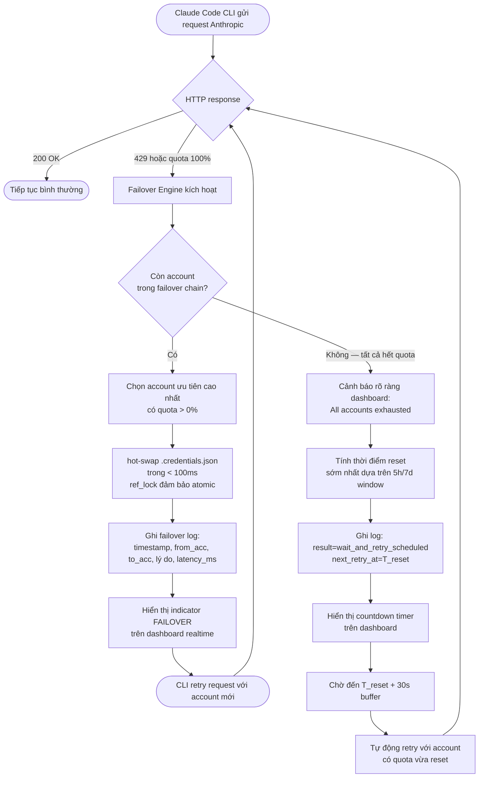

# User Stories: Agent Dashboard v2 — Auto-Failover Anthropic

**Phiên bản:** 1.0
**Ngày:** 2026-08-09
**BA:** Business Analyst (KZTEK)
**PRD nguồn:** `docs/prd/PRD-agent-dashboard-autofailover.md` v2.3
**Plan:** `docs/plans/PLAN-agent-dashboard-autofailover-2026-08-09/PLAN-MASTER.md`

---

## Tổng quan

File này chi tiết hóa 7 acceptance-level requirements (FAIL-1..7) từ PRD v2.3 thành User Stories có AC đo được (Given/When/Then), kèm business flow tổng thể, edge cases bắt buộc xử lý, và câu hỏi mở cho Tech Lead.

**Persona duy nhất:** Power-User (vietanh@kztek.vn) — vận hành 1 máy local Windows, tối thiểu 2 account Anthropic (`vietanh` + `OAuth Imported`).

---

## Business Flow Tổng Thể



---

## US-001: Phát hiện tự động khi account Anthropic bị 429 hoặc đạt 100% quota

**Map:** FAIL-1

**Là** Power-User đang chạy pipeline Claude Code
**Tôi muốn** hệ thống tự động phát hiện khi account Anthropic đang active bị rate-limit hoặc hết quota
**Để** failover engine có thể can thiệp trước khi CLI bị gián đoạn

### Acceptance Criteria

**Scenario 1 — Happy path: phát hiện 429**
```
Given  Account Anthropic đang active (`vietanh` hoặc bất kỳ account nào trong chain)
When   Claude Code CLI nhận HTTP 429 từ Anthropic API (quota exceeded)
Then   Failover Engine nhận tín hiệu trigger trong vòng 5 giây kể từ khi 429 xảy ra
And    Failover Engine chuyển sang US-002 (hot-swap)
And    Failover Engine KHÔNG trigger khi nhận 429 do throttling ngắn hạn không liên quan đến quota
       (Note cho TL: cơ chế phân biệt 429 "quota" vs 429 "rate-limit thông thường" — xem BR3)
```

**Scenario 2 — Happy path: phát hiện quota 100%**
```
Given  Dashboard UsageBar đang monitor quota 5h hoặc 7d của account active
When   Quota đạt 100% (UsageBar hiện đã có dữ liệu này từ Sprint 5)
Then   Failover Engine nhận tín hiệu trigger trong vòng 30 giây kể từ khi quota chạm 100%
And    Không cần đợi đến khi CLI thực sự nhận 429 — phát hiện chủ động (proactive detection)
```

**Scenario 3 — Edge case: chỉ có 1 account trong system**
```
Given  AccountStore chỉ chứa đúng 1 account Anthropic
When   Failover Engine phát hiện 429 hoặc quota 100%
Then   Failover Engine KHÔNG cố gắng rotate sang account khác
And    Chuyển thẳng sang hành vi US-006 (wait-and-retry)
And    Dashboard cảnh báo: "Không có account backup — hệ thống sẽ chờ quota reset"
```

**Scenario 4 — Edge case: trigger là lỗi NON-429 (network timeout, 401, 403)**
```
Given  Claude Code CLI gặp lỗi network timeout, HTTP 401 (token expired), hoặc 403
When   Dashboard phát hiện các lỗi này
Then   Failover Engine KHÔNG trigger auto-failover
And    Lỗi 401 → mark account is needs_relogin=true trong AccountStore (đã có cơ chế)
And    Lỗi network → không làm gì, CLI tự retry theo logic của nó
And    Dashboard log lỗi ở mức DEBUG/WARNING nhưng KHÔNG ghi failover event
```

### Quy tắc nghiệp vụ
- **BR1:** Trigger condition chỉ gồm 2 loại: (a) HTTP 429 từ Anthropic API, (b) Quota 100% theo UsageBar monitor. Không có trigger condition nào khác.
- **BR2:** Failover Engine phải phân biệt "account này 429" với "Anthropic API down toàn cầu". Nếu > 1 account trong chain đều trả 429 cùng lúc trong 60 giây → có thể là API down, KHÔNG nên tiếp tục rotate (tránh vòng lặp vô nghĩa).
- **BR3:** Với quota 100% detection — dùng lại cơ chế UsageBar hiện tại (Sprint 5). Failover Engine đăng ký callback khi quota threshold đạt 100%.

### Edge cases
- EC1 (1 account): thẳng sang wait-and-retry, không rotate
- EC2 (non-429 error): KHÔNG trigger failover
- EC3 (API down toàn cầu): detect pattern và tạm dừng auto-failover

### Câu hỏi mở cho Tech Lead
- **Q-TL-1:** Cơ chế detection 429 cụ thể là gì? Dashboard có proxy Anthropic API calls không, hay đọc log file của Claude Code CLI, hay poll /usage endpoint? Câu trả lời ảnh hưởng đến latency của trigger. BA đề xuất: nếu không proxy được, dùng kết hợp UsageBar (proactive) + log parsing (reactive) — TL xác nhận khả thi không.
- **Q-TL-2:** Ngưỡng phân biệt "API down toàn cầu" vs "account cụ thể hết quota": dùng điều kiện gì? (VD: nếu 429 đến từ 2+ account trong < 60s → assume API down?) — TL quyết định threshold cụ thể.

---

## US-002: Hot-swap credential sang account tiếp theo trong chuỗi ưu tiên

**Map:** FAIL-2

**Là** Power-User đang chạy pipeline Claude Code
**Tôi muốn** hệ thống tự động đổi sang account Anthropic backup trong dưới 100ms
**Để** Claude Code CLI không cần restart và tiếp tục chạy với quota mới mà không gián đoạn

### Acceptance Criteria

**Scenario 1 — Happy path: hot-swap thành công**
```
Given  Failover Engine đã nhận trigger (US-001)
And    Có ít nhất 1 account khác trong failover chain với quota > 0%
When   Failover Engine thực hiện hot-swap
Then   Toàn bộ quá trình swap (từ lúc nhận trigger đến khi .credentials.json được ghi) < 100ms
And    .credentials.json được ghi atomic (dùng refresh_lock — đã có trong oauth_service.py)
And    Account mới được set là active_id trong AccountStore
And    Claude Code CLI có thể dùng account mới ngay lập tức cho request tiếp theo
And    CLI KHÔNG cần restart
```

**Scenario 2 — Happy path: chọn account ưu tiên khi có nhiều lựa chọn**
```
Given  Failover chain có 3 account: A (active, 100% quota), B (priority=2, 60% quota), C (priority=1, 30% quota)
When   Account A bị 429/quota full
Then   Failover Engine chọn account C (priority=1 cao hơn C(priority=2))
       — priority 1 = ưu tiên cao nhất (tức là ưu tiên theo thứ tự user đặt)
And    Nếu account C cũng 100% → thử account B tiếp theo theo thứ tự priority
```

**Scenario 3 — Edge case: account backup cũng gần hết quota (95%)**
```
Given  Account A (active) bị 100% quota
And    Account B (backup duy nhất) còn 5% quota (95% đã dùng)
When   Failover Engine chọn account backup
Then   Failover Engine VẪN swap sang account B (không từ chối vì 5% vẫn còn dùng được)
And    Dashboard hiển thị warning: "Account B còn ít quota (5%) — có thể cần failover lại sớm"
And    Nếu account B cũng bị 429 ngay sau đó → trigger failover tiếp theo hoặc wait-and-retry
```

**Scenario 4 — Edge case: failover xảy ra giữa lúc CLI đang có request mid-flight**
```
Given  Claude Code CLI đang có 1 request đang chạy dở (request đã gửi đi, chưa nhận response)
When   Failover Engine thực hiện hot-swap .credentials.json
Then   Request đang chạy dở KHÔNG bị cắt bởi dashboard — Anthropic tiếp tục xử lý request đó
And    Nếu request đó nhận 429 (do quota hết trước khi swap xong) → CLI tự retry sẽ dùng account mới
And    Nếu request đó thành công → không có vấn đề gì
And    Dashboard ghi chú trong log: "Swap thực hiện khi có request mid-flight — request đó tự handle theo kết quả từ Anthropic"
       (Note: Dashboard không thể kiểm soát request đã in-flight, chỉ ảnh hưởng request tiếp theo)
```

**Scenario 5 — Negative: swap thất bại (write error)**
```
Given  Failover Engine cố gắng ghi .credentials.json
When   Write thất bại (disk I/O error, permission denied)
Then   Restore in-memory backup ngay lập tức (đã có trong oauth_service.activate_oauth_account())
And    Ghi failover log: result=swap_failed, reason=write_error
And    Dashboard cảnh báo: "Failover thất bại — không thể ghi credential file"
And    KHÔNG tiếp tục retry swap vô hạn — báo lỗi và dừng
```

### Quy tắc nghiệp vụ
- **BR4:** Thứ tự chọn account: theo `priority` field trong failover chain config (US-005). Priority thấp hơn (VD: 1) = ưu tiên cao hơn. Nếu tie → chọn account có quota còn nhiều hơn.
- **BR5:** Account có `needs_relogin=true` bị BỎ QUA trong failover chain — không swap sang account đó (đã có field trong AccountStore).
- **BR6:** Account đang là active (bị 429) bị đánh dấu "exhausted" tạm thời trong session failover hiện tại — không quay lại account đó trong cùng vòng rotate (chỉ xem xét lại khi quota reset hoặc user xác nhận reactivate thủ công).
- **BR7:** Swap sử dụng `refresh_lock` (asyncio.Lock đã có trong oauth_service.py) — đảm bảo chỉ 1 swap xảy ra tại 1 thời điểm. KHÔNG có swap song song.

### Edge cases
- EC4 (mid-flight request): Dashboard swap không ảnh hưởng request đang chạy — CLI tự handle
- EC5 (account backup 95% quota): vẫn swap, warning ở UI
- EC6 (write error): rollback về backup, dừng và cảnh báo

---

## US-003: Log đầy đủ mọi sự kiện failover

**Map:** FAIL-3, FAIL-7 (no silent failover)

**Là** Power-User muốn trace lại lịch sử quota và account rotation sau khi xảy ra
**Tôi muốn** mọi sự kiện failover được ghi lại với đầy đủ thông tin đo được
**Để** tôi có thể audit trail, debug chi phí, và hiểu tại sao pipeline dùng account khác nhau

### Acceptance Criteria

**Scenario 1 — Happy path: ghi log khi failover thành công**
```
Given  Failover Engine vừa thực hiện hot-swap thành công
When   Swap hoàn thành (kết quả = success)
Then   Hệ thống ghi 1 record vào bảng failover_events với đủ các field:
         - failover_id: UUID unique
         - occurred_at: ISO 8601 với ms precision (VD: "2026-08-09T21:30:45.123+07:00")
         - from_account_id + from_account_name
         - to_account_id + to_account_name
         - trigger_reason: "http_429" | "quota_5h_full" | "quota_7d_full"
         - result: "success"
         - swap_latency_ms: số đo thực tế (phải < 100 — xem FAIL-2 SLA)
         - next_retry_at: null (không phải wait-and-retry)
And    Log này hiển thị trên dashboard (US-004)
And    Log KHÔNG chứa access_token, refresh_token hay bất kỳ credential plaintext nào
```

**Scenario 2 — Happy path: ghi log khi hết toàn bộ account (wait-and-retry)**
```
Given  Tất cả account trong chain đều hết quota
When   Hệ thống chuyển sang wait-and-retry
Then   Ghi record failover_events với:
         - from_account_id + from_account_name (account bị trigger cuối cùng)
         - to_account_id: null, to_account_name: null
         - result: "wait_and_retry_scheduled"
         - next_retry_at: ISO 8601 thời điểm retry (T_reset + 30s buffer)
```

**Scenario 3 — Verify no silent failover**
```
Given  Bất kỳ swap nào xảy ra (thành công hay thất bại)
When   Kiểm tra dashboard và failover log
Then   KHÔNG có swap nào xảy ra mà không có entry trong failover_events
And    KHÔNG có swap nào xảy ra mà không có indicator trực quan trên dashboard (US-004/US-007)
       — "silent failover" là trạng thái bị nghiêm cấm
```

**Scenario 4 — Xem lại lịch sử failover sau 24h**
```
Given  User mở tab "Failover Log" trên dashboard
When   Hệ thống load lịch sử
Then   Hiển thị danh sách failover events theo thứ tự ngược (mới nhất lên đầu)
And    Mỗi row hiển thị: thời gian, account từ → đến, lý do, kết quả, latency_ms
And    Hỗ trợ filter theo ngày
And    Hỗ trợ hiển thị "số lần failover trong 24h" (FAIL-4 metric)
And    Log giữ lại tối thiểu 30 ngày (sau đó có thể auto-purge)
```

**Scenario 5 — QA spot-check completeness**
```
Given  QA simulate 10 failover events liên tiếp (theo QA test plan)
When   Kiểm tra bảng failover_events
Then   Đúng 10 records xuất hiện — không thiếu record nào
And    Mỗi record có đủ tất cả 9 field bắt buộc (không có field null không hợp lệ)
And    swap_latency_ms của tất cả success events đều < 100ms
```

### Quy tắc nghiệp vụ
- **BR8:** Ghi log là bắt buộc — nếu log write thất bại (DB error), swap vẫn xảy ra nhưng hệ thống PHẢI retry ghi log (tối đa 3 lần, sau đó ghi vào file fallback log). KHÔNG block swap vì lý do logging.
- **BR9:** Log KHÔNG được chứa credential plaintext (accessToken, refreshToken). Chỉ chứa account_id và account_name (display name an toàn).
- **BR10:** failover_events là bảng mới trong SQLite schema — DevOps Engineer thêm migration script khi deploy.

### Edge cases
- EC7 (DB write fail): log vào file fallback, không block swap
- EC8 (log query timeout): trả về partial results với thông báo lỗi, không crash dashboard

---

## US-004: Dashboard hiển thị trạng thái failover realtime

**Map:** FAIL-4

**Là** Power-User đang quan sát pipeline chạy
**Tôi muốn** dashboard hiển thị real-time trạng thái auto-failover và thông tin quota
**Để** tôi biết ngay lập tức khi nào hệ thống đang tự động rotate account

### Acceptance Criteria

**Scenario 1 — Happy path: indicator khi failover đang diễn ra**
```
Given  Failover Engine vừa bắt đầu hot-swap
When   Swap đang xảy ra (hoặc vừa hoàn thành)
Then   Dashboard hiển thị indicator rõ ràng trong Account Manager section:
         - Badge/label trên account đang active: "FAILOVER ACTIVE"
         - Tên account mới vừa được kích hoạt (sau khi swap xong)
         - Lý do ngắn gọn: "429 detected" hoặc "Quota full (5h/7d)"
And    Indicator cập nhật trong < 2 giây sau khi swap xảy ra (WebSocket push)
And    Indicator tự mờ/xóa sau 30 giây (trở về trạng thái normal view)
       — nhưng vẫn giữ trong Failover Log tab
```

**Scenario 2 — Happy path: hiển thị account đang active và thời gian reset**
```
Given  Hệ thống đang chạy bình thường (có hoặc không có failover)
When   User xem Account Manager section
Then   Hiển thị rõ:
         - Account nào đang active (tên + icon active)
         - Quota 5h còn lại: X% và thời điểm reset (đã có từ Sprint 5 UsageBar)
         - Quota 7d còn lại: X%
         - Số lần failover trong 24h gần nhất (badge số hoặc text)
```

**Scenario 3 — Happy path: wait-and-retry countdown**
```
Given  Tất cả account hết quota, hệ thống đang chờ retry
When   User xem dashboard
Then   Hiển thị rõ ràng:
         - Banner cảnh báo màu cam/đỏ: "Tất cả account Anthropic đã hết quota"
         - Countdown timer đến thời điểm retry dự kiến: "Retry sau: HH:MM:SS"
         - Account nào sẽ được retry đầu tiên
And    Khi countdown = 0 → Failover Engine tự động thử lại (không cần user bấm gì)
And    Banner biến mất khi retry thành công
```

**Scenario 4 — Edge case: user manual activation trong lúc countdown chạy**
```
Given  Hệ thống đang trong trạng thái wait-and-retry (countdown)
And    User bấm "Kích hoạt" thủ công 1 account từ Account Manager UI
When   Manual activation được thực hiện
Then   Auto-failover wait-and-retry bị HỦY ngay lập tức
And    Account user vừa kích hoạt thủ công trở thành active
And    Countdown timer biến mất
And    Ghi log: "Manual activation by user — auto-retry cancelled"
       — Nguyên tắc: manual activation LUÔN ưu tiên hơn auto-failover
```

### Quy tắc nghiệp vụ
- **BR11:** Tất cả cập nhật trạng thái failover trên dashboard PHẢI đi qua WebSocket (đã có cơ chế broadcast từ Sprint 1–6) — không dùng polling.
- **BR12:** Indicator failover PHẢI hiển thị ngay cả khi user đang ở tab khác (Session View, Token Analytics) — banner hoặc notification ở header level.

---

## US-005: Cấu hình chuỗi ưu tiên failover

**Map:** FAIL-5

**Là** Power-User muốn kiểm soát thứ tự account rotation
**Tôi muốn** cấu hình account nào được ưu tiên dùng trước khi failover, account nào là backup cuối
**Để** pipeline dùng account có quota nhiều nhất trước, tránh tốn quota account quan trọng sớm

### Acceptance Criteria

**Scenario 1 — Happy path: xem và sửa failover chain**
```
Given  User mở Account Manager trên dashboard
When   User xem tab "Failover Chain" (hoặc section tương đương)
Then   Thấy danh sách account theo thứ tự priority hiện tại (dạng ordered list)
And    Mỗi account có:
         - Tên account
         - Priority number (1 = ưu tiên cao nhất)
         - Trạng thái: Active / Standby / Exhausted / Needs Relogin
         - % quota còn lại (5h/7d)
And    Có nút drag-and-drop hoặc nút lên/xuống để thay đổi thứ tự
And    Có checkbox "Bao gồm trong failover chain" cho từng account
```

**Scenario 2 — Happy path: lưu cấu hình mới**
```
Given  User kéo account B lên trước account A trong danh sách
When   User bấm "Lưu thứ tự"
Then   Failover chain config được ghi vào AccountStore (persist qua restart)
And    Ngay lập tức áp dụng cho lần failover tiếp theo
And    Dashboard hiển thị confirmation: "Thứ tự ưu tiên đã cập nhật"
And    Ghi log audit (không phải failover log) về thay đổi config: "User updated failover chain order"
```

**Scenario 3 — Edge case: loại account khỏi chain**
```
Given  User bỏ tick "Bao gồm trong failover chain" cho account B
When   Account A (active) bị 429
Then   Failover Engine KHÔNG failover sang account B
And    Nếu không còn account nào khác trong chain → chuyển sang wait-and-retry
```

**Scenario 4 — Edge case: tất cả account bị bỏ khỏi chain (chain rỗng)**
```
Given  User đã bỏ tất cả account khỏi failover chain (hoặc chỉ có 1 account)
When   Account active bị 429
Then   Dashboard cảnh báo khi user cố bỏ account cuối cùng: "Phải giữ ít nhất 1 account trong chain"
And    Nếu vẫn xảy ra (edge case cực đoan) → hành vi giống EC1 (US-001): thẳng sang wait-and-retry
```

### Quy tắc nghiệp vụ
- **BR13:** Cấu hình failover chain được persist trong AccountStore file (đã có XOR encryption) — không mất qua restart.
- **BR14:** Priority được biểu diễn bằng số nguyên, bắt đầu từ 1 (cao nhất). Khi thêm account mới, mặc định thêm vào cuối chain (priority cao nhất số = ưu tiên thấp nhất).
- **BR15:** Account có `needs_relogin=true` tự động bị skip trong failover chain — không cần user cấu hình thủ công.

---

## US-006: Wait-and-retry tự động khi hết toàn bộ quota

**Map:** FAIL-6

**Là** Power-User đang chạy pipeline lúc đêm khuya (không ngồi trước máy)
**Tôi muốn** khi tất cả account Anthropic hết quota, hệ thống tự động chờ và thử lại khi quota reset
**Để** pipeline tiếp tục được tự động mà không cần tôi thức dậy restart thủ công

### Acceptance Criteria

**Scenario 1 — Happy path: tất cả account hết quota, chờ reset**
```
Given  Failover Engine đã thử tất cả account trong chain — tất cả đều hết quota/429
When   Không còn account khả dụng
Then   Hệ thống tính thời điểm reset sớm nhất trong số tất cả account:
         - Dùng thông tin 5h rolling window hoặc 7d rolling window từ UsageBar
         - T_reset = min(reset_time của tất cả account)
         - T_retry = T_reset + 30 giây (buffer tránh race condition)
And    Hệ thống lên lịch retry tại T_retry
And    Dashboard cảnh báo + countdown timer (US-004)
And    Ghi failover log: result="wait_and_retry_scheduled", next_retry_at=T_retry
```

**Scenario 2 — Happy path: auto-retry khi đến giờ reset**
```
Given  Hệ thống đang trong trạng thái wait-and-retry, countdown = 0
When   Đến thời điểm T_retry
Then   Failover Engine tự động chọn account có reset sớm nhất và thực hiện hot-swap
And    Nếu quota đã thực sự reset → CLI dùng account đó tiếp tục
And    Nếu quota CHƯA reset (VD: Anthropic có delay) → hệ thống chờ thêm 5 phút rồi retry lần nữa
And    Tối đa 3 lần retry sau T_reset — nếu vẫn fail → cảnh báo user cần can thiệp thủ công
```

**Scenario 3 — Edge case: race condition quota reset**
```
Given  Hệ thống đang chờ retry, quota của account A dự kiến reset lúc 22:00
And    Thực tế Anthropic reset quota lúc 21:58 (2 phút sớm hơn dự kiến)
When   Đến 22:00:30 (T_retry), hệ thống retry
Then   Retry thành công vì quota đã reset trước đó — không có vấn đề gì
       (Buffer 30s ở phía sau tránh trường hợp ngược lại: reset trễ hơn dự kiến)
```

**Scenario 4 — Edge case: chỉ có 1 account (không có gì để rotate)**
```
Given  AccountStore chỉ có 1 account Anthropic và account đó hết quota
When   Failover Engine phát hiện không có account backup
Then   Thẳng sang wait-and-retry (bỏ qua bước rotate)
And    Dashboard: "1 account duy nhất — hệ thống sẽ tự động thử lại khi quota reset lúc [thời gian]"
And    Hành vi giống Scenario 1, chỉ khác ở thông điệp hiển thị
```

**Scenario 5 — Edge case: user bấm manual activation trong lúc chờ**
```
Given  Hệ thống đang trong wait-and-retry countdown
And    User thêm account Anthropic mới vào Account Manager và kích hoạt thủ công
When   Account mới được kích hoạt
Then   Auto-retry bị HỦY ngay lập tức (manual beats auto — BR16)
And    System dùng account mới user vừa kích hoạt
And    Ghi log: "Manual activation cancelled scheduled auto-retry"
```

### Quy tắc nghiệp vụ
- **BR16:** Manual activation LUÔN ưu tiên hơn auto-failover và wait-and-retry. Khi user làm gì thủ công → hủy mọi scheduled retry đang chờ.
- **BR17:** Không cross-provider — khi tất cả Anthropic account hết quota, hệ thống KHÔNG tự ý chuyển sang bất kỳ provider nào khác (Gemini, OpenAI, ...). Chỉ chờ Anthropic reset.
- **BR18:** Giới hạn retry sau T_reset: tối đa 3 lần, mỗi lần cách nhau 5 phút. Sau 3 lần fail → dừng auto-retry và cảnh báo user cần can thiệp thủ công.
- **BR19:** T_retry = T_reset + 30 giây là buffer mặc định. Buffer này giúp tránh trường hợp quota chưa fully propagate trên Anthropic infrastructure ngay đúng thời điểm reset.

### Edge cases
- EC9 (1 account): thẳng sang wait-and-retry
- EC10 (quota reset race condition): buffer 30s đủ để handle
- EC11 (Anthropic delay > 30s reset): retry lần 2 sau 5 phút, tối đa 3 lần
- EC12 (user manual cancel): hủy scheduled retry ngay lập tức

---

## US-007: Indicator trực quan — không có silent failover

**Map:** FAIL-7

**Là** Power-User đôi khi không ngồi trước dashboard liên tục
**Tôi muốn** mọi sự kiện failover đều được hiển thị rõ ràng và không bao giờ xảy ra trong âm thầm
**Để** tôi luôn biết tình trạng account đang dùng, không bị ngạc nhiên khi nhìn lại log

### Acceptance Criteria

**Scenario 1 — Happy path: indicator hiển thị ngay khi failover xảy ra**
```
Given  Failover Engine vừa thực hiện hot-swap thành công
When   Swap hoàn thành
Then   Dashboard cập nhật ngay:
         - Account Manager section: badge "FAILOVER ACTIVE" trên account mới (xem US-004)
         - Notification/toast xuất hiện ở header: "Đã tự động chuyển sang [tên account mới] — [lý do]"
         - Failover Log tab: 1 record mới xuất hiện realtime (WebSocket push)
And    Notification hiển thị ít nhất 10 giây trước khi tự đóng (không được biến mất ngay)
```

**Scenario 2 — Verify no silent failover (test scenario)**
```
Given  QA simulate 5 failover events liên tiếp mà không nhìn vào dashboard
When   QA quay lại xem dashboard sau đó
Then   Failover Log tab hiển thị đúng 5 records (không mất record nào)
And    Mỗi record có đủ thông tin để reconstruct đầy đủ timeline: account nào, lúc nào, lý do gì
And    KHÔNG có bất kỳ swap nào xảy ra mà không có record trong log
```

**Scenario 3 — Indicator khi failover thất bại**
```
Given  Failover Engine cố gắng swap nhưng thất bại (write error)
When   Swap thất bại
Then   Dashboard hiển thị error indicator: "Failover thất bại — [lý do ngắn gọn]"
And    Ghi failover log: result="swap_failed"
And    KHÔNG silent-fail (im lặng tiếp tục như không có gì xảy ra)
```

### Quy tắc nghiệp vụ
- **BR20:** Mọi swap (thành công hay thất bại) PHẢI có:
  1. Entry trong failover_events table (US-003)
  2. Indicator trực quan trên dashboard trong < 2 giây sau swap
  Thiếu 1 trong 2 = vi phạm FAIL-7.
- **BR21:** Notification/toast tối thiểu hiển thị 10 giây — không được auto-dismiss trước đó.

---

## Tổng hợp Edge Cases Bắt Buộc

| ID | Edge Case | US liên quan | Hành vi bắt buộc |
|----|-----------|--------------|------------------|
| EC1 | Chỉ có 1 account | US-001, US-006 | Bỏ qua rotate, thẳng sang wait-and-retry |
| EC2 | Account backup còn 5% quota | US-002 | Vẫn failover sang đó, warning ở UI |
| EC3 | API Anthropic down toàn cầu (429 từ nhiều account cùng lúc) | US-001 | Phát hiện pattern, tạm dừng auto-failover, cảnh báo user |
| EC4 | Mid-flight request khi failover | US-002 | Dashboard không ảnh hưởng request đang chạy; swap chỉ ảnh hưởng request tiếp theo |
| EC5 | Non-429 errors (timeout, 401, 403) | US-001 | KHÔNG trigger failover; 401 → needs_relogin |
| EC6 | Credential write error khi swap | US-002 | Rollback in-memory backup, cảnh báo, không retry vô hạn |
| EC7 | Failover log DB write error | US-003 | Ghi file fallback log, không block swap |
| EC8 | Manual activation trong khi auto-failover/wait-and-retry | US-004, US-006 | Manual wins, hủy auto ngay lập tức |
| EC9 | Race condition quota reset (Anthropic delay) | US-006 | Buffer 30s + retry 3 lần cách nhau 5 phút |
| EC10 | Tất cả account trong chain có needs_relogin=true | US-002, US-006 | Skip tất cả, thẳng sang wait-and-retry (hoặc cảnh báo không có account hợp lệ) |
| EC11 | User bỏ tất cả account khỏi failover chain | US-005 | UI chặn action + cảnh báo; fallback: thẳng wait-and-retry |

---

## Câu hỏi Mở Còn Lại cho Tech Lead / Dispatcher

> Tất cả câu hỏi business (Q1-Q7 trong PRD) đã chốt. Các câu hỏi dưới đây là câu hỏi **kỹ thuật triển khai** — BA không thể tự trả lời, cần Tech Lead xác nhận khi viết TDD.

| ID | Câu hỏi | Ảnh hưởng đến AC nào |
|----|---------|----------------------|
| **Q-TL-1** | Cơ chế phát hiện 429 từ CLI: proxy API calls, log parsing, hay poll /usage endpoint? Ảnh hưởng đến latency trigger trong US-001 Scenario 1 (BA đặt threshold 5 giây — TL xác nhận đạt được không) | US-001 |
| **Q-TL-2** | Threshold phân biệt "1 account hết quota" vs "Anthropic API down toàn cầu" (EC3): điều kiện cụ thể là gì? BA đề xuất: nếu 2+ account trong chain đều 429 trong < 60 giây → assume API issue | US-001 BR2 |
| **Q-TL-3** | DB schema cho `failover_events` table: 9 fields BA đề xuất có đủ không, hay TL cần thêm fields khác cho TDD? | US-003 |
| **Q-TL-4** | Cơ chế tính T_reset (thời điểm quota reset): UsageBar hiện tại (Sprint 5) đã có thông tin này không, hay cần thêm endpoint Anthropic? Ảnh hưởng đến US-006 Scenario 1 | US-006 |

---

## Thống kê

| Mục | Số lượng |
|-----|---------|
| User Stories | 7 (US-001..007, map 1-1 với FAIL-1..7) |
| Acceptance Criteria Scenarios | 27 scenarios tổng |
| Business Rules | 21 (BR1..BR21) |
| Edge Cases bắt buộc xử lý | 11 (EC1..EC11) |
| Câu hỏi mở cho Tech Lead | 4 (Q-TL-1..4) — không block implementation |

---

*US v1.0 — Business Analyst KZTEK — 2026-08-09*
*Bước tiếp theo: UI/UX Designer thiết kế wireframe/mockup cho: (1) Failover status indicator, (2) Failover chain config UI, (3) Wait-and-retry countdown banner, (4) Failover log view — lưu ý: Auto-Failover chủ yếu backend, UI chỉ cần thêm các component nhỏ vào Account Manager section đã có.*
