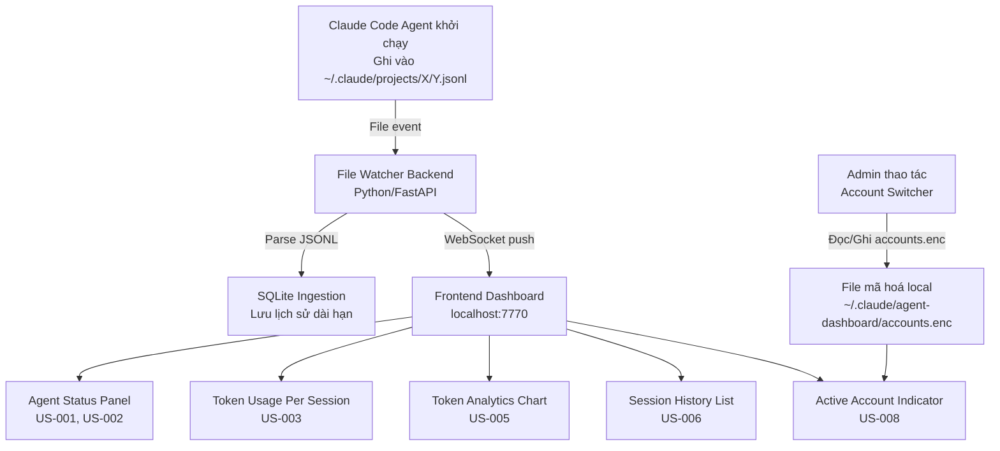

# User Stories — Agent Dashboard

**Feature:** Agent Dashboard — Dashboard Web Local Realtime Quản Lý Claude Code Agents
**BA:** Business Analyst (KZTEK)
**Phiên bản:** 1.0
**Ngày:** 2026-08-05
**Nguồn PRD:** `docs/prd/PRD-agent-dashboard.md` v1.0
**Persona duy nhất:** KZTEK Internal Developer (admin)

---

## Phạm vi tài liệu này

| Nhóm | Feature IDs | Trạng thái |
|---|---|---|
| P0 — MVP | F-01, F-02, F-03, F-04 | Viết story chi tiết ✅ |
| P1 — Sprint 1 | F-05, F-06, F-07, F-08 | Viết story chi tiết ✅ |
| P2 — Backlog | F-09, F-10, F-11, F-12 | Backlog — chưa viết story chi tiết |

---

## Business Flow tổng thể



---

## US-001: Xem danh sách agent đang chạy realtime

**Là** admin vận hành hệ thống multi-agent Claude Code
**Tôi muốn** xem danh sách các agent đang chạy với tên agent, task đang làm, thời gian bắt đầu, và trạng thái (running/idle/done)
**Để** biết ngay hệ thống đang làm gì mà không cần mở terminal đọc log thủ công

### Acceptance Criteria

**Scenario 1: Happy path — có session đang chạy**
```
Given admin mở dashboard tại localhost:7770
  And có ít nhất 1 Claude Code session đang ghi vào ~/.claude/projects/*/*.jsonl
When trang Agent Status Panel tải xong
Then hiển thị danh sách dạng bảng/card với mỗi entry gồm:
  - Tên agent (lấy từ trường "agent" trong JSONL hoặc tên file project)
  - Task đang làm (tóm tắt từ trường message/task gần nhất trong JSONL, tối đa 100 ký tự)
  - Thời gian bắt đầu (timestamp entry đầu tiên của session)
  - Trạng thái: "Running" (có activity trong 60 giây qua), "Idle" (60–300 giây không có entry mới), "Done" (>300 giây không có entry mới hoặc file đã đóng)
```

**Scenario 2: Không có session active**
```
Given admin mở dashboard
  And không có file .jsonl nào được ghi trong 300 giây qua
When trang Agent Status Panel tải xong
Then hiển thị trạng thái trống với thông báo "Không có agent nào đang chạy"
  And không hiển thị bảng trống hay loading spinner vô hạn
```

**Scenario 3: Nhiều agent chạy đồng thời trong cùng thư mục project**
```
Given có 2 Claude Code session đang chạy đồng thời
  And cả hai ghi vào cùng thư mục ~/.claude/projects/X/ nhưng file .jsonl khác nhau
When Agent Status Panel hiển thị
Then mỗi file .jsonl tương ứng với 1 dòng riêng biệt trong bảng
  And session ID (đường dẫn file đầy đủ hoặc hash) phân biệt hai agent
  And thông tin token/task của agent A không lẫn vào agent B
```

**Scenario 4: Agent kết thúc — nhận diện "Done" không có event tường minh**
```
Given admin đang nhìn dashboard với 1 agent có status "Running"
  And user đóng Claude Code app đột ngột (không có event "done" trong log)
When không có entry JSONL mới nào được ghi trong >300 giây
Then status agent đó chuyển từ "Running" → "Idle" sau 60 giây không có activity
  Then status chuyển từ "Idle" → "Done" sau 300 giây tổng không có activity
  And agent vẫn hiển thị trong danh sách (không biến mất) với nhãn "Done"
  And có timestamp "Kết thúc lúc" hiển thị là thời điểm entry cuối cùng + timeout
```

### Quy tắc nghiệp vụ
- **BR1:** Ngưỡng timeout Running→Idle: 60 giây không có entry mới trong file JSONL của session đó.
- **BR2:** Ngưỡng timeout Idle→Done: 300 giây (5 phút) tổng không có entry mới (tính từ entry cuối).
- **BR3:** Mỗi file `.jsonl` = 1 session riêng biệt. Không gộp nhiều file vào một session.
- **BR4:** Task description được lấy từ trường message cuối cùng có type = "assistant" hoặc tương đương; nếu không có → hiển thị "Đang khởi động...".
- **BR5:** Danh sách sắp xếp: "Running" lên đầu, "Idle" giữa, "Done" cuối — trong mỗi nhóm sắp theo thời gian bắt đầu mới nhất.

### Edge Cases
- **EC1 (File JSONL ghi dở):** Dòng cuối file chưa có ký tự `\n` (đang được ghi). Backend đọc từng dòng hoàn chỉnh, bỏ qua dòng không parse được JSON, không crash — log warning.
- **EC2 (File bị xóa):** Nếu file `.jsonl` bị xóa trong lúc dashboard đang watch, session đó chuyển ngay sang "Done" và giữ lại trong danh sách (không biến mất đột ngột).
- **EC3 (Thư mục projects không tồn tại):** Hiển thị banner cảnh báo "Không tìm thấy thư mục log" thay vì crash.
- **EC4 (File JSONL có entry không hợp lệ/format lạ):** Bỏ qua entry đó, tiếp tục đọc entry tiếp theo.

### Câu hỏi mở cho PM
- **Q1:** Ngưỡng 60s (Idle) và 300s (Done) có phù hợp với thực tế sử dụng không? Claude Code có thể pause rất lâu giữa các bước (ví dụ đang chờ user confirm)?
- **Q2:** Khi agent "Done" — giữ lại trong danh sách bao lâu trước khi chuyển sang Session History (US-006)? Đề xuất: agent Done trong session hiện tại (< 24h) vẫn hiện ở panel, sau đó chuyển vào history.

---

## US-002: Dashboard cập nhật realtime không cần refresh thủ công

**Là** admin
**Tôi muốn** dashboard tự động cập nhật khi có hoạt động mới của agent (không cần nhấn F5)
**Để** luôn thấy trạng thái mới nhất mà không bị phân tâm bởi việc refresh tay

### Acceptance Criteria

**Scenario 1: Happy path — session mới xuất hiện tự động**
```
Given admin đang nhìn dashboard (tab đang active trên browser)
  And không có session nào đang chạy
When Claude Code khởi động session mới và ghi entry đầu tiên vào .jsonl
Then trong vòng ≤2 giây, Agent Status Panel hiển thị session mới
  And không cần admin refresh trang
```

**Scenario 2: Token count cập nhật realtime trong session đang chạy**
```
Given admin đang nhìn dashboard với 1 agent đang chạy
  And token hiển thị là 5,000 input / 2,000 output
When agent xử lý xong 1 turn mới, JSONL có thêm entry token
Then số token trên dashboard cập nhật trong vòng ≤2 giây
  And không có flicker/reload toàn trang — chỉ giá trị thay đổi
```

**Scenario 3: Kết nối WebSocket bị mất (browser tab background/sleep)**
```
Given admin để browser tab ở background hơn 5 phút
  And kết nối WebSocket bị đóng do browser throttle
When admin quay lại tab dashboard
Then dashboard tự động reconnect WebSocket trong vòng 5 giây
  And hiển thị trạng thái "Đang kết nối lại..." trong thời gian reconnect
  And sau khi reconnect, hiển thị trạng thái hiện tại (không mất dữ liệu đã có)
```

**Scenario 4: Backend restart trong lúc dashboard đang mở**
```
Given admin mở dashboard và đang xem data
  And backend process bị restart (ví dụ: update code)
When WebSocket connection bị đứt do backend restart
Then frontend hiển thị banner "Mất kết nối — đang kết nối lại..."
  And tự động reconnect khi backend sẵn sàng
  And không mất dữ liệu đã hiển thị trước đó (chỉ không nhận update mới)
```

### Quy tắc nghiệp vụ
- **BR1:** Backend dùng file-watch (watchfiles hoặc watchdog) — polling interval ≤500ms để đảm bảo độ trễ tổng ≤2s.
- **BR2:** Chỉ push delta (thay đổi mới) qua WebSocket, không push toàn bộ state mỗi lần.
- **BR3:** Frontend WebSocket client có auto-reconnect với exponential backoff (1s → 2s → 4s → max 30s).
- **BR4:** Khi reconnect thành công, frontend request full-state snapshot từ backend để đồng bộ lại.

### Edge Cases
- **EC1 (JSONL dòng ghi dở):** File watcher phát hiện file change → backend cố đọc dòng mới → dòng parse lỗi JSON (ghi dở) → log warning + retry sau 200ms → sau lần retry dòng đã hoàn chỉnh → parse thành công. Backend KHÔNG crash, KHÔNG bỏ sót entry.
- **EC2 (Nhiều file thay đổi cùng lúc):** Khi 3 session chạy đồng thời và cả 3 file thay đổi trong cùng 1 batch event → backend xử lý tuần tự theo queue, push lần lượt lên WebSocket, không drop event.
- **EC3 (File watch mất quyền đọc):** Nếu file `.jsonl` bị thay đổi permissions → log error + hiển thị badge cảnh báo trên session đó, không dừng watch các file khác.

### Câu hỏi mở cho PM
- **Q3:** Khi backend restart, có muốn frontend tự load lại page hay chỉ reconnect WebSocket giữ nguyên UI? Đề xuất: chỉ reconnect, không reload page.

---

## US-003: Xem token usage của từng session hiện tại

**Là** admin
**Tôi muốn** xem token input/output/cache cho mỗi session đang chạy và vừa kết thúc
**Để** phát hiện ngay session nào đang hao token bất thường

### Acceptance Criteria

**Scenario 1: Happy path — hiển thị token đúng**
```
Given có 1 session đang chạy với dữ liệu JSONL đã có entries token
When admin nhìn vào panel token của session đó
Then hiển thị:
  - Token input: [số]
  - Token output: [số]
  - Token cache read: [số] (hoặc 0 nếu không có)
  - Token cache write: [số] (hoặc 0 nếu không có)
  - Tổng token: input + output (cache read không tính vào tổng theo convention Anthropic)
  And các giá trị này khớp chính xác (0% drift) với tổng cộng từ các entries JSONL tương ứng
```

**Scenario 2: Session mới — chưa có token data**
```
Given session vừa khởi động, chưa có entry nào ghi token
When admin nhìn vào token panel của session đó
Then hiển thị "0 / 0 / 0" (input/output/cache) với nhãn "Chưa có dữ liệu"
  And không hiển thị "-" hay null làm người dùng nhầm
```

**Scenario 3: Nhiều session đồng thời — không lẫn token**
```
Given session A đã dùng 10,000 input tokens
  And session B đã dùng 3,000 input tokens
  And cả hai đang chạy cùng lúc
When admin nhìn bảng token
Then session A hiển thị đúng 10,000 (không bị cộng thêm token của B)
  And session B hiển thị đúng 3,000
  And tổng toàn dashboard (nếu có) = 13,000
```

**Scenario 4: Session có nhiều JSONL entries trùng event ID**
```
Given file .jsonl của session có 2 entries với cùng event_id (do bug ghi trùng)
When backend parse và tính token
Then chỉ tính 1 lần cho event_id đó (dedup theo event_id)
  And log warning "Duplicate event_id detected" để debug sau
```

### Quy tắc nghiệp vụ
- **BR1:** Token tính lũy kế (cumulative) — cộng dồn tất cả entries của session từ đầu đến hiện tại.
- **BR2:** Dedup dựa trên `event_id` hoặc field tương đương trong JSONL. Nếu JSONL không có event_id → dedup không thực hiện được, log warning.
- **BR3:** Cache read token KHÔNG tính vào "total tokens" để tránh inflate số (convention Anthropic billing).
- **BR4:** Giá trị token hiển thị theo định dạng có dấu phân cách nghìn: "10,234" không phải "10234".

### Edge Cases
- **EC1 (JSONL thiếu trường token):** Entry không có trường `usage`/`tokens` → bỏ qua entry đó, tiếp tục cộng các entry khác, không crash.
- **EC2 (Token value âm hoặc không hợp lệ):** Nếu giá trị parse ra âm hoặc không phải số → bỏ qua entry, log warning.
- **EC3 (File JSONL rất lớn — >100MB):** Stream-read từng dòng, không load toàn file vào RAM.

---

## US-004: Dữ liệu token tồn tại sau khi restart dashboard

**Là** admin
**Tôi muốn** xem lại token usage và lịch sử session từ các ngày/tuần trước kể cả sau khi restart dashboard
**Để** phân tích xu hướng chi phí mà không mất dữ liệu lịch sử

### Acceptance Criteria

**Scenario 1: Happy path — data tồn tại sau restart**
```
Given dashboard đã chạy và đã ingest token data của 5 session trong ngày hôm nay
When admin restart dashboard (dừng process, chạy lại)
Then sau khi dashboard khởi động lại (<5 giây), tab Token Analytics và Session History
     vẫn hiển thị đầy đủ dữ liệu 5 session đó
  And không mất entry nào
```

**Scenario 2: Dashboard khởi động lần đầu — database chưa tồn tại**
```
Given file ~/.claude/agent-dashboard/history.db chưa tồn tại
When admin chạy lệnh khởi động dashboard lần đầu
Then backend tự động tạo file history.db với schema đúng
  And dashboard mở thành công, không báo lỗi
  And hiển thị trạng thái trống với thông báo "Chưa có dữ liệu lịch sử"
```

**Scenario 3: Không ghi trùng khi restart**
```
Given session X đã được ingest vào SQLite trước khi restart
  And file .jsonl của session X vẫn còn trên disk
When dashboard restart và file watcher đọc lại file .jsonl cũ
Then backend không ingest lại các entries đã có trong SQLite
  And token count của session X không bị nhân đôi
```

**Scenario 4: SQLite file bị corrupt**
```
Given file history.db bị corrupt (ví dụ: mất điện đột ngột khi ghi)
When dashboard cố mở file đó khi khởi động
Then dashboard log error "history.db corrupt — backing up và tạo mới"
  And đổi tên file cũ thành history.db.bak.[timestamp]
  And tạo history.db mới trống
  And dashboard khởi động thành công (không crash)
  And hiển thị banner cảnh báo "Dữ liệu lịch sử đã bị reset — xem history.db.bak để phục hồi"
```

### Quy tắc nghiệp vụ
- **BR1:** SQLite dùng WAL (Write-Ahead Logging) mode để tránh lock khi backend đọc/ghi đồng thời.
- **BR2:** Mỗi entry JSONL được đánh dấu `ingested = true` trong bảng tracking (hoặc dùng last_offset của file) — để restart không ingest lại.
- **BR3:** Đường dẫn database cố định: `~/.claude/agent-dashboard/history.db`. Không config được trong MVP (P2 feature F-12).
- **BR4:** Backup file corrupt giữ lại 3 phiên bản gần nhất (`.bak.1`, `.bak.2`, `.bak.3`), xóa phiên bản cũ hơn.

### Edge Cases
- **EC1 (Disk đầy khi ghi SQLite):** Backend bắt exception `disk full` → log error + hiển thị banner cảnh báo "Không thể lưu lịch sử — ổ đĩa đầy" + tiếp tục hoạt động realtime (không crash), chỉ mất persistence.
- **EC2 (SQLite lock do process khác):** Nếu có process khác đang giữ lock → retry 3 lần với 500ms delay → nếu vẫn fail → log error + bỏ qua lần ingest đó.

### Câu hỏi mở cho PM
- **Q4:** Dữ liệu lịch sử giữ lại bao lâu trước khi auto-purge? Đề xuất: 90 ngày. Cần xác nhận để implement cleanup job.

---

## US-005: Xem biểu đồ token usage theo thời gian

**Là** admin
**Tôi muốn** xem biểu đồ token usage theo ngày/tuần/tháng, có thể filter theo agent hoặc session
**Để** nhận ra xu hướng chi phí và phát hiện ngày nào bất thường

### Acceptance Criteria

**Scenario 1: Happy path — biểu đồ 30 ngày gần nhất**
```
Given đã có dữ liệu token trong SQLite của 15 ngày qua
When admin mở tab Token Analytics, chọn filter "30 ngày"
Then hiển thị biểu đồ cột (bar chart) theo ngày
  And mỗi cột gồm 2 phần màu khác nhau: input tokens (xanh) và output tokens (cam)
  And tổng token mỗi ngày khớp với tổng từ SQLite (0% sai lệch)
  And các ngày không có data hiển thị cột = 0 (không bị thiếu trục X)
```

**Scenario 2: Filter theo agent cụ thể**
```
Given biểu đồ đang hiển thị tổng tất cả agent
  And có dropdown "Lọc theo agent" với danh sách tên agent từ database
When admin chọn agent "senior-developer" từ dropdown
Then biểu đồ chỉ hiển thị token của agent "senior-developer"
  And tổng token trên biểu đồ khớp với tổng của agent đó trong SQLite
  And dropdown vẫn giữ selection khi admin switch tab rồi quay lại
```

**Scenario 3: Không có dữ liệu trong khoảng thời gian chọn**
```
Given admin chọn filter "7 ngày" nhưng dữ liệu đầu tiên là 30 ngày trước
When biểu đồ render
Then hiển thị thông báo "Không có dữ liệu trong khoảng thời gian này"
  And không hiển thị biểu đồ trống gây nhầm lẫn
  And gợi ý admin chọn "30 ngày" hoặc "Tất cả"
```

**Scenario 4: Filter "Tuần" và "Tháng"**
```
Given admin switch từ "30 ngày" sang "Theo tuần (12 tuần)"
When biểu đồ re-render
Then trục X hiển thị 12 tuần gần nhất (nhãn "Tuần 1", "Tuần 2"... hoặc "W31", "W32"...)
  And mỗi cột là tổng token của 7 ngày trong tuần đó
  And aggregate chính xác — không sai lệch so với tổng từng ngày
```

### Quy tắc nghiệp vụ
- **BR1:** Biểu đồ dùng thư viện Chart.js (vanilla JS) hoặc Recharts (React) — quyết định cụ thể ở TDD.
- **BR2:** Filter options: "7 ngày", "30 ngày", "12 tuần", "6 tháng".
- **BR3:** Default filter khi mở tab lần đầu: "30 ngày".
- **BR4:** Token cache read không hiển thị riêng trên biểu đồ (P2) — chỉ input và output trong MVP.
- **BR5:** Tooltip khi hover cột: hiển thị breakdown chi tiết (input, output, số session trong ngày đó).

### Edge Cases
- **EC1 (Dữ liệu lớn — >365 ngày):** Khi filter "Tất cả" và database có >365 ngày data → aggregate theo tháng thay vì ngày để tránh chart quá dày.
- **EC2 (Chỉ có 1 ngày dữ liệu):** Biểu đồ vẫn render được với 1 cột duy nhất, không bị lỗi division.

---

## US-006: Xem lịch sử session đã kết thúc

**Là** admin
**Tôi muốn** xem danh sách các session đã kết thúc với thông tin agent, task, tổng token, thời gian
**Để** audit lại công việc đã thực hiện và phát hiện session bất thường

### Acceptance Criteria

**Scenario 1: Happy path — danh sách session history**
```
Given có dữ liệu lịch sử nhiều session trong SQLite
When admin mở tab Session History
Then hiển thị bảng với các cột:
  - Tên agent
  - Task description (100 ký tự đầu từ message cuối cùng)
  - Tổng token (input + output)
  - Thời gian bắt đầu
  - Thời gian kết thúc (hoặc "N/A" nếu timeout)
  - Trạng thái: "Done" / "Timeout"
  And bảng sắp xếp mặc định: mới nhất lên đầu
  And phân trang hoặc lazy load nếu >50 records
```

**Scenario 2: Filter theo ngày**
```
Given admin muốn xem session của ngày hôm qua
When admin chọn date picker "From: hôm qua 00:00 — To: hôm qua 23:59"
Then bảng chỉ hiển thị session có thời gian bắt đầu trong khoảng đó
  And hiển thị số lượng kết quả: "Hiển thị X session"
```

**Scenario 3: Chưa có lịch sử**
```
Given dashboard mới cài, chưa có session nào hoàn thành
When admin mở tab Session History
Then hiển thị trạng thái rỗng: "Chưa có lịch sử session"
  And không hiển thị bảng trống gây nhầm lẫn
```

**Scenario 4: Session bị timeout (không có event Done rõ ràng)**
```
Given session X kết thúc vì Claude Code bị đóng đột ngột
  And session X đã được chuyển sang "Done" theo timeout logic (BR2 của US-001)
When admin xem Session History
Then session X hiển thị với cột "Trạng thái" = "Timeout"
  And cột "Thời gian kết thúc" = thời gian entry cuối cùng + offset timeout (không phải thời gian thực)
  And có tooltip giải thích: "Phiên kết thúc do không có activity trong 5 phút"
```

### Quy tắc nghiệp vụ
- **BR1:** Session "Done" từ Agent Status Panel được tự động chuyển vào Session History sau khi status Done >1 phút.
- **BR2:** Session History lưu và hiển thị cả session "Done" lẫn "Timeout".
- **BR3:** Filter ngày mặc định: hiển thị tất cả (không giới hạn) khi mở lần đầu.
- **BR4:** Không cho phép xóa session history từ UI trong MVP (P2 feature).

### Edge Cases
- **EC1 (Rất nhiều session — >1000 records):** Phân trang server-side (page size 50), không load hết vào frontend.
- **EC2 (Task description rỗng):** Nếu không có message assistant trong JSONL → hiển thị "(Không có mô tả)".

---

## US-007: Quản lý danh sách tài khoản API key

**Là** admin
**Tôi muốn** thêm/sửa/xóa tài khoản (tên hiển thị + API key), chọn tài khoản active, và copy API key để dùng thủ công
**Để** chuyển đổi giữa các tài khoản Anthropic nhanh chóng mà không cần sửa file config thủ công

> **Lưu ý thiết kế quan trọng (từ PM):** Account Switcher trong Sprint 1 CHỈ làm: lưu danh sách account (file local mã hoá nhẹ), cho phép đặt "active account", và cho phép user copy API key để tự áp dụng vào Claude Code. Dashboard KHÔNG tự động inject API key vào Claude Code runtime đang chạy — đó là scope P3, ngoài phạm vi hiện tại.

### Acceptance Criteria

**Scenario 1: Happy path — thêm tài khoản mới**
```
Given admin mở trang Account Manager
When admin nhập "Tên hiển thị: KZTEK Production" và "API key: sk-ant-xxx..."
  And nhấn "Thêm tài khoản"
Then tài khoản mới xuất hiện trong danh sách
  And API key được lưu mã hoá vào ~/.claude/agent-dashboard/accounts.enc (không plaintext)
  And field API key hiển thị dạng "sk-ant-****...****" (masked, chỉ lộ 4 ký tự đầu và 4 ký tự cuối)
```

**Scenario 2: Đặt tài khoản active**
```
Given có 3 tài khoản trong danh sách, không tài khoản nào là active
When admin click nút "Đặt active" trên tài khoản "KZTEK Production"
Then tài khoản đó được đánh dấu active (badge/highlight rõ ràng)
  And các tài khoản khác không còn active (chỉ 1 active tại một thời điểm)
  And Active Account Indicator trên header cập nhật ngay (US-008)
```

**Scenario 3: Copy API key để tự dùng**
```
Given admin muốn dùng API key của tài khoản "KZTEK Dev"
When admin click nút "Copy API key" trên tài khoản đó
Then API key đầy đủ (không masked) được copy vào clipboard
  And hiển thị toast thông báo "Đã copy API key — tự nhập vào Claude Code config"
  And API key biến mất khỏi clipboard sau 30 giây (security)
```

**Scenario 4: Xóa tài khoản active**
```
Given tài khoản "KZTEK Production" đang là active
When admin click "Xóa" tài khoản đó và xác nhận dialog
Then tài khoản bị xóa khỏi danh sách và khỏi file accounts.enc
  And không còn tài khoản active
  And Active Account Indicator hiển thị cảnh báo (theo US-008, Scenario 2)
```

**Scenario 5: File accounts.enc bị hỏng/không đọc được**
```
Given file ~/.claude/agent-dashboard/accounts.enc bị corrupt (ví dụ: ghi dở)
When dashboard khởi động và cố đọc file đó
Then dashboard log error + đổi tên file cũ thành accounts.enc.bak.[timestamp]
  And tạo file accounts.enc mới trống
  And trang Account Manager hiển thị danh sách trống kèm banner cảnh báo:
      "File tài khoản bị hỏng và đã được reset. Vui lòng thêm lại tài khoản."
  And không crash dashboard
```

**Scenario 6: File accounts.enc không tồn tại (lần đầu dùng)**
```
Given chưa có file accounts.enc
When admin mở trang Account Manager lần đầu
Then hiển thị danh sách trống với hướng dẫn "Chưa có tài khoản — Nhấn 'Thêm tài khoản' để bắt đầu"
  And file accounts.enc được tạo khi admin thêm tài khoản đầu tiên
```

**Scenario 7: Thêm tài khoản với API key rỗng**
```
Given admin đang điền form thêm tài khoản
When admin bỏ trống trường API key và nhấn "Thêm"
Then hiển thị validation error "API key không được để trống"
  And không lưu tài khoản
  And focus trở lại field API key
```

### Quy tắc nghiệp vụ
- **BR1:** Mã hoá API key: XOR với key ngẫu nhiên được sinh lúc cài đặt lần đầu + encode base64 — đủ để không lộ plaintext, không dùng cho bảo mật cấp cao. Key mã hoá lưu trong file riêng `~/.claude/agent-dashboard/.enc_key` (không commit vào git).
- **BR2:** Chỉ 1 tài khoản active tại một thời điểm. Khi đặt active tài khoản mới → tự động bỏ active tài khoản cũ.
- **BR3:** Tên tài khoản tối đa 50 ký tự, không cho phép trùng tên.
- **BR4:** API key phải bắt đầu bằng "sk-ant-" — validate client-side trước khi lưu. Nếu không khớp format → hiển thị warning (không block, vì format có thể thay đổi).
- **BR5:** Copy API key chỉ hoạt động trong browser — dùng Clipboard API. Nếu browser không hỗ trợ → hiện modal dialog hiển thị API key để user copy tay.
- **BR6:** Dashboard KHÔNG tự inject API key vào môi trường Claude Code — user tự copy và apply.

### Edge Cases
- **EC1 (Tên tài khoản trùng):** Khi thêm tài khoản có tên đã tồn tại → hiển thị error "Tên tài khoản đã tồn tại, vui lòng chọn tên khác".
- **EC2 (File .enc_key bị mất):** Nếu file `.enc_key` bị xóa → không thể giải mã `accounts.enc` → xử lý như EC5: backup + tạo mới, cảnh báo user.
- **EC3 (Nhiều browser tab mở đồng thời):** Nếu user mở 2 tab dashboard và thêm account ở tab A → tab B phải tự cập nhật danh sách (qua WebSocket event "account_updated").

### Câu hỏi mở cho PM
- **Q5:** Có cần "Edit" tài khoản (sửa tên/key) hay chỉ "Xóa + Thêm lại"? Đề xuất: hỗ trợ Edit inline cho tên hiển thị, không cho edit API key (phải xóa + thêm mới để tránh lộ key cũ).
- **Q6:** Sau khi user "Copy API key" — có muốn dashboard hướng dẫn cụ thể cách apply vào Claude Code không? (ví dụ: "Mở terminal, chạy `export ANTHROPIC_API_KEY=...`"). Đề xuất: thêm tooltip/modal hướng dẫn ngắn.

---

## US-008: Hiển thị tài khoản đang dùng trên header

**Là** admin
**Tôi muốn** luôn thấy tài khoản/API key nào đang được đặt là active ngay trên header của dashboard
**Để** không bao giờ nhầm lẫn đang dùng tài khoản nào khi chạy agent

### Acceptance Criteria

**Scenario 1: Happy path — có tài khoản active**
```
Given admin đã set "KZTEK Production" là active account
When admin mở bất kỳ tab nào của dashboard (Status, Analytics, History, Accounts)
Then header luôn hiển thị: tên tài khoản active "KZTEK Production"
  And API key hiển thị dạng masked: "sk-ant-****...XXXX" (chỉ 4 ký tự cuối)
  And indicator có màu xanh lá (hoặc badge "Active")
```

**Scenario 2: Không có tài khoản active — cảnh báo**
```
Given chưa có tài khoản nào được đặt active (hoặc tài khoản active vừa bị xóa)
When admin nhìn header
Then header hiển thị banner cảnh báo màu cam/vàng:
    "Chưa có tài khoản active — Vào Accounts để đặt tài khoản"
  And có link "Đặt ngay" dẫn thẳng đến trang Account Manager
  And KHÔNG hiển thị placeholder sai lệch như "N/A" hay để trống không rõ nghĩa
```

**Scenario 3: Tài khoản active vừa thay đổi (từ trang Accounts)**
```
Given admin vừa đổi active account từ "KZTEK Dev" sang "KZTEK Production" trong trang Accounts
When admin nhìn header (không cần refresh trang)
Then header cập nhật ngay lập tức hiển thị "KZTEK Production"
  And tên tài khoản cũ không còn hiển thị trên header
```

### Quy tắc nghiệp vụ
- **BR1:** Header Account Indicator hiển thị persistent trên tất cả các trang/tab của dashboard.
- **BR2:** Tên tài khoản trên header tối đa 30 ký tự — nếu dài hơn thì truncate với "..." và tooltip hiển thị tên đầy đủ.
- **BR3:** Cập nhật realtime qua WebSocket event "account_changed" — không cần refresh.
- **BR4:** Header KHÔNG hiển thị API key đầy đủ — luôn masked, không thể hover để xem đầy đủ (phải vào Account Manager mới copy được).

### Edge Cases
- **EC1 (File accounts.enc không đọc được khi load header):** Header hiển thị cảnh báo "Không đọc được cấu hình tài khoản" thay vì crash.

### Câu hỏi mở cho PM
- **Q7:** Khi không có active account, có muốn block hoàn toàn một số chức năng (ví dụ: ẩn nút Copy API key ở Agent panel) hay chỉ warning không block?

---

## P2 Features — Backlog (chưa viết story chi tiết)

| Feature ID | Tên | Ghi chú |
|---|---|---|
| F-09 | Token Cost Estimate | Backlog Sprint 2 — phụ thuộc config pricing thủ công |
| F-10 | Alert: High Token Session | Backlog Sprint 2 — phụ thuộc F-12 (config UI) |
| F-11 | Export CSV | Backlog Sprint 2 — standalone, không có dependency phức tạp |
| F-12 | Dashboard Config UI | Backlog Sprint 2 — nên làm trước F-10 |

User Story chi tiết cho F-09..F-12 sẽ được viết khi PM xác nhận priority cho Sprint 2.

---

## Tổng hợp Edge Cases quan trọng (cross-cutting)

| Edge Case | Ảnh hưởng | Xử lý đề xuất |
|---|---|---|
| JSONL dòng ghi dở (ghi chưa xong) | F-01, F-02, F-03 | Parse từng dòng; skip dòng lỗi JSON; retry sau 200ms |
| Nhiều session đồng thời — không lẫn data | F-01, F-02, F-03 | Phân biệt bằng đường dẫn file JSONL đầy đủ |
| Agent "kết thúc" không có event Done | F-01, F-06 | Timeout logic: 60s→Idle, 300s→Done |
| accounts.enc bị corrupt/thiếu | F-07, F-08 | Backup + tạo mới + cảnh báo user |
| SQLite corrupt | F-04 | Backup + tạo mới + cảnh báo user |
| Disk đầy | F-04 | Log error + hiển thị banner + tiếp tục hoạt động realtime |
| WebSocket disconnect | F-02 | Auto-reconnect với backoff; hiển thị trạng thái reconnecting |

---

## Câu hỏi tổng hợp cần PM xác nhận trước khi TL thiết kế

| # | Câu hỏi | Ảnh hưởng đến |
|---|---|---|
| Q1 | Ngưỡng timeout Idle (60s) và Done (300s) có phù hợp không? | US-001 BR1, BR2 |
| Q2 | Agent "Done" giữ lại trên Status Panel bao lâu trước khi vào History? | US-001, US-006 |
| Q3 | Backend restart → frontend reload page hay chỉ reconnect WebSocket? | US-002 |
| Q4 | Dữ liệu lịch sử SQLite auto-purge sau bao nhiêu ngày? | US-004 |
| Q5 | Account Manager có cần tính năng "Edit" account không? | US-007 |
| Q6 | Có cần hướng dẫn apply API key sau khi copy không? | US-007 |
| Q7 | Không có active account → block chức năng hay chỉ warning? | US-008 |
