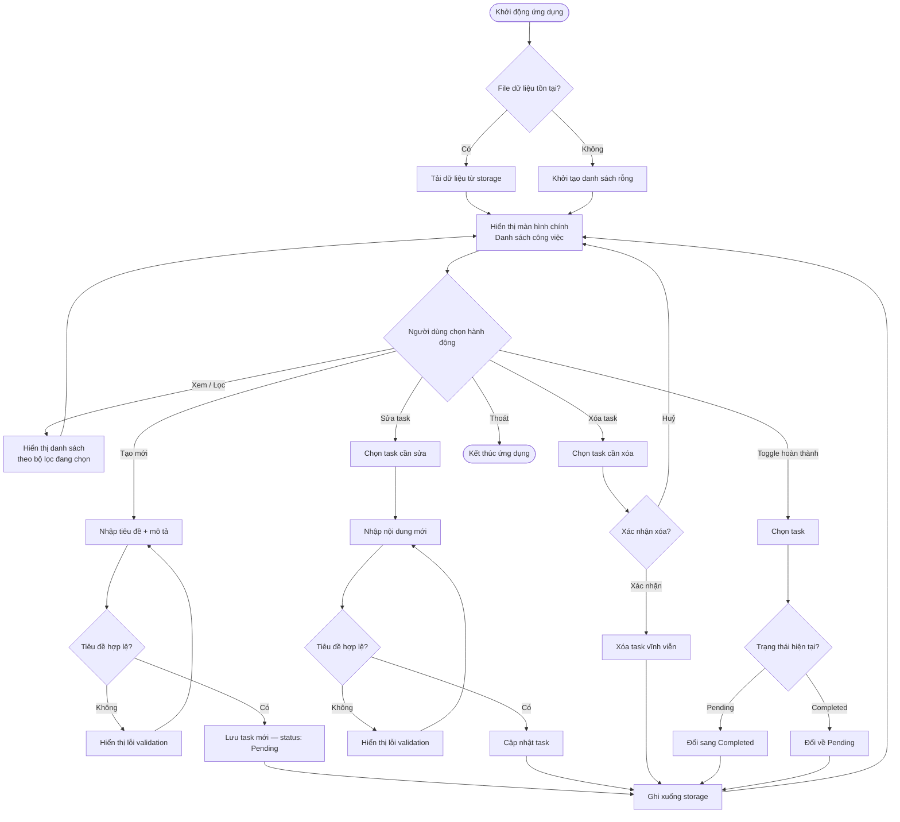
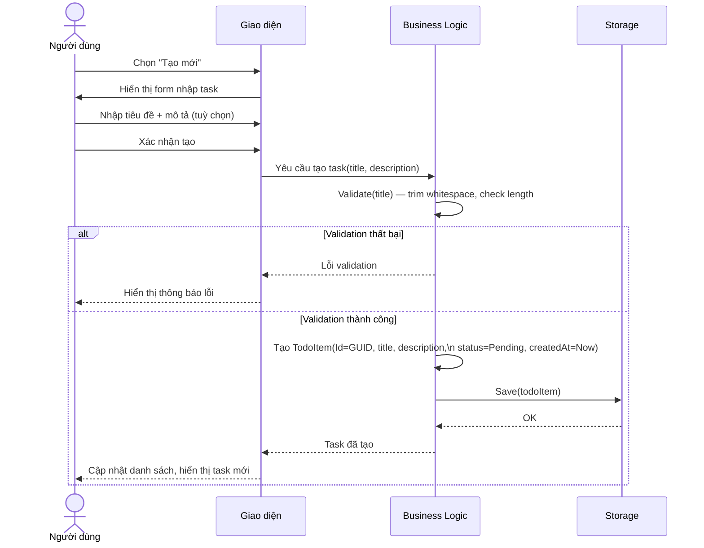
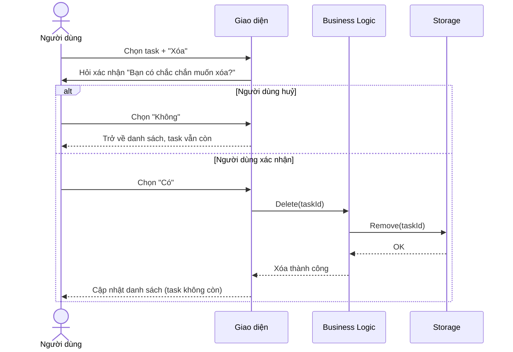
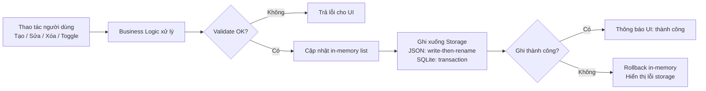
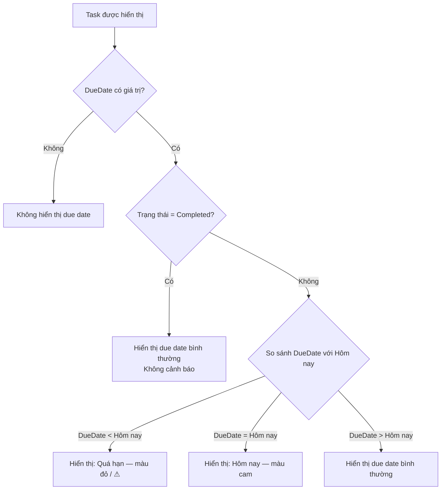

# User Stories — To-Do App C# (.NET 8)

> Tài liệu này bóc tách từ `docs/prd/PRD-todo-app-csharp.md` (v1.0).
> Mọi thay đổi logic nghiệp vụ phải cập nhật đồng bộ cả PRD lẫn file này.

---

## Tổng quan các User Story

| ID | Tên | Feature | Priority | Trạng thái |
|---|---|---|---|---|
| US-001 | Tạo công việc mới | F01 | Must Have | Draft |
| US-002 | Xem danh sách công việc | F02 | Must Have | Draft |
| US-003 | Sửa công việc | F03 | Must Have | Draft |
| US-004 | Xóa công việc | F04 | Must Have | Draft |
| US-005 | Đánh dấu hoàn thành / bỏ hoàn thành | F05 | Must Have | Draft |
| US-006 | Lưu trữ tự động (Persistence) | F06 | Must Have | Draft |
| US-007 | Tải dữ liệu khi khởi động | F07 | Must Have | Draft |
| US-008 | Lọc theo trạng thái | F08 | Should Have | Draft |
| US-009 | Gán mức độ ưu tiên | F09 | Should Have | Draft |
| US-010 | Gán ngày hạn hoàn thành | F10 | Should Have | Draft |

---

## Flow Nghiệp Vụ Tổng Thể



---

## US-001: Tạo công việc mới

**Là** người dùng cá nhân (sinh viên / nhân viên văn phòng)
**Tôi muốn** tạo một công việc mới bằng cách nhập tiêu đề và mô tả tuỳ chọn
**Để** ghi nhớ và theo dõi những việc cần làm

### Acceptance Criteria

#### Scenario 1 — Happy path: Tạo task với tiêu đề hợp lệ
```
Given  Người dùng đang ở màn hình chính, chưa có thao tác nào đang thực hiện
When   Người dùng chọn chức năng "Tạo mới", nhập tiêu đề "Hoàn thành báo cáo" và xác nhận
Then   - Task mới xuất hiện ngay trong danh sách với trạng thái "Pending"
       - Tiêu đề hiển thị đúng nội dung vừa nhập
       - Ngày tạo ghi nhận thời điểm hiện tại (CreatedAt)
       - Ứng dụng lưu task xuống storage ngay lập tức (không cần thao tác lưu thủ công)
```

#### Scenario 2 — Happy path: Tạo task có cả tiêu đề và mô tả
```
Given  Người dùng đang ở màn hình chính
When   Người dùng nhập tiêu đề "Họp team sáng thứ 2"
       và mô tả "Phòng họp A3, 9:00"
       rồi xác nhận
Then   - Task mới xuất hiện với tiêu đề và mô tả đúng
       - Mô tả có thể được xem chi tiết khi chọn task
```

#### Scenario 3 — Edge case: Tiêu đề rỗng
```
Given  Người dùng đang ở màn hình tạo task
When   Người dùng không nhập tiêu đề (bỏ trống hoặc chỉ nhập dấu cách) và xác nhận
Then   - Hệ thống hiển thị thông báo lỗi: "Tiêu đề không được để trống"
       - Không tạo task mới
       - Con trỏ trở lại ô nhập tiêu đề để người dùng sửa
```

#### Scenario 4 — Edge case: Tiêu đề vượt quá độ dài tối đa
```
Given  Người dùng đang ở màn hình tạo task
When   Người dùng nhập tiêu đề dài hơn 200 ký tự và xác nhận
Then   - Hệ thống hiển thị thông báo lỗi: "Tiêu đề tối đa 200 ký tự"
       - Không tạo task mới
```

#### Scenario 5 — Edge case: Người dùng huỷ tạo task
```
Given  Người dùng đang ở màn hình tạo task, đã nhập một số nội dung
When   Người dùng chọn "Huỷ" hoặc nhấn Escape
Then   - Ứng dụng trở về màn hình chính
       - Không tạo task mới
       - Dữ liệu đã nhập bị bỏ (không lưu nháp)
```

### Business Flow



### Quy tắc nghiệp vụ
- **BR1:** Tiêu đề bắt buộc, không được rỗng sau khi trim whitespace đầu/cuối
- **BR2:** Tiêu đề tối đa 200 ký tự
- **BR3:** Mô tả (Description) là tuỳ chọn, tối đa 1000 ký tự
- **BR4:** Mỗi task nhận một ID duy nhất (GUID) do hệ thống sinh — người dùng không nhập
- **BR5:** Trạng thái khởi tạo luôn là "Pending"
- **BR6:** CreatedAt ghi nhận thời điểm tạo, không cho phép chỉnh sửa sau đó
- **BR7:** Lưu xuống storage phải xảy ra ngay sau khi tạo thành công (không batch delay)

### Edge cases cần xử lý
- **EC1:** Storage không ghi được (disk full, permission denied) → hiển thị lỗi "Không thể lưu dữ liệu. Kiểm tra dung lượng đĩa." và giữ task trong memory
- **EC2:** Người dùng nhập tiêu đề chỉ chứa khoảng trắng → xử lý như tiêu đề rỗng (Trim trước khi validate)
- **EC3:** Người dùng mở nhiều cửa sổ ứng dụng cùng lúc → ghi chú: MVP single-instance, không xử lý concurrency

### Câu hỏi mở cho PM
- **Q1:** Có cần hiển thị xác nhận "Task đã tạo thành công" (toast/notification) hay chỉ cần task xuất hiện trong danh sách là đủ?
- **Q2:** Khi storage ghi thất bại, có nên cho phép giữ task trong memory (mất khi tắt app) không, hay phải block hoàn toàn?

---

## US-002: Xem danh sách công việc

**Là** người dùng cá nhân
**Tôi muốn** xem tất cả công việc đã tạo trong một danh sách rõ ràng
**Để** nắm bắt nhanh những việc đang còn làm và việc đã hoàn thành

### Acceptance Criteria

#### Scenario 1 — Happy path: Xem danh sách có dữ liệu
```
Given  Người dùng đã tạo ít nhất 1 task trước đó
When   Màn hình chính được hiển thị (sau khởi động hoặc sau thao tác khác)
Then   - Tất cả task hiển thị theo thứ tự ngày tạo mới nhất lên đầu (mặc định)
       - Mỗi task hiển thị tối thiểu: tiêu đề, trạng thái (Pending/Completed), ngày tạo
       - Task Completed hiển thị khác biệt rõ so với Pending
         (ví dụ: gạch ngang tiêu đề, màu mờ, ký hiệu [x] hoặc checkmark)
```

#### Scenario 2 — Edge case: Danh sách rỗng
```
Given  Người dùng chưa tạo task nào, hoặc đã xóa tất cả task
When   Màn hình chính được hiển thị
Then   - Hiển thị thông báo "Chưa có công việc nào. Hãy tạo task đầu tiên!"
       - Không hiển thị danh sách trống gây nhầm lẫn
       - Nút / lệnh tạo task vẫn có thể truy cập
```

#### Scenario 3 — Edge case: Danh sách nhiều task
```
Given  Người dùng có hơn 50 task trong danh sách
When   Màn hình chính hiển thị
Then   - Danh sách có thể cuộn (scroll) để xem tất cả task
       - Hiệu suất hiển thị không bị lag (< 1 giây để render)
```

### Quy tắc nghiệp vụ
- **BR1:** Thứ tự mặc định: ngày tạo mới nhất lên đầu (CreatedAt DESC)
- **BR2:** Task Completed phải có dấu hiệu trực quan khác biệt rõ ràng với Pending
- **BR3:** Mỗi task trong danh sách hiển thị tối thiểu: tiêu đề, trạng thái, ngày tạo

### Edge cases cần xử lý
- **EC1:** File storage tồn tại nhưng không đọc được (corrupt/permission) → hiển thị thông báo lỗi, không crash
- **EC2:** Danh sách rỗng → hiển thị empty state rõ ràng (không màn hình trắng)

### Câu hỏi mở cho PM
- **Q1:** Mặc định sắp xếp theo ngày tạo (mới nhất trước) hay theo thứ tự nhập (cũ nhất trước)?
- **Q2:** Có hiển thị số thứ tự (1, 2, 3...) trước mỗi task không?
- **Q3:** Khi có Priority (F09) và Due Date (F10), có hiển thị chúng trong dòng danh sách hay chỉ khi xem chi tiết?

---

## US-003: Sửa công việc

**Là** người dùng cá nhân
**Tôi muốn** sửa tiêu đề và mô tả của một công việc đã tạo
**Để** cập nhật thông tin khi yêu cầu công việc thay đổi

### Acceptance Criteria

#### Scenario 1 — Happy path: Sửa tiêu đề thành công
```
Given  Danh sách có ít nhất 1 task, người dùng đang ở màn hình chính
When   Người dùng chọn task cần sửa, thay đổi tiêu đề thành "Tiêu đề mới" và xác nhận
Then   - Tiêu đề task cập nhật ngay trong danh sách
       - Trường UpdatedAt ghi nhận thời điểm sửa
       - Trạng thái (Pending/Completed) không thay đổi
       - Thay đổi được lưu xuống storage ngay lập tức
```

#### Scenario 2 — Happy path: Sửa mô tả
```
Given  Task đang có mô tả "Cũ"
When   Người dùng chọn task, sửa mô tả thành "Mới" và xác nhận
Then   - Mô tả cập nhật đúng
       - Tiêu đề và trạng thái không thay đổi
```

#### Scenario 3 — Edge case: Lưu tiêu đề rỗng
```
Given  Người dùng đang sửa task
When   Người dùng xóa toàn bộ tiêu đề (để trống) và xác nhận
Then   - Hệ thống hiển thị lỗi: "Tiêu đề không được để trống"
       - Task không bị cập nhật (nội dung cũ được giữ nguyên)
```

#### Scenario 4 — Edge case: Huỷ sửa
```
Given  Người dùng đang ở màn hình sửa task, đã thay đổi nội dung
When   Người dùng chọn "Huỷ"
Then   - Ứng dụng trở về màn hình chính
       - Task giữ nguyên nội dung cũ (thay đổi chưa lưu bị bỏ)
```

### Quy tắc nghiệp vụ
- **BR1:** Validation tiêu đề khi sửa áp dụng cùng quy tắc như khi tạo (BR1, BR2 của US-001)
- **BR2:** CreatedAt không thay đổi khi sửa
- **BR3:** UpdatedAt được cập nhật mỗi khi lưu thay đổi thành công
- **BR4:** Chỉ tiêu đề và mô tả mới có thể sửa ở US-003; trạng thái sửa ở US-005; priority/due date sửa ở US-009/US-010

### Edge cases cần xử lý
- **EC1:** Task bị xóa bởi tác nhân bên ngoài trong khi đang sửa → khi lưu, hiển thị lỗi "Task không còn tồn tại"
- **EC2:** Storage không ghi được khi lưu → giống EC1 của US-001

### Câu hỏi mở cho PM
- **Q1:** Có cần hiển thị lịch sử chỉnh sửa (edit history) không? (PRD không đề cập)
- **Q2:** Có cho phép sửa task đã Completed không? (Hay phải unmark trước?)

---

## US-004: Xóa công việc

**Là** người dùng cá nhân
**Tôi muốn** xóa vĩnh viễn một công việc khỏi danh sách
**Để** giữ danh sách gọn gàng, loại bỏ task không còn cần thiết

### Acceptance Criteria

#### Scenario 1 — Happy path: Xóa task sau khi xác nhận
```
Given  Danh sách có ít nhất 1 task
When   Người dùng chọn task, chọn "Xóa" và xác nhận "Có" trong hộp thoại xác nhận
Then   - Task biến mất hoàn toàn khỏi danh sách ngay lập tức
       - Storage được cập nhật (task không còn trong file)
       - Số task trong danh sách giảm đi 1
       - Không có cách nào khôi phục task đã xóa (no undo trong MVP)
```

#### Scenario 2 — Edge case: Huỷ xóa
```
Given  Người dùng đã chọn "Xóa" và đang thấy hộp thoại xác nhận
When   Người dùng chọn "Không" hoặc "Huỷ"
Then   - Task vẫn còn trong danh sách, không bị xóa
       - Ứng dụng trở về màn hình chính
```

#### Scenario 3 — Edge case: Xóa task duy nhất
```
Given  Danh sách chỉ có 1 task
When   Người dùng xóa task đó và xác nhận
Then   - Task bị xóa
       - Danh sách hiển thị empty state (US-002 Scenario 2)
```

### Business Flow



### Quy tắc nghiệp vụ
- **BR1:** Bắt buộc có bước xác nhận trước khi xóa — không xóa ngay lập tức khi nhấn "Xóa"
- **BR2:** Xóa là vĩnh viễn — không có tính năng Undo/Trash trong MVP
- **BR3:** Xóa áp dụng cho cả task Pending và Completed

### Edge cases cần xử lý
- **EC1:** Task không tìm thấy trong storage khi xóa (đã bị xóa bởi tác nhân khác) → hiển thị thông báo, làm mới danh sách

### Câu hỏi mở cho PM
- **Q1:** Có cần tính năng "Xóa tất cả task đã hoàn thành" (bulk delete completed) không?
- **Q2:** MVP có cần tính năng Recycle Bin / Undo xóa không, hay xóa vĩnh viễn là chấp nhận được?

---

## US-005: Đánh dấu hoàn thành / Bỏ đánh dấu

**Là** người dùng cá nhân
**Tôi muốn** đánh dấu một công việc là hoàn thành hoặc bỏ đánh dấu hoàn thành
**Để** theo dõi tiến độ công việc và phân biệt việc đã xong với việc chưa xong

### Acceptance Criteria

#### Scenario 1 — Happy path: Đánh dấu Pending → Completed
```
Given  Danh sách có task với trạng thái "Pending"
When   Người dùng chọn task đó và thực hiện toggle (click checkbox / nhấn phím / chọn menu)
Then   - Trạng thái task đổi sang "Completed"
       - Giao diện cập nhật ngay: task hiển thị với dấu hiệu hoàn thành
         (gạch ngang tiêu đề, màu mờ hơn, hoặc ký hiệu [✓])
       - CompletedAt ghi nhận thời điểm toggle
       - Storage được cập nhật ngay
```

#### Scenario 2 — Happy path: Bỏ đánh dấu Completed → Pending
```
Given  Danh sách có task với trạng thái "Completed"
When   Người dùng toggle task đó
Then   - Trạng thái task đổi về "Pending"
       - Giao diện trở về hiển thị bình thường (không gạch ngang)
       - CompletedAt bị xóa (null)
       - Storage được cập nhật
```

#### Scenario 3 — Edge case: Toggle nhanh liên tiếp
```
Given  Người dùng toggle task liên tục (Pending→Completed→Pending→Completed)
When   Sau 3 lần toggle
Then   - Trạng thái cuối cùng là Completed (số lẻ lần toggle từ Pending)
       - Storage phản ánh đúng trạng thái cuối cùng
       - Không có lỗi race condition hay data inconsistency
```

### Quy tắc nghiệp vụ
- **BR1:** Toggle là hành động đảo trạng thái (flip-flop): Pending ↔ Completed
- **BR2:** Khi đánh dấu Completed, ghi lại CompletedAt = thời điểm hiện tại
- **BR3:** Khi bỏ đánh dấu (về Pending), CompletedAt đặt về null
- **BR4:** Trạng thái Completed không ngăn người dùng sửa hoặc xóa task (trừ khi có quy tắc khác từ PM)
- **BR5:** Dấu hiệu trực quan của Completed phải đủ rõ để phân biệt ngay không cần đọc label

### Edge cases cần xử lý
- **EC1:** Storage ghi thất bại khi toggle → hiển thị lỗi, rollback trạng thái về trước toggle

### Câu hỏi mở cho PM
- **Q1:** Khi filter "Completed" đang bật và user toggle task về Pending → task có biến mất khỏi view hiện tại ngay không?
- **Q2:** Có cần hiển thị thời điểm hoàn thành (CompletedAt) trong giao diện không?

---

## US-006: Lưu trữ tự động (Persistence)

**Là** người dùng cá nhân
**Tôi muốn** mọi thay đổi được lưu tự động mà không cần nhấn nút "Save"
**Để** không lo mất dữ liệu khi tắt ứng dụng hoặc máy tính bị tắt đột ngột

### Acceptance Criteria

#### Scenario 1 — Happy path: Lưu sau mỗi thao tác
```
Given  Người dùng thực hiện bất kỳ thao tác nào (tạo, sửa, xóa, toggle)
When   Thao tác thành công
Then   - Dữ liệu được ghi xuống storage (file JSON hoặc SQLite) ngay trong cùng thao tác
       - Không cần thao tác lưu thủ công
       - Dữ liệu tồn tại bền vững sau khi tắt ứng dụng
```

#### Scenario 2 — Happy path: Kiểm tra sau restart
```
Given  Người dùng đã tạo 5 task và tắt ứng dụng
When   Người dùng mở lại ứng dụng
Then   - Đủ 5 task xuất hiện với trạng thái và nội dung đúng như trước khi tắt
       - Không có task bị mất, không có task bị trùng lặp
```

#### Scenario 3 — Edge case: Ứng dụng crash giữa chừng khi đang ghi
```
Given  Ứng dụng đang ghi dữ liệu xuống storage
When   Ứng dụng bị crash (kill process) đúng lúc đang ghi
Then   - File storage không bị corrupt (dữ liệu còn đọc được)
       - Trạng thái là bản trước thao tác cuối (worst case: mất 1 thao tác gần nhất)
       - Khi mở lại, ứng dụng vẫn khởi động bình thường
```

### Business Flow



### Quy tắc nghiệp vụ
- **BR1:** Mọi thao tác thay đổi dữ liệu phải được persist ngay sau khi hoàn thành — không dùng lazy save
- **BR2:** Với JSON storage: dùng pattern write-then-rename (ghi ra file temp → rename) để đảm bảo atomicity
- **BR3:** Với SQLite storage: dùng transaction để đảm bảo atomicity
- **BR4:** File lưu trữ nằm tại một vị trí cố định (Tech Lead quyết định: AppData hoặc cùng thư mục exe)
- **BR5:** Ứng dụng KHÔNG được crash khi file storage không tồn tại → tự tạo file mới

### Edge cases cần xử lý
- **EC1:** Disk đầy → hiển thị lỗi rõ ràng, không crash silently
- **EC2:** File bị xóa bởi người dùng trong khi app đang chạy → app tự tạo lại file mới, cảnh báo "Dữ liệu đã bị xóa ngoài ứng dụng"
- **EC3:** File bị corrupt (JSON invalid / SQLite damaged) → app hiển thị cảnh báo và khởi tạo danh sách mới (không crash)
- **EC4:** Permission denied (không có quyền ghi vào thư mục) → hiển thị lỗi với hướng dẫn

### Câu hỏi mở cho PM
- **Q1:** Nếu storage ghi thất bại nhiều lần liên tiếp, có cần cơ chế retry hay báo lỗi ngay?
- **Q2:** Có cần tính năng backup thủ công (export ra file khác) không?

---

## US-007: Tải dữ liệu khi khởi động

**Là** người dùng cá nhân
**Tôi muốn** ứng dụng tự động tải lại dữ liệu đã lưu khi mở lên
**Để** tiếp tục làm việc với danh sách công việc mà không cần thiết lập lại

### Acceptance Criteria

#### Scenario 1 — Happy path: Khởi động với dữ liệu có sẵn
```
Given  Người dùng đã dùng ứng dụng trước đó và có dữ liệu lưu
When   Người dùng mở ứng dụng
Then   - Toàn bộ task được load đúng và đầy đủ
       - Giao diện sẵn sàng tương tác trong vòng 2 giây (G4 trong PRD)
       - Thứ tự và trạng thái task đúng như trước khi tắt
```

#### Scenario 2 — Happy path: Khởi động lần đầu (không có file)
```
Given  Đây là lần đầu mở ứng dụng, không có file dữ liệu nào
When   Người dùng mở ứng dụng
Then   - Ứng dụng khởi động bình thường
       - Hiển thị empty state (không có task)
       - Tự tạo file storage mới sẵn sàng
```

#### Scenario 3 — Edge case: File dữ liệu bị corrupt
```
Given  File storage tồn tại nhưng nội dung bị hỏng (JSON malformed / SQLite corrupt)
When   Ứng dụng cố đọc file khi khởi động
Then   - Ứng dụng KHÔNG crash
       - Hiển thị thông báo cảnh báo: "Dữ liệu bị lỗi. Ứng dụng sẽ khởi động với danh sách mới."
       - Backup file cũ lại (rename thành data.bak.json) trước khi tạo file mới
       - Ứng dụng tiếp tục chạy bình thường với danh sách rỗng
```

#### Scenario 4 — Edge case: File dữ liệu không đọc được (permission)
```
Given  File storage tồn tại nhưng app không có quyền đọc
When   Ứng dụng cố đọc file
Then   - Hiển thị lỗi rõ ràng: "Không thể đọc file dữ liệu. Kiểm tra quyền truy cập."
       - Ứng dụng vẫn khởi động (không crash), hoạt động với danh sách rỗng trong memory
```

### Quy tắc nghiệp vụ
- **BR1:** Thời gian load tối đa 2 giây trên máy tối thiểu (Core i3, 4GB RAM) với ≤ 1000 task
- **BR2:** Load xảy ra khi khởi động — không lazy load
- **BR3:** Khi file corrupt, bắt buộc backup trước khi reset để người dùng có cơ hội phục hồi thủ công
- **BR4:** Ứng dụng KHÔNG được crash vì bất kỳ trạng thái storage nào — mọi lỗi đều phải được handle gracefully

### Edge cases cần xử lý
- **EC1:** File rất lớn (> 10MB / > 5000 task) → load vẫn phải xong trong 2 giây hoặc hiển thị loading indicator
- **EC2:** Nhiều instance ứng dụng cùng mở (multi-instance) → ghi chú: MVP không hỗ trợ, không xử lý concurrency

### Câu hỏi mở cho PM
- **Q1:** Số lượng task tối đa dự kiến trong MVP? (Ảnh hưởng quyết định storage format)
- **Q2:** Có cần hiển thị "Đang tải..." khi load dữ liệu không?

---

## US-008: Lọc theo trạng thái

**Là** người dùng cá nhân
**Tôi muốn** lọc danh sách công việc theo trạng thái (Tất cả / Đang chờ / Đã hoàn thành)
**Để** tập trung vào nhóm công việc cần quan tâm mà không bị phân tâm bởi nhóm khác

### Acceptance Criteria

#### Scenario 1 — Happy path: Lọc Pending
```
Given  Danh sách có 3 task Pending và 2 task Completed
When   Người dùng chọn bộ lọc "Đang chờ" (Pending)
Then   - Chỉ hiển thị 3 task Pending
       - 2 task Completed bị ẩn
       - Tiêu đề bộ lọc / trạng thái hiển thị cho thấy đang ở chế độ "Pending"
       - Dữ liệu thực không bị mất (chỉ ẩn tạm thời)
```

#### Scenario 2 — Happy path: Lọc Completed
```
Given  Danh sách có 3 task Pending và 2 task Completed
When   Người dùng chọn bộ lọc "Đã hoàn thành" (Completed)
Then   - Chỉ hiển thị 2 task Completed
       - 3 task Pending bị ẩn
```

#### Scenario 3 — Happy path: Xem tất cả
```
Given  Đang ở chế độ lọc bất kỳ
When   Người dùng chọn "Tất cả" (All)
Then   - Hiển thị toàn bộ task (cả Pending và Completed)
       - Thứ tự sắp xếp mặc định được khôi phục
```

#### Scenario 4 — Edge case: Lọc khi không có task nào thuộc nhóm
```
Given  Người dùng đang ở chế độ lọc "Đã hoàn thành" nhưng chưa có task nào hoàn thành
When   Bộ lọc "Completed" được áp dụng
Then   - Hiển thị empty state: "Chưa có công việc nào hoàn thành"
       - Không hiển thị màn hình trắng
```

#### Scenario 5 — Edge case: Toggle task trong khi đang lọc
```
Given  Đang lọc "Pending", task A đang hiển thị
When   Người dùng toggle task A sang Completed
Then   - Task A biến khỏi view "Pending" ngay lập tức (vì không còn khớp bộ lọc)
       - Storage cập nhật đúng
       - Không có lỗi hoặc hiển thị sai
```

### Quy tắc nghiệp vụ
- **BR1:** Bộ lọc chỉ thay đổi view — không xóa hay thay đổi dữ liệu gốc
- **BR2:** Ba chế độ lọc: All (mặc định), Pending, Completed
- **BR3:** Trạng thái bộ lọc hiện tại phải hiển thị rõ ràng trong UI
- **BR4:** Khi tạo task mới trong khi đang lọc "Pending" → task mới xuất hiện trong view (vì task mới = Pending)
- **BR5:** Khi tạo task mới trong khi đang lọc "Completed" → task mới KHÔNG xuất hiện trong view (vì task mới = Pending)

### Edge cases cần xử lý
- **EC1:** Xóa task trong khi đang lọc → danh sách cập nhật đúng theo bộ lọc hiện tại

### Câu hỏi mở cho PM
- **Q1:** Bộ lọc có được nhớ giữa các lần mở ứng dụng không, hay luôn reset về "All"?
- **Q2:** Có cần hiển thị số lượng task trong mỗi nhóm (Pending: 3, Completed: 2) không?

---

## US-009: Gán mức độ ưu tiên (Priority)

**Là** người dùng cá nhân
**Tôi muốn** gán mức độ ưu tiên (Thấp / Trung bình / Cao) cho từng công việc
**Để** biết việc nào cần làm trước và tập trung vào việc quan trọng nhất

### Acceptance Criteria

#### Scenario 1 — Happy path: Gán priority khi tạo task
```
Given  Người dùng đang ở màn hình tạo task mới
When   Người dùng chọn mức độ ưu tiên "Cao" trước khi xác nhận
Then   - Task được tạo với Priority = High
       - Trong danh sách, task hiển thị nhãn / màu / ký hiệu phân biệt mức độ ưu tiên
         (ví dụ: Cao = đỏ, Trung bình = vàng, Thấp = xanh)
```

#### Scenario 2 — Happy path: Sửa priority của task đã có
```
Given  Task đang có Priority = Medium
When   Người dùng chỉnh sửa task, thay đổi priority sang "High" và lưu
Then   - Priority cập nhật thành High
       - Hiển thị nhãn/màu đúng trong danh sách
       - Storage cập nhật
```

#### Scenario 3 — Edge case: Không chọn priority khi tạo
```
Given  Người dùng đang tạo task mới
When   Người dùng không chọn priority (bỏ trống) và xác nhận
Then   - Task được tạo với Priority mặc định = None hoặc Medium (PM quyết định)
       - Không báo lỗi — priority là tuỳ chọn
```

### Quy tắc nghiệp vụ
- **BR1:** Ba mức ưu tiên: Low / Medium / High (+ None nếu PM đồng ý)
- **BR2:** Priority là tuỳ chọn — task có thể không có priority
- **BR3:** Mỗi mức ưu tiên phải có dấu hiệu trực quan rõ ràng (màu sắc hoặc ký hiệu)
- **BR4:** Priority không ảnh hưởng đến validation hay luồng khác

### Edge cases cần xử lý
- **EC1:** Dữ liệu cũ (trước khi F09 được thêm) không có trường Priority → mặc định None khi đọc

### Câu hỏi mở cho PM
- **Q1:** Priority mặc định khi tạo task là gì: None, Low, hay Medium?
- **Q2:** Có cần tính năng lọc theo priority (kết hợp với F08) không?
- **Q3:** Có cần sắp xếp tự động theo priority (High lên đầu) không?

---

## US-010: Gán ngày hạn hoàn thành (Due Date)

**Là** người dùng cá nhân
**Tôi muốn** gán ngày hạn hoàn thành (deadline) cho công việc
**Để** biết việc nào sắp đến hạn và ưu tiên xử lý kịp thời

### Acceptance Criteria

#### Scenario 1 — Happy path: Gán due date khi tạo task
```
Given  Người dùng đang tạo task mới
When   Người dùng chọn ngày "05/06/2026" làm due date
Then   - Task được tạo với DueDate = 05/06/2026
       - Due date hiển thị trong dòng task tại danh sách
```

#### Scenario 2 — Happy path: Task quá hạn
```
Given  Task có DueDate = 01/06/2026 (ngày trong quá khứ)
       và trạng thái = Pending
When   Màn hình danh sách hiển thị
Then   - Task hiển thị dấu hiệu "Quá hạn" rõ ràng
         (ví dụ: màu đỏ, ký hiệu ⚠, nhãn "Quá hạn")
       - Dấu hiệu quá hạn tự động tính theo ngày hiện tại
```

#### Scenario 3 — Happy path: Task đến hạn hôm nay
```
Given  Task có DueDate = ngày hôm nay và trạng thái = Pending
When   Màn hình danh sách hiển thị
Then   - Task hiển thị dấu hiệu nhắc nhở "Hôm nay"
         (ví dụ: màu cam, nhãn "Hôm nay")
```

#### Scenario 4 — Happy path: Task Completed dù đã quá hạn
```
Given  Task có DueDate đã qua và trạng thái = Completed
When   Màn hình danh sách hiển thị
Then   - Task KHÔNG hiển thị dấu hiệu "Quá hạn" (đã hoàn thành thì không cần cảnh báo)
       - Hiển thị bình thường như task Completed khác
```

#### Scenario 5 — Edge case: Gán due date trong quá khứ
```
Given  Người dùng đang tạo hoặc sửa task
When   Người dùng chọn ngày trong quá khứ làm due date
Then   - Ứng dụng CHO PHÉP lưu (không block) nhưng hiển thị cảnh báo:
         "Ngày hạn đã qua. Bạn có muốn tiếp tục không?"
       - Sau khi xác nhận, task được lưu với due date đó và hiển thị "Quá hạn" ngay
```

#### Scenario 6 — Edge case: Không gán due date
```
Given  Người dùng tạo task mà không chọn due date
When   Task được tạo
Then   - Task tạo thành công với DueDate = null
       - Không báo lỗi
       - Không hiển thị nhãn due date trong danh sách
```

### Quy tắc nghiệp vụ
- **BR1:** Due date là tuỳ chọn — task hoàn toàn hợp lệ khi không có due date
- **BR2:** Định dạng hiển thị: DD/MM/YYYY (theo locale Việt Nam)
- **BR3:** Task quá hạn = DueDate < ngày hôm nay VÀ trạng thái = Pending
- **BR4:** Task Completed không bao giờ hiển thị cảnh báo quá hạn
- **BR5:** Tính quá hạn dựa trên ngày (date-only), không tính giờ
- **BR6:** Ứng dụng sử dụng múi giờ local của máy người dùng (không cần xử lý timezone phức tạp trong MVP)

### Business Flow (Kiểm tra trạng thái hiển thị Due Date)



### Edge cases cần xử lý
- **EC1:** Đồng hồ hệ thống thay đổi (user chỉnh giờ máy) → ứng dụng tính lại trạng thái quá hạn theo đồng hồ hiện tại mỗi khi render
- **EC2:** Dữ liệu cũ không có trường DueDate → đọc như DueDate = null, không crash

### Câu hỏi mở cho PM
- **Q1:** Có cần hiển thị số ngày còn lại (ví dụ "còn 3 ngày") không?
- **Q2:** Có cần sắp xếp task theo due date (sắp đến hạn nhất lên đầu) không?
- **Q3:** Due date có thể là giờ cụ thể (DateTime) hay chỉ cần ngày (Date)?

---

## Tổng hợp Business Rules (Master BR List)

| ID | Quy tắc | Áp dụng tại |
|---|---|---|
| BR-GLOBAL-01 | Tiêu đề task không được rỗng (sau trim), tối đa 200 ký tự | US-001, US-003 |
| BR-GLOBAL-02 | Mô tả là tuỳ chọn, tối đa 1000 ký tự | US-001, US-003 |
| BR-GLOBAL-03 | Mọi thay đổi dữ liệu phải persist xuống storage ngay lập tức | US-001 đến US-010 |
| BR-GLOBAL-04 | Ứng dụng không được crash với bất kỳ trạng thái storage nào | US-006, US-007 |
| BR-GLOBAL-05 | Trạng thái mặc định khi tạo task = Pending | US-001 |
| BR-GLOBAL-06 | ID task là GUID do hệ thống sinh — không phụ thuộc người dùng | US-001 |
| BR-GLOBAL-07 | Xóa task phải có bước xác nhận, xóa là vĩnh viễn | US-004 |
| BR-GLOBAL-08 | Bộ lọc chỉ thay đổi view, không thay đổi dữ liệu | US-008 |
| BR-GLOBAL-09 | Task Completed không hiển thị cảnh báo quá hạn | US-010 |
| BR-GLOBAL-10 | Due date tính theo ngày (date-only), múi giờ local | US-010 |

---

## Tổng hợp Câu Hỏi Mở cho PM

| ID | Câu hỏi | Liên quan | Deadline gợi ý |
|---|---|---|---|
| OQ-BA-01 | Sau khi tạo task thành công có cần toast notification không? | US-001 | Trước Phase 1 |
| OQ-BA-02 | Khi storage ghi thất bại, có cho phép task tồn tại trong memory không? | US-001, US-006 | Trước Phase 1 |
| OQ-BA-03 | Thứ tự mặc định: mới nhất trước hay cũ nhất trước? | US-002 | Trước Phase 1 |
| OQ-BA-04 | Hiển thị số thứ tự trước mỗi task không? | US-002 | Trước Phase 1 |
| OQ-BA-05 | Có cho phép sửa task đã Completed không? | US-003 | Trước Phase 1 |
| OQ-BA-06 | Có cần Recycle Bin / Undo xóa không? | US-004 | Trước Phase 1 |
| OQ-BA-07 | Toggle task sang Completed khi đang lọc Pending → task biến mất ngay không? | US-005, US-008 | Trước Phase 2 |
| OQ-BA-08 | Bộ lọc có nhớ giữa các lần mở ứng dụng không? | US-008 | Trước Phase 2 |
| OQ-BA-09 | Priority mặc định khi tạo: None, Low, hay Medium? | US-009 | Trước Phase 2 |
| OQ-BA-10 | Due date có thể là giờ cụ thể (DateTime) hay chỉ cần ngày (Date)? | US-010 | Trước Phase 2 |
| OQ-BA-11 | Có hiển thị số ngày còn lại đến deadline không? | US-010 | Trước Phase 2 |

---

*Tài liệu này là đầu vào chính thức cho Tech Lead (TDD), UI/UX Designer (mockup), và QA Lead (test plan).*
*Mọi câu hỏi mở OQ-BA-* phải được PM trả lời trước khi Phase tương ứng bắt đầu.*
